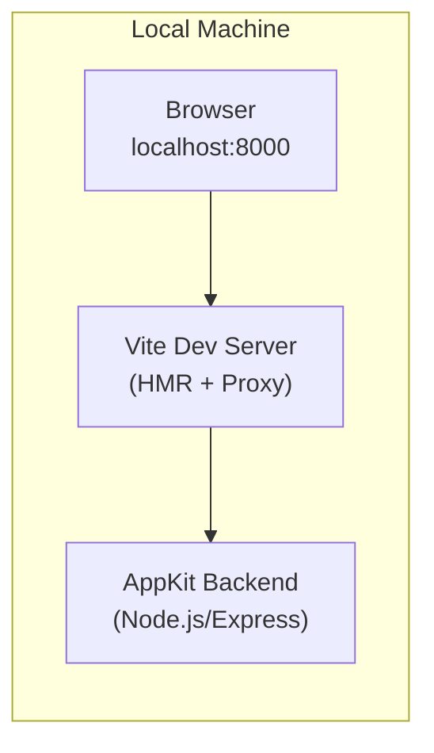
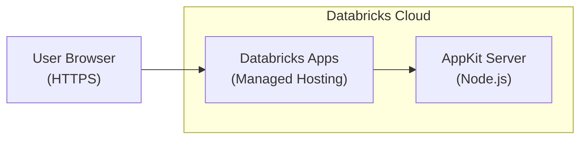
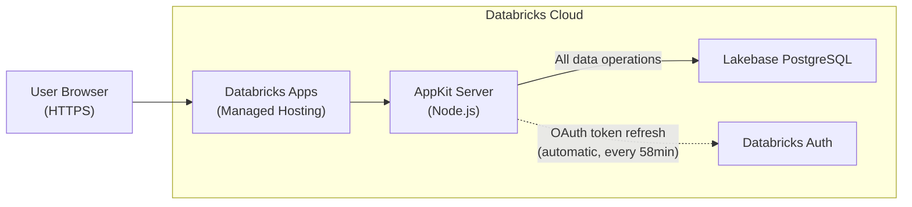

# Build and Deploy Databricks Apps with AppKit

**Last Updated:** April 2026
**Created by:** Prashanth Subrahmanyam

## Background

This document is a comprehensive guide to building, deploying, and testing web applications on the Databricks platform using **AppKit** — a TypeScript SDK with a plugin-based architecture for creating full-stack Databricks Apps. It walks through a complete lifecycle: scaffolding a project, building a UI from a PRD, deploying to Databricks Apps, wiring a Lakebase (managed PostgreSQL) backend, and running end-to-end verification.

This guide is structured as a series of **steps**, each designed to be given as a prompt to an AI coding assistant (Cursor, Claude Code, Windsurf, etc.). The assistant executes the instructions using the referenced Agent Skills, which contain the detailed implementation knowledge.

```
Step 1                Step 2             Step 3
Scaffold, Build  -->  Deploy        -->  Setup Lakebase
& Test Locally        (Mock Data)        Bundle Resources
                                          │
                                          ├─► Step 4: Wire Lakebase Backend
                                          │
                                          ├─► Optional Step 4b: Wire Model Serving / Agent endpoint
                                          │
                                          ├─► Optional Step 4c: Wire AppKit to a separate Agent App
                                          │
                                          └─► Optional Step 4d: Add chat history + feedback
                                                                  │
                                                                  ▼
                                                          Step 5: Deploy + E2E Test
```

Steps 1-2 build and deploy a functional UI with mock data (no database required). Steps 3-5 add a Lakebase PostgreSQL backend with live data. Agent chat is optional: use `06-appkit-serving-wiring` when the agent is exposed as a Model Serving / Agent Serving endpoint, or use `06d-appkit-agent-app-proxy` when the agent is deployed as a separate Databricks App. Agent-chat apps can then add persistent chat history (`07-appkit-chat-history`) and user feedback linked to MLflow assessments (`08-appkit-feedback`).

---

## Pre-Requisites

Complete the pre-requisites checklist before beginning: [PRE-REQUISITES.md](../PRE-REQUISITES.md)

Key requirements:
- Databricks workspace with Apps and Lakebase enabled
- AI-powered IDE (Cursor recommended) with Claude Sonnet 4.5+
- Databricks CLI installed and authenticated — **IDE/CLI client only**; Genie Code is pre-authenticated (see the Genie Code block below)
- Node.js v22+ installed
- A PRD document at `docs/design_prd.md` describing the application to build

> **Genie Code (in-workspace) — Set Up Project first.** Genie Code discovers skills by recursing into a repo cloned in your per-user skills folder, and it runs pre-authenticated and serverless (skip the CLI auth requirement above). Clone the **whole** workshop repo once, then start a fresh thread so the skills load:
>
> ```bash
> git clone https://github.com/databricks-solutions/vibe-coding-workshop-template.git \
>   /Users/<your-username>/.assistant/skills/vibe-coding-workshop
> ```
>
> After cloning, **start a NEW Agent-mode chat thread** (hard-refresh the page if skills don't appear), then load `skills/genie-code-environment`; `skills/vibecoding-state` detects `client_context` and gates each step. The local dev server / E2E-test steps in this guide are IDE/CLI-only — on Genie Code, verify against the deployed app instead. Grounded in the [Genie Code skills docs](https://learn.microsoft.com/en-us/azure/databricks/genie-code/skills).

---

## Workshop Parameters

Fill in these values before starting. They are referenced throughout all steps.

| Parameter | Value | Description |
|-----------|-------|-------------|
| `{workspace_url}` | __________________ | Your Databricks workspace URL (e.g. `https://myworkspace.cloud.databricks.com`) |
| `{use_case_slug}` | __________________ | Short app identifier (e.g. `bookings`, `inventory`, `analytics`) |
| `{user_app_name}` | __________________ | Lakebase project name (set in the **Setup Lakebase** step) |
| `{LAKEBASE_HOST}` | __________________ | Lakebase host address (output of the **Setup Lakebase** step) |
| `{agent_app_name}` | __________________ | Optional: separate Agent App name for the 2-Apps proxy path |
| `{agent_app_url}` | __________________ | Optional: separate Agent App URL for the 2-Apps proxy path |

---

### Lakebase Setup

Lakebase project creation and configuration is handled in the **Setup Lakebase** step. Do not create a project manually — the Setup Lakebase step walks through project creation, endpoint discovery, and compute optimization.

Fill in `{user_app_name}` and `{LAKEBASE_HOST}` in the Workshop Parameters table above after completing the **Setup Lakebase** step.

---

### Session State File (Cross-Step Context)

Each step should begin by reading `.vibecoding-state.md` (if it exists) from the app root (`apps_lakebase/$APP_NAME/`). Each step should end by appending resolved issues, current variable values, and workarounds.

Example:

```markdown
## Scaffold, Build & Test
- APP_NAME: jane-d-stayfinder
- Workspace: https://fevm-jane-doe.cloud.databricks.com
- Note: Typegen TABLE_OR_VIEW_NOT_FOUND errors are expected (no live tables in this step)
```

This prevents re-discovery of the same issues across steps (~7 min + ~10K tokens saved per session).

---

---

## Step 1: Scaffold, Build, and Test Locally

In this step, you will authenticate to Databricks, scaffold a blank AppKit project, implement a UI with mock data from a PRD, and verify everything works locally. No SQL warehouse or database is needed. This is the foundation for all subsequent steps.

Start a new Agent thread and use the following prompt:

---

### System Prompt

*Instructions for the AI model*

You are a full-stack developer building a web application on Databricks AppKit. Your goal is to scaffold a blank AppKit project, implement a UI with mock data from a PRD, and test locally.

Key requirements:

- Scaffold a **blank** AppKit project (no plugins) using the `01-appkit-scaffold` skill
- Read the PRD to understand user personas, journeys, and data requirements
- Build the app using the `02-appkit-build` skill (frontend components, design quality, routing)
- Use static mock data arrays in all components — no live backend, no SQL warehouse, no database
- Create a UI design document describing screens, components, and navigation
- Test locally at `http://localhost:8000` before proceeding

CLI Best Practices:

- Run from `apps_lakebase/` or use `apps_lakebase/scripts/` for scripts
- Run CLI commands outside the IDE sandbox to avoid SSL/TLS certificate errors

---

### Input Template

*Pass as-is to output (skip LLM)*

*LLM bypass enabled — This template will be returned directly to the user without AI processing*

#### Your Task

You are a full-stack developer building a web application on Databricks AppKit. Your goal is to scaffold a blank AppKit project, build a UI with mock data from a PRD, and test locally.

**Workspace:** `{workspace_url}`

#### File Locations

| What | Where |
|------|-------|
| All app source, configs, server, client | `apps_lakebase/$APP_NAME/` |
| Design docs (PRD, UI design) | `docs/` (repo root) |

All file paths below are relative to `apps_lakebase/$APP_NAME/` unless explicitly prefixed with `docs/`.

#### Hard Constraints

- **Workspace access:** Verify with `databricks current-user me --host {workspace_url}` before proceeding. If you get a 403, STOP and ask the user for a different workspace.
- **Typegen noise:** `npm run dev` triggers `npm run typegen` via the `predev` hook. `TABLE_OR_VIEW_NOT_FOUND` errors are expected when no live SQL queries are configured. These do not block the app.
- **App name:** Constructed below — do not use a shell variable named `USERNAME` (collides with system env vars on macOS/Linux).

---

#### Step 1.1: Authenticate and Set Up Variables

```bash
# Authenticate to Databricks — IDE/CLI only (see PRE-REQUISITES §11); Genie Code is pre-authenticated, skip this line

# Derive app name from your username + use case
USER_JSON=$(databricks current-user me --output json)
EMAIL=$(echo "$USER_JSON" | jq -r '.userName')
FIRSTNAME=$(echo "$EMAIL" | cut -d'@' -f1 | cut -d'.' -f1)
LASTINITIAL=$(echo "$EMAIL" | cut -d'@' -f1 | cut -d'.' -f2 | cut -c1)
APP_PREFIX="${FIRSTNAME}-${LASTINITIAL}"
APP_NAME="${APP_PREFIX}-{use_case_slug}"
echo "App: $APP_NAME | Email: $EMAIL"

# Validate and auto-truncate APP_NAME
if [ ${#APP_NAME} -gt 26 ]; then
  APP_NAME=$(echo "$APP_NAME" | cut -c1-26 | sed 's/-$//')
  echo "Truncated to: $APP_NAME"
fi
if echo "$APP_NAME" | grep -q '[^a-z0-9-]'; then
  echo "ERROR: APP_NAME contains invalid characters: $APP_NAME"
  echo "Must be lowercase letters, numbers, and hyphens only."
fi
```

**Important:** App names must be max 26 characters, lowercase letters/numbers/hyphens only (no underscores). The validation above catches issues automatically.

---

#### Step 1.2: Install Agent Skills and Scaffold the AppKit App

Read and follow **every step** in the `01-appkit-scaffold` skill at `@apps_lakebase/skills/01-appkit-scaffold/SKILL.md`. Do not skip any steps.

The skill will guide you through:
1. **Installing Databricks Agent Skills** — required before scaffolding. Do not skip this.
2. **Scaffolding the AppKit project** inside `apps_lakebase/`

**Parameters to use** (the skill needs these values):
- **Profile:** Use `$PROFILE` (or select one via `databricks auth profiles`)
- **App name:** Use `$APP_NAME` from Step 1.1
- **Features:** None — scaffold a **blank** app (no `--features` flag)
- **Description:** `"{use_case_slug} app"`
- **Working directory:** Run `cd apps_lakebase` first so the app is created inside `apps_lakebase/`

After the skill completes scaffold + `npm install`, verify the bundle config:

```bash
# app.yaml has no name field (only the start command) — this is expected.
# The app name lives in databricks.yml:
grep "name:" databricks.yml
```

If `databricks.yml` doesn't contain `$APP_NAME`, update it manually.

**From this point on, all file paths are relative to `apps_lakebase/$APP_NAME/`** — this is your app root.

---

#### Step 1.3: Read the PRD

Review `@docs/design_prd.md` (parent `docs/` folder at repo root) to understand:

- User personas and their needs
- Key user journeys (Happy Path only)
- Core features and requirements
- Data requirements — what entities and relationships the UI needs to display

---

#### Step 1.4: Build the App

Read and follow the `02-appkit-build` skill at `@apps_lakebase/skills/02-appkit-build/SKILL.md`. The skill covers frontend components, design quality, routing, and testing. **Read every reference file the skill points to** — especially `references/llm-guardrails.md` and `references/design-quality.md` — before writing component code.

**Demo data strategy:** Use static mock data arrays directly in your components. All charts, tables, and data-driven components should use the `data` prop with hardcoded representative sample data. There is no live backend, no SQL warehouse, and no database at this stage — the goal is a fully functional UI with realistic-looking mock data.

**Skip these parts of the build skill** (they are not relevant for a blank app):
- SQL query file creation (`config/queries/`)
- `npm run typegen` (type generation from SQL files)
- `useAnalyticsQuery` hooks
- `useMemo` on query parameters and `sql.*` helpers

The backend only needs the `server()` plugin registered. The scaffold generates `.catch(console.error)` instead of `await` — **replace the entire `server/server.ts`** with:

```typescript
// REPLACE the scaffold-generated server/server.ts with this:
import { createApp, server } from "@databricks/appkit";

await createApp({
  plugins: [server()],
});
```

---

#### Step 1.5: Create UI Design Document

Save a design overview to `@docs/ui_design.md` (parent `docs/` folder at repo root) describing:

- Key screens/pages
- Core components and their mock data sources
- Navigation flow
- Design direction and aesthetic choices

---

#### Step 1.6: Test Locally

From your app directory (`apps_lakebase/$APP_NAME/`):

```bash
# Free port 8000 if something is already bound to it
lsof -ti:8000 | xargs kill -9 2>/dev/null || true

npm run dev
```

**Note:** `npm run dev` triggers `npm run typegen` automatically via the `predev` hook. You may see `TABLE_OR_VIEW_NOT_FOUND` errors for queries referencing tables that don't exist yet — this is expected and does not block the app from running.

Open `http://localhost:8000` and verify:

- The UI loads without console errors
- Navigation works across pages
- All interactive elements respond
- Static mock data renders correctly in all components

**Automated check (if browser is unavailable):**

```bash
curl -s -o /dev/null -w "%{http_code}" http://localhost:8000
# Should return 200
```

**Visual verification** is recommended before proceeding. If you have access to the `web-devloop-tester` subagent, use it to check for console errors and layout issues.

---

#### Summary Checklist

- [ ] Databricks CLI is authenticated and `APP_NAME` is set
- [ ] AppKit project is scaffolded inside `apps_lakebase/` as a blank app (no plugins)
- [ ] Backend (`server/server.ts`) uses `await createApp({ plugins: [server()] })` (not `.catch(console.error)`)
- [ ] Frontend (`client/src/`) implements key pages with mock data
- [ ] Loading/error/empty states on every data-driven component
- [ ] `tests/smoke.spec.ts` uses `data-testid` selectors (not text/role); key page elements have `data-testid` attributes
- [ ] `@docs/ui_design.md` is created (parent docs folder)
- [ ] `npm run dev` runs cleanly at `http://localhost:8000`
- [ ] `databricks apps validate` passes (catches strict-mode TS errors and smoke test regressions that `npm run build` alone misses)
- [ ] `.vibecoding-state.md` updated (see below)

**Before finishing**, write (or append to) `apps_lakebase/$APP_NAME/.vibecoding-state.md` with:
- Step name (`## Scaffold, Build & Test`)
- Key variable values (`APP_NAME`, `PROFILE`, workspace URL)
- Any resolved issues or workarounds encountered during this phase

Only proceed to deployment after local testing passes.

---

### How to Use

1. **Copy the generated prompt**
2. **Replace** `{workspace_url}` and `{use_case_slug}` with your values
3. **Paste into Cursor or Copilot**
4. The code assistant will:
   - Authenticate and scaffold a blank AppKit project
   - Read your PRD and build the UI with mock data
   - Create `ui_design.md`
   - Test locally at `http://localhost:8000`

**Note:** This step focuses on local development with static mock data. No SQL warehouse or database is needed. Deployment to Databricks happens in the **Deploy to Databricks Apps** step. Live data wiring via Lakebase happens in the **Setup Lakebase**, **Wire Lakebase Backend**, and **Deploy and E2E Test** steps.

---

### Expected Output

**Project directory tree:**

```
apps_lakebase/$APP_NAME/
├── app.yaml                    # App deployment configuration
├── databricks.yml              # Databricks bundle config
├── package.json                # Dependencies (@databricks/appkit, etc.)
├── tsconfig.json
├── server/
│   └── server.ts               # AppKit backend (server plugin only)
├── client/
│   ├── index.html
│   ├── vite.config.ts
│   └── src/
│       ├── main.tsx
│       ├── App.tsx             # Root component with routing
│       └── components/         # UI components with mock data
└── tests/
    └── smoke.spec.ts           # Smoke test (update selectors for your app)
```

Pages and components under `client/src/` will vary based on your PRD.

**Terminal output — `npm run dev`:**

Output format varies by AppKit version. Look for confirmation that the server is running on port 8000 and the Vite dev server is ready. You may see a Registered Routes table and `[appkit:server]`-prefixed log lines — this is normal.

**Architecture — Local Development:**



**What you should see in the browser:**

```
┌─────────────────────────────────────────────────────────────┐
│  My App                                    Dashboard | Details│
├─────────────────────────────────────────────────────────────┤
│                                                             │
│  ┌──────────┐  ┌──────────┐  ┌──────────┐  ┌──────────┐   │
│  │ Total    │  │ Active   │  │ Revenue  │  │ Growth   │   │
│  │ Orders   │  │ Users    │  │ $12,450  │  │ +15.3%   │   │
│  │ 1,247    │  │ 342      │  │          │  │          │   │
│  └──────────┘  └──────────┘  └──────────┘  └──────────┘   │
│                                                             │
│  ┌─────────────────────────────┐  ┌────────────────────┐   │
│  │  Orders by Status           │  │  Recent Activity   │   │
│  │  ████████████ Completed 72% │  │  Order #1247 ...   │   │
│  │  ██████      Pending   20% │  │  Order #1246 ...   │   │
│  │  ███         Cancelled  8% │  │  Order #1245 ...   │   │
│  │                             │  │  Order #1244 ...   │   │
│  └─────────────────────────────┘  └────────────────────┘   │
│                                                             │
└─────────────────────────────────────────────────────────────┘
```

**Verification — curl test:**

```bash
$ curl -s http://localhost:8000 | head -1
<!DOCTYPE html>
```

---

### Checkpoint

> **Validate before proceeding.** Due to the non-deterministic nature of LLMs, it may take a few iterations of troubleshooting to ensure the app builds and runs correctly. Verify:
>
> - [ ] `npm run dev` starts without errors
> - [ ] The UI loads at `http://localhost:8000` with no console errors
> - [ ] All pages render with mock data (live data swap happens in the **Wire Lakebase Backend** step)
> - [ ] `docs/ui_design.md` exists and describes the application
> - [ ] `.vibecoding-state.md` updated with resolved issues, variable values, and workarounds
>
> **Do NOT proceed to Deploy until local testing passes.**

#### Context for Deploy to Databricks Apps

Copy the following into your new Agent thread so it has the necessary context:

> - **App directory:** `apps_lakebase/$APP_NAME/` (run `ls apps_lakebase/` to confirm)
> - **CLI profile:** `$PROFILE` (e.g., `DEFAULT`)
> - **Workspace:** `{workspace_url}`
> - **Use case slug:** `{use_case_slug}`

---

---

## Step 2: Deploy (Mock Data)

In this step, you will deploy the locally-tested application to Databricks Apps so it is accessible via a public HTTPS URL. The app serves mock data only — no database is connected yet.

Start a new Agent thread and use the following prompt:

---

### System Prompt

*Instructions for the AI model*

You are a DevOps engineer deploying an AppKit web application to Databricks Apps. Your goal is to deploy the locally-tested app so it is accessible via a public HTTPS URL.

Key requirements:

- Derive the app name from the user's Databricks identity to match `app.yaml` and `databricks.yml`
- Validate that the app directory and config files exist and point to the correct workspace
- Deploy using the `03-appkit-deploy` skill (config validation, build, deploy, UI verification, error diagnosis)
- Verify the app reaches `RUNNING` state and the UI loads in a browser

CLI Best Practices:

- Run from `apps_lakebase/` or use `apps_lakebase/scripts/` for scripts
- Run CLI commands outside the IDE sandbox to avoid SSL/TLS certificate errors

---

### Input Template

*Pass as-is to output (skip LLM)*

*LLM bypass enabled — This template will be returned directly to the user without AI processing*

#### Your Task

Deploy the locally-tested AppKit web application to Databricks Apps.

**First:** Read `apps_lakebase/$APP_NAME/.vibecoding-state.md` if it exists — it contains resolved issues and variable values from prior phases.

**Workspace:** `{workspace_url}`

**Working directory:** All app paths and commands use the `apps_lakebase/` folder. The scaffolded AppKit app lives at `apps_lakebase/$APP_NAME/`.

---

#### Deployment Constraints

- Databricks App names must use only lowercase letters, numbers, and dashes (no underscores). Use hyphens: `my-app-name` not `my_app_name`.
- App names are max 26 characters.

---

#### Step 2.1: Derive App Name and Set Profile

Derive your app name from your username + use case. This ensures the deployed app matches your `app.yaml` and `databricks.yml` configuration.

```bash
USER_JSON=$(databricks current-user me --output json)
EMAIL=$(echo "$USER_JSON" | jq -r '.userName')
FIRSTNAME=$(echo "$EMAIL" | cut -d'@' -f1 | cut -d'.' -f1)
LASTINITIAL=$(echo "$EMAIL" | cut -d'@' -f1 | cut -d'.' -f2 | cut -c1)
APP_PREFIX="${FIRSTNAME}-${LASTINITIAL}"
APP_NAME="${APP_PREFIX}-{use_case_slug}"
echo "Deploying app: $APP_NAME"
```

Detect (or create) a CLI profile for the target workspace:

```bash
TARGET_HOST="{workspace_url}"
PROFILE=$(databricks auth profiles --output json 2>/dev/null \
  | jq -r --arg host "$TARGET_HOST" \
    '[.profiles[] | select(.host == $host)] | .[0].name // empty')

if [ -z "$PROFILE" ]; then
  # IDE/CLI: create a profile per PRE-REQUISITES §11; Genie Code: skip — pre-authenticated, no profiles (omit --profile).
  echo "No profile found for $TARGET_HOST — IDE/CLI only: see PRE-REQUISITES §11."
  PROFILE=$(databricks auth profiles --output json 2>/dev/null \
    | jq -r --arg host "$TARGET_HOST" \
      '[.profiles[] | select(.host == $host)] | .[0].name // empty')
fi

echo "Using profile: $PROFILE"
```

Verify the app directory exists and `databricks.yml` points to the target workspace:

```bash
ls apps_lakebase/$APP_NAME/databricks.yml
grep "host:" apps_lakebase/$APP_NAME/databricks.yml
```

If deploying to a different workspace than where you scaffolded in the **Scaffold, Build & Test** step, update `databricks.yml` to match your target workspace and clear old bundle state:

```bash
rm -rf apps_lakebase/$APP_NAME/.databricks
```

---

#### Step 2.1b: Pre-flight Build Check

Run a local build before deploying to surface code issues early:

```bash
cd apps_lakebase/$APP_NAME
npm run build
```

If this fails with TypeScript errors (e.g., unused imports, type mismatches), fix them now. These are code quality issues from the **Scaffold, Build & Test** step, not deploy problems.

> **Typegen errors are expected.** If you see `TABLE_OR_VIEW_NOT_FOUND` during the build, these come from SQL queries referencing tables that don't exist in the target workspace yet. They are non-blocking — the app runs with mock data and these errors do not affect deployment.

---

#### Step 2.2: Deploy

Read and follow the `03-appkit-deploy` skill at `@apps_lakebase/skills/03-appkit-deploy/SKILL.md`. Run all skill commands from the `apps_lakebase/` directory.

The skill covers: config validation, build, deploy, UI verification, error diagnosis (3-iteration fix loop), and workspace app limit handling.

---

#### Summary

Your job is complete when:

- [ ] The Databricks App is deployed and running
- [ ] The web UI loads in browser (React application, not an error page)
- [ ] No errors in the app logs
- [ ] Mock data renders correctly in all components
- [ ] `.vibecoding-state.md` updated (see below)

**Before finishing**, append to `apps_lakebase/$APP_NAME/.vibecoding-state.md` with:
- Step name (`## Deploy to Databricks Apps`)
- Key variable values (`APP_NAME`, `PROFILE`, app URL, workspace URL)
- Any resolved issues or workarounds encountered during this phase

---

### How to Use

1. **Copy the generated prompt**
2. **Replace** `{workspace_url}` and `{use_case_slug}` with your values
3. **Paste into Cursor or Copilot**
4. The code assistant will:
   - Derive your app name and validate config
   - Deploy the app to Databricks Apps using the deploy skill
   - Verify the app is running and accessible

**Note:** This step deploys the mock-data app from the **Scaffold, Build & Test** step. For Lakebase integration (live data), continue to the **Setup Lakebase**, **Wire Lakebase Backend**, and **Deploy and E2E Test** steps.

---

### Expected Output

**Terminal output — deploy sequence:**

```
$ cd apps_lakebase/$APP_NAME
$ databricks apps deploy --profile $PROFILE

Deploying app '{user_app_name}'...
Building application... done
Starting application... done

App deployed successfully!
  URL:    https://{user_app_name}.{workspace_url}
  Status: RUNNING
```

**Architecture — Deployed on Databricks:**



**App status — `databricks apps get`:**

```json
{
  "name": "{user_app_name}",
  "url": "https://{user_app_name}.{workspace_url}",
  "status": {
    "state": "RUNNING",
    "message": "Application is running"
  },
  "service_principal_id": "12345678-abcd-1234-efgh-123456789012",
  "create_time": "2026-04-10T14:30:00Z"
}
```

> **Note:** You may see `"state": null` immediately after deploy. This is normal — verify with `compute_status.state: "ACTIVE"` and check logs for a healthy server startup.

**App logs — healthy startup:**

Log format varies by AppKit version. Look for messages confirming the server is listening on port 8000. Absence of ERROR-level messages indicates a healthy startup.

**What you should see in the browser:**

The same mock-data UI from the **Scaffold, Build & Test** step, now accessible at a public HTTPS URL — no local machine required.

---

### Checkpoint

> **Validate before proceeding.**
>
> - [ ] The Databricks App is deployed and in `RUNNING` state
> - [ ] The web UI loads in browser at the app URL (React application, not an error page)
> - [ ] No errors in the app logs (`databricks apps logs $APP_NAME`)
> - [ ] Mock data renders correctly in all components
> - [ ] `.vibecoding-state.md` updated with resolved issues, variable values, and workarounds
>
> **Continue to Setup Lakebase** to set up a Lakebase project for live data.

#### Context for Setup Lakebase

Copy the following into your new Agent thread so it has the necessary context:

> - **App directory:** `apps_lakebase/$APP_NAME/`
> - **CLI profile:** `$PROFILE` (e.g., `DEFAULT`)
> - **Workspace:** `{workspace_url}`
> - **Use case slug:** `{use_case_slug}`
> - The app has been deployed at least once (Service Principal exists)

---

---

## Step 3: Setup Lakebase

In this step, you will install the `@databricks/lakebase` npm package and configure bundle resources in `databricks.yml` and `app.yaml`. This is a **config-only** step — `server.ts` is NOT modified. Plugin registration (`lakebase()` in the plugins array) happens in the **Wire Lakebase Backend** step alongside the database code. The bundle creates the Lakebase project automatically on first deploy — no manual CLI project creation is needed.

Start a new Agent thread and use the following prompt:

---

### System Prompt

*Instructions for the AI model*

You are a full-stack developer adding the Lakebase (PostgreSQL) package to an existing AppKit application and configuring bundle resources for deployment. This is a **config-only** step — install the npm package and configure YAML files, but do NOT modify `server.ts`. Plugin registration happens in the **Wire Lakebase Backend** step.

Key requirements:

- Install `@databricks/lakebase` npm package (do NOT register the plugin in `server.ts` yet)
- Declare `postgres_projects` resource in `databricks.yml` (do NOT declare `postgres_branches` or `postgres_endpoints` — Lakebase auto-creates these)
- Configure `app.yaml` with `valueFrom: postgres` for `LAKEBASE_ENDPOINT` and a static `DB_SCHEMA`
- Derive `DB_SCHEMA` from `$APP_NAME` (hyphens to underscores) for user-scoped database isolation
- Do NOT deploy in this step — deployment happens in the **Deploy and E2E Test** step
- Do NOT create a Lakebase project via CLI — the bundle creates it automatically on first deploy
- Do NOT add `lakebase()` to `server.ts` — that happens in the **Wire Lakebase Backend** step

CLI Best Practices:

- Run from `apps_lakebase/` or use `apps_lakebase/scripts/` for scripts
- Run CLI commands outside the IDE sandbox to avoid SSL/TLS certificate errors

---

### Input Template

*Pass as-is to output (skip LLM)*

*LLM bypass enabled — This template will be returned directly to the user without AI processing*

#### Your Task

Install the Lakebase (PostgreSQL) package and configure bundle resources so the platform auto-provisions Lakebase on deploy. This is a **config-only** step — install the npm package and configure YAML files. Do NOT modify `server.ts` — plugin registration and database code happen in the **Wire Lakebase Backend** step.

**First:** Read `apps_lakebase/$APP_NAME/.vibecoding-state.md` if it exists — it contains resolved issues and variable values from prior phases.

**Workspace:** `{workspace_url}`

**Working directory:** All app code and commands use the `apps_lakebase/` folder. The scaffolded AppKit app lives at `apps_lakebase/$APP_NAME/`.

> **MANDATORY:** Read `.vibecoding-state.md` first to get the `PROFILE` value from prior phases. Use `--profile $PROFILE` on every `databricks` CLI command in this step. If the returned email doesn't match the prior phase, stop and verify the profile.

---

#### Step 3.1: Set Variables

```bash
PROFILE="<your-databricks-cli-profile>"  # Must match the profile from prior phases
USER_JSON=$(databricks current-user me --profile $PROFILE --output json)
EMAIL=$(echo "$USER_JSON" | jq -r '.userName')
FIRSTNAME=$(echo "$EMAIL" | cut -d'@' -f1 | cut -d'.' -f1)
LASTINITIAL=$(echo "$EMAIL" | cut -d'@' -f1 | cut -d'.' -f2 | cut -c1)
APP_PREFIX="${FIRSTNAME}-${LASTINITIAL}"
APP_NAME="${APP_PREFIX}-{use_case_slug}"
DB_SCHEMA=$(echo "$APP_NAME" | tr '-' '_')
echo "PROFILE=$PROFILE  APP_NAME=$APP_NAME  DB_SCHEMA=$DB_SCHEMA"
```

---

#### Step 3.2: Install the Lakebase Package

```bash
cd apps_lakebase/$APP_NAME
npm install @databricks/lakebase
```

---

#### Step 3.3: Add Bundle Resources to `databricks.yml`

> **MANDATORY: Before proceeding, read `@apps_lakebase/skills/04-appkit-plugin-add/references/plugin-lakebase.md` section "3. Declare Bundle Resources".** It contains critical Terraform state warnings. Key rule: **never remove `postgres_projects` from `databricks.yml` after the first deploy.**

Lakebase Autoscaling uses a **two-phase** deploy process because the database ID is auto-generated and cannot be known until the project exists:

- **Phase 1 (this step):** Declare `postgres_projects` only. The first deploy creates the project. Lakebase automatically creates a default `production` branch and `primary` endpoint.
- **Phase 2 (Deploy and E2E Test step):** After the project exists, discover the database ID and add the `app.resources.postgres` binding so `valueFrom: postgres` resolves.

> **The first deploy WILL show the app in CRASHED state.** This is expected — `valueFrom: postgres` cannot resolve until `app.resources.postgres` is configured in Phase 2. Proceed to database ID discovery; the second deploy will succeed.

> **Do NOT declare `postgres_branches` or `postgres_endpoints`** in `databricks.yml`. Lakebase Autoscaling auto-creates these with the project. Declaring them causes Terraform errors: `branch already exists` / `read_write endpoint already exists`.

**Pre-check — does the project already exist?**

```bash
databricks postgres get-project projects/$APP_NAME --profile $PROFILE --output json 2>&1
```

If this succeeds (project exists from a prior run), skip the `postgres_projects` declaration and note "Project already exists" in `.vibecoding-state.md`. If it fails with "not found", proceed normally.

Add the following to `databricks.yml`:

```yaml
resources:
  postgres_projects:
    my_db:
      project_id: <APP_NAME>
      display_name: '<APP_NAME>'
      pg_version: 17
      default_endpoint_settings:
        autoscaling_limit_min_cu: 0.5
        autoscaling_limit_max_cu: 2.0
        suspend_timeout_duration: "300s"
```

Replace `<APP_NAME>` with the actual `$APP_NAME` value. If `databricks.yml` already has a `resources:` section, merge the `postgres_projects` resource into it.

> **Keep `postgres_projects` during Phase 2.** After Phase 1 creates the project, Terraform state tracks the resource. The Phase 2 redeploy is idempotent. Do NOT remove `postgres_projects` between Phase 1 and Phase 2.
>
> **Re-running the workshop?** If the project exists from a **prior run or manual CLI creation** (current bundle has no Terraform state for it), either delete the project first (`databricks postgres delete-project projects/$APP_NAME --profile $PROFILE`) and proceed normally, or remove `postgres_projects` from `databricks.yml` and skip to Phase 2. If `databricks bundle deploy` fails with `"project already exists"`, this is the case — use one of these two options.

---

#### Step 3.4: Configure `app.yaml` Environment Variables

Add to the `env:` section of `app.yaml`:

```yaml
  - name: LAKEBASE_ENDPOINT
    valueFrom: postgres
  - name: DB_SCHEMA
    value: '<value of $DB_SCHEMA from Step 3.1>'
```

The platform auto-injects `PGHOST`, `PGPORT`, `PGDATABASE`, `PGSSLMODE`, `PGUSER` from the bundle resource binding. Do NOT set these manually.

---

#### Step 3.5: Configure `.env` for Local Development

Add to `.env` in the app root:

```env
DB_SCHEMA=<value of $DB_SCHEMA from Step 3.1>
```

Local development uses mock fallback data before the first deploy.

---

#### Step 3.6: Verify Package Installation

```bash
cd apps_lakebase/$APP_NAME
npm ls @databricks/lakebase
```

Must show `@databricks/lakebase` in the dependency tree.

---

#### Step 3.7: Validate Configuration

```bash
cd apps_lakebase/$APP_NAME
databricks apps validate --profile $PROFILE
```

Must pass with no errors. Common issues: YAML indentation errors (use 2-space indent), missing `resources:` key. A warning about `valueFrom: postgres` not resolving is expected until Phase 2.

---

#### Summary

Your Lakebase plugin is configured. The Lakebase project will be created automatically on first deploy.

---

#### Checklist

- [ ] `@databricks/lakebase` installed in `package.json`
- [ ] `server/server.ts` is **unchanged** (plugin registration happens in the Wire Lakebase Backend step)
- [ ] `DB_SCHEMA` derived from `$APP_NAME` (hyphens to underscores)
- [ ] `databricks.yml` has `postgres_projects` resource (no `postgres_branches` or `postgres_endpoints` — auto-created)
- [ ] `app.yaml` has `LAKEBASE_ENDPOINT` with `valueFrom: postgres` and `DB_SCHEMA` as static value
- [ ] `databricks apps validate` passes (warning about `valueFrom: postgres` is expected)
- [ ] `.vibecoding-state.md` updated (see below)

**Before finishing**, append to `apps_lakebase/$APP_NAME/.vibecoding-state.md` with:
- Step name (`## Setup Lakebase`)
- Key variable values (`DB_SCHEMA`, bundle resource project_id, `PROFILE`)
- Any resolved issues or workarounds encountered during this phase
- **Critical Notes for Next Phase:**
  - DO NOT remove `postgres_projects` from `databricks.yml` after Phase 1 deploy — Terraform state tracks it
  - Phase 2 redeploy is idempotent; Terraform sees no diff and skips the resource

---

### How to Use

1. Copy the **Input Template** section above
2. Replace `{workspace_url}` and `{use_case_slug}` with your values
3. Paste into Cursor or Copilot
4. The code assistant will:
   - Install the `@databricks/lakebase` npm package
   - Add bundle resources to `databricks.yml`
   - Configure `app.yaml` with `valueFrom: postgres`
   - Configure `.env` with `DB_SCHEMA`

**Note:** This is a config-only step. `server.ts` is not modified — plugin registration (`lakebase()` in the plugins array) and database code happen in the **Wire Lakebase Backend** step. The Lakebase project is created automatically on first deploy (in the **Deploy and E2E Test** step).

---

### Expected Output

**Build verification:**

```
$ cd apps_lakebase/$APP_NAME && npm run build
... (build output) ...
Build completed successfully.
```

**`app.yaml` env section after this step:**

```yaml
env:
  # ... existing env vars ...
  - name: LAKEBASE_ENDPOINT
    valueFrom: postgres
  - name: DB_SCHEMA
    value: '{user_schema_prefix}_booking_app'
```

---

### Checkpoint

> **Validate before proceeding.**
>
> - [ ] `@databricks/lakebase` installed in `package.json`
> - [ ] `server/server.ts` is unchanged (plugin registration happens in the **Wire Lakebase Backend** step)
> - [ ] `databricks.yml` has `postgres_projects` resource (no `postgres_branches` or `postgres_endpoints` — auto-created)
> - [ ] `app.yaml` has `LAKEBASE_ENDPOINT` with `valueFrom: postgres` and `DB_SCHEMA`
> - [ ] `npm run build` passes
> - [ ] `.vibecoding-state.md` updated with resolved issues, variable values, and workarounds
>
> **Do NOT proceed to the Wire Lakebase Backend step until `npm run build` passes.**

#### Context for Wire Lakebase Backend

Copy the following into your new Agent thread so it has the necessary context:

> - **App directory:** `apps_lakebase/$APP_NAME/`
> - **CLI profile:** `$PROFILE` (e.g., `DEFAULT`)
> - **Workspace:** `{workspace_url}`
> - Lakebase plugin installed, `valueFrom: postgres` in `app.yaml`, bundle resources in `databricks.yml`
> - `DB_SCHEMA` derived from `$APP_NAME`

---

---

## Step 4: Wire Lakebase Backend

In this step, you will create database tables and seed data, build API routes for all data operations, and replace all static mock data with Lakebase-backed API calls. The Lakebase plugin is already installed (from Step 3). This step focuses on application code and local testing with mock fallback data. Deployment and live Lakebase verification happen in the **Deploy and E2E Test** step.

> **Prerequisite:** The **Setup Lakebase** step must be complete.

Start a new Agent thread and use the following prompt:

---

### System Prompt

*Instructions for the AI model*

You are a full-stack developer wiring a Lakebase PostgreSQL backend into an AppKit web application. Follow the `05-appkit-lakebase-wiring` skill for all reusable patterns (database design, API routes, frontend hooks, testing). Use the PRD to derive application-specific tables, routes, and seed data.

Approach: Start coding after reading the skill. Do not plan the entire implementation in advance — follow the skill steps sequentially and make decisions using the Decision Defaults table in the skill. If a decision is not covered there, pick the simpler option and move on.

Key requirements:

- The `@databricks/lakebase` package is installed and YAML files are configured (from the **Setup Lakebase** step), but `server.ts` has NOT been modified yet
- This step registers `lakebase()` in the plugins array AND writes all database code (DDL, routes, frontend hooks)
- Follow the `05-appkit-lakebase-wiring` skill for DDL patterns, API route architecture, frontend hooks, and testing
- Use `DB_SCHEMA` (from `.vibecoding-state.md` or `.env`) in all DDL, queries, and grants
- Do NOT deploy in this step — deployment happens in the **Deploy and E2E Test** step
- Local validation is `npm run build` only — `npm run dev` will crash because Lakebase env vars are not set until after the first deploy

CLI Best Practices:

- Run from `apps_lakebase/` or use `apps_lakebase/scripts/` for scripts
- Run CLI commands outside the IDE sandbox to avoid SSL/TLS certificate errors

---

### Input Template

*Pass as-is to output (skip LLM)*

*LLM bypass enabled — This template will be returned directly to the user without AI processing*

#### Your Task

Wire the AppKit web application to a Lakebase database so the UI fetches data from Lakebase PostgreSQL via Express API routes. This step registers the `lakebase()` plugin in `server.ts` (moved here from Setup Lakebase to avoid runtime crashes in local dev) AND writes all database code. Lakebase is the sole data source — there is no SQL warehouse in this flow. Local validation is **`npm run build` only** — `npm run dev` will crash because Lakebase env vars (`LAKEBASE_ENDPOINT`, `PGHOST`) are not set until after the first deploy. Deployment and live data verification happen in the **Deploy and E2E Test** step.

**First:** Read `apps_lakebase/$APP_NAME/.vibecoding-state.md` if it exists — it contains resolved issues and variable values from prior phases (including `DB_SCHEMA` from the **Setup Lakebase** step).

**Workspace:** `{workspace_url}`

**Working directory:** All app code and commands use the `apps_lakebase/` folder. The scaffolded AppKit app lives at `apps_lakebase/$APP_NAME/`.

**Prerequisite:** The **Setup Lakebase** step must be complete — the `@databricks/lakebase` package is installed, bundle resources are declared in `databricks.yml`, and `app.yaml` has `valueFrom: postgres`. Note: `server.ts` was NOT modified in that step — this step adds the `lakebase()` plugin registration along with all database code.

---

#### Wire UI to Backend

Read `@apps_lakebase/skills/05-appkit-lakebase-wiring/SKILL.md` and follow **Steps 1-3**. Use your PRD to derive the specific tables, API routes, and seed data. Work incrementally: complete each skill step (DDL, routes, frontend) with a build gate between them. Do not design all tables, routes, and page changes in a single planning pass.

The skill covers:

- **Step 1** — Database schema design: PRD-to-schema methodology, PostgreSQL type conventions, idempotent DDL, count-check seed pattern. Also read `@apps_lakebase/skills/05-appkit-lakebase-wiring/references/database-design-guide.md` for normalization rules and data type guidance.
- **Step 2** — API routes: `server.extend()` pattern, `{ data, source }` response contract, mock fallback, health endpoint
- **Step 3** — Frontend wiring: `useLakebaseData` hook, `ConnectionStatus` component, defensive data handling (DECIMAL coercion, DATE coercion, snake_case mapping). **Run `npm run build` after every 2-3 page rewrites** — do not rewrite all pages in a single pass. When removing a static data import, audit whether UI elements that depended on that data (e.g., property images from `PROPERTIES.find()`) are preserved via API or intentionally removed. Read `@apps_lakebase/skills/05-appkit-lakebase-wiring/references/multi-table-example.md` for cross-entity enrichment patterns (LEFT JOIN for lookup pages that need related entity data).

When deployed in the **Deploy and E2E Test** step, the Service Principal will run this code on first boot to create database objects.

---

#### Build Gate

Before proceeding, verify the app builds cleanly:

```bash
cd apps_lakebase/$APP_NAME
npm run build   # Must pass with zero errors
```

Fix any TypeScript, ESM, or import errors now. Each deploy cycle takes 3-5 minutes — catching errors locally saves significant time.

---

#### Part C: Local Build Validation

Follow **Step 4** of the `05-appkit-lakebase-wiring` skill. In summary:

1. `npm run build` — must pass with zero errors

> **Do NOT run `npm run dev`.** The `lakebase()` plugin throws `ConfigurationError` when `LAKEBASE_ENDPOINT` and `PGHOST` are not set. These env vars are provisioned by the platform on first deploy. `npm run build` is sufficient — it validates all TypeScript, imports, and bundling without executing the code. Runtime testing happens in the **Deploy and E2E Test** step.

---

#### Checklist

- [ ] DDL and seed data are idempotent (skill Step 1)
- [ ] API routes return `{ data, source }` with mock fallback (skill Step 2)
- [ ] `useLakebaseData` hook and `ConnectionStatus` component created (skill Step 3)
- [ ] All static mock data replaced with API calls
- [ ] DECIMAL/DATE coercion and snake_case mapping handled
- [ ] `npm run build` passes (do NOT run `npm run dev` — Lakebase env vars not set yet)
- [ ] "Critical Notes for Next Phase" from prior step's `.vibecoding-state.md` are preserved (especially: do NOT remove `postgres_projects` from `databricks.yml`)
- [ ] `.vibecoding-state.md` updated (see below)

**Before finishing**, append to `apps_lakebase/$APP_NAME/.vibecoding-state.md` with:
- Step name (`## Wire Lakebase Backend`)
- Key variable values (`DB_SCHEMA`, API endpoints created)
- Any resolved issues or workarounds encountered during this phase
- Carry forward any "Critical Notes for Next Phase" from the Setup Lakebase step

---

### How to Use

1. Copy the **Input Template** section above
2. Replace `{workspace_url}` with your value
3. Paste into Cursor or Copilot
4. The code assistant will:
   - Read the `05-appkit-lakebase-wiring` skill for patterns
   - Register `lakebase()` in the plugins array
   - Design database schema from the PRD
   - Build API routes with live/mock fallback
   - Replace all static mock data with API calls
   - Verify with `npm run build` (not `npm run dev`)

**Note:** This phase registers the `lakebase()` plugin and writes all Lakebase code. Local validation is `npm run build` only — `npm run dev` crashes without Lakebase env vars. Deployment and live data verification happen in the **Deploy and E2E Test** step.

---

### Expected Output

**Build validation:**

```
$ cd apps_lakebase/$APP_NAME && npm run build
... (build output) ...
Build completed successfully.
```

After the **Deploy and E2E Test** step, the ConnectionStatus switches from "Mock Data" to "Live Data" and all endpoints return `"source": "live"`.

> **Why no `npm run dev`?** The `lakebase()` plugin throws `ConfigurationError` at startup when `LAKEBASE_ENDPOINT` and `PGHOST` are not set. These env vars are provisioned by the Databricks Apps platform after the first deploy creates the Lakebase project. `npm run build` validates all code without executing it. Runtime testing with live or mock data happens after deployment.

**Before/After — The Scaffold to Lakebase Wiring Code Change:**

```
BEFORE (Scaffold — hardcoded arrays):          AFTER (Lakebase Wiring — API-backed with fallback):
┌────────────────────────────────┐             ┌────────────────────────────────┐
│  (no data source indicator)    │             │  ⚠ Mock Data — orders          │
│                                │             │                                │
│  const data = [                │             │  useLakebaseData("/api/orders") │
│    { id: 1, ... },            │             │  → fetch → try Lakebase        │
│    { id: 2, ... },            │             │  → catch → mock fallback       │
│  ];                            │             │                                │
│  (hardcoded in component)      │             │  (API-driven, ready for live)  │
└────────────────────────────────┘             └────────────────────────────────┘
```

After the **Deploy and E2E Test** step, the ConnectionStatus switches from "Mock Data" to "Live Data" and all endpoints return `"source": "live"`.

---

### Checkpoint

> **Validate before proceeding.** Verify the code changes are complete:
>
> - [ ] `@databricks/lakebase` installed in `package.json`
> - [ ] `lakebase()` registered in `server/server.ts` plugins
> - [ ] `DB_SCHEMA` derived from `$APP_NAME` and used in all DDL, queries, and grants
> - [ ] DDL and seed data are idempotent (skill Step 1)
> - [ ] API routes return `{ data, source }` with mock fallback (skill Step 2)
> - [ ] `useLakebaseData` hook and `ConnectionStatus` component created (skill Step 3)
> - [ ] All static mock data replaced with API calls
> - [ ] DECIMAL/DATE coercion and snake_case mapping handled
> - [ ] `npm run build` passes (do NOT run `npm run dev` — Lakebase env vars not set yet)
> - [ ] `.vibecoding-state.md` updated with resolved issues, variable values, and workarounds
>
> **Do NOT proceed to Deploy and E2E Test until `npm run build` passes.**

#### Context for Deploy and E2E Test

Copy the following into your new Agent thread so it has the necessary context:

> - **App directory:** `apps_lakebase/$APP_NAME/`
> - **CLI profile:** `$PROFILE` (e.g., `DEFAULT`)
> - **Workspace:** `{workspace_url}`
> - **Lakebase project:** `{user_app_name}`
> - All Lakebase API endpoints return `"source": "mock"` with fallback data locally (live data after deploy)
> - `app.yaml` uses `valueFrom: postgres` for Lakebase env vars; `databricks.yml` declares bundle resources

---

## Optional Step 4b/4c: Wire Agent Chat

Choose the agent wiring path that matches where your agent runs:

| Agent runtime | Use this skill | When to choose it |
|---------------|----------------|-------------------|
| Model Serving / Agent Serving endpoint | `apps_lakebase/skills/06-appkit-serving-wiring/SKILL.md` | The agent is exposed as a serving endpoint alias in AppKit |
| Separate Databricks Agent App | `apps_lakebase/skills/06d-appkit-agent-app-proxy/SKILL.md` | The agent is deployed as its own Databricks App and the AppKit app proxies `/api/chat` with app-to-app auth plus end-user OBO forwarding |

For the standalone GenAI course's canonical Track A + AppKit 2-Apps flow, use `06d-appkit-agent-app-proxy` after the Agent App is deployed and you have recorded `{agent_app_name}` and `{agent_app_url}` in `.vibecoding-state.md`.

Before moving on, verify:

- [ ] The selected agent wiring skill has been completed
- [ ] `/api/chat` or the serving stream route works with the expected auth model
- [ ] `.vibecoding-state.md` records the agent runtime, endpoint/app URL, and any stream-format notes

---

## Optional Step 4d: Add Chat History and Feedback

Agent-chat apps can add two user-facing quality features after Lakebase and agent streaming are wired:

1. Read `apps_lakebase/skills/07-appkit-chat-history/SKILL.md` to persist chat sessions, messages, and trace IDs in Lakebase.
2. Read `apps_lakebase/skills/08-appkit-feedback/SKILL.md` to add thumbs up/down feedback and optionally log MLflow assessments against captured trace IDs.

`07-appkit-chat-history` requires Lakebase wiring plus either the serving endpoint path (`06`) or the separate Agent App proxy path (`06d`). `08-appkit-feedback` requires the `Vote` table and `traceId` flow created by `07`.

Before deploying, verify:

- [ ] Chat sessions and messages persist in Lakebase or degrade to ephemeral mode when configured
- [ ] Assistant messages include IDs and trace IDs for feedback lookup
- [ ] Feedback buttons call the AppKit feedback route and persist votes
- [ ] `.vibecoding-state.md` records whether MLflow assessment logging is enabled

---

---

## Step 5: Deploy and E2E Test with Lakebase

In this step, you will deploy the Lakebase-wired application to Databricks Apps and run comprehensive end-to-end testing — verifying API correctness, Lakebase connectivity in production, log health, and connection resilience after idle periods.

> **When in doubt, consult these authoritative sources before improvising:**
> - AppKit deploy docs: https://databricks.github.io/appkit/docs/app-management
> - Platform deploy behavior: https://docs.databricks.com/aws/en/dev-tools/databricks-apps/deploy
> - Lakebase plugin docs: https://databricks.github.io/appkit/docs/plugins/lakebase
> - In-terminal: `npx @databricks/appkit docs "app-management"`
> - Agent Skills: https://github.com/databricks/databricks-agent-skills/tree/main/skills/databricks-apps/references/appkit
>
> Do NOT improvise npm lifecycle hooks, platform-detection conditionals, or workarounds
> that skip the platform's build pipeline. If deployment fails, check logs and match
> against the Common Errors table in the deploy skill (`03-appkit-deploy/SKILL.md`) first.

Start a new Agent thread and use the following prompt:

---

### System Prompt

*Instructions for the AI model*

You are a QA engineer deploying and running end-to-end tests for an AppKit web application with Lakebase. Your goal is to deploy the Lakebase-wired app to Databricks Apps (where the Service Principal creates database objects on first boot), verify Lakebase connectivity and API correctness, and test connection resilience after idle periods.

Key requirements:

- Validate Lakebase config in `app.yaml` before deploying
- Deploy using the `03-appkit-deploy` skill (SP creates schema/tables on first boot)
- Test all backend API endpoints with bearer token authentication
- Check app logs for healthy Lakebase connections
- Fix Lakebase-specific errors (up to 3 iterations)
- Optionally grant local dev permissions for post-deploy local testing
- Run the critical idle connection test (3-5 minutes idle, then re-test)
- Consult the [databricks-agent-skills references](https://github.com/databricks/databricks-agent-skills/tree/main/skills/databricks-apps/references/appkit) for Lakebase patterns, platform constraints, and testing guidance

CLI Best Practices:

- Run from `apps_lakebase/` or use `apps_lakebase/scripts/` for scripts
- Run CLI commands outside the IDE sandbox to avoid SSL/TLS certificate errors

---

### Input Template

*Pass as-is to output (skip LLM)*

*LLM bypass enabled — This template will be returned directly to the user without AI processing*

#### Your Task

Deploy the Lakebase-wired web application to Databricks Apps and run comprehensive end-to-end testing. This is the first deploy with Lakebase code — the Service Principal will create the database schema, tables, and seed data on startup.

**First:** Read `apps_lakebase/$APP_NAME/.vibecoding-state.md` if it exists — it contains resolved issues and variable values from prior phases.

**Workspace:** `{workspace_url}`

**Working directory:** All app paths and commands use the `apps_lakebase/` folder. The scaffolded AppKit app lives at `apps_lakebase/$APP_NAME/`.

**Prerequisite:** Complete the **Wire Lakebase Backend** step first. Local testing must pass with mock fallback data before deployment.

---

#### Deployment Constraints

- Databricks App names must use only lowercase letters, numbers, and dashes (no underscores). Use hyphens: `my-app-name` not `my_app_name`.
- App names are max 26 characters.

---

#### Step 5.1: Set Variables and Validate Lakebase Config

Derive your app name and auto-detect a CLI profile for the target workspace:

```bash
USER_JSON=$(databricks current-user me --output json)
EMAIL=$(echo "$USER_JSON" | jq -r '.userName')
FIRSTNAME=$(echo "$EMAIL" | cut -d'@' -f1 | cut -d'.' -f1)
LASTINITIAL=$(echo "$EMAIL" | cut -d'@' -f1 | cut -d'.' -f2 | cut -c1)
APP_PREFIX="${FIRSTNAME}-${LASTINITIAL}"
APP_NAME="${APP_PREFIX}-{use_case_slug}"

TARGET_HOST="{workspace_url}"
PROFILE=$(databricks auth profiles --output json 2>/dev/null \
  | jq -r --arg host "$TARGET_HOST" \
    '[.profiles[] | select(.host == $host)] | .[0].name // empty')

if [ -z "$PROFILE" ]; then
  # IDE/CLI: create a profile per PRE-REQUISITES §11; Genie Code: skip — pre-authenticated, no profiles (omit --profile).
  echo "No profile found for $TARGET_HOST — IDE/CLI only: see PRE-REQUISITES §11."
  PROFILE=$(databricks auth profiles --output json 2>/dev/null \
    | jq -r --arg host "$TARGET_HOST" \
      '[.profiles[] | select(.host == $host)] | .[0].name // empty')
fi

echo "Using profile: $PROFILE"
```

Verify `app.yaml` has the Lakebase-specific environment variables (in addition to the generic checks the deploy skill performs):

```bash
grep "valueFrom.*postgres" apps_lakebase/$APP_NAME/app.yaml && echo "LAKEBASE_ENDPOINT: OK"
grep "postgres_project" apps_lakebase/$APP_NAME/databricks.yml && echo "Bundle resources: OK"
```

Then run the AppKit validator to catch schema or resource binding issues early:

```bash
cd apps_lakebase/$APP_NAME && databricks apps validate --profile $PROFILE
```

Fix any validation errors before deploying.

You should see `valueFrom: postgres` for `LAKEBASE_ENDPOINT` in `app.yaml` and `postgres_projects` in `databricks.yml`. The platform auto-injects `PGHOST`, `PGPORT`, `PGDATABASE`, `PGSSLMODE` from the bundle resource binding — these should NOT appear as static values in `app.yaml`.

> **Do NOT declare `postgres_branches` or `postgres_endpoints`** in `databricks.yml`. Lakebase Autoscaling auto-creates the default `production` branch and `primary` endpoint with the project. Declaring them causes Terraform "already exists" errors.

---

#### Step 5.1b: Complete Lakebase Two-Phase Resource Binding

The **Setup Lakebase** step declared `postgres_projects` in `databricks.yml` (Phase 1). Before deploying, you must complete Phase 2: add the `app.resources.postgres` binding so `valueFrom: postgres` resolves at runtime.

**If this is the first deploy** (project does not exist yet), deploy once to create the project, then discover the database ID:

```bash
cd apps_lakebase/$APP_NAME
databricks apps deploy --profile $PROFILE
# Wait for deploy to complete, then:
DB_ID=$(databricks postgres list-databases projects/$APP_NAME/branches/production \
  --profile $PROFILE --output json | jq -r '.[0].name')
echo "Database ID: $DB_ID"
```

**If the project already exists** (from a prior deploy), just discover the database ID:

```bash
DB_ID=$(databricks postgres list-databases projects/$APP_NAME/branches/production \
  --profile $PROFILE --output json | jq -r '.[0].name')
echo "Database ID: $DB_ID"
```

Then add the `resources` array to your `apps.app` resource in `databricks.yml`. Your final file should have BOTH `postgres_projects` (from Setup Lakebase) AND the new `app.resources.postgres` binding:

```yaml
# Complete databricks.yml after Phase 2 binding.
# IMPORTANT: postgres_projects from Setup Lakebase MUST remain.
# Only the 'resources' array under apps.app is new.
resources:
  apps:
    app:
      name: "<APP_NAME>"
      source_code_path: ./
      resources:                          # <-- NEW: add this block
        - name: "postgres"
          postgres:
            branch: "projects/<APP_NAME>/branches/production"
            database: "projects/<APP_NAME>/branches/production/databases/<DB_ID>"
            permission: "CAN_CONNECT_AND_CREATE"

  postgres_projects:                      # <-- KEEP: from Setup Lakebase step
    my_db:
      project_id: <APP_NAME>
      # ... existing settings from Setup Lakebase ...
```

Replace `<APP_NAME>` and `<DB_ID>` with actual values. **Keep all existing `postgres_projects` settings** — only add the `resources` array under `apps.app`.

> **Why this matters:** `valueFrom: postgres` in `app.yaml` resolves against the **app's resource list** (`apps.app.resources`), not the top-level bundle resources (`postgres_projects`). Without `app.resources.postgres`, the platform cannot inject `LAKEBASE_ENDPOINT` and the app falls back to mock data silently.

For the full schema reference, see `@apps_lakebase/skills/04-appkit-plugin-add/references/plugin-lakebase.md` section "app.resources.postgres Schema Reference".

---

#### Step 5.2: Deploy (SP Creates Database Objects)

Read and follow the `03-appkit-deploy` skill at `@apps_lakebase/skills/03-appkit-deploy/SKILL.md`. Run all skill commands from the `apps_lakebase/` directory.

The skill covers: config validation, build, deploy, UI verification, error diagnosis (3-iteration fix loop), and workspace app limit handling.

This is the first deploy with Lakebase code. The Service Principal runs the DDL in `server.ts` on startup, creating the schema, tables, and seed data. The SP owns all database objects it creates.

> **Deploy-first requirement (from [agent-skills lakebase.md](https://github.com/databricks/databricks-agent-skills/blob/main/skills/databricks-apps/references/appkit/lakebase.md)):** The SP must create the schema to own it. If you ran local dev before deploying, the schema is owned by your personal credentials and the SP cannot access it. In that case, drop the schema from the Lakebase SQL Console and redeploy.

> **SP permissions:** The Service Principal is auto-granted `CONNECT_AND_CREATE` via the `app.resources.postgres` binding (with `permission: CAN_CONNECT_AND_CREATE`). No manual grants are needed. If you see permission errors, verify the `app.resources.postgres` binding is declared in `databricks.yml` (see Step 5.1b).

**Timing:** First deploys take 3-5 minutes (npm install runs on the platform). Redeployments take 1-3 minutes. Use `databricks apps logs $APP_NAME --follow --profile $PROFILE` to stream logs in real-time instead of polling repeatedly.

**Important:** Always use `databricks apps deploy` — never `databricks apps start` — to push code changes. `databricks apps deploy` runs the full pipeline (build + bundle deploy + start). `apps start` only resumes a stopped app without updating code, and may hang if compute is in STOPPED state.

After the skill completes, verify the app status is RUNNING before testing:

```bash
# Verify app is running before testing
databricks apps get $APP_NAME --output json --profile $PROFILE | jq '{status: .status.state, compute: .compute_status.state, url: .url}'

APP_URL=$(databricks apps get $APP_NAME --output json --profile $PROFILE | jq -r '.url')
echo "App URL: $APP_URL"
```

The primary readiness signal is `compute_status.state: ACTIVE`. `status.state` may remain `null` in some CLI versions or workspace configurations — this is normal and does not indicate a problem. If `compute` is not `ACTIVE`, wait 30 seconds and re-check.

**Warning:** `databricks bundle deploy` resets the app's resource list to match `databricks.yml`. If no code changes are needed since the **Wire Lakebase Backend** step, you may skip redeployment — the app is already running.

---

#### Rule: Before Testing ANY API Endpoint

1. Read `server/server.ts` (or equivalent) to identify all registered routes, HTTP methods, and request body schemas
2. For POST/PUT endpoints, extract exact field names from the INSERT/UPDATE SQL statements
3. Read the seed data file (`server/mock-data.ts` or equivalent) for exact values needed by lookup/filter endpoints (reference numbers, emails, IDs)
4. Construct test payloads that match the actual code — do NOT guess based on REST conventions
5. Only test routes that actually exist in the code

DO NOT guess request body fields or assume standard REST endpoints exist (e.g., `GET /api/bookings` may not exist even if `POST /api/bookings` does).

> **Smoke test selectors:** If the app includes `tests/smoke.spec.ts` (from AppKit scaffold), update heading and text selectors to match your app's actual content before running `databricks apps validate`. The default template assertions will fail for custom apps. See [testing.md](https://github.com/databricks/databricks-agent-skills/blob/main/skills/databricks-apps/references/testing.md).

---

#### Step 5.3: Test All Backend APIs

Databricks Apps require authentication. Get a bearer token, then test:

```bash
TOKEN=$(databricks auth token --profile $PROFILE | jq -r '.access_token')
AUTH_HEADER="Authorization: Bearer $TOKEN"
```

> **Token expiry:** Databricks Apps bearer tokens can expire quickly. If any `curl` call returns an empty `{}` response, check the HTTP status code — it is likely 401 (expired token). The Databricks Apps proxy returns `{}` instead of a standard 401 body. Refresh the token before each test batch:
>
> ```bash
> TOKEN=$(databricks auth token --profile $PROFILE | jq -r '.access_token')
> ```

```bash
# Health endpoint
curl -s -H "$AUTH_HEADER" "$APP_URL/api/health/lakebase" | jq .

# Test each data endpoint used by your UI pages.
# Replace with your actual API endpoints:
curl -s -H "$AUTH_HEADER" "$APP_URL/api/orders" | jq .
# curl -s -H "$AUTH_HEADER" "$APP_URL/api/bookings" | jq .
# curl -s -H "$AUTH_HEADER" "$APP_URL/api/listings" | jq .
# ... add all endpoints that fetch from Lakebase
```

If `curl` returns HTML (a login page) or 401, the token may have expired. Re-run the `TOKEN=...` line to refresh it.

**Verify each response includes:**

- `"source": "live"` (not `"mock"`) when Lakebase is connected
- Actual data rows from your Lakebase tables
- Health endpoint returns `{ "status": "connected", "source": "live" }`

If any endpoint returns `"source": "mock"`, there is a Lakebase connection issue — proceed to Step 5.5.

---

#### Step 5.4: Check Logs for Lakebase Connections

```bash
databricks apps logs $APP_NAME --tail-lines 100 --search lakebase --profile $PROFILE
```

You should see INFO logs showing:

- `ConnectionPool initialised` — the Lakebase plugin started successfully
- Connection attempts to Lakebase (may include retries on first connect after scale-to-zero wake)
- `[Lakebase]` prefixed query logs with row counts for each endpoint

If the `--search` flag is not supported by your CLI version, fall back to:

```bash
databricks apps logs $APP_NAME --tail-lines 100 --profile $PROFILE | grep -i lakebase
```

---

#### Step 5.5: Fix Lakebase Errors (up to 3 iterations)

If Lakebase-specific errors occur (the deploy skill already handles generic AppKit errors), check the logs:

```bash
databricks apps logs $APP_NAME --tail-lines 100 --profile $PROFILE
```

##### Lakebase-Specific Errors

| Error | Cause | Fix |
|-------|-------|-----|
| `ERR_MODULE_NOT_FOUND` for `@databricks/lakebase` | Package not installed | Verify `@databricks/lakebase` is in `package.json` dependencies; redeploy |
| `error resolving resource postgres for env LAKEBASE_ENDPOINT: resource postgres not found` | `app.yaml` uses `valueFrom: postgres` but no `postgres` resource in `databricks.yml`; `bundle deploy` stripped it | Add the `app.resources.postgres` binding to `databricks.yml` (see Step 5.1b); redeploy |
| `LAKEBASE_ENDPOINT is not set` or `PGHOST is not set` | Missing app resource binding | Verify `valueFrom: postgres` in `app.yaml` and that `apps.app.resources` has a `postgres` entry in `databricks.yml` (see Step 5.1b); redeploy |
| `role "xxxxxxxx-xxxx-..." does not exist` | Service Principal lacks Lakebase role | Re-deploy the app so the SP re-creates and owns objects. If the SP was just created, grant via SQL (see Step 5.2 callout) |
| `permission denied for sequence` | SP lacks GRANT on sequences for SERIAL columns | Re-deploy the app so the SP re-creates objects, or grant manually: `GRANT ALL ON ALL SEQUENCES IN SCHEMA <DB_SCHEMA> TO "<sp-id>";` |
| `Connection attempt 1/5 failed` | Normal on first request — Lakebase autoscaling cold start | Wait and retry. The connection pool handles retries automatically |
| `token's identity did not match` | OAuth token mismatch | Verify `app.yaml` has correct static env vars; do NOT set `PGUSER` or `PGPASSWORD` manually |
| `permission denied for schema` / `must be owner of schema` | Schema owned by another identity (e.g., from a prior deploy or local dev) | Drop the schema (`DROP SCHEMA <DB_SCHEMA> CASCADE;`) from the Lakebase SQL Console and redeploy so the SP re-creates it |

> **Note:** If you previously ran an older version of the **Wire Lakebase Backend** step that deployed the app, you may have schema ownership conflicts. Drop the schema from the Lakebase SQL Console and redeploy so the SP re-creates it cleanly.

**Fix cycle:**

1. Identify the error from logs
2. Apply the fix in `apps_lakebase/$APP_NAME/`
3. Redeploy: `cd apps_lakebase/$APP_NAME && databricks apps deploy --profile $PROFILE`
4. Wait for the app to reach RUNNING state (stream logs with `databricks apps logs $APP_NAME --follow --profile $PROFILE`)
5. Re-test endpoints

Repeat up to 3 times. If errors persist after 3 attempts, report them for manual investigation.

---

#### Step 5.6: Idle Connection Test (CRITICAL)

After confirming all endpoints return `"source": "live"`, wait 3-5 minutes without interacting with the app. Lakebase autoscaling instances may scale to zero during idle periods.

After waiting, reload the app in your browser and re-test:

```bash
TOKEN=$(databricks auth token --profile $PROFILE | jq -r '.access_token')
curl -s -H "Authorization: Bearer $TOKEN" "$APP_URL/api/health/lakebase" | jq .
```

**Expected:** Still returns `"source": "live"`. The AppKit Lakebase plugin handles automatic OAuth token refresh and connection pool recovery.

If it returns `"source": "mock"` or the health check shows `"disconnected"`, check logs for `terminating connection` or `Connection attempt failed` errors:

```bash
databricks apps logs $APP_NAME --tail-lines 50 --profile $PROFILE
```

The connection pool should recover automatically after the autoscaling instance wakes. If it does not recover after 2-3 page reloads, verify pool settings configured in the **Wire Lakebase Backend** step (`lakebase({ pool: { ... } })` in `server.ts`).

---

#### Step 5.7: Grant Local Development Permissions (Optional)

After deployment, you can optionally grant your Databricks identity access to the Lakebase database for local development against live data. This is useful for debugging and iterating locally after the **Deploy and E2E Test** step.

**Option 1: `databricks_superuser` via Lakebase UI (recommended — simpler)**

1. Open the Lakebase Autoscaling UI (Compute > Lakebase Postgres > your project)
2. Navigate to the Branch Overview page for `production`
3. Click **Add role** (or **Edit role** if your OAuth role already exists)
4. Select your Databricks identity as the principal and check the **`databricks_superuser`** system role

This grants full DML access (read/write) to all objects in the branch. `databricks_superuser` has DML access but NOT DDL (create schema/table) — the SP already created objects during deploy. Reference: [AppKit Lakebase docs - Local development](https://databricks.github.io/appkit/docs/plugins/lakebase#local-development)

**Option 2: Fine-grained SQL grants (for schema-level control)**

If you need per-schema permissions instead of superuser, connect to the Lakebase database and run this SQL:

```sql
CREATE EXTENSION IF NOT EXISTS databricks_auth;

DO $$
DECLARE
  subject TEXT := '<YOUR_EMAIL>';     -- Your Databricks email (e.g. name@company.com)
  schema TEXT := '<DB_SCHEMA>';       -- From the Wire Lakebase Backend step, Step A0 (e.g. 'jane_d_booking_app')
BEGIN
  PERFORM databricks_create_role(subject, 'USER');
  EXECUTE format('GRANT CONNECT ON DATABASE "databricks_postgres" TO %I', subject);
  EXECUTE format('GRANT ALL ON SCHEMA %s TO %I', schema, subject);
  EXECUTE format('GRANT ALL PRIVILEGES ON ALL TABLES IN SCHEMA %s TO %I', schema, subject);
  EXECUTE format('GRANT ALL PRIVILEGES ON ALL SEQUENCES IN SCHEMA %s TO %I', schema, subject);
  EXECUTE format('ALTER DEFAULT PRIVILEGES IN SCHEMA %s GRANT ALL ON TABLES TO %I', schema, subject);
  EXECUTE format('ALTER DEFAULT PRIVILEGES IN SCHEMA %s GRANT ALL ON SEQUENCES TO %I', schema, subject);
END $$;
```

Replace `<YOUR_EMAIL>` with your actual Databricks login email and `<DB_SCHEMA>` with the value from the **Wire Lakebase Backend** step, Step A0. Reference: [upstream fine-grained permissions](https://databricks.github.io/appkit/docs/plugins/lakebase#fine-grained-permissions)

**How to run this SQL** — choose one method:

1. **Lakebase SQL Console** — open the Lakebase project in the Databricks UI (Compute > Lakebase Postgres > your project), click the branch, and use the built-in SQL editor.

2. **`psql` with OAuth credentials:**
   ```bash
   # Generate short-lived credentials (endpoint path is a REQUIRED positional argument)
   ENDPOINT="projects/{user_app_name}/branches/production/endpoints/primary"
   CREDS=$(databricks postgres generate-database-credential "$ENDPOINT" \
     --profile $PROFILE --output json)
   PGUSER="$(databricks current-user me --output json --profile $PROFILE | jq -r '.userName')"
   PGPASSWORD=$(echo "$CREDS" | jq -r '.token')

   # Connect
   PGPASSWORD=$PGPASSWORD psql -h {LAKEBASE_HOST} -U $PGUSER -d databricks_postgres --set=sslmode=require
   ```

After granting, verify local connectivity:

```bash
cd apps_lakebase/$APP_NAME
lsof -ti:8000 | xargs kill -9 2>/dev/null || true
npm run dev
# In another terminal:
curl -s http://localhost:8000/api/health/lakebase | jq .
# Expected: { "status": "connected", "source": "live" }
```

---

#### Summary

Your job is complete when:

- [ ] Databricks App is deployed and running
- [ ] Web UI is accessible at the app URL (React application, not an error page)
- [ ] ConnectionStatus shows "Live Data" (connected to Lakebase)
- [ ] `GET /api/health/lakebase` returns `{ "status": "connected", "source": "live" }`
- [ ] All data API endpoints return `"source": "live"` with real data from Lakebase
- [ ] No errors in the app logs
- [ ] Idle connection test passes (still "Live Data" after 3-5 minutes idle)
- [ ] `.vibecoding-state.md` updated (see below)

**Before finishing**, append to `apps_lakebase/$APP_NAME/.vibecoding-state.md` with:
- Step name (`## Deploy and E2E Test`)
- Key variable values (`APP_URL`, test results summary)
- Any resolved issues or workarounds encountered during this phase

---

### How to Use

1. **Copy the generated prompt**
2. **Replace** `{workspace_url}` and `{use_case_slug}` with your values
3. **Paste into Cursor or Copilot**
4. The code assistant will:
   - Validate Lakebase config in `app.yaml`
   - Deploy the app (SP creates database objects on first boot)
   - Read server.ts to identify actual routes before testing
   - Test all backend API endpoints with bearer token auth
   - Check logs for healthy Lakebase connections
   - Fix any Lakebase-specific errors (up to 3 iterations)
   - Optionally grant local dev permissions
   - Run the idle connection test

**Note:** This is the final step. After this, your AppKit application is fully deployed with Lakebase backend verified end-to-end.

---

### Expected Output

**Full API test battery:**

```json
$ curl -s "$APP_URL/api/health/lakebase" | jq .
{
  "status": "connected",
  "source": "live"
}

$ curl -s "$APP_URL/api/orders" | jq .
{
  "data": [
    { "id": 1, "user_id": "demo-user", "amount": 99.99, "status": "completed", "created_at": "2026-04-10T14:45:00Z" },
    { "id": 2, "user_id": "alice",      "amount": 45.00, "status": "pending",   "created_at": "2026-04-10T14:46:00Z" },
    { "id": 3, "user_id": "bob",        "amount": 72.50, "status": "completed", "created_at": "2026-04-10T14:47:00Z" }
  ],
  "source": "live"
}
```

**App logs — healthy Lakebase connections:**

Log format varies by AppKit version. Check `databricks apps logs $APP_NAME --tail-lines 30 --profile $PROFILE` for: Lakebase plugin loaded, ConnectionPool initialized, DDL executed, server listening on port 8000, and `[Lakebase]`-prefixed query logs. Absence of ERROR-level messages indicates a healthy startup.

**Idle connection test timeline:**

```
T+0:00  ───── All endpoints return "source": "live" ✓
        │
        │     (no interaction — app idle)
        │
T+3:00  ───── Lakebase may scale to zero
        │
T+5:00  ───── Reload browser + re-test
        │
        ▼
        curl /api/health/lakebase → { "status": "connected", "source": "live" } ✓
        ConnectionPool auto-recovered after cold start
```

**Architecture — Final Production State:**



**Final verification dashboard:**

```
┌──────────────────────────────────────────────────────────────────┐
│  E2E Verification Results                                        │
├──────────────────────────────┬──────────┬────────────────────────┤
│  Test                        │  Status  │  Details               │
├──────────────────────────────┼──────────┼────────────────────────┤
│  App deployed & RUNNING      │  PASS ✓  │  State: RUNNING        │
│  UI loads in browser         │  PASS ✓  │  React app rendered    │
│  /api/health/lakebase        │  PASS ✓  │  source: live          │
│  /api/orders                 │  PASS ✓  │  3 rows, source: live  │
│  App logs — no errors        │  PASS ✓  │  ConnectionPool OK     │
│  Idle test (5 min)           │  PASS ✓  │  Auto-recovered        │
│  ConnectionStatus UI         │  PASS ✓  │  Shows "Live Data"     │
├──────────────────────────────┼──────────┼────────────────────────┤
│  TOTAL                       │  7/7 ✓   │  All tests passed      │
└──────────────────────────────┴──────────┴────────────────────────┘
```

---

### Checkpoint

> **Final validation — your application is production-ready.**
>
> - [ ] Databricks App is deployed and in `RUNNING` state
> - [ ] Web UI is accessible at the app URL (React application, not an error page)
> - [ ] ConnectionStatus shows "Live Data" (connected to Lakebase)
> - [ ] `GET /api/health/lakebase` returns `{ "status": "connected", "source": "live" }`
> - [ ] All data API endpoints return `"source": "live"` with real data from Lakebase
> - [ ] No errors in the app logs
> - [ ] Idle connection test passes (still "Live Data" after 3-5 minutes idle)
>
> **Congratulations!** Your AppKit application is deployed with Lakebase and verified end-to-end.

---

---

## Final Checklist

Combined verification across all steps:

### Scaffold & Build
- [ ] Databricks CLI authenticated and `APP_NAME` set
- [ ] AppKit project scaffolded inside `apps_lakebase/` as a blank app (no plugins)
- [ ] Frontend implements key pages with mock data
- [ ] `npm run dev` runs cleanly at `http://localhost:8000`

### Deploy to Databricks Apps
- [ ] Databricks App deployed and in `RUNNING` state
- [ ] Web UI loads at the app URL
- [ ] Mock data renders correctly

### Setup Lakebase (Config Only)
- [ ] `@databricks/lakebase` installed in `package.json`
- [ ] `server/server.ts` is **unchanged** (plugin registration happens in Wiring step)
- [ ] `databricks.yml` has `postgres_projects` resource (no `postgres_branches` or `postgres_endpoints` — auto-created)
- [ ] `app.yaml` has `LAKEBASE_ENDPOINT` with `valueFrom: postgres` and `DB_SCHEMA`

### Wire Lakebase Backend (Code + Plugin Registration)
- [ ] `lakebase()` registered in `server/server.ts` plugins
- [ ] `DB_SCHEMA` derived from `$APP_NAME` and used in all DDL/queries/grants
- [ ] DDL and seed data run idempotently (count-check pattern)
- [ ] All API routes return `{ data, source }` with mock fallback
- [ ] ConnectionStatus component on all data pages
- [ ] All static mock data replaced with API calls
- [ ] `npm run build` passes (do NOT run `npm run dev` — Lakebase env vars not set yet)

### Wire Agent Chat (Optional)
- [ ] `@databricks/serving` installed and `serving()` registered in `server/server.ts`
- [ ] Agent endpoint configured in `app.yaml` as a serving resource
- [ ] Chat UI component wired to streaming agent responses
- [ ] See `apps_lakebase/skills/06-appkit-serving-wiring/SKILL.md` for patterns
- [ ] If the agent is a separate Databricks App instead, `06d-appkit-agent-app-proxy` is complete and `/api/chat` forwards app-to-app auth plus end-user OBO headers

### Chat History and Feedback (Optional)
- [ ] `07-appkit-chat-history` complete when persistent conversations are required
- [ ] Chat messages include assistant message IDs and captured trace IDs
- [ ] `08-appkit-feedback` complete when thumbs feedback or MLflow assessments are required
- [ ] Votes persist in Lakebase and MLflow assessment logging is verified when tracing is enabled

### Deploy + E2E Test
- [ ] App deployed and Service Principal creates database objects
- [ ] All API endpoints return `"source": "live"` in production
- [ ] App logs show healthy Lakebase connections
- [ ] Idle connection test passes (3-5 minutes)
- [ ] Final verification dashboard: 7/7 tests passed
