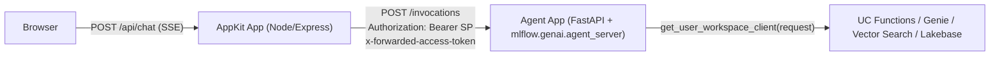

# Wire AppKit Frontend to Agent App Backend (2-Apps Canonical)

Proxy requests from an AppKit Databricks App (frontend) to a separate Agent Databricks App (backend) with end-user identity forwarded via `x-forwarded-access-token`. This is the canonical wiring for **Variant 4** of the workshop — the 2-Apps pattern where agent runtime and product UI are on independent deployment cadences.

## When to Use

- The agent is deployed as its **own Databricks App** (per [Track A 07-deploy-and-query](../../../genai-agents/tracks/A-custom-agent-apps/07-deploy-and-query/SKILL.md) with `target=databricks_apps`).
- You want a rich AppKit dashboard (Lakebase tables, admin views, custom React) **plus** a separate agent service.
- You need **user-scoped** tool calls (Lakebase row-level auth, Genie, per-user UC grants) — OBO is non-negotiable.
- You accept two deployables and two deploy cadences.

## When NOT to Use

- **Agent deployed to Model Serving / Agent Serving endpoint** — use [`06-appkit-serving-wiring`](../06-appkit-serving-wiring/SKILL.md). URL shape, auth model, and resource type differ.
- **Supervisor API (Beta) hosted agent** — use [`06b-appkit-supervisor-wiring`](../06b-appkit-supervisor-wiring/SKILL.md). That path uses a Python sidecar, not a separate Databricks App.
- **Agent in the same AppKit process (Node-native)** — keep the agent in-process and skip this proxy skill. The older `06c-appkit-integrated-agent` path is not bundled in this template.
- **Template-only chat app** (Variant 3) — no AppKit at all; just use a Databricks Apps template directly.

## Architecture



Two independent auth layers on every request:

- **App-to-App**: AppKit service principal has `CAN_USE` on the Agent App (carried as `Authorization: Bearer <SP>`).
- **End-user OBO**: forwarded verbatim as `x-forwarded-access-token` and consumed by the agent handler.

See [`references/obo-forwarding.md`](references/obo-forwarding.md) for the full contract.

---

## Header Contract (Canonical)

### Inbound headers (browser → AppKit App)

Databricks Apps canonical user headers, set by the Apps platform on every request:

- `x-forwarded-email` — the end user's email (canonical attribute used as MLflow `AssessmentSource.source_id`).
- `x-forwarded-preferred-username` — the user's preferred username (often equals the email).
- `x-forwarded-user` — the user's stable identifier (workspace user id).
- `x-forwarded-access-token` — the downscoped OBO token for user-scoped Databricks API calls (only present when the App declares `user_api_scopes`).

`x-forwarded-user-info` is **not** a canonical Databricks Apps header and must not be used. Earlier internal code paths assumed it existed; it does not. Always read the four canonical headers above.

### Outbound header (AppKit App → Agent App)

Pathway-C AppKit proxies must set `x-app-user-email` on outbound requests to the Agent App. The agent uses this value as `AssessmentSource.source_id` for MLflow feedback. **Do not infer originating user identity from the app-to-app OAuth `Authorization: Bearer` token** — that token represents the AppKit App service principal hop, not the originating end user.

Concretely, in the proxy handler (Step 2 below):

```typescript
const email = req.headers["x-forwarded-email"];
if (typeof email === "string" && email.length > 0) {
  headers.set("x-app-user-email", email);
}
```

The Agent App's `@invoke` / `@stream` handler then reads `x-app-user-email` from its incoming request and passes it as `AssessmentSource(source_type="HUMAN", source_id=<email>)` when it logs feedback to MLflow. See [Track A 04-authentication](../../../genai-agents/tracks/A-custom-agent-apps/04-authentication/SKILL.md) for the agent-side contract.

---

## SSE Synthesis Debt (`workspace_sse_guardrail`)

The Sonnet endpoints used in the workshop are subject to an AI-Gateway output guardrail that trips on streaming responses. When the selected `agent_chat` endpoint has `streaming_ok == false` in `endpoint_guardrail_audit`, this proxy MUST call the Agent App with `stream: false`, take the unary `/invocations` JSON response, and **synthesize** the SSE stream the frontend expects — typically one `response.output_text.delta` followed by `response.completed` and `[DONE]`. The dual extractor in [`references/dual-format-streaming.md`](references/dual-format-streaming.md) consumes that synthesized stream identically to a real one.

`debt: workspace_sse_guardrail` is canonical while the selected `agent_chat` endpoint has `streaming_ok == false`. This is "accepted permanent" only in the sense that the workshop has no admin-ticket or external-key requirement. The debt still has `remove_when` and must be audited by `vibecoding-state.audit_debts`.

Operator obligations:

- The synthesized-SSE branch MUST be tagged `debt: workspace_sse_guardrail` in `Globals.productized_debts[]`, with a `remove_when` predicate referencing `endpoint_guardrail_audit[llm_role_endpoints.agent_chat.endpoint].streaming_ok == true`.
- Do **not** assume the workaround is invisible just because no admin ticket is filed. `audit_debts` (see [`vibecoding-state` SKILL.md](../../../skills/vibecoding-state/SKILL.md)) re-evaluates `remove_when` on every audit run; once the upstream guardrail flips, the debt's `debt_lifted` evaluation flips and the synthesis branch must be removed.
- Ship a one-line revert path gated on `debt_lifted` (e.g. `return upstream.body` instead of synthesizing) so the proxy reverts to true streaming without further engineering when the policy changes.

Without this discipline, the proxy productizes the workaround forever — Track A users get non-streaming UX even after the underlying policy is fixed, because no operator will know to delete the synthesized-SSE branch.

---

## Request Body Contract (Dual Shape, Normalized)

The proxy MUST accept and normalize **both** of the request body shapes that AppKit chat clients and Track A authoring patterns produce:

- **Responses-style** — `{ "input": ... }` (the shape `mlflow.genai.agent_server` Responses adapters expect).
- **Chat-style** — `{ "messages": [{ "role": "user", "content": "..." }, ...] }` (the OpenAI-compatible shape used by the minimal hook in Step 4).

Anything else MUST be rejected at the proxy (before any upstream call) with HTTP `400` and a JSON body:

```json
{ "error": "invalid_body_shape", "accepted": ["input", "messages"] }
```

Concretely, in the proxy handler:

```typescript
type Body = { input?: unknown; messages?: unknown };
const body = (req.body ?? {}) as Body;
const hasInput = body.input !== undefined;
const hasMessages = Array.isArray(body.messages);
if (!hasInput && !hasMessages) {
  res.status(400).json({ error: "invalid_body_shape", accepted: ["input", "messages"] });
  return;
}
const upstreamBody = hasInput
  ? { input: body.input }
  : { messages: body.messages };
```

Why the dual shape matters: an earlier iteration of the proxy assumed only `{messages}` and dropped `{input}` callers silently — the agent received a malformed body and returned an empty stream that the dual extractor rendered as a blank UI. Rejecting with `invalid_body_shape` makes the contract violation observable instead of silent.

See [`references/dual-format-streaming.md`](references/dual-format-streaming.md) for the streaming counterpart of this contract — dual **request** shapes here, dual **response** shapes there.

---

## Before You Begin

**Prerequisites — verify these before proceeding:**

1. Agent App is deployed and in `RUNNING` state:

   ```bash
   databricks apps get "$AGENT_APP_NAME" --profile "$PROFILE" --output json | jq -r '.status.state'
   ```

   Expect `RUNNING`. If not, complete [Track A Prompt 17](../../../example/skyloyalty/WALKTHROUGH.md#prompt-17---deploy-agent) before continuing.

2. Agent App URL is known:

   ```bash
   databricks apps get "$AGENT_APP_NAME" --profile "$PROFILE" --output json | jq -r '.url'
   ```

3. Agent App accepts `/invocations`:

   ```bash
   AGENT_URL=$(databricks apps get "$AGENT_APP_NAME" --profile "$PROFILE" --output json | jq -r '.url')
   TOKEN=$(databricks auth token --profile "$PROFILE" --output json | jq -r '.access_token')
   curl -s -X POST "${AGENT_URL%/}/invocations" \
     -H "Authorization: Bearer $TOKEN" \
     -H "Content-Type: application/json" \
     -d '{"messages":[{"role":"user","content":"Hello"}]}' | head -c 500
   ```

   Non-empty response with HTTP 200 means the agent is reachable. A 401 means your SP lacks `CAN_USE` (see Step 1). A 404 means the agent wasn't authored with `/invocations` (it must use `mlflow.genai.agent_server` or `AgentServer.serve()` — see [Track A 02-agent-framework](../../../genai-agents/tracks/A-custom-agent-apps/02-agent-framework/SKILL.md)).

4. Node.js v22+ and Databricks CLI `>= 0.295.0`:

   ```bash
   node --version      # v22.x or higher
   databricks --version  # >= 0.295.0
   ```

### Working in Genie Code (client routing)

The proxy handler and OBO forwarding (Step 2) are **server-side code — identical on both clients**. Only the toolchain commands and the deployed-app probes differ. `$AGENT_APP_NAME` / `$APPKIT_APP_NAME` / `$PROFILE` / `$AGENT_APP_URL` resolve from `.vibecoding-state.md` when a prior phase wrote them (don't re-derive). Apply these substitutions:

| IDE/CLI (as written) | Genie Code substitution |
|----------------------|--------------------------|
| `databricks apps get … --profile $PROFILE` (Prereqs 1–2) | run via `runDatabricksCli` (read-tier), **omit `--profile`** |
| `databricks auth token` + `curl … /invocations -H "Authorization: Bearer …"` (Prereq 3) | `auth token` is hard-blocked and raw Bearer is rejected — confirm reachability from the **deployed AppKit proxy** (Step 6) or via the OAuth-session test in `03-appkit-deploy`; for a quick SP-only check use the SDK `executeCode` (`w.config` + `requests`) |
| `databricks bundle validate --profile $PROFILE` (Step 1d) | run via `runDatabricksCli` (omit `--profile`); if a targetless validate is guardrail-blocked, pass `--target dev` |
| `npm run build` gates (Steps 2, 3, 4, 5) | **IDE-only** convenience — no local Node toolchain. Skip; the platform builds **server-side** on deploy, errors surface in `databricks apps logs <name>` |
| `npm run dev` | not available — verify on the deployed app |
| `databricks apps deploy …` (Step 6a) | see the `03-appkit-deploy` deploy-routing contract (`runDatabricksCli`, else SDK `w.apps.deploy(... SNAPSHOT)`) |
| `test-agent-app-proxy.sh` four-probe E2E (Step 6b) | runs against **deployed** apps; on Genie Code drive its `databricks`/`curl` calls via `runDatabricksCli` / `executeCode` (omit `--profile`). The browser check (Step 6c) is the simplest manual verify. |

Paths are relative to `apps_lakebase/$APP_NAME` — under your `.assistant/skills` repo clone on Genie Code, never `/tmp`. See `skills/genie-code-environment` for the full manifest.

---

## Decision Defaults

| Decision | Default | Rationale |
|----------|---------|-----------|
| Chat route | `/api/chat` (SSE POST) | Matches the Track A agent app contract and keeps the frontend hook stable across variants |
| Frontend hook | Custom `useChat`-shaped hook (raw `fetch` + `ReadableStream`) | Serving plugin's `useServingStream` assumes a Serving endpoint URL shape |
| App-to-App auth | AppKit SP via `CAN_USE` on the Agent App | Explicit resource binding; auditable |
| End-user auth | Forward `x-forwarded-access-token` verbatim | What the agent's `get_user_workspace_client(request)` expects |
| Streaming format | Dual parser (Responses API + OpenAI chat chunks) | `mlflow.genai.agent_server` emits both depending on authoring pattern |
| Timeout | 120000 ms (2 min) | Agents can be slow; first-request cold-start ~20 s |
| Serving plugin? | **No** — use vanilla `server()` + `server.extend()` | Serving plugin's resource shape is wrong for Apps backends |
| Agent App URL env var | `AGENT_APP_URL` via `valueFrom: agent-backend` | Explicit, avoids platform-derived names that vary across CLI versions |

---

## Step 0: Workspace alignment preflight

`app:` resource binding (Step 1) **only** works when the AppKit App and the Agent App live in the same Databricks workspace. Cross-workspace bindings are silently dropped at deploy time. Run this preflight before declaring the resource — it takes 30 seconds and prevents a multi-hour migration loop.

```bash
profile_host() {
  local profile="$1"
  databricks auth profiles --skip-validate --output json \
    | jq -r --arg p "$profile" '.profiles[] | select(.name == $p) | .host'
}

APPKIT_PROFILE="${APPKIT_PROFILE:-$PROFILE}"
AGENT_PROFILE="${AGENT_PROFILE:-$PROFILE}"

APPKIT_HOST=$(profile_host "$APPKIT_PROFILE")
AGENT_HOST=$(profile_host "$AGENT_PROFILE")

if [ -z "$APPKIT_HOST" ] || [ -z "$AGENT_HOST" ]; then
  echo "FAIL: could not resolve both Databricks profile hosts."
  echo "      APPKIT_PROFILE=$APPKIT_PROFILE -> ${APPKIT_HOST:-<missing>}"
  echo "      AGENT_PROFILE=$AGENT_PROFILE -> ${AGENT_HOST:-<missing>}"
  exit 1
fi

[ "$APPKIT_HOST" = "$AGENT_HOST" ] || {
  echo "FAIL: AppKit ($APPKIT_HOST) and Agent ($AGENT_HOST) live in different workspaces."
  echo "      app: resource binding requires same-workspace deployment."
  exit 1
}

echo "OK: AppKit and Agent App are in the same workspace ($APPKIT_HOST)."
```

> **Why this halts not warns.** A cross-workspace `app:` binding produces a misleading error chain at deploy time: `databricks bundle deploy` succeeds, the app starts in `RUNNING` state, but every `/api/chat` request returns `403 App not authorized` with no clear diagnostic. The four-probe script's Probe 2 (`appkit_sp_only`) catches it eventually, but only after a full deploy cycle. Better to halt here.

**Lakebase / MLflow caveat.** Do not compare `lakebase_host` string prefixes against the workspace host; Lakebase/Postgres endpoint hostnames are not guaranteed to share the workspace URL prefix. The right checks are: the AppKit and Agent App profiles resolve to the same Databricks workspace host, the AppKit bundle target host equals that host, and the MLflow experiment / UC trace tables are created in that same workspace context.

**Captured state.** Record the verified workspace host in the state file under `Captured Resource IDs` as `apps_workspace_host: <host>`. Step 1 (resource binding) reads this value to confirm the bundle target matches.

**Gate:** `APPKIT_HOST == AGENT_HOST`, and the AppKit bundle target host matches that same value.

---

## Step 1: Declare the Agent App as a Resource

The AppKit App must have `CAN_USE` on the Agent App. Declare it in the bundle.

**Read [`references/app-resource-declaration.md`](references/app-resource-declaration.md) now** — it covers both DABs and Apps UI forms, the `app` vs `serving_endpoint` distinction, and the `databricks bundle schema` verification.

### 1a. `databricks.yml`

```yaml
variables:
  agent_app_name:
    description: Name of the Agent App deployed per Track A 07-deploy-and-query
  appkit_app_name:
    description: Name of this AppKit App

resources:
  apps:
    ${var.appkit_app_name}:
      resources:
        - name: agent-backend
          description: Agent App this AppKit dashboard proxies to
          app:
            name: ${var.agent_app_name}
            permission: CAN_USE
```

### 1b. `app.yaml`

```yaml
env:
  - name: AGENT_APP_URL
    valueFrom: agent-backend
```

### 1c. Local `.env`

```env
AGENT_APP_URL=https://<agent-app-name>-<workspace-id>.apps.databricks.com
```

### 1d. Validate

```bash
cd apps_lakebase/$APP_NAME
databricks bundle validate --profile "$PROFILE"
```

Expected output ends with `Validation OK`. An `unknown field: app` error means your CLI is older than `0.295.0` — upgrade.

**Gate:** `databricks bundle validate` passes with the `app` resource accepted.

---

## Step 2: Write the Proxy Handler

Create `server/agent-proxy.ts`. This file is the entire App-to-Agent contract.

**Read [`references/obo-forwarding.md`](references/obo-forwarding.md) now** — the full explanation of two-layer auth, why `.asUser(req)` doesn't apply, and the per-request `getExecutionContext()` rule lives there. The snippet below is minimal; the reference file is authoritative.

```typescript
import type { Request, Response } from "express";
import { Readable } from "node:stream/web";
import { getExecutionContext } from "@databricks/appkit";

async function buildBackendHeaders(req: Request): Promise<Headers> {
  const ctx = getExecutionContext();
  const config = ctx.client.config;
  await config.ensureResolved();

  const headers = new Headers();
  await config.authenticate(headers);
  headers.set("Content-Type", "application/json");

  const forwarded = req.headers["x-forwarded-access-token"];
  if (typeof forwarded === "string" && forwarded.length > 0) {
    headers.set("x-forwarded-access-token", forwarded);
  }

  // Pathway-C identity propagation: forward the originating user's email so
  // the Agent App can use it as MLflow AssessmentSource.source_id. The
  // app-to-app Bearer above represents the AppKit SP, not the end user.
  const email = req.headers["x-forwarded-email"];
  if (typeof email === "string" && email.length > 0) {
    headers.set("x-app-user-email", email);
  }

  return headers;
}

export async function proxyAgentChat(req: Request, res: Response): Promise<void> {
  const base = (process.env.AGENT_APP_URL ?? "").replace(/\/$/, "");
  if (!base) {
    res.status(500).json({ error: "AGENT_APP_URL is not configured" });
    return;
  }

  // Dual request-shape contract — see "Request Body Contract" section above.
  // Accept Responses-style {input} and Chat-style {messages}; reject anything else.
  type Body = { input?: unknown; messages?: unknown };
  const body = (req.body ?? {}) as Body;
  const hasInput = body.input !== undefined;
  const hasMessages = Array.isArray(body.messages);
  if (!hasInput && !hasMessages) {
    res.status(400).json({ error: "invalid_body_shape", accepted: ["input", "messages"] });
    return;
  }
  const upstreamBody = hasInput ? { input: body.input } : { messages: body.messages };

  const headers = await buildBackendHeaders(req);
  const upstream = await fetch(`${base}/invocations`, {
    method: "POST",
    headers,
    body: JSON.stringify(upstreamBody),
  });

  if (!upstream.ok || !upstream.body) {
    const text = await upstream.text();
    res.status(upstream.status).send(text);
    return;
  }

  res.writeHead(200, {
    "Content-Type": "text/event-stream",
    "Cache-Control": "no-cache",
    "Connection": "keep-alive",
  });
  Readable.fromWeb(upstream.body).pipe(res);
}
```

Key rules:

- `getExecutionContext()` runs **inside the handler**, never at module scope (per-request token resolution).
- `config.authenticate(headers)` always runs — the Bearer is the SP, not the user.
- `x-forwarded-access-token` is forwarded **verbatim** if present; no decoding, no re-wrapping.
- `x-app-user-email` is set from the inbound `x-forwarded-email` so the agent can attribute MLflow feedback to the originating user (not the AppKit SP). See "Header Contract" above.
- `AGENT_APP_URL.replace(/\/$/, "")` normalizes the trailing slash before appending `/invocations`.
- The request body is normalized per the dual-shape contract above: Responses-style `{input}` or Chat-style `{messages}` only; anything else returns `400 invalid_body_shape`.
- `Readable.fromWeb(upstream.body).pipe(res)` handles SSE pass-through on Node 22+. **Note:** when `endpoint_guardrail_audit[agent_chat].streaming_ok == false` you cannot pass-through — you must call `/invocations` with `stream: false`, parse the unary JSON, and synthesize a single `response.output_text.delta` + `response.completed` + `[DONE]` SSE frame sequence. Tag that branch `debt: workspace_sse_guardrail` per the SSE Synthesis Debt section above.

**Gate:** `npm run build` passes with `agent-proxy.ts` compiled and no TypeScript errors.

---

## Step 3: Mount in `server/server.ts`

`server.extend()` must run **before** `server.start()`, so disable auto-start.

```typescript
import { createApp, server } from "@databricks/appkit";
import { proxyAgentChat } from "./agent-proxy";

const AppKit = await createApp({
  plugins: [server({ autoStart: false })],
});

AppKit.server.extend((app) => {
  app.post("/api/chat", proxyAgentChat);
});

await AppKit.server.start();
```

Same pattern as [`05-appkit-lakebase-wiring`](../05-appkit-lakebase-wiring/SKILL.md) and [`06b-appkit-supervisor-wiring`](../06b-appkit-supervisor-wiring/SKILL.md). If your existing `server.ts` already starts the server before extending, refactor to this order.

> **Do NOT register the `serving()` plugin here.** The Serving plugin targets Model Serving endpoints, not Apps. Adding it configures auto-routes that will never work against `AGENT_APP_URL`.

**Gate:** `npm run build` passes.

---

## Step 4: Wire the Frontend Chat UI

The proxy exposes `/api/chat` as SSE. Build a client that sends `{ messages: [...] }` and parses the dual-format stream.

**Read [`references/dual-format-streaming.md`](references/dual-format-streaming.md) now** — the extractor for Responses API events (`response.output_text.delta`) versus OpenAI chat chunks is non-obvious and agent-specific.

### 4a. Minimal React Hook

```tsx
import { useState, useCallback } from "react";

type Msg = { role: "user" | "assistant"; content: string };

export function useAgentChat() {
  const [messages, setMessages] = useState<Msg[]>([]);
  const [streaming, setStreaming] = useState(false);
  const [error, setError] = useState<string | null>(null);

  const send = useCallback(async (content: string) => {
    const next: Msg[] = [...messages, { role: "user", content }];
    setMessages(next);
    setStreaming(true);
    setError(null);

    try {
      const res = await fetch("/api/chat", {
        method: "POST",
        headers: { "Content-Type": "application/json" },
        body: JSON.stringify({ messages: next }),
      });
      if (!res.ok || !res.body) throw new Error(`HTTP ${res.status}`);

      const reader = res.body.getReader();
      const decoder = new TextDecoder();
      let buffer = "";
      let assistantText = "";

      while (true) {
        const { done, value } = await reader.read();
        if (done) break;
        buffer += decoder.decode(value, { stream: true });
        const events = buffer.split("\n\n");
        buffer = events.pop() ?? "";
        for (const ev of events) {
          const line = ev.split("\n").find((l) => l.startsWith("data: "));
          if (!line) continue;
          const payload = line.slice(6);
          if (payload === "[DONE]") continue;
          try {
            const chunk = JSON.parse(payload);
            const delta =
              chunk.type === "response.output_text.delta"
                ? chunk.delta ?? ""
                : chunk.choices?.[0]?.delta?.content ?? "";
            if (delta) {
              assistantText += delta;
              setMessages((prev) => {
                const copy = [...prev];
                const last = copy[copy.length - 1];
                if (last?.role === "assistant") {
                  copy[copy.length - 1] = { role: "assistant", content: assistantText };
                } else {
                  copy.push({ role: "assistant", content: assistantText });
                }
                return copy;
              });
            }
          } catch {
            // Partial chunk or non-JSON keepalive — ignore
          }
        }
      }
    } catch (err) {
      setError(String(err));
    } finally {
      setStreaming(false);
    }
  }, [messages]);

  return { messages, send, streaming, error };
}
```

### 4b. Conversation State Rules

- Pass the **full message history** on every request — the agent is stateless at the HTTP layer; long-term state lives in Lakebase (see [Track A 05-lakebase-memory](../../../genai-agents/tracks/A-custom-agent-apps/05-lakebase-memory/SKILL.md)).
- Append the assistant message **incrementally** during streaming, not only at end — gives progressive UX.
- Use the dual extractor unconditionally — the agent may switch authoring patterns without warning.

**Gate:** `npm run build` passes with the chat hook and page compiled.

---

## Step 5: Build Gate

```bash
cd apps_lakebase/$APP_NAME
npm run build
```

Must pass with zero TypeScript errors before deploy. Do **not** run `npm run dev` yet unless `.env` has `AGENT_APP_URL` set.

---

## Step 6: Deploy and Verify

### 6a. Deploy

Use [`03-appkit-deploy`](../03-appkit-deploy/SKILL.md):

```bash
databricks apps deploy --profile "$PROFILE"
```

First deploy after adding the `app:` resource may require a **resource binding approval** in the Apps UI (the AppKit SP must be granted `CAN_USE` on the Agent App — this is an explicit consent step). Check the Apps UI → your App → Resources tab for any `Pending approval` status.

### 6b. End-to-End Probes (Four-Probe Identity Verification)

```bash
EXPECTED_USER_EMAIL="real-end-user@example.com" \
MLFLOW_TRACING_SQL_WAREHOUSE_ID="<warehouse-id>" \
MLFLOW_TRACING_TABLE="<catalog>.<schema>.<prefix>" \
bash apps_lakebase/skills/06d-appkit-agent-app-proxy/scripts/test-agent-app-proxy.sh \
  --appkit-app "$APPKIT_APP_NAME" \
  --agent-app "$AGENT_APP_NAME" \
  --profile "$PROFILE" \
  --expected-email "$EXPECTED_USER_EMAIL"
```

The script runs **four probes**. The first three exercise transport; the fourth asserts identity attribution end-to-end (the canonical Pathway-C failure mode is feedback `source_id` ending up as the AppKit SP UUID instead of the originating user's email):

| # | Probe | What it proves | Failure signature |
|---|-------|---------------|-------------------|
| 1 | `agent_direct` | Direct `POST /invocations` on the Agent App with SP `Authorization: Bearer` succeeds → the agent is up and the SP has `CAN_USE`. | HTTP 401: SP lacks `CAN_USE`. HTTP 404: agent not authored with `/invocations`. |
| 2 | `appkit_sp_only` | `POST /api/chat` on the AppKit App with no `x-forwarded-access-token` succeeds → the **app-to-app proxy path** works (SP-only auth flows from AppKit to Agent App). | HTTP 5xx: proxy never executed `config.authenticate(headers)`. HTTP 403: resource-binding approval pending. |
| 3 | `appkit_with_obo` | `POST /api/chat` with a stub `x-forwarded-access-token` *and* `x-forwarded-email` succeeds → **OBO header propagation** works (the proxy forwards both `x-forwarded-access-token` verbatim and stamps `x-app-user-email` outbound). | HTTP 200 but a downstream tool 401 means the agent received the OBO token but couldn't use it (scope issue). |
| 4 | `feedback_source_id` | A `user_feedback` assessment recorded for the trace returned by Probe 3 has `AssessmentSource.source_id == EXPECTED_USER_EMAIL`, **NOT** the AppKit SP UUID. Uses the **canonical UC v4 trace ID conversion contract** documented in [Skill 04c — Trace ID Contract: Two Forms](../../../genai-agents/sdlc/04c-end-user-feedback/SKILL.md#trace-id-contract-two-forms): converts the client form `trace:/<catalog>.<schema>.<prefix>/<bare_id>` to the Assessments backend form (bare id) before reading the row from the SQL warehouse. | `trace_assessment_api_contract_missing` — required env vars or API shape are unavailable; this is **a fail, not a silent pass**. Otherwise: `source_id` is the AppKit SP UUID — `x-app-user-email` was not forwarded (Step 2 regression) or the agent ignored it (Track A 04 regression). |

**Probe 4 contract — explicit fail vs. silent pass.** The probe must use the same trace-ID conversion as Skill 04c. If any of the following are missing:

- `EXPECTED_USER_EMAIL` (the originating end-user identity to assert against)
- `MLFLOW_TRACING_SQL_WAREHOUSE_ID` (the warehouse the trace assessments table is surfaced through)
- `MLFLOW_TRACING_TABLE` (`<catalog>.<schema>.<prefix>` for the UC v4 trace tables)
- A `trace_id` from Probe 3 (means the agent does not implement Skill 04c Pattern A or B — `trace_id` never reaches the frontend)
- A readable `<prefix>_assessments` row (means the feedback path never wrote, or warehouse lag)

…Probe 4 fails with the explicit reason `trace_assessment_api_contract_missing`. **It does not silently pass.** A green Probe 4 means: the agent emits trace ids in the documented form, the AppKit feedback path or agent-side `mlflow.log_feedback(...)` wrote a row, and the row attributes the assessment to the originating user — not the AppKit service-principal hop.

All four must pass to declare the proxy verified.

### 6c. Browser Verification

Open the AppKit app URL in a browser and test:

- Chat input accepts a message.
- Response streams progressively (no 30-second wall-of-silence).
- Conversation history persists across turns.
- A **domain-specific data question** returns data — not just a greeting. If the agent greets but returns nothing for "how many bookings last month?", the tool-calling path is broken on the agent side (not the proxy).
- For per-user-scoped queries (Lakebase row-level data), verify the result set matches the logged-in user — OBO is actually flowing.

**Gate:** All four probes pass (including the `feedback_source_id` identity-attribution probe) **and** a domain-specific question returns user-scoped data. Probe 4 must not skip with `trace_assessment_api_contract_missing` — that is a fail, not a pass.

---

## Gotchas

Inline callouts are summarized below.

| Gotcha | Fix | Step |
|--------|-----|------|
| Used `serving_endpoint` resource type instead of `app` | Switch to `app:` with `CAN_USE` — see [`references/app-resource-declaration.md`](references/app-resource-declaration.md) | 1 |
| `AGENT_APP_URL` empty at runtime | Resource name mismatch between `databricks.yml` and `valueFrom` — both must read `agent-backend` | 1 |
| `serving()` plugin registered | Adds auto-routes that 404 against Agent App; remove it | 3 |
| `getExecutionContext()` cached at module scope | Intermittent 401s under load; token cache is per-request | 2 |
| Forwarded only the header, stripped `Authorization` | 403 from Apps platform (not the agent) — both headers needed | 2 |
| `AGENT_APP_URL` has a trailing `/` | `POST /invocations/invocations` 404 | 2 |
| Parser only reads `choices[0].delta.content` | Blank UI against `ResponsesAgent` streams — see [`references/dual-format-streaming.md`](references/dual-format-streaming.md) | 4 |
| Ship after one "Hello" response | Tool-calling path may still be broken; test a real domain question | 6 |
| Pending resource approval not granted | Deploy succeeds, `/api/chat` 403 with `App not authorized` | 6 |
| First-request cold start ~20 s | Agent App containers sleep; increase first-request frontend timeout or warm the agent with a cron | 6 |
| Used `.asUser(req)` from Serving plugin | Targets `/serving-endpoints/...` — wrong URL; won't work against Apps | 2 |
| Agent App authored without `/invocations` | 404 on any probe; agent needs `mlflow.genai.agent_server` or `AgentServer.serve()` | — |
| Read `x-forwarded-user-info` to identify the user | That header does not exist on Databricks Apps. Use the canonical `x-forwarded-email` / `x-forwarded-preferred-username` / `x-forwarded-user` triplet | Header Contract |
| Skipped setting `x-app-user-email` and let the agent use SP identity for feedback | MLflow `AssessmentSource.source_id` becomes the AppKit SP UUID, not the user's email — every assessment looks like the same author. Caught by Probe 4 (`feedback_source_id`) in the four-probe verification script. | 2 |
| Probe 4 returns `trace_assessment_api_contract_missing` and you treat it as a pass | That sentinel is a **fail**, not a skip. It means the trace-ID round-trip or assessments read-back is broken; you have no evidence the AppKit SP UUID issue is fixed. Set `EXPECTED_USER_EMAIL`, `MLFLOW_TRACING_SQL_WAREHOUSE_ID`, `MLFLOW_TRACING_TABLE`, ensure the agent emits `trace_id` per Skill 04c Pattern A or B, and re-run. | 6 |
| Proxy accepts only `{messages}` and silently drops `{input}` callers | Responses-style clients get an empty stream and a blank UI with no error in the logs. Implement the dual Request Body Contract and reject unknown shapes with `400 invalid_body_shape` so contract violations are observable. | 2 |
| SSE pass-through used unconditionally even when `endpoint_guardrail_audit[agent_chat].streaming_ok == false` | The Sonnet output guardrail trips and the request fails. Synthesize a single `response.output_text.delta` + `response.completed` + `[DONE]` from the unary `/invocations` response, and tag the branch `debt: workspace_sse_guardrail` with a `remove_when` predicate so it is reverted automatically once the guardrail is lifted. | 2 |
| Synthesized-SSE branch shipped without a `debt: workspace_sse_guardrail` tag in `Globals.productized_debts[]` | `audit_debts` has no record to evaluate; once the workspace policy is fixed, the proxy productizes non-streaming UX forever and no operator knows to delete the workaround. | SSE Synthesis Debt |

---

## Anti-Patterns

| Anti-Pattern | Why It Fails | Correct Approach |
|--------------|--------------|------------------|
| Copy [`06-appkit-serving-wiring`](../06-appkit-serving-wiring/SKILL.md) verbatim | Wrong URL shape, wrong resource type, wrong auth helpers | Use this skill; the patterns differ at every layer |
| Stash OBO token in a module-level variable | Tokens are per-request; cached token leaks across users | Always call `getExecutionContext()` and read headers inside the handler |
| Skip `config.authenticate(headers)` because `x-forwarded-access-token` is present | App-to-App Bearer is still required; only user tools use the forwarded token | Always set both |
| Use `server.extend` after `server.start()` | Routes never register | `server({ autoStart: false })` + `extend` + `start` |
| Transform `messages` → `input` (or vice versa) in the proxy | Agent handlers authored per Track A accept the shape they were called with; rewriting `messages` into `input` (or back) breaks the agent contract on whichever side you didn't author | Forward the originating shape unchanged per the dual Request Body Contract; reject unknown shapes with `400 invalid_body_shape` rather than guessing |
| Delete the AppKit App to "start fresh" after a resource-binding error | New SP ID loses Lakebase ownership | Fix the binding in the Apps UI |

---

## Migration: 06 → 06d

If you started on a Model Serving endpoint and are moving the agent to a Databricks App per [migrate-agent-to-apps](https://docs.databricks.com/aws/en/generative-ai/agent-framework/migrate-agent-to-apps), read [`references/migration-from-serving.md`](references/migration-from-serving.md). It covers the `serving_endpoint` → `app` resource swap, dropping the `serving()` plugin, and route renaming.

---

## Quick Reference

| Task | Command / Pattern |
|------|------------------|
| Check Agent App status | `databricks apps get "$AGENT_APP_NAME" --profile "$PROFILE" --output json \| jq -r '.status.state'` |
| Check Agent App URL | `databricks apps get "$AGENT_APP_NAME" --profile "$PROFILE" --output json \| jq -r '.url'` |
| Smoke test Agent App | `curl -X POST "${AGENT_URL%/}/invocations" -H "Authorization: Bearer $TOKEN" -H "Content-Type: application/json" -d '{"messages":[{"role":"user","content":"Hello"}]}'` |
| Validate bundle | `databricks bundle validate --profile "$PROFILE"` |
| Build gate | `npm run build` |
| E2E test (4 probes) | `EXPECTED_USER_EMAIL=... MLFLOW_TRACING_SQL_WAREHOUSE_ID=... MLFLOW_TRACING_TABLE=<catalog>.<schema>.<prefix> bash apps_lakebase/skills/06d-appkit-agent-app-proxy/scripts/test-agent-app-proxy.sh --appkit-app $APPKIT_APP_NAME --agent-app $AGENT_APP_NAME --profile $PROFILE --expected-email $EXPECTED_USER_EMAIL` |
| AppKit docs (live) | `npx @databricks/appkit docs "server"` |

---

## References

- Upstream platform skills: [`databricks-model-serving`](https://github.com/databricks/databricks-agent-skills/tree/main/skills/databricks-model-serving) and [`databricks-apps`](https://github.com/databricks/databricks-agent-skills/tree/main/skills/databricks-apps) (both tracked in `upstream_sources`).
- [`references/obo-forwarding.md`](references/obo-forwarding.md) — `x-forwarded-access-token` contract and proxy implementation details
- [`references/app-resource-declaration.md`](references/app-resource-declaration.md) — `databricks.yml` `app:` resource form and `valueFrom` mapping
- [`references/dual-format-streaming.md`](references/dual-format-streaming.md) — SSE parser for Responses API + OpenAI chat chunks
- [`references/migration-from-serving.md`](references/migration-from-serving.md) — moving an app from 06 (Model Serving) to 06d (Apps backend)
- [Author an agent on Databricks Apps](https://docs.databricks.com/aws/en/generative-ai/agent-framework/author-agent)
- [Stateful agents](https://docs.databricks.com/aws/en/generative-ai/agent-framework/stateful-agents)
- [Migrate an agent to Databricks Apps](https://docs.databricks.com/aws/en/generative-ai/agent-framework/migrate-agent-to-apps)
- [Track A 02-agent-framework](../../../genai-agents/tracks/A-custom-agent-apps/02-agent-framework/SKILL.md) — the agent-authoring counterpart
- [WALKTHROUGH-agentapp-plus-appkit](../../../example/skyloyalty/WALKTHROUGH.md) — Variant 4 end-to-end orchestration
