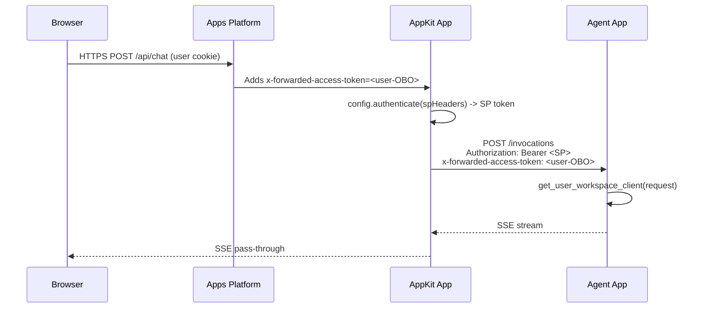

# OBO Forwarding — `x-forwarded-access-token`

Use this reference when wiring an AppKit Databricks App (frontend) to a separate **Agent Databricks App** (backend). The Agent App expects the end-user's identity via the `x-forwarded-access-token` HTTP header; the AppKit proxy must forward that header verbatim on every request.

**When to read this:** Reading [../SKILL.md](../SKILL.md) and reached Step 2 (proxy handler). Stop and read this file first.

> **Client routing:** the OBO-forwarding proxy code here is **server-side and client-agnostic** — it runs identically whether the app was deployed from an IDE or Genie Code. No command substitutions apply to the code itself; only the surrounding deploy/verify toolchain differs (see [`../SKILL.md`](../SKILL.md) routing table).

**Do NOT use this pattern for:**

- **Model Serving / Agent Serving endpoints** — use the AppKit `serving()` plugin's `.asUser(req)` helper. See [apps_lakebase/skills/06-appkit-serving-wiring/SKILL.md](../../06-appkit-serving-wiring/SKILL.md).
- **In-process agent in the same App** — no forwarding needed; the request context already carries the user. The older `06c-appkit-integrated-agent` path is not bundled in this template.

---

## The Contract



Two independent auth layers travel on the same request:

| Header | Value | Who uses it | Purpose |
|--------|-------|-------------|---------|
| `Authorization: Bearer <token>` | AppKit App's service principal token | Agent App's ingress (Databricks Apps platform) | Proves AppKit SP has `CAN_USE` on the Agent App |
| `x-forwarded-access-token` | End user's OBO token | Agent App's handler code (`get_user_workspace_client`) | Gives tool calls the end user's identity |

Both must be present in production. In local dev, only the SP auth flows; the user header is missing and the agent falls back to SP identity with a log warning.

---

## Proxy Implementation (TypeScript)

Canonical pattern for `server/agent-proxy.ts`. Adapted from [apps_lakebase/skills/06b-appkit-supervisor-wiring/SKILL.md](../../06b-appkit-supervisor-wiring/SKILL.md) Node proxy, but **without** the Python sidecar — the backend is already a Databricks App with its own `/invocations` route.

```typescript
import type { Request, Response } from "express";
import { Readable } from "node:stream/web";
import { getExecutionContext } from "@databricks/appkit";

const AGENT_APP_URL = process.env.AGENT_APP_URL ?? "";

async function buildBackendHeaders(req: Request): Promise<Headers> {
  const ctx = getExecutionContext();
  const config = ctx.client.config;
  await config.ensureResolved();

  const headers = new Headers();
  await config.authenticate(headers);
  headers.set("Content-Type", "application/json");

  const forwardedUserToken = req.headers["x-forwarded-access-token"];
  if (typeof forwardedUserToken === "string" && forwardedUserToken.length > 0) {
    headers.set("x-forwarded-access-token", forwardedUserToken);
  } else if (process.env.NODE_ENV === "production") {
    console.warn(
      "[agent-proxy] no x-forwarded-access-token on request; agent will run as AppKit SP",
    );
  }

  return headers;
}

export async function proxyAgentChat(req: Request, res: Response): Promise<void> {
  if (!AGENT_APP_URL) {
    res.status(500).json({ error: "AGENT_APP_URL is not configured" });
    return;
  }

  const headers = await buildBackendHeaders(req);
  const url = `${AGENT_APP_URL.replace(/\/$/, "")}/invocations`;

  const upstream = await fetch(url, {
    method: "POST",
    headers,
    body: JSON.stringify({ messages: req.body.messages }),
  });

  if (!upstream.ok || !upstream.body) {
    const text = await upstream.text();
    res.status(upstream.status).send(text);
    return;
  }

  res.writeHead(200, {
    "Content-Type": "text/event-stream",
    "Cache-Control": "no-cache",
    "Connection": "keep-alive",
  });
  Readable.fromWeb(upstream.body).pipe(res);
}
```

Critical details:

- `config.authenticate(headers)` **always** runs — the Bearer is the SP, not the user. Do not skip this just because `x-forwarded-access-token` is present.
- `x-forwarded-access-token` is forwarded **verbatim**. Do not decode, refresh, or re-wrap it.
- `getExecutionContext()` is called **per request**, not at module scope. Token cache is per-request; caching at module scope ends in stale-token 401s.
- `Readable.fromWeb(upstream.body).pipe(res)` is the Node 22+ idiomatic SSE passthrough.
- `AGENT_APP_URL.replace(/\/$/, "")` — the Apps platform sometimes injects URLs with a trailing slash. Strip it once, then append `/invocations`.

---

## Why Not `.asUser(req)`?

The AppKit `serving()` plugin exposes `AppKit.serving("agent").asUser(req).invoke(...)`. That helper:

1. Resolves the Serving endpoint URL from `DATABRICKS_SERVING_ENDPOINT_NAME`.
2. Mints a user-scoped token from `x-forwarded-access-token`.
3. Calls `/serving-endpoints/:name/invocations`.

None of that applies to a Databricks App backend:

| Concern | `serving().asUser(req)` | 06d proxy |
|---------|--------------------------|-----------|
| Target URL | `/serving-endpoints/:name/invocations` | `<AGENT_APP_URL>/invocations` |
| Resource type | `serving-endpoint` | `app` (with `CAN_USE`) |
| Auth model | Single user-scoped Bearer | Two-layer (SP Bearer + forwarded user header) |
| Request shape | Serving-endpoint OpenAPI schema (`messages` or `input`) | Whatever the Agent App's `/invocations` accepts |

Using `asUser(req)` against a Databricks App URL will 404 — there's no `/serving-endpoints/...` route on an App.

---

## Agent App Side (reference only)

The backend that accepts these headers is authored per Track A. The relevant snippet — in the Agent App, **not** in this skill — is:

```python
from databricks_app.utils import get_user_workspace_client
from mlflow.genai import agent_server

@agent_server.invoke
async def handle_invoke(request: dict, http_request) -> dict:
    ws = get_user_workspace_client(http_request)
    # All tool calls below are user-scoped via ws.
    ...
```

The Agent App reads `x-forwarded-access-token` off `http_request`; no extra code on the AppKit side is needed to make this work, provided the header arrives intact.

See [Author an agent on Databricks Apps](https://docs.databricks.com/aws/en/generative-ai/agent-framework/author-agent) and [Stateful agents](https://docs.databricks.com/aws/en/generative-ai/agent-framework/stateful-agents) for the full agent-side pattern.

---

## Local Dev Behaviour

When running `npm run dev` locally:

- The Apps platform is absent, so `x-forwarded-access-token` is never set.
- `config.authenticate(headers)` still resolves (from CLI profile or `DATABRICKS_HOST` + `DATABRICKS_TOKEN` in `.env`).
- The Agent App falls back to its own SP / personal token.
- All tool calls run as that fallback identity.

This is fine for development. For **OBO-dependent tests** (per-user Lakebase, Genie with user scope), deploy both Apps and test in production.

---

## Gotchas

| Gotcha | Symptom | Fix |
|--------|---------|-----|
| Forgot to forward the header | Agent traces all show the same SP user | Add the `if (typeof forwardedUserToken === "string")` block |
| Cached `getExecutionContext()` at module scope | Intermittent 401s under load | Call `getExecutionContext()` inside the handler |
| Forwarded the header but stripped `Authorization` | `403` from the Apps platform (not the agent) | Keep both headers; they serve different layers |
| Assumed `NODE_ENV` defaults to `development` | Warning never prints in production | Set `NODE_ENV=production` in `app.yaml` — see [apps_lakebase/skills/03-appkit-deploy/SKILL.md](../../03-appkit-deploy/SKILL.md) |
| Used `req.headers.get(...)` | TypeScript error; Express `req.headers` is a plain object | Use `req.headers["x-forwarded-access-token"]` |

---

## References

- [Author an agent on Databricks Apps](https://docs.databricks.com/aws/en/generative-ai/agent-framework/author-agent)
- [Stateful agents](https://docs.databricks.com/aws/en/generative-ai/agent-framework/stateful-agents)
- [Agent authentication](https://docs.databricks.com/aws/en/generative-ai/agent-framework/agent-authentication)
- [Migrate an agent to Databricks Apps](https://docs.databricks.com/aws/en/generative-ai/agent-framework/migrate-agent-to-apps)
