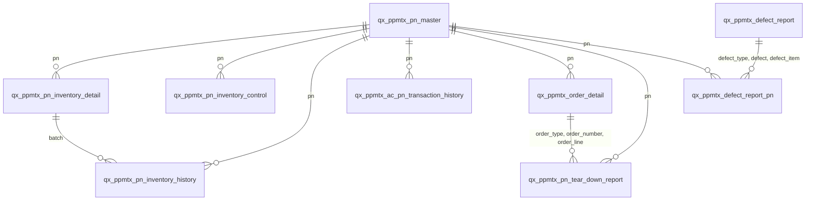

# Genie Analysis Plan — Propulsion Predictive Maintenance

**Source:** `subject_maintenanceengineering_test.an_maintenanceengineering_ods` (Silver layer)
**Tables:** 14 | **Columns:** 1210

---

## 1. Table Inventory

| Table | Type | Columns | Comment | Business Domain |
|-------|------|---------|---------|----------------|
| `qx_ppmtx_ac_pn_transaction_history` | STREAMING_TABLE | 66 | Silver aircraft part transactions - validated component remo | Transaction History |
| `qx_ppmtx_defect_report` | STREAMING_TABLE | 221 | Silver defect reports - validated aircraft defect and mainte | Defect / Maintenance |
| `qx_ppmtx_defect_report_pn` | STREAMING_TABLE | 20 | Silver defect report parts - validated parts associated with | Defect / Maintenance |
| `qx_ppmtx_dq_orphaned_defect_pn` | MATERIALIZED_VIEW | 6 | Referential integrity check - defect report parts without ma | Defect / Maintenance |
| `qx_ppmtx_dq_orphaned_inventory` | MATERIALIZED_VIEW | 6 | Referential integrity check - inventory detail records witho | Inventory Management |
| `qx_ppmtx_dq_record_counts` | MATERIALIZED_VIEW | 3 | Data quality monitoring - record counts and processing times | Data Quality (Monitoring) |
| `qx_ppmtx_dq_rules` | MANAGED | 8 | Centralized data quality rules for Silver layer pipelines | Data Quality (Monitoring) |
| `qx_ppmtx_order_detail` | STREAMING_TABLE | 226 | Silver order detail - validated maintenance order line items | Procurement / Orders |
| `qx_ppmtx_pn_inventory_control` | STREAMING_TABLE | 38 | Silver inventory control - validated scheduled maintenance c | Inventory Management |
| `qx_ppmtx_pn_inventory_detail` | STREAMING_TABLE | 133 | Silver inventory detail - validated part inventory records w | Inventory Management |
| `qx_ppmtx_pn_inventory_detail_quarantine` | STREAMING_TABLE | 134 | Quarantined inventory detail records that failed critical DQ | Inventory Management |
| `qx_ppmtx_pn_inventory_history` | STREAMING_TABLE | 104 | Silver inventory history - validated inventory transaction r | Inventory Management |
| `qx_ppmtx_pn_master` | STREAMING_TABLE | 214 | Silver part number master - validated part catalog with qual | Part Master Data |
| `qx_ppmtx_pn_tear_down_report` | STREAMING_TABLE | 31 | Silver tear down reports - validated component teardown and  | Component Overhaul |

## 2. Column Analysis (Key Columns per Table)

### `qx_ppmtx_ac_pn_transaction_history`

| Column | Type | Nullable | Role |
|--------|------|----------|------|
| `transaction` | STRING | YES | **Dimension Key** |
| `transaction_item` | DECIMAL | YES | **FK / Composite Key** |
| `transaction_type` | STRING | YES | Attribute |
| `ac` | STRING | YES | **Dimension Key** |
| `transaction_date` | TIMESTAMP | YES | **Timestamp** |
| `transaction_hour` | DECIMAL | YES | Attribute |
| `transaction_minute` | DECIMAL | YES | Attribute |
| `defect_type` | STRING | YES | **Dimension Key** |
| `defect` | STRING | YES | **Dimension Key** |
| `defect_item` | DECIMAL | YES | **FK / Composite Key** |
| `wo` | DECIMAL | YES | Attribute |
| `task_card` | STRING | YES | Attribute |
| `goods_rcvd_batch` | DECIMAL | YES | Attribute |
| `pn` | STRING | YES | **Dimension Key** |
| `sn` | STRING | YES | **Dimension Key** |
| `position` | STRING | YES | Attribute |
| `reason_category` | STRING | YES | Attribute |
| `schedule_category` | STRING | YES | Attribute |
| `hours_installed` | DECIMAL | YES | **Measure** |
| `minutes_installed` | DECIMAL | YES | **Measure** |
| ... | ... | ... | *(46 more columns)* |

### `qx_ppmtx_defect_report`

| Column | Type | Nullable | Role |
|--------|------|----------|------|
| `defect_type` | STRING | YES | **Dimension Key** |
| `defect` | STRING | YES | **Dimension Key** |
| `defect_item` | DECIMAL | YES | **FK / Composite Key** |
| `status` | STRING | YES | Attribute |
| `ac` | STRING | YES | **Dimension Key** |
| `chapter` | DECIMAL | YES | Attribute |
| `section` | DECIMAL | YES | Attribute |
| `paragraph` | DECIMAL | YES | Attribute |
| `flight` | STRING | YES | Attribute |
| `fuel` | DECIMAL | YES | **Measure** |
| `delay` | STRING | YES | Attribute |
| `delays_hours` | DECIMAL | YES | **Measure** |
| `delay_minutes` | DECIMAL | YES | **Measure** |
| `i_f_s_d` | STRING | YES | Attribute |
| `cancellation` | STRING | YES | Attribute |
| `defect_description` | STRING | YES | Attribute |
| `defect_category` | STRING | YES | Attribute |
| `mddr` | STRING | YES | Attribute |
| `defer` | STRING | YES | Attribute |
| `defer_by` | STRING | YES | Attribute |
| ... | ... | ... | *(201 more columns)* |

### `qx_ppmtx_defect_report_pn`

| Column | Type | Nullable | Role |
|--------|------|----------|------|
| `defect_type` | STRING | YES | **Dimension Key** |
| `defect` | STRING | YES | **Dimension Key** |
| `defect_item` | DECIMAL | YES | **FK / Composite Key** |
| `item` | DECIMAL | YES | Attribute |
| `pn` | STRING | YES | **Dimension Key** |
| `spare` | STRING | YES | Attribute |
| `ipc` | STRING | YES | Attribute |
| `required_date` | TIMESTAMP | YES | **Timestamp** |
| `qty` | DECIMAL | YES | **Measure** |
| `reserved` | STRING | YES | Attribute |
| `notes` | DECIMAL | YES | Attribute |
| `blob_no` | DECIMAL | YES | Attribute |
| `document_no` | DECIMAL | YES | Attribute |
| `created_by` | STRING | YES | Attribute |
| `created_date` | TIMESTAMP | YES | **Timestamp** |
| `modified_by` | STRING | YES | Attribute |
| `modified_date` | TIMESTAMP | YES | **Timestamp** |
| `picklist_processed` | STRING | YES | Attribute |
| `qty_reserved` | DECIMAL | YES | **Measure** |
| `processed_timestamp` | TIMESTAMP | YES | **Timestamp** |

### `qx_ppmtx_order_detail`

| Column | Type | Nullable | Role |
|--------|------|----------|------|
| `order_type` | STRING | YES | **Dimension Key** |
| `order_number` | DECIMAL | YES | **FK / Composite Key** |
| `order_line` | DECIMAL | YES | **FK / Composite Key** |
| `status` | STRING | YES | Attribute |
| `requisition` | DECIMAL | YES | Attribute |
| `requisition_line` | DECIMAL | YES | Attribute |
| `pn` | STRING | YES | **Dimension Key** |
| `sn` | STRING | YES | **Dimension Key** |
| `batch` | DECIMAL | YES | **FK / Composite Key** |
| `pn_description` | STRING | YES | Attribute |
| `exchange_pn` | STRING | YES | Attribute |
| `exchange_pn_description` | STRING | YES | Attribute |
| `exchange_sn` | STRING | YES | Attribute |
| `exchange_repair` | STRING | YES | Attribute |
| `exchange_repair_cost` | DECIMAL | YES | **Measure** |
| `actual_repair` | STRING | YES | Attribute |
| `non_inventory_flag` | STRING | YES | Attribute |
| `qty_require` | DECIMAL | YES | **Measure** |
| `qty_received` | DECIMAL | YES | **Measure** |
| `qty_available` | DECIMAL | YES | **Measure** |
| ... | ... | ... | *(206 more columns)* |

### `qx_ppmtx_pn_inventory_control`

| Column | Type | Nullable | Role |
|--------|------|----------|------|
| `pn` | STRING | YES | **Dimension Key** |
| `sn` | STRING | YES | **Dimension Key** |
| `control` | STRING | YES | Attribute |
| `schedule_hours` | DECIMAL | YES | **Measure** |
| `schedule_cycles` | DECIMAL | YES | **Measure** |
| `schedule_days` | DECIMAL | YES | **Measure** |
| `schedule_date` | TIMESTAMP | YES | **Timestamp** |
| `actual_hours` | DECIMAL | YES | **Measure** |
| `actual_minutes` | DECIMAL | YES | **Measure** |
| `actual_cycles` | DECIMAL | YES | **Measure** |
| `actual_days` | DECIMAL | YES | **Measure** |
| `reset_date` | TIMESTAMP | YES | **Timestamp** |
| `notes` | DECIMAL | YES | Attribute |
| `created_by` | STRING | YES | Attribute |
| `created_date` | TIMESTAMP | YES | **Timestamp** |
| `modified_by` | STRING | YES | Attribute |
| `modified_date` | TIMESTAMP | YES | **Timestamp** |
| `authorization` | STRING | YES | Attribute |
| `override` | STRING | YES | Attribute |
| `calendar_control` | STRING | YES | Attribute |
| ... | ... | ... | *(18 more columns)* |

### `qx_ppmtx_pn_inventory_detail`

| Column | Type | Nullable | Role |
|--------|------|----------|------|
| `batch` | DECIMAL | YES | **FK / Composite Key** |
| `goods_rcvd_batch` | DECIMAL | YES | Attribute |
| `vendor_lot` | STRING | YES | Attribute |
| `pn` | STRING | YES | **Dimension Key** |
| `sn` | STRING | YES | **Dimension Key** |
| `nha_pn` | STRING | YES | Attribute |
| `nha_sn` | STRING | YES | Attribute |
| `condition` | STRING | YES | Attribute |
| `owner` | STRING | YES | Attribute |
| `unit_cost` | DECIMAL | YES | **Measure** |
| `currency` | STRING | YES | Attribute |
| `approved_certificate` | STRING | YES | Attribute |
| `ri_by` | STRING | YES | Attribute |
| `ri_date` | TIMESTAMP | YES | **Timestamp** |
| `installed_ac` | STRING | YES | Attribute |
| `installed_position` | STRING | YES | Attribute |
| `installed_date` | TIMESTAMP | YES | **Timestamp** |
| `installed_hour` | DECIMAL | YES | Attribute |
| `installed_minute` | DECIMAL | YES | Attribute |
| `location` | STRING | YES | Attribute |
| ... | ... | ... | *(113 more columns)* |

### `qx_ppmtx_pn_inventory_detail_quarantine`

| Column | Type | Nullable | Role |
|--------|------|----------|------|
| `batch` | DECIMAL | YES | **FK / Composite Key** |
| `goods_rcvd_batch` | DECIMAL | YES | Attribute |
| `vendor_lot` | STRING | YES | Attribute |
| `pn` | STRING | YES | **Dimension Key** |
| `sn` | STRING | YES | **Dimension Key** |
| `nha_pn` | STRING | YES | Attribute |
| `nha_sn` | STRING | YES | Attribute |
| `condition` | STRING | YES | Attribute |
| `owner` | STRING | YES | Attribute |
| `unit_cost` | DECIMAL | YES | **Measure** |
| `currency` | STRING | YES | Attribute |
| `approved_certificate` | STRING | YES | Attribute |
| `ri_by` | STRING | YES | Attribute |
| `ri_date` | TIMESTAMP | YES | **Timestamp** |
| `installed_ac` | STRING | YES | Attribute |
| `installed_position` | STRING | YES | Attribute |
| `installed_date` | TIMESTAMP | YES | **Timestamp** |
| `installed_hour` | DECIMAL | YES | Attribute |
| `installed_minute` | DECIMAL | YES | Attribute |
| `location` | STRING | YES | Attribute |
| ... | ... | ... | *(114 more columns)* |

### `qx_ppmtx_pn_inventory_history`

| Column | Type | Nullable | Role |
|--------|------|----------|------|
| `transaction_no` | DECIMAL | YES | **FK / Composite Key** |
| `transaction_type` | STRING | YES | Attribute |
| `batch` | DECIMAL | YES | **FK / Composite Key** |
| `goods_rcvd_batch` | DECIMAL | YES | Attribute |
| `pn` | STRING | YES | **Dimension Key** |
| `sn` | STRING | YES | **Dimension Key** |
| `nla` | STRING | YES | Attribute |
| `nha_pn` | STRING | YES | Attribute |
| `nha_sn` | STRING | YES | Attribute |
| `qty` | DECIMAL | YES | **Measure** |
| `order_type` | STRING | YES | **Dimension Key** |
| `order_no` | DECIMAL | YES | Attribute |
| `order_line` | DECIMAL | YES | **FK / Composite Key** |
| `location` | STRING | YES | Attribute |
| `control` | STRING | YES | Attribute |
| `bin` | STRING | YES | Attribute |
| `condition` | STRING | YES | Attribute |
| `wo` | DECIMAL | YES | Attribute |
| `task_card` | STRING | YES | Attribute |
| `ac` | STRING | YES | **Dimension Key** |
| ... | ... | ... | *(84 more columns)* |

### `qx_ppmtx_pn_master`

| Column | Type | Nullable | Role |
|--------|------|----------|------|
| `pn` | STRING | YES | **Dimension Key** |
| `pn_description` | STRING | YES | Attribute |
| `category` | STRING | YES | Attribute |
| `sub_category` | STRING | YES | Attribute |
| `expenditure` | STRING | YES | Attribute |
| `stock_uom` | STRING | YES | Attribute |
| `shelf_life_flag` | STRING | YES | Attribute |
| `shelf_life_days` | DECIMAL | YES | **Measure** |
| `tool_calibration_flag` | STRING | YES | Attribute |
| `tool_life_days` | DECIMAL | YES | **Measure** |
| `ri_flag` | STRING | YES | Attribute |
| `ri_notes` | DECIMAL | YES | Attribute |
| `handling_notes` | DECIMAL | YES | Attribute |
| `shipping_notes` | DECIMAL | YES | Attribute |
| `pn_supersede` | STRING | YES | Attribute |
| `standard_cost` | DECIMAL | YES | **Measure** |
| `average_cost` | DECIMAL | YES | **Measure** |
| `gl_company` | STRING | YES | Attribute |
| `gl_expenditure` | STRING | YES | Attribute |
| `gl` | STRING | YES | Attribute |
| ... | ... | ... | *(194 more columns)* |

### `qx_ppmtx_pn_tear_down_report`

| Column | Type | Nullable | Role |
|--------|------|----------|------|
| `order_type` | STRING | YES | **Dimension Key** |
| `order_number` | DECIMAL | YES | **FK / Composite Key** |
| `order_line` | DECIMAL | YES | **FK / Composite Key** |
| `fault_confirm` | STRING | YES | Attribute |
| `status` | STRING | YES | Attribute |
| `pn` | STRING | YES | **Dimension Key** |
| `sn` | STRING | YES | **Dimension Key** |
| `batch` | DECIMAL | YES | **FK / Composite Key** |
| `pn_description` | STRING | YES | Attribute |
| `notes` | DECIMAL | YES | Attribute |
| `created_by` | STRING | YES | Attribute |
| `created_date` | TIMESTAMP | YES | **Timestamp** |
| `modified_by` | STRING | YES | Attribute |
| `modified_date` | TIMESTAMP | YES | **Timestamp** |
| `blob_no` | DECIMAL | YES | Attribute |
| `defect_type` | STRING | YES | **Dimension Key** |
| `defect` | STRING | YES | **Dimension Key** |
| `defect_item` | DECIMAL | YES | **FK / Composite Key** |
| `work_done` | STRING | YES | Attribute |
| `shop_finding` | STRING | YES | Attribute |
| ... | ... | ... | *(11 more columns)* |

## 3. Relationship Map

Inferred relationships based on shared column names:

## 4. Table Relevance Assessment

| Table | Relevance | Rationale |
|-------|-----------|----------|
| `qx_ppmtx_ac_pn_transaction_history` | High | Aircraft component removal/install - failure patterns |
| `qx_ppmtx_defect_report` | High | Defect tracking - primary predictive signal |
| `qx_ppmtx_defect_report_pn` | High | Part-level defect detail - failure mode analysis |
| `qx_ppmtx_dq_orphaned_defect_pn` | Low | Internal DQ monitoring |
| `qx_ppmtx_dq_orphaned_inventory` | Low | Internal DQ monitoring |
| `qx_ppmtx_dq_record_counts` | Low | Internal DQ monitoring |
| `qx_ppmtx_dq_rules` | Low | Internal DQ metadata - not for business analysis |
| `qx_ppmtx_order_detail` | Medium | Procurement context - lead time analysis |
| `qx_ppmtx_pn_inventory_control` | High | Maintenance schedules and control limits |
| `qx_ppmtx_pn_inventory_detail` | High | Current inventory state - key for predictive maintenance |
| `qx_ppmtx_pn_inventory_detail_quarantine` | Low | Quarantined records - DQ investigation only |
| `qx_ppmtx_pn_inventory_history` | High | Transaction history - patterns for prediction |
| `qx_ppmtx_pn_master` | High | Central dimension - all parts reference this |
| `qx_ppmtx_pn_tear_down_report` | High | Fault confirmation and root cause analysis |

## 5. Recommended Genie Space Structure

### Space 1: Predictive Maintenance Analytics
Core tables for propulsion predictive maintenance analysis:

| Asset | Type | Purpose |
|-------|------|--------|
| `qx_ppmtx_pn_master` | Table | Part number reference |
| `qx_ppmtx_pn_inventory_detail` | Table | Current inventory state |
| `qx_ppmtx_pn_inventory_control` | Table | Maintenance schedules |
| `qx_ppmtx_pn_inventory_history` | Table | Inventory transactions |
| `qx_ppmtx_ac_pn_transaction_history` | Table | Aircraft part removals/installs |
| `qx_ppmtx_pn_tear_down_report` | Table | Component teardown analysis |
| `qx_ppmtx_order_detail` | Table | Procurement orders |
| `qx_ppmtx_defect_report` | Table | Aircraft defects |
| `qx_ppmtx_defect_report_pn` | Table | Defect-part associations |

**Total assets: 9** (well within 25-asset limit)

## 6. Metric View Candidates

| Metric | Source Table | Measure Column(s) | Dimensions | Description |
|--------|-------------|-------------------|------------|-------------|
| Part Failure Rate | `ac_pn_transaction_history` | COUNT(*) | pn, ac, transaction_type | Removal frequency per part |
| Inventory Value | `pn_inventory_detail` | SUM(unit_cost) | condition, owner | Total inventory value by condition |
| Mean Time Between Removals | `ac_pn_transaction_history` | AVG(days_installed) | pn, reason_category | Average lifespan per part |
| Defect Frequency | `defect_report` | COUNT(*) | ac, chapter, defect_type | Defects per aircraft/ATA chapter |
| Order Fulfillment | `order_detail` | COUNT(*) | status, order_type | Orders by status |
| Tear Down Fault Confirm Rate | `pn_tear_down_report` | COUNT(CASE fault_confirm) | pn, status | Fault confirmation rate |
| Schedule Compliance | `pn_inventory_control` | actual_hours/schedule_hours | pn, control | Maintenance schedule adherence |

## 7. TVF (Table-Valued Function) Candidates

| TVF Name | Parameters | Description | Source Tables |
|----------|-----------|-------------|---------------|
| `get_part_history` | `part_number STRING` | Full lifecycle of a specific part | pn_master, inventory_history, transaction_history |
| `get_aircraft_defects` | `aircraft_id STRING, date_from DATE` | All defects for an aircraft since date | defect_report, defect_report_pn |
| `get_inventory_status` | `part_number STRING` | Current inventory positions for a PN | pn_inventory_detail, pn_inventory_control |
| `get_removal_patterns` | `part_number STRING, lookback_days INT` | Removal frequency and patterns | ac_pn_transaction_history |
| `get_order_status` | `order_number DECIMAL` | Full order detail with line items | order_detail, pn_tear_down_report |

## 8. Data Lineage Notes

| Silver Table | Bronze Source | Transformation |
|-------------|-------------|----------------|
| `qx_ppmtx_pn_master` | `qx_trax_pn_master` | Schema clone + DQ + processed_timestamp |
| `qx_ppmtx_pn_inventory_detail` | `qx_trax_pn_inventory_detail` | Schema clone + DQ + processed_timestamp |
| `qx_ppmtx_pn_inventory_control` | `qx_trax_pn_inventory_control` | Schema clone + DQ + processed_timestamp |
| `qx_ppmtx_pn_inventory_history` | `qx_trax_pn_inventory_history` | Schema clone + DQ + processed_timestamp |
| `qx_ppmtx_ac_pn_transaction_history` | `qx_trax_ac_pn_transaction_history` | Schema clone + DQ + processed_timestamp |
| `qx_ppmtx_pn_tear_down_report` | `qx_trax_pn_tear_down_report` | Schema clone + DQ + processed_timestamp |
| `qx_ppmtx_order_detail` | `qx_trax_order_detail` | Schema clone + DQ + processed_timestamp |
| `qx_ppmtx_defect_report` | `qx_trax_defect_report` | Schema clone + DQ + processed_timestamp |
| `qx_ppmtx_defect_report_pn` | `qx_trax_defect_report_pn` | Schema clone + DQ + processed_timestamp |

**Lineage Pattern:** All Silver tables are schema clones of their Bronze counterparts with the addition of DQ expectations (critical rules drop, warnings log) and a `processed_timestamp` column. No aggregation, no joins, no schema restructuring.
