# Canonical Walkthrough Ordering — `genai-agents/`

> **Owned by:** `genai-agents/00-course-orchestrator/SKILL.md` (the navigator).
> This sidecar holds the workshop-style narrative — per-step Activity / Output /
> Gate tables and time estimates — that the navigator itself no longer inlines.
> Load this only when running the course end-to-end (i.e. via `Instructions.md`
> and `example/<use_case>/WALKTHROUGH.md`); the navigator's keyword routing
> table covers ad-hoc lookups.

The canonical path is **Track A — custom OpenAI-Agents-SDK agent on Databricks
Apps**. Three modules:

```mermaid
flowchart LR
    F0[F0 uc-resources] --> F1[F1 mlflow-foundation]
    F1 --> F2[F2 experiment-tracing]
    F2 --> F3[F3 tools-and-data-access]
    F3 --> F5[F5 knowledge-assistant]
    F5 --> A1[A1..A7 Track A]
    A1 --> S1[S1 prompt-registry]
    S1 --> S2[S2 eval-datasets]
    S2 --> S3[S3 scorers-judges]
    S3 --> S4["S4 eval-runs (incl. labeling_session op)"]
    S4 --> S4b[S4b stakeholder-signoff]
    S4b --> S8choice{eval regressed?}
    S8choice -->|"default, instruction-shape"| S8b[S8b hand-authoring]
    S8choice -->|"advanced, opt-in"| S8[S8 GEPA optimize_prompts]
    S8choice -->|"no"| S5
    S8b --> S5[S5 register]
    S8 --> S5
    S5 --> S6["S6 deploy + automation; optional AI Gateway hardening (F4) when pre-provisioned"]
    S6 --> S7[S7 monitoring]
    S7 --> S4c[S4c end-user feedback]
    S4c --> A8[A8 debugging — ongoing]

    F2b["F2b ts-tracing (optional, Variant 5)"]:::optional
    F2c["F2c trace-context (optional)"]:::optional
    Capstone["Capstone (optional, accelerator mirror)"]:::optional
```



- **Foundation** — UC schemas + volumes, MLflow, tracing, tools/data, Knowledge Assistant (~2.5 hours)
- **Agent Build** — Track A custom agent on Databricks Apps (~6.5 hours)
- **SDLC Pipeline** — Prompt registry → eval → sign-off → (optional iteration) → register → deploy + automation; optional AI Gateway hardening (F4) when pre-provisioned → monitor → end-user feedback (~7 hours)

Total canonical path: **~16 hours**, plus optional ~2 hr capstone, plus 1–2 hr if
the iteration loop runs.

---

## Prerequisites

| Requirement | How to Check |
|---|---|
| Databricks workspace with Apps enabled | Workspace admin settings |
| Unity Catalog enabled | `SHOW CATALOGS` returns results |
| SQL Warehouse (Serverless) | SQL Warehouses page |
| `uv` installed | `uv --version` |
| Databricks CLI authenticated | `databricks auth token` succeeds |
| Python 3.11+ | `python --version` |

```bash
databricks auth token > /dev/null 2>&1 && echo "CLI: OK" || echo "CLI: FAILED"
uv --version > /dev/null 2>&1 && echo "uv: OK" || echo "uv: MISSING"
python3 -c "import sys; assert sys.version_info >= (3,11)" 2>/dev/null && echo "Python: OK" || echo "Python: NEEDS 3.11+"
```

---

## Workspace Preparation

If starting from a fresh workspace, set up these resources before beginning:

```bash
# Authenticate — IDE/CLI only (see PRE-REQUISITES §11); Genie Code is pre-authenticated (run these via runDatabricksCli)

databricks unity-catalog schemas create \
  --catalog-name main \
  --name my_agent_project \
  --comment "GenAI agent course project"

databricks sql warehouses list --output json | python3 -c \
  "import sys,json; ws=json.load(sys.stdin); [print(f'{w[\"id\"]}  {w[\"name\"]}') for w in ws]"

databricks apps list

databricks serving-endpoints list --output json | python3 -c \
  "import sys,json; eps=json.load(sys.stdin).get('endpoints',[]); [print(e['name']) for e in eps[:5]]"
```

| Value | Where to find it |
|-------|------------------|
| `{catalog}` | Schema-create step (default: `main`) |
| `{schema}` | Schema-create step (your schema name) |
| `{warehouse_id}` | Warehouse-list output |
| `{agent_name}` | Your choice (lowercase-with-hyphens) |
| `{experiment_path}` | Your choice (e.g. `/Shared/{agent_name}/traces`) |

---

## MODULE 1: Foundation (canonical, ~2.5 hours)

### Foundation Step 0: UC Resources Foundation (15 min)

**Load and execute:** `foundation/00-uc-resources-foundation/SKILL.md`

| Activity | Output |
|----------|--------|
| Read resolved spec, discover required volumes | `agent.required_volumes`, `agent.knowledge_base_backend` |
| Create canonical agent + ops UC schemas idempotently | `agent_schema`, `ops_schema` |
| Create UC volumes (knowledge_sources, agent_outputs, memory, benchmark, signoff) | `uc_volumes` map of name → `/Volumes/...` |

**Gate:** Schemas + required volumes exist. Re-running produces zero new objects.

**Notes:** UC catalog, user schema prefix, volume paths.

**Next:** Load `foundation/01-mlflow-genai-foundation/SKILL.md`

---

### Foundation Step 1: MLflow GenAI Foundation (30 min)

**Load and execute:** `foundation/01-mlflow-genai-foundation/SKILL.md`

| Activity | Output |
|----------|--------|
| Verify `mlflow[databricks]>=3.10.1` installed | Correct dependencies |
| Enable `mlflow.openai.autolog()` at module level | LLM calls traced |
| Understand ResponsesAgent signature rules | No manual `signature=` in `log_model()` |
| Set up connection pooling pattern | Shared `WorkspaceClient` |
| Understand environment detection | `detect_environment()` helper |

**Gate:** Autolog active, traces appear in MLflow UI.

**Notes:** MLflow version, autolog type, environment detection pattern.

**Next:** Load `foundation/02-experiment-tracing-and-uc-storage/SKILL.md`

---

### Foundation Step 2: Experiment Tracing + UC OTEL (1 hr)

**Load and execute:** `foundation/02-experiment-tracing-and-uc-storage/SKILL.md`

| Activity | Output |
|----------|--------|
| Create structured experiment paths | Organized MLflow experiments |
| Configure trace tags and metadata | Filterable traces |
| Enable UC OTEL trace storage | SQL-queryable Delta tables |
| Set `set_databricks_monitoring_sql_warehouse_id()` | Monitoring integration ready |

**Gate:** Experiment created with `trace_location=UnityCatalog(...)`, traces in UC Delta tables.

**Notes:** Experiment path, UC catalog/schema, table prefix, warehouse ID.

**Next:** Load `foundation/03-tools-and-data-access/SKILL.md`

---

### Foundation Step 2b (optional): TypeScript Tracing

**Load and execute:** `foundation/02b-typescript-tracing/SKILL.md`

Sibling to Step 2. Run **only** when targeting **Variant 5** (Node-native single
App). Covers `mlflow-tracing` + `mlflow-openai` npm packages, `tracedOpenAI`,
`mlflow.trace`, nested spans, sessions/users, and custom OTLP fallback patterns.

**Gate:** TS traces visible in MLflow UI from a local Node script.

---

### Foundation Step 2c (optional): Trace Context + Environments

**Load and execute:** `foundation/02c-trace-context-and-environments/SKILL.md`

Cross-cutting (Python or TS). Use when adding user, session, environment, or
version context to traces (`mlflow.trace.user`, `mlflow.trace.session`,
`mlflow.source.*`, Git provenance, `APP_ENVIRONMENT`, `client_request_id`,
`gen_ai.*`).

**Gate:** Production traces carry user/session/env/version metadata.

---

### Foundation Step 3: Tools and Data Access (30 min)

**Load and execute:** `foundation/03-tools-and-data-access/SKILL.md`

| Activity | Output |
|----------|--------|
| Wire UC Functions, Genie Spaces, Vector Search MCP | Available tools |
| Document tool resource grants | Resource list for `log_model` |

**Gate:** Required tools resolvable from agent code.

**Next:** Load `foundation/05-knowledge-assistant/SKILL.md` if your agent needs document Q&A; otherwise jump to Track A Step 1.

---

### Foundation Step 5: Knowledge Assistant (optional, 30 min)

**Load and execute:** `foundation/05-knowledge-assistant/SKILL.md`

Use whenever your agent needs document Q&A with citations. Step 5_0 stages
source markdown into the F0-provisioned `knowledge_sources` volume (branches
A/B/C); Steps 5a–5d create and sync the KA endpoint. Skip if you'll use Vector
Search MCP directly via F3.

**Gate:** KA endpoint name + `knowledge_assistant_id` captured in state.

> **Note:** F4 (`foundation/04-ai-gateway/SKILL.md`) is **not** loaded in MODULE 1. It is invoked from MODULE 3 Step 6 (deployment), per SkyLoyalty Prompt 21 — gateway in front of the LLM endpoint with usage tracking + guardrails.

**Next:** Pick MODULE 2 below.

---

## MODULE 2: Agent Build — Track A (canonical, ~6.5 hours)

Track A is the canonical path: a custom agent built with the OpenAI Agents SDK
and deployed on Databricks Apps with a built-in chat UI. Full control over the
agent loop, custom `@function_tool` + MCP, AsyncDatabricksSession (Lakebase)
memory, and a `predict_fn` that flows directly into MODULE 3.

**Load and execute each skill in order:**

| Step | Skill to Load | Time |
|------|--------------|------|
| A1 | `tracks/A-custom-agent-apps/01-clone-and-run/SKILL.md` — Clone template, quickstart, local dev | 30 min |
| A2 | `tracks/A-custom-agent-apps/02-agent-framework/SKILL.md` — Agent Framework + ResponsesAgent | 1 hr |
| A3 | `tracks/A-custom-agent-apps/03-tools-and-mcp/SKILL.md` — `@function_tool`, MCP, resource grants | 1 hr |
| A4 | `tracks/A-custom-agent-apps/04-authentication/SKILL.md` — SP + OBO, env detection | 30 min |
| A5 | `tracks/A-custom-agent-apps/05-lakebase-memory/SKILL.md` — Memory + `predict_fn` production | 1 hr |
| A6 | `tracks/A-custom-agent-apps/06-evaluation/SKILL.md` — Smoke test evaluation | 30 min |
| A7 | `tracks/A-custom-agent-apps/07-deploy-and-query/SKILL.md` — First manual deploy + query | 30 min |
| A8 (ongoing) | `tracks/A-custom-agent-apps/08-debugging/SKILL.md` — Systematic runbook for failing/misbehaving deployed agents | as needed |

Each skill's **Validation Gate** must pass before loading the next. Each
skill's **Next Step** section tells you which skill to load next. A8 is loaded
on demand whenever a deployed agent regresses (referenced again in MODULE 3).

**Track A Gate:** Agent deployed to Databricks Apps, smoke test passing,
`predict_fn` ready for SDLC.

**Track A produces:** `predict_fn` = `Runner.run_sync(agent, question).final_output`

**After A7:** Load `sdlc/01-prompt-registry/SKILL.md` to begin the SDLC pipeline.

> Looking for Supervisor API, Model Serving, or a Node/TypeScript end-to-end
> path? See `references/alternate-methods-catalog.md`.

---

## MODULE 3: SDLC Pipeline (canonical, ~7 hours)

The pipeline consumes the `predict_fn` interface produced by Track A. Ordering
matches SkyLoyalty `example/skyloyalty/WALKTHROUGH.md` Module 7 (Prompts 20a–22).

### SDLC Step 1: Prompt Registry (1 hr)

**Load and execute:** `sdlc/01-prompt-registry/SKILL.md`

| Activity | Output |
|----------|--------|
| Register prompts with UC-qualified names | Versioned prompts in UC |
| Configure aliases (`production`, `staging`) | Stable references |
| Implement trace linking via `load_prompt()` | Linked Prompts in UI |

**Gate:** Prompts registered in UC, `@production` alias set.

**Next:** Load `sdlc/02-evaluation-datasets/SKILL.md`

---

### SDLC Step 2: Evaluation Datasets (1 hr)

**Load and execute:** `sdlc/02-evaluation-datasets/SKILL.md`

| Activity | Output |
|----------|--------|
| Define evaluation record schema (`inputs` + `expectations`) | Standard format |
| Create benchmark dataset | Evaluation rows |
| Persist to UC Delta via MLflow GenAI datasets | Versioned dataset |

**Gate:** Evaluation dataset persisted to UC Delta with `merge_records`.

**Next:** Load `sdlc/03-scorers-and-judges/SKILL.md`

---

### SDLC Step 3: Scorers and Judges (1 hr)

**Load and execute:** `sdlc/03-scorers-and-judges/SKILL.md`

| Activity | Output |
|----------|--------|
| Configure built-in judges (Safety, Correctness, Guidelines) | Standard metrics |
| Write custom `@scorer` functions | Domain-specific scoring |
| Define threshold configuration | Quality gates |

**Gate:** Full scorer list assembled. Thresholds defined.

**Next:** Load `sdlc/04-evaluation-runs/SKILL.md`

---

### SDLC Step 4: Evaluation Runs (1 hr)

**Load and execute:** `sdlc/04-evaluation-runs/SKILL.md`

| Activity | Output |
|----------|--------|
| Wire `predict_fn` + scorers + dataset into `mlflow.genai.evaluate()` | Evaluation execution |
| Run optional `labeling_session` op for SME labeling sessions | Human-labeled gold rows (SkyLoyalty Prompt 20e) |
| Check score thresholds | Pass/fail gate |
| Run failure-shape router on regressions | Route to S8b (instruction) / architecture review (L1) / tooling (retrieval) |

**Gate:** Evaluation run completes, `thresholds_met` is True (or routed to iteration loop below).

**Note:** `predict_fn` comes from Track A (`Runner.run_sync(...).final_output`). The `evaluate()` call is identical for all paths.

**Next:** Load `sdlc/04b-stakeholder-signoff/SKILL.md`

---

### SDLC Step 4b: Stakeholder Sign-Off Gate (30 min)

**Load and execute:** `sdlc/04b-stakeholder-signoff/SKILL.md`

| Activity | Output |
|----------|--------|
| Translate technical eval metrics to business-meaningful terms | `business_metrics_report` |
| Run structured review with business + compliance stakeholders | Review record |
| Capture sign-off as a versioned artifact | `signoff_artifact` (in F0 signoff volume) |
| Block promotion if review-blocking issues remain | `deployment_gate` |

**Gate:** `signoff_artifact` captured, `deployment_gate` clear of blocking issues.

**Note:** Mirrors the "Align with stakeholders before production" phase of the Databricks agents development workflow. Do **not** substitute this for Step 4 eval — it is the gate layered on top.

**Next:** If Step 4 revealed regressions on instruction-shaped failures, run the **iteration loop** below; otherwise jump to `sdlc/05-logged-model-and-uc-registration/SKILL.md`.

---

### SDLC Iteration Loop (conditional — only if eval regressed)

| Default path | Skill |
|---|---|
| **S8b — Hand-Authored Prompt Iteration** (default workshop path) | `sdlc/08b-prompt-handauthoring/SKILL.md` |

Hand-authored prompt revisions guided by failing-scorer rationales from the
first scored eval, with full-dataset re-eval and alias-gated promotion. Use
when `failure_shape == "instruction"` AND there are no L1 scorer failures.

| Advanced path | Skill |
|---|---|
| **S8 — Automated GEPA Optimization** (opt-in via `prompt_iteration_strategy: gepa`) | `sdlc/08-prompt-optimization/SKILL.md` |

Programmatic prompt improvement via `mlflow.genai.optimize_prompts()` /
`GepaPromptOptimizer`. Single + multi-prompt, custom scorers, budget controls,
register optimized output to UC with a staging alias.

**Both write `@staging` and promote to `@production` only if the full-dataset
re-eval meets thresholds.** Do not use for L1 scorer failures (route to
architecture review) or when the gap is tool/retrieval-shaped.

**Next:** Re-run S4 → S4b. When sign-off is clear, load `sdlc/05-logged-model-and-uc-registration/SKILL.md`.

---

### SDLC Step 5: Model Registration + UC (30 min)

**Load and execute:** `sdlc/05-logged-model-and-uc-registration/SKILL.md`

| Activity | Output |
|----------|--------|
| Log agent to MLflow with `log_model` and resources | LoggedModel |
| Register to Unity Catalog | UC model version |
| Gate champion promotion on eval + sign-off | `@champion` alias |

**Gate:** Model registered in UC.

**Next:** Load `sdlc/06-deployment-and-automation/SKILL.md`

---

### SDLC Step 6: Deployment + Automation (1 hr, includes F4 AI Gateway)

**Load and execute:** `sdlc/06-deployment-and-automation/SKILL.md`

| Activity | Output |
|----------|--------|
| Deploy agent to Databricks Apps | Running agent (chat UI) |
| Stand up AI Gateway in front of LLM endpoint (`foundation/04-ai-gateway/SKILL.md`) | Gateway with usage tracking + guardrails |
| Verify access via chat UI | Working deployment |
| Define CI/CD job (evaluate → sign-off → register → deploy) | Automation pipeline |

**Gate:** Agent deployed and accessible through the configured model route. CI/CD pipeline defined. Optional AI Gateway route configured only when pre-provisioned.

**Note:** Per SkyLoyalty Prompt 21, this step folds in `foundation/04-ai-gateway/SKILL.md` (gateway in front of `llm_role_endpoints.agent_chat.endpoint` with PII + safety guardrails and rate limits).

**Next:** Load `sdlc/07-production-monitoring/SKILL.md`

---

### SDLC Step 7: Production Monitoring (1 hr)

**Load and execute:** `sdlc/07-production-monitoring/SKILL.md`

| Activity | Output |
|----------|--------|
| Register production scorers with sampling | Live monitoring |
| Enable trace archival to UC Delta | Long-term storage |
| Configure monitoring dashboard queries | Quality dashboards |

**Gate:** Production scorers registered and started. Dashboard query returns data.

**Next:** Load `sdlc/04c-end-user-feedback/SKILL.md` to wire user feedback on the deployed agent.

---

### SDLC Step 4c: End-User Feedback (post-deploy, 30 min)

**Load and execute:** `sdlc/04c-end-user-feedback/SKILL.md`

Run **after** S7 — a deployed agent is required. Wires end-user feedback
(thumbs up/down, ratings, free-form comments) from the AppKit UI back into
MLflow as Assessments on the originating trace.

| Activity | Output |
|----------|--------|
| Implement `mlflow.log_feedback(...)` write-path on the agent app | `feedback_assessments` |
| Correlate via `trace_id` (response field) or `client_request_id` (streaming end-of-stream event) | Trace-linked feedback |
| Capture multi-dimensional feedback (rating-per-aspect, normalized 0..1) | `feedback_volume_metric` |
| Build downstream eval dataset from feedback | `feedback_eval_dataset` |

**Gate:** Feedback assessments visible in MLflow UI on the originating traces; AppKit feedback proxy contract aligned with `apps_lakebase/skills/08-appkit-feedback`.

**Next (optional):** The previously bundled capstone (multi-agent Genie Orchestrator) was removed during the 2026-04-27 consolidation. For canonical multi-agent and Genie Space orchestration patterns see upstream [`databricks-agent-bricks`](https://github.com/databricks/databricks-agent-skills/tree/main/skills/databricks-agent-bricks) and [`databricks-genie`](https://github.com/databricks/databricks-agent-skills/tree/main/skills/databricks-genie).

---

### Cross-cutting: Track A Step 8 — Debugging (ongoing)

**Reference:** `tracks/A-custom-agent-apps/08-debugging/SKILL.md`

Loaded on demand whenever a deployed Databricks Apps agent fails or behaves
unexpectedly. Covers local dev, bundle config, deployment, runtime errors,
auth, resource permissions, and Lakebase memory.

---

## Post-Completion Validation

- [ ] Agent built and accessible (via chosen track)
- [ ] MLflow tracing active, traces in UC OTEL Delta tables
- [ ] Prompts registered in UC with aliases
- [ ] Evaluation dataset persisted with lineage
- [ ] Full scorer suite with threshold gates
- [ ] Model registered in UC (Tracks A/C) or config versioned (Track B)
- [ ] CI/CD pipeline with evaluate-then-promote
- [ ] Production scorers registered with sampling
- [ ] Monitoring dashboard operational

---

## Module Map (canonical)

| Module | Step | Skill Directory | Time |
|--------|------|----------------|------|
| Foundation | F0 | `foundation/00-uc-resources-foundation/` | 15 min |
| Foundation | F1 | `foundation/01-mlflow-genai-foundation/` | 30 min |
| Foundation | F2 | `foundation/02-experiment-tracing-and-uc-storage/` | 1 hr |
| Foundation | F3 | `foundation/03-tools-and-data-access/` | 30 min |
| Foundation | F5 (optional) | `foundation/05-knowledge-assistant/` | 30 min |
| Track A | A1 | `tracks/A-custom-agent-apps/01-clone-and-run/` | 30 min |
| Track A | A2 | `tracks/A-custom-agent-apps/02-agent-framework/` | 1 hr |
| Track A | A3 | `tracks/A-custom-agent-apps/03-tools-and-mcp/` | 1 hr |
| Track A | A4 | `tracks/A-custom-agent-apps/04-authentication/` | 30 min |
| Track A | A5 | `tracks/A-custom-agent-apps/05-lakebase-memory/` | 1 hr |
| Track A | A6 | `tracks/A-custom-agent-apps/06-evaluation/` | 30 min |
| Track A | A7 | `tracks/A-custom-agent-apps/07-deploy-and-query/` | 30 min |
| Track A | A8 (ongoing) | `tracks/A-custom-agent-apps/08-debugging/` | as needed |
| SDLC | S1 | `sdlc/01-prompt-registry/` | 1 hr |
| SDLC | S2 | `sdlc/02-evaluation-datasets/` | 1 hr |
| SDLC | S3 | `sdlc/03-scorers-and-judges/` | 1 hr |
| SDLC | S4 | `sdlc/04-evaluation-runs/` (incl. `labeling_session` op) | 1 hr |
| SDLC | S4b | `sdlc/04b-stakeholder-signoff/` | 30 min |
| SDLC | S5 | `sdlc/05-logged-model-and-uc-registration/` | 30 min |
| SDLC | S6 | `sdlc/06-deployment-and-automation/` (folds in `foundation/04-ai-gateway/`) | 1 hr |
| SDLC | S7 | `sdlc/07-production-monitoring/` | 1 hr |
| SDLC | S4c (post-deploy) | `sdlc/04c-end-user-feedback/` | 30 min |

### Conditional iteration loop (if eval regressed)

| Path | Skill | Time |
|---|---|---|
| Default (instruction-shape failures) | `sdlc/08b-prompt-handauthoring/` | 1 hr |
| Advanced (opt-in GEPA) | `sdlc/08-prompt-optimization/` | 1–2 hr |

### Optional / variant-only

| Step | Skill Directory | When |
|---|---|---|
| F2b | `foundation/02b-typescript-tracing/` | Variant 5 only |
| F2c | `foundation/02c-trace-context-and-environments/` | When adding user/session/env trace context |
| Capstone | Upstream [`databricks-agent-bricks`](https://github.com/databricks/databricks-agent-skills/tree/main/skills/databricks-agent-bricks) + [`databricks-genie`](https://github.com/databricks/databricks-agent-skills/tree/main/skills/databricks-genie) | Optional, ~2 hr |
| Alternate Tracks B / C | Upstream [`databricks-agent-bricks`](https://github.com/databricks/databricks-agent-skills/tree/main/skills/databricks-agent-bricks) + [`databricks-model-serving`](https://github.com/databricks/databricks-agent-skills/tree/main/skills/databricks-model-serving) | See `references/alternate-methods-catalog.md` |
