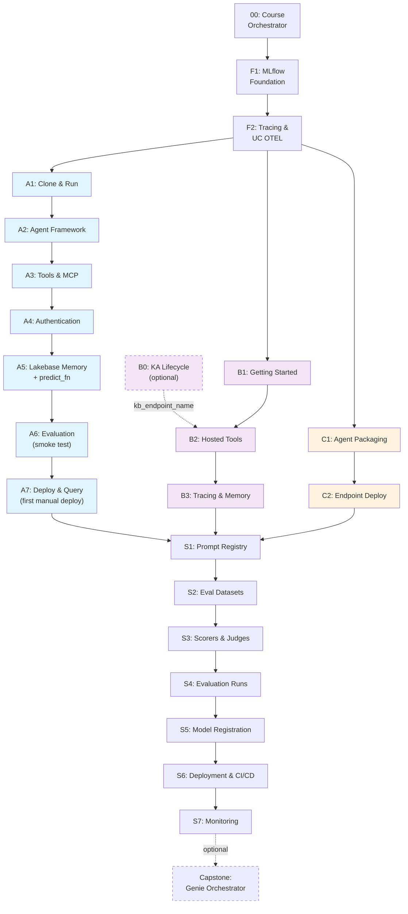

# GenAI Agent Development Course

A modular, opinionated course for building, evaluating, deploying, and monitoring
production-grade GenAI agents on Databricks. **Three modules: Foundation → Agent Track → SDLC Pipeline.**

The MLflow SDLC (evaluation, registration, deployment, monitoring) stays constant.
The agent creation method is your choice.

## Architecture



> **Diagram note:** Tracks **B** (hosted-tools: B0–B3) and **C** (serving wrap: C1–C2) and the **Capstone** are **alternate methods** — their skill mirrors were removed in the 2026-04-27 consolidation. For those patterns use the upstream [`databricks/databricks-agent-skills`](https://github.com/databricks/databricks-agent-skills). The canonical path is **Track A** (blue).

## Canonical track

The workshop's canonical agent build is **Track A: Custom Agent on
Databricks Apps** (Module 2 below). Other shapes (Supervisor API, Model
Serving wrap, Node-native end-to-end) are **alternate methods** and are not
the primary path in this template. The previously bundled B/C/capstone skill
mirrors have been removed during the 2026-04-27 consolidation; for canonical
Databricks-platform patterns covering hosted-tool agents and serving deployments,
see the upstream registry
[`databricks/databricks-agent-skills`](https://github.com/databricks/databricks-agent-skills)
(`databricks-agent-bricks`, `databricks-model-serving`). Use
`genai-agents/00-course-orchestrator/SKILL.md` first so the navigator can
route you correctly.

| Criterion | Track A (canonical) | Alternates |
|---|---|---|
| Setup time | ~6 hours | varies (1.5–6 hours) |
| Control | Full (own Python server) | Hosted-loop / serving / Node |
| Deployment | Databricks Apps (`@invoke`/`@stream`) | API service / Serving endpoint / Node app |
| Best for | Production custom agents with KA + Genie + UC tools and OBO | Quick hosted-tools demos, legacy ResponsesAgent migration, TS-native shops |

## Module 1: Foundation (everyone)

| Step | Skill | Purpose | Time |
|------|-------|---------|------|
| F0b | [Agent Spec and Tool Plan](./foundation/00b-agent-spec-and-tool-plan/SKILL.md) | `docs/design_prd.md` to `docs/agent_spec.yaml` and `docs/agent_tool_plan.yaml`; supports MCP web research and dynamic SQL MCP catalog/schema | 45 min |
| F1 | [MLflow GenAI Foundation](./foundation/01-mlflow-genai-foundation/SKILL.md) | MLflow 3.x, autolog, ResponsesAgent rules, env detection | 30 min |
| F2 | [Experiment Tracing & UC OTEL](./foundation/02-experiment-tracing-and-uc-storage/SKILL.md) | Experiment paths, tracing, UC OTEL Delta tables | 1 hr |
| F3 | [Tools and Data Access](./foundation/03-tools-and-data-access/SKILL.md) | Managed MCP, UC functions, Genie, Vector Search | 1 hr |
| F4 (optional hardening) | [AI Gateway](./foundation/04-ai-gateway/SKILL.md) | Rate limits, PII, fallbacks on serving endpoints; only with pre-provisioned Gateway or public admin APIs | 30 min |
| F5 (optional) | [Knowledge Assistant Lifecycle](./foundation/05-knowledge-assistant/SKILL.md) | Managed document-Q&A endpoint; emits `ka_endpoint_name` and `knowledge_assistant_id` | 30 min |

## Module 2: Agent Creation (pick one)

### Track A: Custom Agent on Apps

| Step | Skill | Purpose | Time |
|------|-------|---------|------|
| A1 | [Clone and Run](./tracks/A-custom-agent-apps/01-clone-and-run/SKILL.md) | Clone template, quickstart, local dev | 30 min |
| A2 | [Agent Framework](./tracks/A-custom-agent-apps/02-agent-framework/SKILL.md) | OpenAI Agents SDK, Runner, streaming, ModelConfig | 1 hr |
| A3 | [Tools and MCP](./tracks/A-custom-agent-apps/03-tools-and-mcp/SKILL.md) | Function tools, Databricks MCP, resource grants | 1 hr |
| A4 | [Authentication](./tracks/A-custom-agent-apps/04-authentication/SKILL.md) | App SP + User OBO, env detection | 30 min |
| A5 | [Lakebase Memory](./tracks/A-custom-agent-apps/05-lakebase-memory/SKILL.md) | AsyncDatabricksSession, DatabricksStore, predict_fn | 1 hr |
| A6 | [Evaluation](./tracks/A-custom-agent-apps/06-evaluation/SKILL.md) | Smoke test: agent-evaluate, judges, dataset | 30 min |
| A7 | [Deploy and Query](./tracks/A-custom-agent-apps/07-deploy-and-query/SKILL.md) | First manual deploy to Databricks Apps, query | 30 min |

> **Optional prerequisite for any track:** [F5: Knowledge Assistant Lifecycle](./foundation/05-knowledge-assistant/SKILL.md)
> creates a managed document-Q&A endpoint and captures both `ka_endpoint_name`
> (for Track A / AppKit) and `knowledge_assistant_id` (for hosted-tools alternates).
> Skip if you plan to use Vector Search MCP directly (see F3).

### Alternate tracks

Track A above is the **canonical** path. Other agent shapes (Supervisor API,
Model Serving wrap, Node-native) are outside the root course path. The
previously bundled B/C track mirrors have been removed during the 2026-04-27
consolidation; for canonical Databricks-platform reference patterns
(hosted-tool agents, serving deployments) see
[`databricks/databricks-agent-skills`](https://github.com/databricks/databricks-agent-skills)
(`databricks-agent-bricks`, `databricks-model-serving`). Keep new work on
Track A unless the orchestrator routes you elsewhere.

## Module 3: SDLC Pipeline (everyone)

| Step | Skill | Purpose | Time |
|------|-------|---------|------|
| S1 | [Prompt Registry](./sdlc/01-prompt-registry/SKILL.md) | UC prompts, versioning, aliases, trace linking | 1 hr |
| S2 | [Evaluation Datasets](./sdlc/02-evaluation-datasets/SKILL.md) | Benchmarks, UC Delta persistence, validation | 1 hr |
| S3 | [Scorers and Judges](./sdlc/03-scorers-and-judges/SKILL.md) | Built-in judges, custom @scorer, thresholds | 1 hr |
| S4 | [Evaluation Runs](./sdlc/04-evaluation-runs/SKILL.md) | mlflow.genai.evaluate(), predict_fn, gates | 1 hr |
| S5 | [Model Registration](./sdlc/05-logged-model-and-uc-registration/SKILL.md) | Log model, UC registration, champion gating | 30 min |
| S6 | [Deployment & Automation](./sdlc/06-deployment-and-automation/SKILL.md) | Deploy (track-specific), CI/CD pipeline | 1 hr |
| S7 | [Production Monitoring](./sdlc/07-production-monitoring/SKILL.md) | Registered scorers, UC OTEL monitoring | 1 hr |

## Capstone (optional)

The previously bundled multi-agent Genie Orchestrator capstone has been removed
during the 2026-04-27 consolidation. For canonical multi-agent and Genie Space
patterns, see [`databricks/databricks-agent-skills`](https://github.com/databricks/databricks-agent-skills)
(`databricks-agent-bricks`, `databricks-genie`).

## Quick Start

**Pick your client path first:**

- **IDE/CLI (Cursor, Claude Code, VS Code, Codex):** authenticate the Databricks CLI (see [PRE-REQUISITES.md](../PRE-REQUISITES.md)), then start at step 1 below.
- **Genie Code (in-workspace):** pre-authenticated and serverless — first **Set Up Project**: clone the whole repo into `/Users/<your-username>/.assistant/skills/vibe-coding-workshop`, then **start a NEW Agent-mode chat thread** (hard-refresh if skills don't appear) so the skills load, and load `skills/genie-code-environment`; `skills/vibecoding-state` detects `client_context`. Then start at step 1. Grounded in the [Genie Code skills docs](https://learn.microsoft.com/en-us/azure/databricks/genie-code/skills).

1. Start with the [GenAI Skill Navigator](./00-course-orchestrator/SKILL.md)
2. Complete Foundation Steps F0-F5 as routed by the navigator
3. Default to **Track A** (canonical). Treat alternate tracks as explicitly routed exceptions.
4. Complete your chosen track
5. Complete SDLC Steps S1-S7 plus post-deploy feedback as routed by the navigator
6. Optionally do the Capstone

## The Interface Contract

All three tracks produce the same **`predict_fn`** interface:

```python
def predict_fn(inputs: dict) -> str:
    """Takes an inputs dict with a 'question' key, returns text response.

    The evaluation harness (run_evaluation.py) calls this as fn(kwargs)
    where kwargs is a dict of keyword arguments from mlflow.genai.evaluate().
    """
    question = inputs.get("question", "")
    # ... call agent ...
    return response_text
```

The SDLC pipeline (evaluation, registration, monitoring) consumes this interface.
It doesn't care how the agent was built — only that it accepts a dict and returns a string.

## Artifact Flow

The core Track A path is AI-Gateway-ready but not AI-Gateway-dependent: the agent reads its model route from configuration, so a pre-provisioned Gateway can be introduced later without changing agent logic.

Sequence: Agent Spec -> Tool Plan -> UC resources -> MLflow tracing -> optional KA -> Track A clone/framework -> tools -> auth/memory -> eval/deploy -> AppKit proxy -> feedback

```
Design:
  design_prd.md -> agent_spec.yaml -> agent_tool_plan.yaml

Foundation:
  F0b → agent_spec.yaml, agent_tool_plan.yaml (Track A only)
  F1 → mlflow_environment
  F2 → experiment_paths, uc_otel_tables

Track (produces predict_fn):
  A: agent_class, tools, auth, memory → predict_fn
     A6: smoke test eval (agent-evaluate, built-in judges)
     A7: first manual deploy (databricks apps deploy)
  B: supervisor_client, tool_config → predict_fn
  C: logged_model, serving_endpoint → predict_fn

SDLC (consumes predict_fn):
  S1 → registered_prompts
  S2 → evaluation_dataset
  S3 → scorer_list, thresholds
  S4 → evaluation_results, thresholds_met  (comprehensive eval, cf. A6 smoke test)
  S5 → uc_model_version, champion_alias
  S6 → deployed_agent, ci_cd_pipeline      (automated deploy, cf. A7 manual deploy)
  S7 → production_scorers, monitoring_dashboards
```

## Grounding

1. **Official Databricks docs** — [Author agents](https://docs.databricks.com/aws/en/generative-ai/agent-framework/author-agent), [Supervisor API](https://docs.databricks.com/aws/en/generative-ai/agent-framework/supervisor-api), [UC OTEL traces](https://docs.databricks.com/aws/en/mlflow3/genai/tracing/trace-unity-catalog)
2. **Databricks app-templates** — [github.com/databricks/app-templates](https://github.com/databricks/app-templates)
3. **databricks-openai** — [pypi.org/project/databricks-openai](https://pypi.org/project/databricks-openai/)
4. **This codebase** (Genie Space Optimizer) — working production patterns
5. **Workshop template** — [vibe-coding-workshop-template](https://github.com/databricks-solutions/vibe-coding-workshop-template/tree/main/data_product_accelerator)
