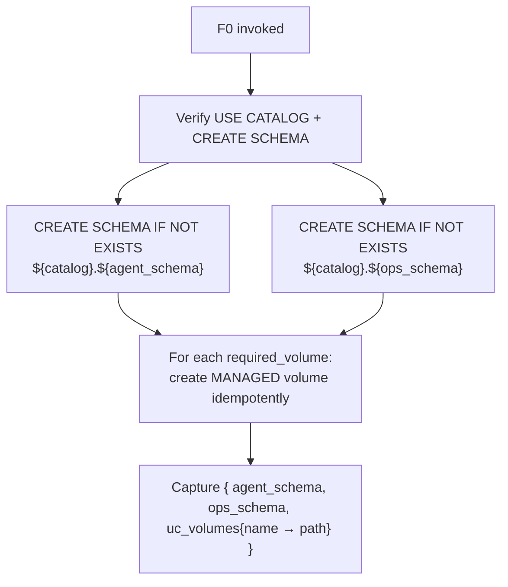

# Foundation Step 0: UC Resources (Schemas + Volumes)

> **Cross-cutting.** This skill is consumed by **every** Foundation step and
> agent track. It exists so that no downstream skill (KA, agent memory, tool
> exports, benchmark persistence, prompt registry) has to repeat schema or
> volume provisioning. If you find yourself writing `CREATE SCHEMA` or
> `CREATE VOLUME` inside another skill, delegate to F0 instead.

## What This Skill Owns

| Resource | Purpose | Default name |
|---|---|---|
| **Agent UC schema** | Holds agent-owned assets — KA source volume, tool output volume, benchmark tables, prompt registry pointers, memory tables | `${user_schema_prefix}_agent` |
| **Ops UC schema** | Holds operational assets — MLflow OTeL trace tables (F2), monitoring tables (SDLC 07), eval-run rollups (SDLC 04) | `${user_schema_prefix}_ops` |
| **`knowledge_sources` MANAGED volume** (in agent schema) | Source markdown / PDFs for Knowledge Assistants (F5) and any retrieval-style tool | `/Volumes/${catalog}/${agent_schema}/knowledge_sources` |
| **`agent_outputs` MANAGED volume** (in agent schema) | CSV exports, charts, generated artifacts produced by `@function_tool` calls | `/Volumes/${catalog}/${agent_schema}/agent_outputs` |
| **`signoffs` MANAGED volume** (in ops schema) | Stakeholder + engineering sign-off `decision.md` artifacts (SDLC 04b) — the durable, UC-governed location read by SDLC 06 promotion gates | `/Volumes/${catalog}/${ops_schema}/signoffs` |
| **Custom volumes** (in agent or ops schema) | Anything declared in `state://AgentSpec.required_volumes[]` | `/Volumes/${catalog}/${schema}/${name}` |

> **`signoffs` is generic.** F0 pre-creates the volume under a workshop-neutral
> name (`signoffs`) so SDLC 04b never has to provision its own UC location and
> SDLC 06 can resolve `/Volumes/${catalog}/${ops_schema}/signoffs/v<N>/decision.md`
> deterministically. The volume name does **not** carry any use-case-specific
> prefix (no `skyloyalty_signoffs`, no `${use_case_slug}_signoffs`); the
> per-version directory `v<N>/` carries the disambiguation.

Every operation is **idempotent** (`CREATE SCHEMA IF NOT EXISTS`,
`CREATE VOLUME IF NOT EXISTS` — `AlreadyExists` is treated as success). It
is safe to call this skill from any prompt that needs to be sure these
resources exist; the cost on a warm workspace is one round-trip per resource.

## What This Skill Does NOT Own

- **Catalog creation.** A UC catalog must already exist; F0 reads
  `state://Resources.uc.catalog` and validates the caller has `USE CATALOG` +
  `CREATE SCHEMA` on it.
- **UC table DDL.** Tables for OTeL traces, benchmarks, memory, or monitoring
  are owned by their respective consuming skills (F2, SDLC 02/04/07).
- **Source content.** F0 creates an empty `knowledge_sources` volume; F5 (or
  any other consumer) is responsible for populating it with files.
- **Bronze data.** Bronze schema + Delta tables are owned by the bronze layer
  setup skill ([`data_product_accelerator/skills/bronze/00-bronze-layer-setup`](../../../data_product_accelerator/skills/bronze/00-bronze-layer-setup/SKILL.md)).

## When to Use

- **Always**, near the top of the prompt sequence — before F1 (MLflow env) so
  that anything downstream can assume schemas + volumes exist.
- Whenever you add a new consuming skill that needs a new volume — extend
  `state://AgentSpec.required_volumes[]` rather than putting `CREATE VOLUME`
  inside the consuming skill.
- After `bootstrap` when the resolved spec is available, but before any other
  Foundation step.

## Prerequisites

| Requirement | How to Check |
|---|---|
| `state://Resources.uc.catalog` is resolved | Set by `vibecoding-state` `bootstrap` op |
| `state://Resources.uc.user_schema_prefix` is resolved | Derived in `bootstrap` from the user identity + `use_case_slug` |
| Workshop SQL warehouse is RUNNING | `state://Resources.warehouse_id` (set by Prompt 1 preflight) — needed for `CREATE SCHEMA` execution via `WorkspaceClient.statement_execution` |
| `databricks-sdk >= 0.30` installed | `python -c "from databricks.sdk import WorkspaceClient; from databricks.sdk.service.catalog import VolumeType"` |
| Caller has `USE CATALOG` + `CREATE SCHEMA` on the catalog | `databricks unity-catalog catalogs get $CATALOG --output json \| jq '.privileges'` |

---

## Inputs

```yaml
# Resolved by the caller from state — F0 does not read state directly.
uc_catalog:           "string (required)"        # e.g. "main"
agent_schema:         "string (required)"        # default: "${user_schema_prefix}_agent"
ops_schema:           "string (required)"        # default: "${user_schema_prefix}_ops"
warehouse_id:         "string (required)"        # SQL warehouse for DDL execution
required_volumes:                                 # optional — defaults below if not provided
  - { name: "knowledge_sources", schema: "agent", comment: "KA + retrieval source files" }
  - { name: "agent_outputs",     schema: "agent", comment: "Tool-generated artifacts (CSV, charts)" }
  - { name: "signoffs",          schema: "ops",   comment: "SDLC 04b stakeholder + engineering signoff decision.md artifacts" }
  # AgentSpec.required_volumes[] is appended verbatim
```

## Operations



### Reference implementation

```python
from databricks.sdk import WorkspaceClient
from databricks.sdk.service.catalog import VolumeType
from databricks.sdk.errors import AlreadyExists

def provision_uc_resources(
    *,
    uc_catalog: str,
    agent_schema: str,
    ops_schema: str,
    warehouse_id: str,
    required_volumes: list[dict] | None = None,
) -> dict:
    w = WorkspaceClient()

    # 1. Schemas (DDL via statement execution against the workshop warehouse)
    for schema in (agent_schema, ops_schema):
        w.statement_execution.execute_statement(
            warehouse_id=warehouse_id,
            statement=(
                f"CREATE SCHEMA IF NOT EXISTS {uc_catalog}.{schema} "
                f"COMMENT 'F0-managed: agent or ops assets'"
            ),
            wait_timeout="30s",
        )

    # 2. Volumes (SDK; AlreadyExists is success)
    defaults = [
        {"name": "knowledge_sources", "schema": "agent",
         "comment": "KA + retrieval source files"},
        {"name": "agent_outputs", "schema": "agent",
         "comment": "Tool-generated artifacts (CSV, charts)"},
        {"name": "signoffs", "schema": "ops",
         "comment": "SDLC 04b stakeholder + engineering signoff decision.md artifacts"},
    ]
    volumes_spec = (required_volumes or []) + defaults
    seen, paths = set(), {}
    for v in volumes_spec:
        target_schema = agent_schema if v["schema"] == "agent" else ops_schema
        key = (target_schema, v["name"])
        if key in seen:
            continue
        seen.add(key)
        try:
            w.volumes.create(
                catalog_name=uc_catalog,
                schema_name=target_schema,
                name=v["name"],
                volume_type=VolumeType.MANAGED,
                comment=v.get("comment", "F0-managed volume"),
            )
        except AlreadyExists:
            pass
        paths[v["name"]] = f"/Volumes/{uc_catalog}/{target_schema}/{v['name']}"

    return {
        "agent_schema": agent_schema,
        "ops_schema": ops_schema,
        "uc_volumes": paths,
    }
```

The skill caller passes the result back to `vibecoding-state` `exit` so
downstream skills can read `state://Resources.uc_volumes.knowledge_sources` etc.

---

## Outputs (handoff)

| Key | Consumer | Value |
|---|---|---|
| `agent_schema` | F2, F5, SDLC 02/04, Track A 05 (memory) | `${user_schema_prefix}_agent` |
| `ops_schema` | F2 (OTeL tables), SDLC 07 (monitoring), SDLC 04b (signoffs) | `${user_schema_prefix}_ops` |
| `uc_volumes.knowledge_sources` | F5 (Step 5_0 — branch B/C upload), F3 (Vector Search MCP source dir) | `/Volumes/${catalog}/${agent_schema}/knowledge_sources` |
| `uc_volumes.agent_outputs` | Track A 03 `csv_export` `@function_tool`, any code-interpreter output | `/Volumes/${catalog}/${agent_schema}/agent_outputs` |
| `uc_volumes.signoffs` (alias `signoff_volume_path`) | SDLC 04b (writes `decision.md`), SDLC 06 (reads it as the promotion gate) | `/Volumes/${catalog}/${ops_schema}/signoffs` |
| `uc_volumes.<custom>` | Whichever consuming skill declared the volume | `/Volumes/${catalog}/${schema}/${name}` |

---

## Validation Gate

- [ ] `${uc_catalog}.${agent_schema}` exists (`SHOW SCHEMAS IN ${uc_catalog} LIKE '${agent_schema}'`)
- [ ] `${uc_catalog}.${ops_schema}` exists
- [ ] Every volume in `required_volumes` is listable via `databricks volumes list ${uc_catalog} ${schema} --output json | jq '.volumes[] | select(.name=="<name>")'`
- [ ] The generic `signoffs` volume in `${ops_schema}` is present (consumed by SDLC 04b / SDLC 06 — name is workshop-neutral)
- [ ] `agent_schema`, `ops_schema`, the full `uc_volumes` map, and `signoff_volume_path` are captured in state

---

## Delegation Map

| Need | Delegate To |
|---|---|
| Bronze schema + Delta tables | [`bronze/00-bronze-layer-setup`](../../../data_product_accelerator/skills/bronze/00-bronze-layer-setup/SKILL.md) |
| OTeL trace tables in `${ops_schema}` | [F2](../02-experiment-tracing-and-uc-storage/SKILL.md) |
| KA source markdown into `knowledge_sources` | [F5 Step 5_0](../05-knowledge-assistant/SKILL.md) — branch (A) skip if non-empty / (B) upload `ka_source` / (C) auto-generate from PRD |
| Lakebase memory tables | [Track A 05](../../tracks/A-custom-agent-apps/05-memory-and-state/SKILL.md) |
| Benchmark tables in `${agent_schema}` | [SDLC 02](../../sdlc/02-evaluation-datasets/SKILL.md) |
| Monitoring tables in `${ops_schema}` | [SDLC 07](../../sdlc/07-production-monitoring/SKILL.md) |

---

## Limitations to Plan For

- **Catalog must exist.** F0 does not create catalogs (org-level admin action).
- **Workspace warehouse required.** Schema DDL goes through the SQL warehouse,
  not the Python serverless API.
- **No drop semantics.** F0 is create-only — to remove a schema or volume,
  delete out of band; do not put `DROP` in any agent skill.
- **Volume size budgeting.** Managed volumes inherit the catalog's storage
  location; if your `agent_outputs` may grow large, document a retention
  policy in the consuming skill.

---

## Notes to Carry Forward

| Key | Produced By | Value |
|---|---|---|
| `agent_schema` | F0 | `${user_schema_prefix}_agent` |
| `ops_schema` | F0 | `${user_schema_prefix}_ops` |
| `uc_volumes` | F0 | Map of `name → /Volumes/${catalog}/${schema}/${name}` |
| `knowledge_source_path` | F0 (alias of `uc_volumes.knowledge_sources`) | Path that F5 attaches as a `files` knowledge source |
| `agent_outputs_path` | F0 (alias of `uc_volumes.agent_outputs`) | Path that Track A 03's `csv_export` writes to |
| `signoff_volume_path` | F0 (alias of `uc_volumes.signoffs`) | Generic, use-case-neutral signoff volume path SDLC 04b writes `decision.md` into and SDLC 06 reads as the promotion gate. Always `/Volumes/${catalog}/${ops_schema}/signoffs` — never workshop-specific. |

---

## Next Step

After F0's gate passes, continue with [F1: MLflow GenAI Foundation](../01-mlflow-genai-foundation/SKILL.md). Every subsequent skill can now assume schemas + volumes exist.

## References

- [CREATE SCHEMA — Databricks SQL](https://docs.databricks.com/aws/en/sql/language-manual/sql-ref-syntax-ddl-create-schema)
- [CREATE VOLUME — Databricks SQL](https://docs.databricks.com/aws/en/sql/language-manual/sql-ref-syntax-ddl-create-volume)
- [Managed vs External Volumes](https://docs.databricks.com/aws/en/volumes/managed-vs-external)
- [Databricks SDK for Python — `volumes`](https://databricks-sdk-py.readthedocs.io/en/latest/workspace/catalog/volumes.html)

---

## Version History

| Version | Date | Changes |
|---------|------|---------|
| 1.1.0 | 2026-04-26 | Added generic, workshop-neutral `signoffs` MANAGED volume in `${ops_schema}` as a default `required_volume`. SDLC 04b writes `decision.md` artifacts here and SDLC 06 reads them as the promotion gate. Captures `signoff_volume_path` (alias of `uc_volumes.signoffs`) so downstream skills resolve `/Volumes/${catalog}/${ops_schema}/signoffs/v<N>/decision.md` deterministically without per-use-case naming. |
| 1.0.0 | 2026-04-24 | Initial skill — extracted from F5 (`05-knowledge-assistant`) Step 5_0 so schema + volume provisioning is owned in one cross-cutting place. Consumers (F5, F2, Track A 05, SDLC 02/04/07) now delegate. |
