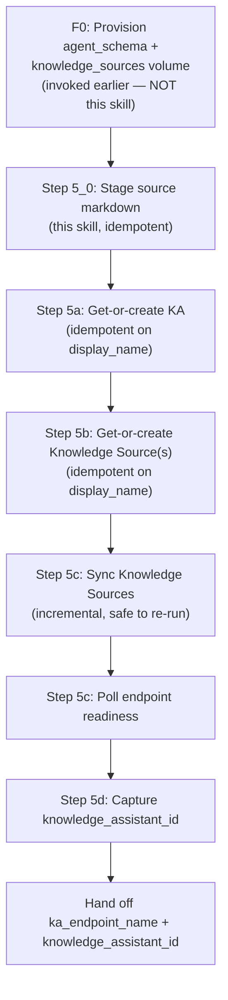

# Foundation Step 5: Knowledge Assistant Lifecycle

> **Track-neutral.** This skill is consumed by Track A (Custom Agent on Apps)
> as a document-Q&A tool, and by Track B (Supervisor API) as a hosted
> `knowledge_assistant` tool. The output `ka_endpoint_name` is the canonical
> handle.

Agent Bricks **Knowledge Assistant (KA)** is a managed document Q&A agent with
citations. Use this skill to create, configure, and sync a KA so its serving
endpoint can be consumed downstream as a tool by:

- **Track A** custom agents (call the KA endpoint as a function tool from your
  agent server, see `tracks/A-custom-agent-apps/03-tools-and-mcp/`).
- **Track B** Supervisor API agents (declare the KA as a hosted
  `knowledge_assistant` tool — see Track B Step 2).
- **AppKit** apps directly (via the `serving()` plugin against the KA endpoint).

> **Beta.** Knowledge Assistants API is in Beta. Refer to the official REST and
> SDK references linked below for the latest field and endpoint shape.

## When to Use

Use this skill when any of the following apply:

- Your agent needs **document Q&A with citations** (policies, runbooks,
  playbooks, FAQs).
- You want Databricks to manage **chunking, embeddings, and retrieval quality**
  instead of building a custom RAG stack.
- You want a **managed endpoint** you can call from a Supervisor API agent, a
  Databricks App, or AI Playground.
- You expect subject-matter experts to improve quality via **guidelines and
  labeled examples** rather than code changes.

Do **not** use this skill when:

- You need full control over the retrieval pipeline (custom chunking,
  re-ranking, dense+sparse fusion, etc.) — use the **Vector Search MCP** path
  described in [F3: Tools and Data Access](../03-tools-and-data-access/SKILL.md).
- Your knowledge source is **structured data** (tables) — use **Genie** instead.

## Prerequisites

| Requirement | How to Check |
|---|---|
| **Foundation Step 0 complete** | `state://Resources.uc_volumes.knowledge_sources` is populated (agent UC schema + `knowledge_sources` MANAGED volume already exist — provisioned by [F0](../00-uc-resources-foundation/SKILL.md)) |
| Foundation Step 1 complete | MLflow environment configured |
| Foundation Step 2 complete | Experiment + UC OTEL configured |
| Unity Catalog enabled | `databricks catalogs list` returns results |
| Serverless compute available | Workspace admin settings |
| Serverless usage policy with nonzero budget | Workspace admin settings |
| Mosaic AI Model Serving access | `databricks serving-endpoints list` succeeds |
| `databricks-sdk` installed | `python -c "import databricks.sdk"` |
| Resolved spec available (optional but recommended) | `state://AgentSpec.knowledge_base_backend` or `state://DataSpec.knowledge_base_documents` is populated |

> **Source data is NOT a prerequisite.** This skill stages source markdown
> into the `knowledge_sources` volume that F0 already created — pulling from
> a pre-staged volume, a local `ka_source` directory, or auto-generating from
> the resolved spec. Examples that ship a DAB which uploads markdown into
> the volume during Module 0 (e.g. `example/skyloyalty/`) merely make this
> step's "branch (A): volume already non-empty" path a fast no-op.

> **Schema and volume creation are NOT this skill's responsibility.** They
> belong to [F0: UC Resources Foundation](../00-uc-resources-foundation/SKILL.md),
> which is invoked once near the top of the prompt sequence and creates
> resources for **every** consuming skill (KA, agent memory, tool exports,
> benchmark tables). If F0 has not run, fail fast with a clear error pointing
> the caller at F0 — do **not** retry the schema/volume DDL here.

## Source Mode Decision

Choose exactly one source mode per knowledge source. A single KA can attach
up to **10** knowledge sources.

| Source Mode | Pick When | Supported Inputs | Constraints |
|---|---|---|---|
| **UC Files** | You have raw docs and want Databricks to index them | `.txt`, `.pdf`, `.md`, `.ppt/.pptx`, `.doc/.docx` in a UC Volume or directory | Files > 50 MB are skipped. Files whose names start with `_` or `.` are skipped. UC tables are not supported. |
| **Vector Search index** | You already maintain a VS index and want reuse | A VS index on `databricks-gte-large-en` | Only that embedding model is supported. AI Guardrails/rate limits must be disabled on the embedding endpoint. |

**Recommendation:** Start with UC Files when in doubt. Switch to a VS index
only when you need custom chunking or to share the index across multiple
agents.

---

## Lifecycle Workflow



Read [`references/knowledge-assistant-api-sdk.md`](references/knowledge-assistant-api-sdk.md)
for complete SDK and REST examples for each step, including migration between
workspaces and labeled-data import/export.

---

## Step 5_0: Stage Source Markdown (KA-Specific)

This step assumes [F0](../00-uc-resources-foundation/SKILL.md) has already
created the agent UC schema and the `knowledge_sources` MANAGED volume. It
does **one thing**: ensure that volume contains at least one `.md` file
ready for KA ingestion. Three deterministic branches, taken in order; the
first that applies wins.

**Inputs:**

| Param | Source |
|---|---|
| `volume_path` | `state://Resources.uc_volumes.knowledge_sources` (set by F0) — typically `/Volumes/${uc_catalog}/${user_schema_prefix}_agent/knowledge_sources` |
| `ka_source` (optional) | `state://AgentSpec.knowledge_base_backend.ka_source` — local directory of pre-authored markdown to upload (e.g. `example/skyloyalty/docs/loyalty_knowledge_base/`) |
| `state://DataSpec.glossary` | Used by branch (C) to auto-generate one markdown file per glossary term |
| `state://AgentSpec.capabilities` | Used by branch (C) to auto-generate `capabilities.md` and `faq.md` |

**Pre-flight assertion:** `w.volumes.read(volume_path)` must succeed. If it
raises `NotFound`, fail with `RuntimeError("F0 has not run — invoke 00-uc-resources-foundation before this skill")` rather than retrying schema/volume DDL.

**Branch logic:**

1. **(A) Pre-staged volume** — if `w.files.list_directory_contents(volume_path)` returns at least one `.md` file (filtering out names starting with `_`/`.` per Agent Bricks ingestion rules), record the file count and skip to Step 5a. **No re-upload.**
2. **(B) Local source directory** — else if `ka_source` points to an existing local directory containing one or more `.md` files, walk it recursively and `w.files.upload(volume_path + "/" + relpath, content, overwrite=True)` each file. Skip files > 50 MB or names starting with `_`/`.`. Record the upload count.
3. **(C) PRD-derived auto-generation** — else render a minimal corpus from the resolved spec (one file per `state://DataSpec.glossary[]` term, one `capabilities.md`, one `faq.md` of capability-scoped Q&A pairs), write to a temp dir, then upload as in (B).

**Capture handoff values:**

- `knowledge_source_origin` — `pre_staged` | `local_dir` | `prd_generated`
- `knowledge_source_file_count` — integer >= 1
- `knowledge_source_path` — the `/Volumes/...` URI consumed by Step 5b

> See [`references/knowledge-assistant-api-sdk.md`](references/knowledge-assistant-api-sdk.md)
> for the full reference implementation (`stage_ka_sources(...)`,
> `_render_prd_corpus(...)`).

---

## Step 5a: Create the Knowledge Assistant (idempotent)

Use the Databricks SDK for Python for all lifecycle operations. **This step
must be idempotent**: re-running the prompt with the same `display_name`
must reuse the existing KA, never create a duplicate.

```python
from databricks.sdk import WorkspaceClient
from databricks.sdk.service.knowledgeassistants import KnowledgeAssistant

w = WorkspaceClient()

def get_or_create_ka(
    *,
    display_name: str,
    description: str,
    instructions: str,
) -> KnowledgeAssistant:
    """Return existing KA matching display_name, else create one. Idempotent."""
    for existing in w.knowledge_assistants.list_knowledge_assistants():
        if getattr(existing, "display_name", None) == display_name:
            return existing
    return w.knowledge_assistants.create_knowledge_assistant(
        knowledge_assistant=KnowledgeAssistant(
            display_name=display_name,
            description=description,
            instructions=instructions,
        )
    )

ka = get_or_create_ka(
    display_name="loyalty-policy-assistant",
    description="Answers questions about loyalty program rules, FAQ, campaign playbook.",
    instructions=(
        "Always cite the specific document and section. "
        "If information is not in the documents, say so explicitly. "
        "Do not fabricate policy details."
    ),
)
print(ka.name)  # "knowledge-assistants/<id>"
```

**Key points:**

- `display_name` is the **idempotency key** — pin it to the user-scoped
  `KA_DISPLAY_NAME` from the resolved spec (e.g.
  `${firstname}-${last_initial}-${use_case_slug}-ka`) so re-runs reattach
  to the same KA instead of creating a new one.
- If the SDK surfaces `endpoint_status="ONLINE"` for the existing KA on
  re-run, treat the step as a no-op and proceed straight to Step 5d.
- `instructions` shape answer style and citation behavior — keep them
  source-agnostic (don't mention a specific source mode). On re-run, if
  `instructions` or `description` differ from the desired values, optionally
  call `w.knowledge_assistants.update_knowledge_assistant(...)` instead of
  recreating; never delete-then-recreate just to change metadata.
- Record `ka.name` (the full resource name including the id). It is required
  for every downstream operation.

For the REST equivalent, see the
[Create a Knowledge Assistant](https://docs.databricks.com/api/workspace/knowledgeassistants/createknowledgeassistant)
API. Use the
[List](https://docs.databricks.com/api/workspace/knowledgeassistants/listknowledgeassistants)
endpoint as the get-step in a get-or-create REST loop.

---

## Step 5b: Attach a Knowledge Source (idempotent)

Attach **at least one** source. You may attach up to 10. Each source is
either UC Files or a VS index. **This step must be idempotent** — re-runs
with the same `display_name` must reuse the existing source.

```python
from databricks.sdk.service.knowledgeassistants import (
    KnowledgeSource, FilesSpec, IndexSpec,
)

def get_or_create_knowledge_source(
    *,
    parent: str,
    spec: KnowledgeSource,
) -> KnowledgeSource:
    """Return existing source matching display_name on this KA, else create. Idempotent."""
    for existing in w.knowledge_assistants.list_knowledge_sources(parent=parent):
        if getattr(existing, "display_name", None) == spec.display_name:
            # Optional: drift-detect path / index_name and call update_knowledge_source.
            return existing
    return w.knowledge_assistants.create_knowledge_source(
        parent=parent, knowledge_source=spec,
    )
```

### UC Files

```python
files_source = get_or_create_knowledge_source(
    parent=ka.name,
    spec=KnowledgeSource(
        display_name="loyalty-program-rules",
        description="Loyalty program rules, tier benefits, and policy FAQ.",
        source_type="files",
        files=FilesSpec(path=knowledge_source_path),  # from F0
    ),
)
```

### Vector Search index

```python
index_source = get_or_create_knowledge_source(
    parent=ka.name,
    spec=KnowledgeSource(
        display_name="loyalty-program-rules",
        description="Loyalty program rules indexed with databricks-gte-large-en.",
        source_type="index",
        index=IndexSpec(
            index_name="main.skyloyalty.loyalty_docs_index",
            text_col="content",
            doc_uri_col="doc_uri",
        ),
    ),
)
```

**DO** — keep one topic per source so retrieval stays focused.

**DO** — pin `display_name` to a deterministic, user-scoped value
(`${use_case_slug}-${topic}`) so it is the stable idempotency key across
re-runs.

**DON'T** — mix policy docs and marketing copy in the same source; the
description-based routing will degrade.

**DON'T** — change `display_name` between runs; it is the only key available
to the get-or-create lookup.

---

## Step 5c: Sync and Poll Readiness

Syncing triggers ingestion for file sources and refresh for index sources.
It is incremental — only new or changed files are processed.

```python
w.knowledge_assistants.sync_knowledge_sources(name=ka.name)
```

Poll readiness until the KA is ready to serve:

```python
import time

def wait_for_ready(name: str, timeout_s: int = 1800, interval_s: int = 30):
    deadline = time.time() + timeout_s
    while time.time() < deadline:
        current = w.knowledge_assistants.get_knowledge_assistant(name=name)
        status = getattr(current, "endpoint_status", None) or getattr(current, "state", None)
        if status and str(status).upper() in {"ONLINE", "READY"}:
            return current
        time.sleep(interval_s)
    raise TimeoutError(f"KA {name} not ready within {timeout_s}s")

ready = wait_for_ready(ka.name)
```

**Constraints:**

- Only the **creator** of the KA can sync or mutate knowledge sources.
- Ingestion time scales with volume size; budget up to a few hours for large
  corpora.
- Re-run `sync_knowledge_sources` after adding or updating files.

---

## Step 5d: Capture the Endpoint Name and Knowledge Assistant ID

The KA produces **two** downstream handles. Capture both — different consumers
use different handles:

| Handle | Used By | Where |
|---|---|---|
| `ka_endpoint_name` | Track A custom agents, AppKit `serving()` plugin | Model Serving endpoint URL (`/serving-endpoints/<name>/invocations`) |
| `knowledge_assistant_id` | Track B Supervisor API `knowledge_assistant` hosted tool | `knowledge_assistant.knowledge_assistant_id` tool parameter |

```python
# ka.name is "knowledge-assistants/<id>" — the trailing segment is the id.
knowledge_assistant_id = ka.name.split("/")[-1]

# Prefer the SDK-surfaced values where available:
refreshed = w.knowledge_assistants.get_knowledge_assistant(name=ka.name)
knowledge_assistant_id = (
    getattr(refreshed, "knowledge_assistant_id", None) or knowledge_assistant_id
)
ka_endpoint_name = (
    getattr(refreshed, "endpoint_name", None)
    or f"ka-{knowledge_assistant_id}"
)

print(ka_endpoint_name, knowledge_assistant_id)
```

Persist both in `config.yml` so downstream skills (Track A tools and MCP,
Track B Hosted Tools, AppKit `serving()` plugin) can wire them:

```yaml
# config.yml (excerpt — keep both handles)
ka_endpoint_name: "ka-<captured id>"
knowledge_assistant_id: "<captured id>"
```

---

## Step 5e: Manage Sources Over Time

```python
from databricks.sdk.service.knowledgeassistants import KnowledgeSource

w.knowledge_assistants.update_knowledge_source(
    name=index_source.name,
    knowledge_source=KnowledgeSource(
        display_name="loyalty-program-rules-v2",
        description="Loyalty program rules, tier benefits, and policy FAQ (updated quarterly).",
    ),
    update_mask="display_name,description",
)

w.knowledge_assistants.delete_knowledge_source(name=files_source.name)
```

**Rules:**

- You cannot remove the last remaining source — a KA must always have at least one.
- Only the creator can add/remove/update sources; workspace admins can manage
  permissions but not sources.

For quality improvement (guidelines, labeled examples, import/export of a UC
table with guidelines), see
[`references/knowledge-assistant-operations.md`](references/knowledge-assistant-operations.md).

---

## Delegation Map

This skill does not duplicate infrastructure or client patterns covered
elsewhere. Delegate to:

| Need | Delegate To |
|---|---|
| MLflow env + tracing prerequisites | [F1](../01-mlflow-genai-foundation/SKILL.md), [F2](../02-experiment-tracing-and-uc-storage/SKILL.md) |
| Wiring the KA endpoint as a custom-agent tool | [Track A 03: Tools and MCP](../../tracks/A-custom-agent-apps/03-tools-and-mcp/SKILL.md) |
| Wiring the KA as a Supervisor hosted tool | Upstream [`databricks-agent-bricks`](https://github.com/databricks/databricks-agent-skills/tree/main/skills/databricks-agent-bricks) (`knowledge_assistant` hosted tool) |
| Wiring the KA endpoint into AppKit directly | [`apps_lakebase/skills/06-appkit-serving-wiring`](../../../apps_lakebase/skills/06-appkit-serving-wiring/SKILL.md) |
| Resource grants and `USE CATALOG`/`SELECT` on sources | [F3: Tools and Data Access](../03-tools-and-data-access/SKILL.md) |
| Custom retrieval path (instead of KA) | [F3: Vector Search MCP](../03-tools-and-data-access/SKILL.md) |

---

## Limitations to Plan For

- **English only.**
- **UC tables are not supported** as a source.
- **Files > 50 MB** are skipped at ingest.
- **Filenames starting with `_` or `.`** are skipped at ingest.
- **VS indexes must use `databricks-gte-large-en`** with AI Guardrails and rate
  limits disabled on the embedding endpoint.
- **Sync is creator-restricted.** Plan service-account ownership accordingly.

---

## Validation Gate

All must pass before this KA is consumed by an agent skill:

- [ ] **F0 prerequisite:** `state://Resources.uc_volumes.knowledge_sources` is set and the volume is reachable
- [ ] At least one source markdown file is present in the volume (Step 5_0;
      from pre-staged bundle, local `ka_source` dir, or PRD auto-generation)
- [ ] KA created **or reused** via SDK get-or-create on `display_name`;
      `ka.name` recorded (Step 5a, idempotent)
- [ ] At least one knowledge source attached **or reused** via SDK
      get-or-create on `display_name` (Step 5b, idempotent)
- [ ] `sync_knowledge_sources` called successfully (Step 5c — incremental,
      safe to re-run on a warm KA)
- [ ] Endpoint reports ready/online via `get_knowledge_assistant` (Step 5c)
- [ ] **Both** `ka_endpoint_name` and `knowledge_assistant_id` captured in
      `config.yml` (Step 5d)
- [ ] Creator/service-account constraint documented for future syncs
- [ ] **Idempotency check:** running this skill a second time without
      changing `display_name` produces zero new KAs and zero new knowledge
      sources (verified via `list_knowledge_assistants` count before/after)

---

## Notes to Carry Forward

| Key | Produced By | Value |
|---|---|---|
| `knowledge_source_path` | Step 5_0 (read from F0) | `/Volumes/${uc_catalog}/${agent_schema}/knowledge_sources` |
| `knowledge_source_file_count` | Step 5_0 | Markdown file count in the volume after staging (>= 1) |
| `knowledge_source_origin` | Step 5_0 | `pre_staged` \| `local_dir` \| `prd_generated` |
| `ka_name` | Step 5a | Full KA resource name (`knowledge-assistants/<id>`) |
| `ka_endpoint_name` | Step 5d | Model Serving endpoint name (Track A / AppKit handle) |
| `knowledge_assistant_id` | Step 5d | ID wired as `knowledge_assistant.knowledge_assistant_id` in Track B Hosted Tools |
| `knowledge_source_type` | Step 5b | `files` or `index` |
| `sync_status` | Step 5c | Last observed status from `get_knowledge_assistant` |
| `source_owner_constraints` | Step 5c | Who is authorized to sync and manage sources |

> `agent_schema` and `knowledge_source_volume` are **F0 outputs**, not F5
> outputs. Read them from `state://Resources.agent_schema` and
> `state://Resources.uc_volumes.knowledge_sources` respectively.

---

## Next Step

After passing this gate, choose your downstream path:

| Path | Next Skill |
|---|---|
| **Custom agent on Apps** (canonical) | [Track A 03: Tools and MCP](../../tracks/A-custom-agent-apps/03-tools-and-mcp/SKILL.md) — wire `ka_endpoint_name` as a function tool |
| **Supervisor API agent** | Upstream [`databricks-agent-bricks`](https://github.com/databricks/databricks-agent-skills/tree/main/skills/databricks-agent-bricks) — wire `knowledge_assistant_id` as the `knowledge_assistant` hosted tool |
| **AppKit app directly** | [`06-appkit-serving-wiring`](../../../apps_lakebase/skills/06-appkit-serving-wiring/SKILL.md) — wire `ka_endpoint_name` via the `serving()` plugin |

## Related Skills

| Skill | Relationship |
|---|---|
| [F3: Tools and Data Access](../03-tools-and-data-access/SKILL.md) | Alternative: Vector Search MCP for custom retrieval |
| [Track A 03: Tools and MCP](../../tracks/A-custom-agent-apps/03-tools-and-mcp/SKILL.md) | Canonical agent consumer — call KA endpoint as a tool |
| Upstream [`databricks-agent-bricks`](https://github.com/databricks/databricks-agent-skills/tree/main/skills/databricks-agent-bricks) | Supervisor consumer reference — `knowledge_assistant` hosted tool |

## References

- [Knowledge Assistant (Agent Bricks)](https://docs.databricks.com/aws/en/generative-ai/agent-bricks/knowledge-assistant)
- [Knowledge Assistants REST API](https://docs.databricks.com/api/workspace/knowledgeassistants)
- [Databricks SDK for Python — knowledge_assistants](https://databricks-sdk-py.readthedocs.io/en/latest/)
- [Configure AI Gateway on model serving endpoints](https://docs.databricks.com/aws/en/ai-gateway/configure-ai-gateway-endpoints)
- On-demand references:
  - [`references/knowledge-assistant-api-sdk.md`](references/knowledge-assistant-api-sdk.md)
  - [`references/knowledge-assistant-operations.md`](references/knowledge-assistant-operations.md)

## Upstream Lineage

This skill builds on, and delegates to, existing Databricks Agent Skills:

- [databricks/databricks-agent-skills — skills/](https://github.com/databricks/databricks-agent-skills/tree/main/skills)
  (auth, CLI basics, Model Serving endpoint management)
- [databricks-solutions/ai-dev-kit — knowledge-assistants skill](https://github.com/databricks-solutions/ai-dev-kit/blob/main/databricks-skills/databricks-agent-bricks/1-knowledge-assistants.md)
  (KA lifecycle, provisioning timeline, Supervisor integration patterns)

---

## Version History

| Version | Date | Changes |
|---------|------|---------|
| 1.0.0 | 2026-04-19 | Initial skill: KA lifecycle (create, attach source, sync, poll, endpoint handoff), delegation map to F3/B1/B2, source-mode decision, limitations. |
| 1.1.0 | 2026-04-20 | Align with April 2026 Supervisor API reference: tool-type + param renames (uc_function, uc_connection, knowledge_assistant, app), trace_destination UC-tables shape, background mode + distributed tracing + return_trace, supported-models list, Apps deployment note (OBO not supported). |
| 1.3.0 | 2026-04-24 | Make the skill use-case-agnostic: add Step 5_0 owning idempotent agent UC schema + `knowledge_sources` MANAGED volume creation and source markdown staging (pre-staged volume / local `ka_source` dir / PRD-derived auto-generation). Removes the implicit assumption that a DAB pre-stages KA sources — examples that ship a bundle now make Step 5_0 a no-op rather than a prerequisite. |
| 1.5.0 | 2026-04-25 | Make Step 5a (KA create) and Step 5b (knowledge source attach) **idempotent via get-or-create on `display_name`**. Re-running the prompt with the same user-scoped `KA_DISPLAY_NAME` now reuses the existing KA + sources instead of failing or duplicating. Validation gate adds an explicit idempotency check. |
| 1.4.0 | 2026-04-24 | Extract schema + volume creation into the new cross-cutting [F0: UC Resources Foundation](../00-uc-resources-foundation/SKILL.md) skill so any agent skill (memory, tool exports, benchmark tables) can share it. F5 Step 5_0 is now scoped only to source-markdown staging and asserts F0 has run; it no longer issues `CREATE SCHEMA` or `CREATE VOLUME`. |
