# Master ERD — QX Predictive Maintenance Gold Layer

> **Catalog:** `subject_maintenanceengineering` | **Schema:** `an_maintenanceengineering_ods`
> **Tables:** 13 | **Domains:** 6

## Domain Index

| Domain | Emoji | Tables | Domain ERD |
|--------|-------|--------|------------|
| Part Master | 🔧 | dim_part | [erd_part_master.md](erd/erd_part_master.md) |
| Component Lifecycle | ✈️ | fact_component_removal, dim_aircraft, dim_station | [erd_component_lifecycle.md](erd/erd_component_lifecycle.md) |
| Defect Management | ⚠️ | fact_defect, bridge_defect_part, dim_ata_chapter | [erd_defect_management.md](erd/erd_defect_management.md) |
| Inventory & Spares | 📦 | fact_inventory_transaction, fact_inventory_snapshot, fact_inventory_control | [erd_inventory_spares.md](erd/erd_inventory_spares.md) |
| Procurement & Overhaul | 🛠️ | fact_order, fact_teardown | [erd_procurement_overhaul.md](erd/erd_procurement_overhaul.md) |
| Common | 📅 | dim_date | (shared across all domains) |

---

```mermaid
erDiagram
    %% ===== 🔧 PART MASTER DOMAIN =====
    qx_ppmtx_gold_dim_part {
        BIGINT dim_part_key PK
        STRING pn
        STRING pn_description
        STRING category
        STRING sub_category
        STRING expenditure
        STRING stock_uom
        DECIMAL standard_cost
        DECIMAL average_cost
    }

    %% ===== 📅 COMMON DOMAIN =====
    qx_ppmtx_gold_dim_date {
        INT dim_date_key PK
        DATE calendar_date
        INT year
        INT quarter
        INT month
        INT week_of_year
        INT day_of_month
        STRING day_name
        STRING month_name
    }

    %% ===== ✈️ COMPONENT LIFECYCLE DOMAIN =====
    qx_ppmtx_gold_dim_aircraft {
        BIGINT dim_aircraft_key PK
        STRING ac
        STRING aircraft_type
    }

    qx_ppmtx_gold_dim_station {
        BIGINT dim_station_key PK
        STRING station_code
        STRING station_name
    }

    qx_ppmtx_gold_fact_component_removal {
        BIGINT fact_component_removal_key PK
        BIGINT dim_part_key
        BIGINT dim_aircraft_key
        BIGINT dim_station_key
        BIGINT dim_ata_chapter_key
        INT transaction_date_key
        STRING transaction
        DECIMAL transaction_item
        STRING transaction_type
        STRING sn
        DECIMAL hours_installed
        DECIMAL cycles_installed
        DECIMAL days_installed
        STRING reason_category
        STRING schedule_category
    }

    %% ===== ⚠️ DEFECT MANAGEMENT DOMAIN =====
    qx_ppmtx_gold_dim_ata_chapter {
        BIGINT dim_ata_chapter_key PK
        DECIMAL chapter
        DECIMAL section
        DECIMAL paragraph
        STRING chapter_description
    }

    qx_ppmtx_gold_fact_defect {
        BIGINT fact_defect_key PK
        BIGINT dim_aircraft_key
        BIGINT dim_ata_chapter_key
        INT reported_date_key
        STRING defect_type
        STRING defect
        DECIMAL defect_item
        STRING defect_description
        STRING defect_category
        STRING resolution_description
        STRING resolution_category
        DECIMAL delays_hours
        DECIMAL delay_minutes
        STRING cancellation
        STRING status
    }

    qx_ppmtx_gold_bridge_defect_part {
        BIGINT bridge_defect_part_key PK
        BIGINT dim_part_key
        STRING defect_type
        STRING defect
        DECIMAL defect_item
        DECIMAL item
        DECIMAL qty
    }

    %% ===== 📦 INVENTORY & SPARES DOMAIN =====
    qx_ppmtx_gold_fact_inventory_transaction {
        BIGINT fact_inventory_transaction_key PK
        BIGINT dim_part_key
        BIGINT dim_aircraft_key
        BIGINT dim_station_key
        INT transaction_date_key
        DECIMAL transaction_no
        DECIMAL batch
        STRING transaction_type
        STRING condition
        DECIMAL qty
    }

    qx_ppmtx_gold_fact_inventory_snapshot {
        BIGINT fact_inventory_snapshot_key PK
        BIGINT dim_part_key
        BIGINT dim_aircraft_key
        BIGINT dim_station_key
        INT snapshot_date_key
        DECIMAL batch
        STRING sn
        STRING condition
        STRING owner
        DECIMAL unit_cost
        STRING location
    }

    qx_ppmtx_gold_fact_inventory_control {
        BIGINT fact_inventory_control_key PK
        BIGINT dim_part_key
        INT schedule_date_key
        STRING sn
        STRING control
        DECIMAL schedule_hours
        DECIMAL schedule_cycles
        DECIMAL schedule_days
        DECIMAL actual_hours
        DECIMAL actual_cycles
        DECIMAL actual_days
    }

    %% ===== 🛠️ PROCUREMENT & OVERHAUL DOMAIN =====
    qx_ppmtx_gold_fact_order {
        BIGINT fact_order_key PK
        BIGINT dim_part_key
        INT order_date_key
        STRING order_type
        DECIMAL order_number
        DECIMAL order_line
        STRING status
        DECIMAL exchange_repair_cost
        DECIMAL qty_require
        DECIMAL qty_received
        DECIMAL qty_available
    }

    qx_ppmtx_gold_fact_teardown {
        BIGINT fact_teardown_key PK
        BIGINT dim_part_key
        BIGINT dim_ata_chapter_key
        INT created_date_key
        STRING order_type
        DECIMAL order_number
        DECIMAL order_line
        STRING fault_confirm
        STRING work_done
        STRING shop_finding
        STRING status
    }

    %% ===== RELATIONSHIPS =====
    qx_ppmtx_gold_dim_part ||--o{ qx_ppmtx_gold_fact_component_removal : "by_dim_part_key"
    qx_ppmtx_gold_dim_aircraft ||--o{ qx_ppmtx_gold_fact_component_removal : "by_dim_aircraft_key"
    qx_ppmtx_gold_dim_station ||--o{ qx_ppmtx_gold_fact_component_removal : "by_dim_station_key"
    qx_ppmtx_gold_dim_ata_chapter ||--o{ qx_ppmtx_gold_fact_component_removal : "by_dim_ata_chapter_key"
    qx_ppmtx_gold_dim_date ||--o{ qx_ppmtx_gold_fact_component_removal : "by_transaction_date_key"

    qx_ppmtx_gold_dim_aircraft ||--o{ qx_ppmtx_gold_fact_defect : "by_dim_aircraft_key"
    qx_ppmtx_gold_dim_ata_chapter ||--o{ qx_ppmtx_gold_fact_defect : "by_dim_ata_chapter_key"
    qx_ppmtx_gold_dim_date ||--o{ qx_ppmtx_gold_fact_defect : "by_reported_date_key"

    qx_ppmtx_gold_dim_part ||--o{ qx_ppmtx_gold_bridge_defect_part : "by_dim_part_key"
    qx_ppmtx_gold_fact_defect ||--o{ qx_ppmtx_gold_bridge_defect_part : "by_defect_composite"

    qx_ppmtx_gold_dim_part ||--o{ qx_ppmtx_gold_fact_inventory_transaction : "by_dim_part_key"
    qx_ppmtx_gold_dim_aircraft ||--o{ qx_ppmtx_gold_fact_inventory_transaction : "by_dim_aircraft_key"
    qx_ppmtx_gold_dim_station ||--o{ qx_ppmtx_gold_fact_inventory_transaction : "by_dim_station_key"
    qx_ppmtx_gold_dim_date ||--o{ qx_ppmtx_gold_fact_inventory_transaction : "by_transaction_date_key"

    qx_ppmtx_gold_dim_part ||--o{ qx_ppmtx_gold_fact_inventory_snapshot : "by_dim_part_key"
    qx_ppmtx_gold_dim_aircraft ||--o{ qx_ppmtx_gold_fact_inventory_snapshot : "by_dim_aircraft_key"
    qx_ppmtx_gold_dim_station ||--o{ qx_ppmtx_gold_fact_inventory_snapshot : "by_dim_station_key"
    qx_ppmtx_gold_dim_date ||--o{ qx_ppmtx_gold_fact_inventory_snapshot : "by_snapshot_date_key"

    qx_ppmtx_gold_dim_part ||--o{ qx_ppmtx_gold_fact_inventory_control : "by_dim_part_key"
    qx_ppmtx_gold_dim_date ||--o{ qx_ppmtx_gold_fact_inventory_control : "by_schedule_date_key"

    qx_ppmtx_gold_dim_part ||--o{ qx_ppmtx_gold_fact_order : "by_dim_part_key"
    qx_ppmtx_gold_dim_date ||--o{ qx_ppmtx_gold_fact_order : "by_order_date_key"

    qx_ppmtx_gold_dim_part ||--o{ qx_ppmtx_gold_fact_teardown : "by_dim_part_key"
    qx_ppmtx_gold_dim_ata_chapter ||--o{ qx_ppmtx_gold_fact_teardown : "by_dim_ata_chapter_key"
    qx_ppmtx_gold_dim_date ||--o{ qx_ppmtx_gold_fact_teardown : "by_created_date_key"
```

