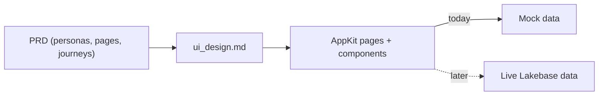
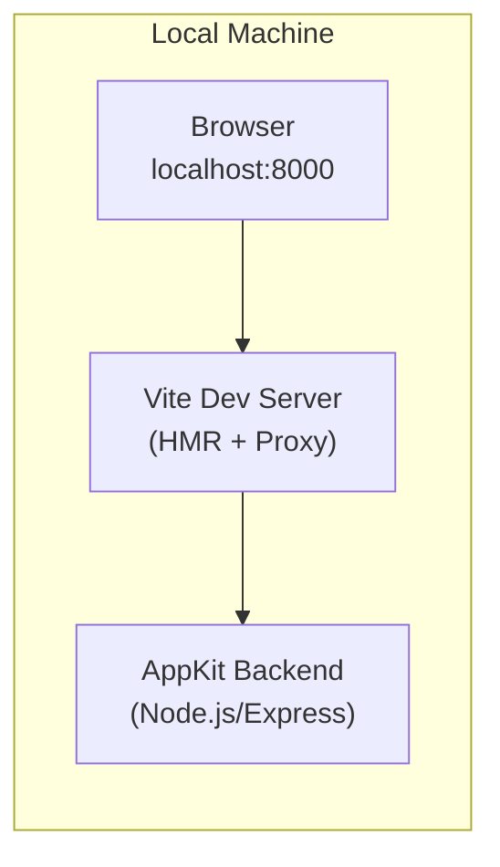
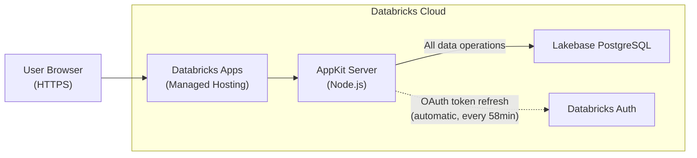
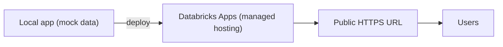
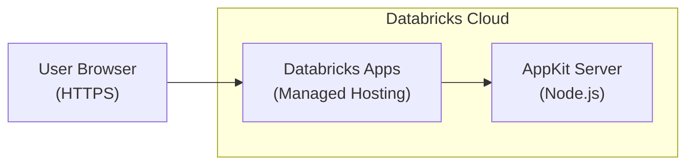

# Chapter 1 — Databricks App: UI Design & Deploy

Design the UI (Figma / coding assistant), scaffold the AppKit project, and deploy the Databricks App.

> Auto-generated from `02_seed_section_input_prompts.sql`. Each section below corresponds to one `section_tag` in the workshop builder's `section_input_prompts` table.

## Sections in this category

| Step (order) | Section | `section_tag` | Forks |
|---|---|---|---|
| 4 | [Figma UI Design](#figma-ui-design) | `figma_ui_design` | — |
| 4 | [Scaffold, Build, and Test Locally](#scaffold-build-and-test-locally) | `cursor_copilot_ui_design` | genie-code |
| 8 | [Deploy and E2E Test with Lakebase](#deploy-and-e2e-test-with-lakebase) | `workspace_setup_deploy` | — |
| 5 | [Deploy to Databricks Apps](#deploy-to-databricks-apps) | `deploy_databricks_app` | genie-code |

---

## Figma UI Design

| Field | Value |
|-------|-------|
| `input_id` | `2` |
| `section_tag` | `figma_ui_design` |
| `order_number` | `4` |
| `coding_assistant` | `__default__` |
| `bypass_llm` | `true` |

_Design a simple, clean user interface using Figma AI_

**Input Template** (the prompt the section feeds to the LLM / pastes verbatim):

```
Generate the **actual UI mockups** for a simple, happy-path implementation using the Product Requirements Document as the source of truth.

## Product Requirements Document (PRD)

Use the following PRD to understand user personas, key user journeys, and core features:

{prd_document}

---

## Design Requirements

Create a **simple UI design** that includes:
- Key screens/pages for primary user personas
- Core components for functional requirements (Happy Path only)
- Simple data display layouts for main entities
- Basic navigation and interactions for high-value user journeys

In addition, document the design with:
- Key screens/pages
- Core components
- Basic navigation and interactions (happy path only)

**Keep it simple** — focus on essential screens and flows, not edge cases.
```

**System Prompt:**

```
This prompt is returned as-is for you to paste into Figma AI. No LLM processing is applied.
```

<details><summary><strong>How to Apply</strong> (user-facing guidance)</summary>

> **Artifact root (client-aware).** The PRD lives at `<ARTIFACT_ROOT>/docs/design_prd.md`, where `<ARTIFACT_ROOT>` is your workshop clone root (resolve via `vibecoding-state.resolve_root`). On Cursor/Copilot that is your repo root and the `@docs/design_prd.md` mention resolves there; on Databricks Genie Code open it under your user project root `/Workspace/Users/<email>/<repo>` (the repo is cloned separately at `/Workspace/Users/<email>/.assistant/skills/<repo>` for skill loading only) — never the page's current working directory.

## Steps to Apply

1. **First, get your PRD ready:**
   - Copy the PRD content generated from the previous step (Step 3)
   - Or open `<ARTIFACT_ROOT>/docs/design_prd.md` (IDE clients that support `@`-mentions can use the `@docs/design_prd.md` mention) and copy its contents

2. **Open Figma and create a new design file**

3. **Upload/Attach the PRD to Figma:**
   - In Figma AI, you can paste the PRD content directly
   - Or use Galileo AI and provide the PRD as context

4. **Copy the generated prompt** using the copy button above

5. **Paste into Figma AI or Galileo AI** to generate the design

6. **Review and iterate** on the generated components

7. **Export the design** when ready:
   - Export as images/assets for reference
   - Or use Figma''s code export features

8. **Move to code implementation:**
   - Open your coding assistant with the project
   - Use the exported Figma designs as visual reference
   - Implement the UI components in code

**Note:** The prompt includes `{prd_document}` which will be replaced with your actual PRD content.

</details>

<details><summary><strong>Expected Output</strong></summary>

## Expected Output

Simple UI design mockups that match the PRD:
- Key screens for primary user flows
- Basic component designs
- Clean, minimal layouts
- Ready for implementation in your coding assistant

</details>

---

## Scaffold, Build, and Test Locally

| Field | Value |
|-------|-------|
| `input_id` | `3` |
| `section_tag` | `cursor_copilot_ui_design` |
| `order_number` | `4` |
| `coding_assistant` | `__default__` |
| `bypass_llm` | `true` |

_Scaffold a blank AppKit project, build UI with mock data from a PRD, test locally before deployment_

**Input Template** (the prompt the section feeds to the LLM / pastes verbatim):

````
## Your Task

You are a full-stack developer building a web application on Databricks AppKit. Your goal is to scaffold a blank AppKit project, build a UI with mock data from a PRD, and test locally.

**First:** Read `$APP_ROOT/.vibecoding-state.md` if it exists — it contains resolved issues and variable values from prior phases.

**Workspace:** `{workspace_url}`

### File Locations

The app is scaffolded into its own **top-level** directory `$APP_ROOT` (= `<app_name>/` at the repo root — a sibling of `apps_lakebase/`, NOT nested inside it). This mirrors how the data-product bundle lives in its own top-level `{user_schema_prefix}_<use_case_slug>_dab/` folder, so the app's root has parity across coding agents.

| What | Where |
|------|-------|
| All app source, configs, server, client | `$APP_ROOT/` (top-level app dir) |
| Design docs (PRD, UI design) | `docs/` (repo root) |

All file paths below are relative to `$APP_ROOT/` unless explicitly prefixed with `docs/`.

### Hard Constraints

- **Workspace access:** Verify with `databricks current-user me --host {workspace_url}` before proceeding. If you get a 403, STOP and ask the user for a different workspace.
- **Typegen noise:** `npm run dev` triggers `npm run typegen` via the `predev` hook. `TABLE_OR_VIEW_NOT_FOUND` errors are expected when no live SQL queries are configured. These do not block the app.
- **App name:** Constructed below — do not use a shell variable named `USERNAME` (collides with system env vars on macOS/Linux).

---

### Step 1: Authenticate and Set Up Variables

> **Client note:** IDE runs these in a terminal; Genie Code runs the `databricks …` commands via `runDatabricksCli` (pre-authenticated). See `genie-code-environment`.

```bash
# Authenticate to Databricks (creates / refreshes the named profile)
PROFILE="{databricks_cli_profile}"
databricks auth login --host {workspace_url} --profile $PROFILE

# Derive app name from your username + use case
USER_JSON=$(databricks current-user me --profile $PROFILE --output json)
EMAIL=$(echo "$USER_JSON" | jq -r '.userName')
FIRSTNAME=$(echo "$EMAIL" | cut -d'@' -f1 | cut -d'.' -f1)
LASTINITIAL=$(echo "$EMAIL" | cut -d'@' -f1 | cut -d'.' -f2 | cut -c1)
APP_PREFIX="${FIRSTNAME}-${LASTINITIAL}"
APP_NAME="${APP_PREFIX}-{use_case_slug}"
echo "App: $APP_NAME | Email: $EMAIL"

# Validate and auto-truncate APP_NAME
if [ ${#APP_NAME} -gt 26 ]; then
  APP_NAME=$(echo "$APP_NAME" | cut -c1-26 | sed 's/-$//')
  echo "Truncated to: $APP_NAME"
fi
if echo "$APP_NAME" | grep -q '[^a-z0-9-]'; then
  echo "ERROR: APP_NAME contains invalid characters: $APP_NAME"
  echo "Must be lowercase letters, numbers, and hyphens only."
fi

# Top-level app directory (parity with {user_schema_prefix}_<use_case_slug>_dab). Run all commands from the repo root.
APP_ROOT="$APP_NAME"
echo "App root: $APP_ROOT"
```

**Important:** App names must be max 26 characters, lowercase letters/numbers/hyphens only (no underscores). The validation above catches issues automatically.

---

### Step 2: Install Agent Skills and Scaffold the AppKit App

Read and follow **every step** in the `01-appkit-scaffold` skill at `@apps_lakebase/skills/01-appkit-scaffold/SKILL.md`. Do not skip any steps.

The skill will guide you through:
1. **Installing Databricks Agent Skills** — required before scaffolding. Do not skip this.
2. **Scaffolding the AppKit project** into its own top-level directory `$APP_ROOT`

**Parameters to use** (the skill needs these values):
- **Profile:** Use `$PROFILE` (or select one via `databricks auth profiles`)
- **App name:** Use `$APP_NAME` from Step 1
- **Features:** None — scaffold a **blank** app (no `--features` flag)
- **Description:** `"{use_case_slug} app"`
- **Working directory:** Run from the **repo root** so the app is created at the top level as `$APP_ROOT/` (a sibling of `apps_lakebase/`, NOT inside it). Do **not** `cd apps_lakebase` first.

After the skill completes scaffold + `npm install`, verify the bundle config:

```bash
# app.yaml has no name field (only the start command) — this is expected.
# The app name lives in databricks.yml:
grep "name:" $APP_ROOT/databricks.yml
```

If `databricks.yml` doesn't contain `$APP_NAME`, update it manually.

**From this point on, all file paths are relative to `$APP_ROOT/`** — this is your app root.

---

### Step 3: Read the PRD

Review `@docs/design_prd.md` (parent `docs/` folder at repo root) to understand:

- User personas and their needs
- Key user journeys (Happy Path only)
- Core features and requirements
- Data requirements — what entities and relationships the UI needs to display

---

### Step 4: Build the App

Read and follow the `02-appkit-build` skill at `@apps_lakebase/skills/02-appkit-build/SKILL.md`. The skill covers frontend components, design quality, routing, and testing. **Read every reference file the skill points to** — especially `references/llm-guardrails.md` and `references/design-quality.md` — before writing component code.

**Demo data strategy:** Use static mock data arrays directly in your components. All charts, tables, and data-driven components should use the `data` prop with hardcoded representative sample data. There is no live backend, no SQL warehouse, and no database at this stage — the goal is a fully functional UI with realistic-looking mock data.

**Skip these parts of the build skill** (they are not relevant for a blank app):
- SQL query file creation (`config/queries/`)
- `npm run typegen` (type generation from SQL files)
- `useAnalyticsQuery` hooks
- `useMemo` on query parameters and `sql.*` helpers

The backend only needs the `server()` plugin registered. The scaffold generates `.catch(console.error)` instead of `await` — **replace the entire `server/server.ts`** with:

```typescript
// REPLACE the scaffold-generated server/server.ts with this:
import { createApp, server } from "@databricks/appkit";

await createApp({
  plugins: [server()],
});
```

---

### Step 5: Create UI Design Document

Save a design overview to `@docs/ui_design.md` (parent `docs/` folder at repo root) describing:

- Key screens/pages
- Core components and their mock data sources
- Navigation flow
- Design direction and aesthetic choices

---

### Step 6: Test Locally

From your app directory (`$APP_ROOT/`):

```bash
# Free port 8000 if something is already bound to it
lsof -ti:8000 | xargs kill -9 2>/dev/null || true

npm run dev
```

**Note:** `npm run dev` triggers `npm run typegen` automatically via the `predev` hook. You may see `TABLE_OR_VIEW_NOT_FOUND` errors for queries referencing tables that don't exist yet — this is expected and does not block the app from running.

Open `http://localhost:8000` and verify:

- The UI loads without console errors
- Navigation works across pages
- All interactive elements respond
- Static mock data renders correctly in all components

**Automated check (if browser is unavailable):**

```bash
curl -s -o /dev/null -w "%{http_code}" http://localhost:8000
# Should return 200
```

**Visual verification** is recommended before proceeding. If you have access to the `web-devloop-tester` subagent, use it to check for console errors and layout issues.

---

### Summary Checklist

Your job is complete when:

- [ ] Databricks CLI is authenticated and `APP_NAME` is set
- [ ] AppKit project is scaffolded at the top level as `$APP_ROOT/` (sibling of `apps_lakebase/`) as a blank app (no plugins)
- [ ] Backend (`server/server.ts`) uses `await createApp({ plugins: [server()] })` (not `.catch(console.error)`)
- [ ] Frontend (`client/src/`) implements key pages with mock data
- [ ] Loading/error/empty states on every data-driven component
- [ ] `tests/smoke.spec.ts` uses `data-testid` selectors (not text/role); key page elements have `data-testid` attributes
- [ ] `@docs/ui_design.md` is created (parent docs folder)
- [ ] `npm run dev` runs cleanly at `http://localhost:8000`
- [ ] `databricks apps validate` passes (catches strict-mode TS errors and smoke test regressions that `npm run build` alone misses)
- [ ] `.vibecoding-state.md` updated (see below)

**Before finishing**, write (or append to) `$APP_ROOT/.vibecoding-state.md` with:
- Step name (`## Scaffold, Build & Test`)
- Key variable values (`APP_NAME`, `PROFILE`, workspace URL)
- Any resolved issues or workarounds encountered during this phase

Only proceed to deployment after local testing passes.
````

**System Prompt:**

```
You are a full-stack developer building a web application on Databricks AppKit. Your goal is to scaffold a blank AppKit project, implement a UI with mock data from a PRD, and test locally.

Key requirements:

- Scaffold a **blank** AppKit project (no plugins) using the `01-appkit-scaffold` skill
- Read the PRD to understand user personas, journeys, and data requirements
- Build the app using the `02-appkit-build` skill (frontend components, design quality, routing)
- Use static mock data arrays in all components — no live backend, no SQL warehouse, no database
- Create a UI design document describing screens, components, and navigation
- Test locally at `http://localhost:8000` before proceeding

CLI Best Practices:

- Run from the repo root (the workshop project root); use `apps_lakebase/scripts/` for shared scripts
- Run CLI commands outside the IDE sandbox to avoid SSL/TLS certificate errors

This prompt is returned as-is for direct use in Cursor/Copilot. No LLM processing.
```

<details><summary><strong>How to Apply</strong> (user-facing guidance)</summary>

## 1️⃣ How To Apply

Copy the prompt above, replace the placeholders, start a **new Agent chat** in your coding assistant, and paste it.

### Prerequisite

Ensure you have:
- ✅ A completed PRD describing the app's personas, pages, and journeys
- ✅ Replaced `{workspace_url}` and `{use_case_slug}` in the prompt with your values

### Steps to Apply

**Step 1:** Start a new Agent thread in your coding assistant
**Step 2:** Copy the prompt and paste it into your coding assistant
**Step 3:** The assistant scaffolds a blank AppKit app and builds the UI from your PRD — on **mock data**
**Step 4:** Confirm the app renders locally at `http://localhost:8000`, then stop — no database yet

---

## 2️⃣ What Are We Building?

The first working version of the app: a real UI built from your PRD, running entirely on **mock data**. No database, no SQL warehouse — just the look, feel, and flows, so the design is settled before any data plumbing begins.



AppKit gives you a **React client** and a **Node server** in one project. Because the pages read from the app's own API rather than hardcoded values, swapping in live data later is a contained change — not a rewrite.

---

## 3️⃣ Why Are We Building It This Way? (Databricks Best Practices)

| Principle | Why it matters |
|-----------|----------------|
| **Mock-data-first** | Finishing the UI on placeholder data decouples design from data plumbing, so each can be reviewed on its own |
| **AppKit client + server** | One TypeScript project with a React client and Node backend, type-safe end to end |
| **A design doc as contract** | `ui_design.md` captures the pages and flows so the later wiring steps build against a fixed target |
| **Local-first iteration** | Running on `localhost` makes design changes fast and cheap before anything is deployed |

---

## 4️⃣ What Happens Behind the Scenes?

1. **The assistant authenticates and scaffolds** a blank AppKit project (React client + Node server).
2. **It reads the PRD** and designs the pages, components, and navigation.
3. **It builds the UI on mock data**, so every page renders without a database.
4. **It saves `ui_design.md`** and runs the app locally at `http://localhost:8000` for review.

</details>

<details><summary><strong>Expected Output</strong></summary>

## Expected Output

**Project directory tree:**

```
$APP_ROOT/
├── app.yaml                    # App deployment configuration
├── databricks.yml              # Databricks bundle config
├── package.json                # Dependencies (@databricks/appkit, etc.)
├── tsconfig.json
├── server/
│   └── server.ts               # AppKit backend (server plugin only)
├── client/
│   ├── index.html
│   ├── vite.config.ts
│   └── src/
│       ├── main.tsx
│       ├── App.tsx             # Root component with routing
│       └── components/         # UI components with mock data
└── tests/
    └── smoke.spec.ts           # Smoke test (update selectors for your app)
```

Pages and components under `client/src/` will vary based on your PRD.

**Terminal output — `npm run dev`:**

Output format varies by AppKit version. Look for confirmation that the server is running on port 8000 and the Vite dev server is ready. You may see a Registered Routes table and `[appkit:server]`-prefixed log lines — this is normal.

**Architecture — Local Development:**



**What you should see in the browser:**

```
┌─────────────────────────────────────────────────────────────┐
│  My App                                    Dashboard | Details│
├─────────────────────────────────────────────────────────────┤
│                                                             │
│  ┌──────────┐  ┌──────────┐  ┌──────────┐  ┌──────────┐   │
│  │ Total    │  │ Active   │  │ Revenue  │  │ Growth   │   │
│  │ Orders   │  │ Users    │  │ $12,450  │  │ +15.3%   │   │
│  │ 1,247    │  │ 342      │  │          │  │          │   │
│  └──────────┘  └──────────┘  └──────────┘  └──────────┘   │
│                                                             │
│  ┌─────────────────────────────┐  ┌────────────────────┐   │
│  │  Orders by Status           │  │  Recent Activity   │   │
│  │  ████████████ Completed 72% │  │  Order #1247 ...   │   │
│  │  ██████      Pending   20% │  │  Order #1246 ...   │   │
│  │  ███         Cancelled  8% │  │  Order #1245 ...   │   │
│  │                             │  │  Order #1244 ...   │   │
│  └─────────────────────────────┘  └────────────────────┘   │
│                                                             │
└─────────────────────────────────────────────────────────────┘
```

**Verification — curl test:**

```bash
$ curl -s http://localhost:8000 | head -1
<!DOCTYPE html>
```

</details>

#### Fork — `coding_assistant = genie-code`  (input_id 911)

> Fork rows override only `input_template`, `system_prompt`, and `bypass_llm`. All display fields are inherited from the default row above.

| Field | Value |
|-------|-------|
| `input_id` | `911` |
| `section_tag` | `cursor_copilot_ui_design` |
| `order_number` | `(inherited)` |
| `coding_assistant` | `genie-code` |
| `bypass_llm` | `true` |

**Input Template** (the prompt the section feeds to the LLM / pastes verbatim):

````
Scaffold a new AppKit project and author its UI on mock data — a build-only step with no deploy. Before this step there is no app; after it, `<APP_ROOT>` holds a scaffolded AppKit project whose screens render from mock data, plus a UI design document — ready for the Lakebase wiring and deploy steps.

This will involve the following steps:

- **Resolve identity** — derive `APP_NAME` and `<APP_ROOT>` (no `auth login`).
- **Load the skills** — read the scaffold and build skills by their full `skill_ref_root`-prefixed paths.
- **Scaffold the app** — create the blank AppKit project into `<APP_ROOT>` (no local npm).
- **Read the PRD** — ground the UI in the product requirements.
- **Author the UI** — write screens and components on mock data (files only, no server).
- **Run the static gate and write the design doc** — scan for traps, then capture the UI design document.

The steps below are the prescriptive runbook for those actions; follow them in order.

**Genie Code — this is a prescriptive runbook. Follow the steps in order. Do NOT improvise paths, do NOT use bare relative paths, do NOT use `@`-mentions, and do NOT deploy. This is a BUILD-ONLY step: you SCAFFOLD the AppKit project and AUTHOR the UI with mock data — you do NOT run a local server, you do NOT test at `http://localhost:8000`, and you do NOT run `databricks apps deploy`. Initial deploy + URL verification happen in the **Deploy to Databricks Apps** step (05). Every skill is named by its full `skill_ref_root`-prefixed path; the app is anchored to `<APP_ROOT>`.**

### 🔴 Non-negotiable execution rules (read before anything)

❌ **NEVER** run `npm run dev`, open `http://localhost:8000`, or rely on a local Node server — Genie Code is serverless and has **no local npm and no localhost** (`genie-code-environment` "AppKit/Node reality"). The IDE's `curl -o /dev/null -w "%{http_code}" http://localhost:8000` smoke check does **NOT** apply here; build correctness is proven server-side at deploy time (step 05), where the Apps runtime runs `npm install` + `npm run build` from source.

❌ **NEVER** run `databricks apps deploy` (or `databricks apps validate`) in this step — deployment and the deployed-URL verification are step 05's job. This step ends when the project is scaffolded and the UI is authored.

✅ The ONLY CLI you run here is **read-only** identity/scaffold via `runDatabricksCli` (`databricks current-user me`, `databricks apps init …`). You are pre-authenticated — do **NOT** run `databricks auth login`.

### Step 0 — Resolve your environment (once, before anything else)

Run `skills/vibecoding-state` operation `enter` with `prompt_id: "cursor_copilot_ui_design"`. It writes and echoes the `## Environment Capabilities` block. Read these resolved values and use them literally throughout:

- `client_context` = `genie_code`
- `artifact_root` = your workshop project root (e.g. `/Workspace/Users/<your-email>/vibe-coding-workshop`) — where all generated bundles/apps/docs build; the repo itself is cloned at `/Workspace/Users/<your-email>/.assistant/skills/vibe-coding-workshop` (skills load from there via `skill_ref_root`, NOT from `artifact_root`)
- `skill_ref_root` = `skills/vibe-coding-workshop` (substitute your clone folder if you cloned somewhere other than `.assistant/skills/vibe-coding-workshop`)
- `app_root` = `<artifact_root>/<app_name>` — the **self-contained AppKit app project** (e.g. `…/vibe-coding-workshop/jane-d-{use_case_slug}`), a TOP-LEVEL sibling of any `{user_schema_prefix}_<use_case_slug>_dab` bundle, NOT nested under `apps_lakebase/` and NOT the bare project root. Referred to below as `<APP_ROOT>`. `app.yaml`, `databricks.yml`, `server/`, `client/`, and `<APP_ROOT>/.vibecoding-state.md` all live here.
- `app_deploy.verb` = `apps deploy` (gated) — used in step 05, NOT here.

`app_root` is `<pending>` until `APP_NAME` is derived (Step 1). After Step 1, re-run `enter`'s capture (or update the block) so `app_root` resolves to `<artifact_root>/<APP_NAME>`.

### Step 1 — Derive `APP_NAME` and `<APP_ROOT>` (no `auth login`)

You are pre-authenticated. Get your identity read-only via `runDatabricksCli`, then construct the app name (max 26 chars, lowercase/numbers/hyphens only):

```bash
databricks current-user me --output json
```

- `EMAIL` = `.userName`; `FIRSTNAME` = the part before `.`; `LASTINITIAL` = first char after `.`.
- `APP_NAME` = `<FIRSTNAME>-<LASTINITIAL>-{use_case_slug}` (truncate to 26 chars, strip a trailing `-`).
- `<APP_ROOT>` = `<artifact_root>/<APP_NAME>`. This is where the project is scaffolded and authored.

> Workspace target for this run: `{workspace_url}`. The session profile placeholder `{databricks_cli_profile}` is **inert on Genie Code** — runDatabricksCli is pre-authenticated, so omit `--profile`.
>
> **Host of record is the runtime, not the template.** On Genie Code the authoritative workspace is the pre-authenticated runtime — derive it from `w.config.host` (or `databricks current-user me`). If `databricks.yml`'s `host:` and `{workspace_url}` disagree, **trust the runtime host**; do not chase the templated value.

### Step 2 — Load the required skills by their FULL `skill_ref_root`-prefixed paths

Load each skill with `readSkillFile` using its fully-qualified `<skill_ref_root>`-prefixed path — NEVER a bare `@…` mention, NEVER a repo-relative path. **The root-level `skills/` come FIRST: they are the highest-priority, always-on guardrails and govern everything below.** Read them in ONE batched `readSkillFile` turn (`genie-code-environment` §10 — Genie Code reads multiple files in parallel in a single turn).

1. `readSkillFile("skills/vibe-coding-workshop/apps_lakebase/skills/01-appkit-scaffold/SKILL.md")` — scaffold mechanics; **on Genie Code `apps init` needs `--output-dir`** (it otherwise lands at `/Workspace/<name>`, ignoring the page CWD).
2. `readSkillFile("skills/vibe-coding-workshop/apps_lakebase/skills/02-appkit-build/SKILL.md")` — UI build patterns, design quality, and its referenced `references/llm-guardrails.md` + `references/design-quality.md`. **Read every reference the skill points to before writing component code.**

When either skill lists further mandatory references, load EACH the same way: take its repo-relative path and prefix it with `skill_ref_root`. Genie Code has no repo-root-relative resolution and `AGENTS.md` does not carry across threads — so always prefix with `skill_ref_root`.

### Step 3 — Scaffold the blank app INTO `<APP_ROOT>` (no local npm)

Scaffold via `runDatabricksCli`, pinning the output directory so the project lands at `<APP_ROOT>` (a top-level sibling of `apps_lakebase/`, NOT inside it) — never `/Workspace/<name>`:

```
databricks apps init --name "<APP_NAME>" --run none --output-dir "<artifact_root>"
```

`apps init` creates `<artifact_root>/<APP_NAME>/` = `<APP_ROOT>`. The `⚠ npm not found` warning is **expected** — Genie Code has no local npm, so `npm install` is skipped here and runs **server-side on deploy** (step 05). Do not try to install npm or run `npm install`. Verify `<APP_ROOT>/databricks.yml` exists and contains `name: <APP_NAME>`; if not, set it.

### Step 4 — Read the PRD

Read `<artifact_root>/docs/design_prd.md` (full `<artifact_root>`-anchored path — NOT a bare `@docs/...` mention; design docs live at `<artifact_root>`'s `docs/`, not under `<APP_ROOT>`). Extract personas, key journeys (Happy Path), core features, and the entities/relationships the UI must display.

### Step 5 — Author the UI with mock data (files only — no server)

Drive the `02-appkit-build` skill to author the frontend under `<APP_ROOT>/client/` and the backend under `<APP_ROOT>/server/`. **Demo-data strategy:** static mock-data arrays directly in components (`data` prop with hardcoded representative samples) — there is no live backend, SQL warehouse, or database at this stage. Skip the SQL-query parts of the build skill (`config/queries/`, `npm run typegen`, `useAnalyticsQuery`, `sql.*`). Replace the entire `<APP_ROOT>/server/server.ts` with:

```typescript
import { createApp, server } from "@databricks/appkit";

await createApp({
  plugins: [server()],
});
```

Write files with `executeCode` `open(path,"w").write(...)` against warm compute (warm up once with a trivial `print("ready")` to absorb the serverless cold start, then keep `timeoutMinutes` generous). Do **not** run `npm run build`/`npm run dev` — there is no local Node; the build runs server-side at deploy.

🔴 **Write literal characters — do not over-escape.** Because you author `.tsx`/`.css` through Python string literals, an apostrophe or quote that gets double-escaped lands in the file as a stray `\uXXXX` (e.g. `\u0027`) and renders as garbage in the UI. Prefer Python **triple-quoted raw strings** (`r"""…"""`) for file bodies and write the real `'`/`"` characters; never emit `\u0027`-style escapes into source. Step 5b's gate flags any residual `\uXXXX` as a backstop.

🔴 **Preserve the scaffold's import specifiers verbatim.** `apps init` ships `client/src/index.css` with `@import "@databricks/appkit-ui/styles.css";` and every `.tsx` importing components from `@databricks/appkit-ui/react`. **Edit these files incrementally — never regenerate `App.tsx`/`index.css` from memory**, which is how the wrong specifiers (bare `@databricks/appkit-ui`, extension-less `…/styles`) get reintroduced and the server-side build fails. Likewise keep the scaffold's `client/src/ErrorBoundary.tsx` (it is what surfaces a client runtime crash in the browser at step 05). See `02-appkit-build` "Hard Rules" + `references/llm-guardrails.md` rules 11–12.

### Step 5b — Pre-handoff static gate (the only static check here)

There is **no local `tsc`/`npm`/`eslint`** on Genie Code, so a regex scan is the **only** way to catch the common, statically-detectable build/runtime killers before this step hands off to deploy. Run via `executeCode` (read files in Python + regex — do NOT depend on the IDE's shell `grep`). It splits hits into **BLOCKING** (must fix) and **REVIEW** (a heuristic — confirm each, then fix):

- **BLOCKING — import specifiers:** bare `@databricks/appkit-ui` (must be `…/react`); `@import "…/styles"` missing the `.css` extension (must be `…/styles.css`).
- **BLOCKING (A) — empty Radix value:** `value=""` on a `<SelectItem>` crashes at runtime when the menu opens; use a non-empty sentinel like `"all"`.
- **BLOCKING (B) — escaped single-quote in a JSX attribute:** crashes the Vite/rolldown parser; use double quotes or a `{"…"}` expression.
- **BLOCKING (C) — stray `\uXXXX` escape artifact:** a literal unicode escape (often from over-escaped Python-written source) renders as garbage; write the real character.
- **BLOCKING (E) — stale server-wiring shape (`server/server.ts`):** `server({ autoStart: false })` (or a manual `AppKit.server.start()`) double-`listen()`s and crashes the app on boot; register routes inside `onPluginsReady(appkit)` + `appkit.server.extend(...)` and let `server()` own the listener.
- **BLOCKING (F) — wrong Lakebase plugin import (`server/server.ts`):** importing the `lakebase` plugin `from "@databricks/lakebase"` (the driver package) fails the build; import it `from "@databricks/appkit"`.
- **REVIEW (D) — unused named import:** flagged when a symbol appears only on its import line. The scaffold's `noUnusedLocals` turns an unused import into a hard `TS6133` build failure. Heuristic only (can false-positive on comment/string-only use or re-exports), so confirm before removing.

```python
import re, pathlib
root = pathlib.Path("<APP_ROOT>/client/src")
bad, review = [], []
for f in root.rglob("*"):
    if f.suffix in {".ts", ".tsx", ".css"}:
        t = f.read_text()
        # import specifiers (the #1 build-killer)
        if re.search(r'from\s+["\']@databricks/appkit-ui["\']', t):
            bad.append(f"{f}: bare '@databricks/appkit-ui' -> use '/react'")
        if re.search(r'@import\s+["\']@databricks/appkit-ui/styles["\']', t):
            bad.append(f"{f}: '/styles' missing '.css' -> use '/styles.css'")
        # (A) empty Radix <SelectItem> value -> runtime crash when the menu opens
        if re.search(r'value\s*=\s*["\']\s*["\']', t):
            bad.append(f"{f}: empty value=\"\" -> use a non-empty sentinel (e.g. \"all\")")
        # (B) escaped single-quote in a JSX attribute -> Vite/rolldown parse crash
        if re.search(r"=\s*'[^']*\\'", t):
            bad.append(f"{f}: escaped single-quote in attribute -> use double quotes or {{\"...\"}}")
        # (C) stray \uXXXX escape artifact (often from over-escaped Python-written source)
        if re.search(r'\\u00[0-9a-fA-F]{2}', t):
            bad.append(f"{f}: literal \\uXXXX escape -> write the real character")
        # (D) unused named import -> TS6133 (noUnusedLocals). HEURISTIC: review, don't auto-delete.
        if f.suffix in {".ts", ".tsx"}:
            for m in re.finditer(r'import\s+(?:type\s+)?\{([^}]+)\}\s+from', t):
                for raw in m.group(1).split(","):
                    name = raw.strip().split(" as ")[-1].strip()
                    if name and len(re.findall(rf'\b{re.escape(name)}\b', t)) <= 1:
                        review.append(f"{f}: '{name}' imported but never referenced -> noUnusedLocals will FAIL the build")
# (E) stale server-wiring shape + (F) wrong lakebase plugin import (server/server.ts)
srv = pathlib.Path("<APP_ROOT>/server/server.ts")
if srv.exists():
    st = srv.read_text()
    if re.search(r'import\s*\{[^}]*\blakebase\b[^}]*\}\s*from\s*["\']@databricks/lakebase["\']', st):
        bad.append(f"{srv}: lakebase plugin imported from '@databricks/lakebase' -> import from '@databricks/appkit'")
    if re.search(r'autoStart\s*:\s*false', st) or re.search(r'\.server\.start\s*\(', st):
        bad.append(f"{srv}: autoStart:false / manual server.start() -> register routes in onPluginsReady, let server() own the listener")
print("BLOCKING:\n" + ("\n".join(bad) or "OK"))
print("REVIEW:\n" + ("\n".join(review) or "none"))
```

Fix every **BLOCKING** hit and triage every **REVIEW** hit before declaring this step complete. `BLOCKING: OK` is required to hand off to step 05. (Step 05 re-runs this same gate as its pre-deploy check.)

### Step 6 — Create the UI design document

Write `<artifact_root>/docs/ui_design.md` (`<artifact_root>`-anchored, NOT `@docs/...`) describing key screens/pages, core components and their mock-data sources, navigation flow, and design direction.

**State-lock:** this prompt runs between an `enter` (Step 0) and an `exit`. After the gate passes, run `skills/vibecoding-state` op `exit` — params: `prompt_id: "cursor_copilot_ui_design"`, `gate: "App scaffolded + UI authored (deploy + verify deferred to step 05)"`, `captured: {app_name, app_root}`. **This `enter`/`exit` pair is a mandatory ritual, not advisory.** Step 0's `enter` MUST locate — or, if this is the first prompt of the track, bootstrap-create — the canonical live state file at `<app_root>/.vibecoding-state.md` (never the temporary `example/…` bootstrap path). The closing `exit` MUST append this prompt's Per-Step Log entry, Gate result, and `captured` vars to that file, then **re-read it and echo the appended section to prove the write landed**. **Gate completion rule:** this prompt is NOT complete until that re-read confirms the appended entry — the chat summary is NOT the state store.

**Gate:** `App scaffolded + UI authored (deploy + verify deferred to step 05)` — `<APP_ROOT>` contains a scaffolded blank AppKit project (`app.yaml`, `databricks.yml` with `name: <APP_NAME>`, `server/server.ts` using `await createApp({ plugins: [server()] })`, and `client/` pages built from the PRD with mock data), and `<artifact_root>/docs/ui_design.md` exists. NO local server was run, NO `http://localhost:8000` check was attempted, and NOTHING was deployed or validated — deploy + deployed-URL verification are step 05.

**➡️ Next step.** The app now lives under `<APP_ROOT>`. Step 05 (**Deploy to Databricks Apps**) deploys it via the SDK SNAPSHOT path (`w.apps.deploy(...)`, build runs server-side) and verifies the deployed URL with the 3-hop OAuth session — keep `<APP_ROOT>` as your working anchor.
````

---

## Deploy and E2E Test with Lakebase

| Field | Value |
|-------|-------|
| `input_id` | `4` |
| `section_tag` | `workspace_setup_deploy` |
| `order_number` | `8` |
| `coding_assistant` | `__default__` |
| `bypass_llm` | `true` |

_Deploy the Lakebase-wired app to Databricks Apps, test APIs, check logs, verify idle resilience_

**Input Template** (the prompt the section feeds to the LLM / pastes verbatim):

````
## Your Task

Deploy the Lakebase-wired web application to Databricks Apps and run comprehensive end-to-end testing. This is the first deploy with Lakebase code — the Service Principal will create the database schema, tables, and seed data on startup.

**First:** Read `$APP_ROOT/.vibecoding-state.md` if it exists — it contains resolved issues and variable values from prior phases.

**Workspace:** `{workspace_url}`

**Working directory:** Run all commands from the **repo root**. The scaffolded AppKit app lives in its own top-level directory `$APP_ROOT/` (= `<app_name>/` at the repo root, a sibling of `apps_lakebase/` — NOT nested inside it).

**Prerequisite:** Complete the **Wire Lakebase Backend** step first. Local testing must pass with mock fallback data before deployment.

---

### Deployment Constraints

- Databricks App names must use only lowercase letters, numbers, and dashes (no underscores). Use hyphens: `my-app-name` not `my_app_name`.
- App names are max 26 characters.

---

### Step 1: Set Variables and Validate Lakebase Config

Derive your app name and auto-detect a CLI profile for the target workspace:

> **Client note:** IDE runs these in a terminal; Genie Code runs the `databricks …` commands via `runDatabricksCli` (resolved channel in `## Environment Capabilities`; SDK `w.apps.deploy(...)` fallback per `genie-code-environment`).

```bash
PROFILE="{databricks_cli_profile}"
TARGET_HOST="{workspace_url}"

# Fallback: if the session-level profile is empty, auto-detect from the workspace URL.
if [ -z "$PROFILE" ]; then
  PROFILE=$(databricks auth profiles --output json 2>/dev/null \
    | jq -r --arg host "$TARGET_HOST" \
      '[.profiles[] | select(.host == $host)] | .[0].name // empty')
fi

# Fallback: if still empty, prompt the user to authenticate and re-detect.
if [ -z "$PROFILE" ]; then
  echo "No profile found for $TARGET_HOST — creating one..."
  databricks auth login --host "$TARGET_HOST"
  PROFILE=$(databricks auth profiles --output json 2>/dev/null \
    | jq -r --arg host "$TARGET_HOST" \
      '[.profiles[] | select(.host == $host)] | .[0].name // empty')
fi

echo "Using profile: $PROFILE"

USER_JSON=$(databricks current-user me --profile $PROFILE --output json)
EMAIL=$(echo "$USER_JSON" | jq -r '.userName')
FIRSTNAME=$(echo "$EMAIL" | cut -d'@' -f1 | cut -d'.' -f1)
LASTINITIAL=$(echo "$EMAIL" | cut -d'@' -f1 | cut -d'.' -f2 | cut -c1)
APP_PREFIX="${FIRSTNAME}-${LASTINITIAL}"
APP_NAME="${APP_PREFIX}-{use_case_slug}"
APP_ROOT="$APP_NAME"   # top-level app dir at the repo root (parity with {user_schema_prefix}_<use_case_slug>_dab)
```

Verify `app.yaml` has the Lakebase-specific environment variables (in addition to the generic checks the deploy skill performs):

```bash
grep "valueFrom.*postgres" $APP_ROOT/app.yaml && echo "LAKEBASE_ENDPOINT: OK"
grep "postgres_project" $APP_ROOT/databricks.yml && echo "Bundle resources: OK"
```

Then run the AppKit validator to catch schema or resource binding issues early:

```bash
cd $APP_ROOT && databricks apps validate --profile $PROFILE
```

Fix any validation errors before deploying.

You should see `valueFrom: postgres` for `LAKEBASE_ENDPOINT` in `app.yaml` and `postgres_projects` in `databricks.yml`. The platform auto-injects `PGHOST`, `PGPORT`, `PGDATABASE`, `PGSSLMODE` from the bundle resource binding — these should NOT appear as static values in `app.yaml`.

> **Do NOT declare `postgres_branches` or `postgres_endpoints`** in `databricks.yml`. Lakebase Autoscaling auto-creates the default `production` branch and `primary` endpoint with the project. Declaring them causes Terraform "already exists" errors.

---

### Step 1b: Complete Lakebase Two-Phase Resource Binding

The **Setup Lakebase** step declared `postgres_projects` in `databricks.yml` (Phase 1). Before deploying, you must complete Phase 2: add the `app.resources.postgres` binding so `valueFrom: postgres` resolves at runtime.

**If this is the first deploy** (project does not exist yet), deploy once to create the project, then discover the database ID:

```bash
cd $APP_ROOT
databricks apps deploy --profile $PROFILE
# Wait for deploy to complete, then:
DB_ID=$(databricks postgres list-databases projects/$APP_NAME/branches/production \
  --profile $PROFILE --output json | jq -r '.[0].name')
echo "Database ID: $DB_ID"
```

**If the project already exists** (from a prior deploy), just discover the database ID:

```bash
DB_ID=$(databricks postgres list-databases projects/$APP_NAME/branches/production \
  --profile $PROFILE --output json | jq -r '.[0].name')
echo "Database ID: $DB_ID"
```

Then add the `resources` array to your `apps.app` resource in `databricks.yml`. Your final file should have BOTH `postgres_projects` (from Setup Lakebase) AND the new `app.resources.postgres` binding:

```yaml
# Complete databricks.yml after Phase 2 binding.
# IMPORTANT: postgres_projects from Setup Lakebase MUST remain.
# Only the 'resources' array under apps.app is new.
resources:
  apps:
    app:
      name: "<APP_NAME>"
      source_code_path: ./
      resources:                          # <-- NEW: add this block
        - name: "postgres"
          postgres:
            branch: "projects/<APP_NAME>/branches/production"
            database: "projects/<APP_NAME>/branches/production/databases/<DB_ID>"
            permission: "CAN_CONNECT_AND_CREATE"

  postgres_projects:                      # <-- KEEP: from Setup Lakebase step
    my_db:
      project_id: <APP_NAME>
      # ... existing settings from Setup Lakebase ...
```

Replace `<APP_NAME>` and `<DB_ID>` with actual values. **Keep all existing `postgres_projects` settings** — only add the `resources` array under `apps.app`.

> **Why this matters:** `valueFrom: postgres` in `app.yaml` resolves against the **app's resource list** (`apps.app.resources`), not the top-level bundle resources (`postgres_projects`). Without `app.resources.postgres`, the platform cannot inject `LAKEBASE_ENDPOINT` and the app falls back to mock data silently.

For the full schema reference, see `@apps_lakebase/skills/04-appkit-plugin-add/references/plugin-lakebase.md` section "app.resources.postgres Schema Reference".

---

### Step 2: Deploy (SP Creates Database Objects)

Read and follow the `03-appkit-deploy` skill at `@apps_lakebase/skills/03-appkit-deploy/SKILL.md`. Run all skill commands from the app root `$APP_ROOT/` (or the repo root, `cd`-ing into `$APP_ROOT` as needed).

The skill covers: config validation, build, deploy, UI verification, error diagnosis (3-iteration fix loop), and workspace app limit handling.

This is the first deploy with Lakebase code. The Service Principal runs the DDL in `server.ts` on startup, creating the schema, tables, and seed data. The SP owns all database objects it creates.

> **Deploy-first requirement (from [agent-skills lakebase.md](https://github.com/databricks/databricks-agent-skills/blob/main/skills/databricks-apps/references/appkit/lakebase.md)):** The SP must create the schema to own it. If you ran local dev before deploying, the schema is owned by your personal credentials and the SP cannot access it. In that case, drop the schema from the Lakebase SQL Console and redeploy.

> **SP permissions:** The Service Principal is auto-granted `CONNECT_AND_CREATE` via the `app.resources.postgres` binding (with `permission: CAN_CONNECT_AND_CREATE`). No manual grants are needed. If you see permission errors, verify the `app.resources.postgres` binding is declared in `databricks.yml` (see Step 1b).

**Timing:** First deploys take 3-5 minutes (npm install runs on the platform). Redeployments take 1-3 minutes. Use `databricks apps logs $APP_NAME --follow --profile $PROFILE` to stream logs in real-time instead of polling repeatedly.

**Important:** Always use `databricks apps deploy` — never `databricks apps start` — to push code changes. `databricks apps deploy` runs the full pipeline (build + bundle deploy + start). `apps start` only resumes a stopped app without updating code, and may hang if compute is in STOPPED state.

After the skill completes, verify the app status is RUNNING before testing:

```bash
databricks apps get $APP_NAME --output json --profile $PROFILE | jq '{status: .status.state, compute: .compute_status.state, url: .url}'

APP_URL=$(databricks apps get $APP_NAME --output json --profile $PROFILE | jq -r '.url')
echo "App URL: $APP_URL"
```

The primary readiness signal is `compute_status.state: ACTIVE`. `status.state` may remain `null` in some CLI versions or workspace configurations — this is normal and does not indicate a problem. If `compute` is not `ACTIVE`, wait 30 seconds and re-check.

**Warning:** `databricks bundle deploy` resets the app's resource list to match `databricks.yml`. If no code changes are needed since the **Wire Lakebase Backend** step, you may skip redeployment — the app is already running.

---

### Rule: Before Testing ANY API Endpoint

1. Read `server/server.ts` (or equivalent) to identify all registered routes, HTTP methods, and request body schemas
2. For POST/PUT endpoints, extract exact field names from the INSERT/UPDATE SQL statements
3. Read the seed data file (`server/mock-data.ts` or equivalent) for exact values needed by lookup/filter endpoints (reference numbers, emails, IDs)
4. Construct test payloads that match the actual code — do NOT guess based on REST conventions
5. Only test routes that actually exist in the code

DO NOT guess request body fields or assume standard REST endpoints exist (e.g., `GET /api/bookings` may not exist even if `POST /api/bookings` does).

> **Smoke test selectors:** If the app includes `tests/smoke.spec.ts` (from AppKit scaffold), update heading and text selectors to match your app's actual content before running `databricks apps validate`. The default template assertions will fail for custom apps. See [testing.md](https://github.com/databricks/databricks-agent-skills/blob/main/skills/databricks-apps/references/testing.md).

---

### Step 3: Test All Backend APIs

Databricks Apps require authentication. Get a bearer token, then test:

```bash
TOKEN=$(databricks auth token --profile $PROFILE | jq -r '.access_token')
AUTH_HEADER="Authorization: Bearer $TOKEN"
```

> **Token expiry:** Databricks Apps bearer tokens can expire quickly. If any `curl` call returns an empty `{}` response, check the HTTP status code — it is likely 401 (expired token). The Databricks Apps proxy returns `{}` instead of a standard 401 body. Refresh the token before each test batch:
>
> ```bash
> TOKEN=$(databricks auth token --profile $PROFILE | jq -r '.access_token')
> ```

```bash
# Health endpoint
curl -s -H "$AUTH_HEADER" "$APP_URL/api/health/lakebase" | jq .

# Test each data endpoint used by your UI pages.
# Replace with your actual API endpoints:
curl -s -H "$AUTH_HEADER" "$APP_URL/api/orders" | jq .
# curl -s -H "$AUTH_HEADER" "$APP_URL/api/bookings" | jq .
# curl -s -H "$AUTH_HEADER" "$APP_URL/api/listings" | jq .
# ... add all endpoints that fetch from Lakebase
```

If `curl` returns HTML (a login page) or 401, the token may have expired. Re-run the `TOKEN=...` line to refresh it.

**Verify each response includes:**

- `"source": "live"` (not `"mock"`) when Lakebase is connected
- Actual data rows from your Lakebase tables
- Health endpoint returns `{ "status": "connected", "source": "live" }`

If any endpoint returns `"source": "mock"`, there is a Lakebase connection issue — proceed to Step 5.

---

### Step 4: Check Logs for Lakebase Connections

```bash
databricks apps logs $APP_NAME --tail-lines 100 --search lakebase --profile $PROFILE
```

You should see INFO logs showing:

- `ConnectionPool initialised` — the Lakebase plugin started successfully
- Connection attempts to Lakebase (may include retries on first connect after scale-to-zero wake)
- `[Lakebase]` prefixed query logs with row counts for each endpoint

If the `--search` flag is not supported by your CLI version, fall back to:

```bash
databricks apps logs $APP_NAME --tail-lines 100 --profile $PROFILE | grep -i lakebase
```

---

### Step 5: Fix Lakebase Errors (up to 3 iterations)

If Lakebase-specific errors occur (the deploy skill already handles generic AppKit errors), check the logs:

```bash
databricks apps logs $APP_NAME --tail-lines 100 --profile $PROFILE
```

#### Lakebase-Specific Errors

| Error | Cause | Fix |
|-------|-------|-----|
| `ERR_MODULE_NOT_FOUND` for `@databricks/lakebase` | Package not installed | Verify `@databricks/lakebase` is in `package.json` dependencies; redeploy |
| `error resolving resource postgres for env LAKEBASE_ENDPOINT: resource postgres not found` | `app.yaml` uses `valueFrom: postgres` but no `postgres` resource in `databricks.yml`; `bundle deploy` stripped it | Add the `app.resources.postgres` binding to `databricks.yml` (see Step 1b); redeploy |
| `LAKEBASE_ENDPOINT is not set` or `PGHOST is not set` | Missing app resource binding | Verify `valueFrom: postgres` in `app.yaml` and that `apps.app.resources` has a `postgres` entry in `databricks.yml` (see Step 1b); redeploy |
| `role "xxxxxxxx-xxxx-..." does not exist` | Service Principal lacks Lakebase role | Re-deploy the app so the SP re-creates and owns objects. If the SP was just created, grant via SQL (see Step 2 callout) |
| `permission denied for sequence` | SP lacks GRANT on sequences for SERIAL columns | Re-deploy the app so the SP re-creates objects, or grant manually: `GRANT ALL ON ALL SEQUENCES IN SCHEMA <DB_SCHEMA> TO "<sp-id>";` |
| `Connection attempt 1/5 failed` | Normal on first request — Lakebase autoscaling cold start | Wait and retry. The connection pool handles retries automatically |
| `token's identity did not match` | OAuth token mismatch | Verify `app.yaml` has correct static env vars; do NOT set `PGUSER` or `PGPASSWORD` manually |
| `permission denied for schema` / `must be owner of schema` | Schema owned by another identity (e.g., from a prior deploy or local dev) | Drop the schema (`DROP SCHEMA <DB_SCHEMA> CASCADE;`) from the Lakebase SQL Console and redeploy so the SP re-creates it |

> **Note:** If you previously ran an older version of the **Wire Lakebase Backend** step that deployed the app, you may have schema ownership conflicts. Drop the schema from the Lakebase SQL Console and redeploy to let the SP recreate it cleanly.

**Fix cycle:**

1. Identify the error from logs
2. Apply the fix in `$APP_ROOT/`
3. Redeploy: `cd $APP_ROOT && databricks apps deploy --profile $PROFILE`
4. Wait for the app to reach RUNNING state (stream logs with `databricks apps logs $APP_NAME --follow --profile $PROFILE`)
5. Re-test endpoints

Repeat up to 3 times. If errors persist after 3 attempts, report them for manual investigation.

---

### Step 6: Idle Connection Test (CRITICAL)

After confirming all endpoints return `"source": "live"`, wait 3-5 minutes without interacting with the app. Lakebase autoscaling instances may scale to zero during idle periods.

After waiting, reload the app in your browser and re-test:

```bash
TOKEN=$(databricks auth token --profile $PROFILE | jq -r '.access_token')
curl -s -H "Authorization: Bearer $TOKEN" "$APP_URL/api/health/lakebase" | jq .
```

**Expected:** Still returns `"source": "live"`. The AppKit Lakebase plugin handles automatic OAuth token refresh and connection pool recovery.

If it returns `"source": "mock"` or the health check shows `"disconnected"`, check logs for `terminating connection` or `Connection attempt failed` errors:

```bash
databricks apps logs $APP_NAME --tail-lines 50 --profile $PROFILE
```

The connection pool should recover automatically after the autoscaling instance wakes. If it does not recover after 2-3 page reloads, verify pool settings configured in the **Wire Lakebase Backend** step (`lakebase({ pool: { ... } })` in `server.ts`).

---

### Step 7: Grant Local Development Permissions (Optional)

After deployment, you can optionally grant your Databricks identity access to the Lakebase database for local development against live data.

**Option 1: `databricks_superuser` via Lakebase UI (recommended — simpler)**

1. Open the Lakebase Autoscaling UI (Compute > Lakebase Postgres > your project)
2. Navigate to the Branch Overview page for `production`
3. Click **Add role** (or **Edit role** if your OAuth role already exists)
4. Select your Databricks identity as the principal and check the **`databricks_superuser`** system role

This grants full DML access (read/write) to all objects in the branch. `databricks_superuser` has DML access but NOT DDL (create schema/table) — the SP already created objects during deploy. Reference: [AppKit Lakebase docs - Local development](https://databricks.github.io/appkit/docs/plugins/lakebase#local-development)

**Option 2: Fine-grained SQL grants (for schema-level control)**

```sql
CREATE EXTENSION IF NOT EXISTS databricks_auth;

DO $$
DECLARE
  subject TEXT := '<YOUR_EMAIL>';
  schema TEXT := '<DB_SCHEMA>';
BEGIN
  PERFORM databricks_create_role(subject, 'USER');
  EXECUTE format('GRANT CONNECT ON DATABASE "databricks_postgres" TO %I', subject);
  EXECUTE format('GRANT ALL ON SCHEMA %s TO %I', schema, subject);
  EXECUTE format('GRANT ALL PRIVILEGES ON ALL TABLES IN SCHEMA %s TO %I', schema, subject);
  EXECUTE format('GRANT ALL PRIVILEGES ON ALL SEQUENCES IN SCHEMA %s TO %I', schema, subject);
  EXECUTE format('ALTER DEFAULT PRIVILEGES IN SCHEMA %s GRANT ALL ON TABLES TO %I', schema, subject);
  EXECUTE format('ALTER DEFAULT PRIVILEGES IN SCHEMA %s GRANT ALL ON SEQUENCES TO %I', schema, subject);
END $$;
```

**How to run this SQL** — choose one method:

1. **Lakebase SQL Console** — open the Lakebase project in the Databricks UI (Compute > Lakebase Postgres > your project), click the branch, and use the built-in SQL editor.

2. **`psql` with OAuth credentials:**
   ```bash
   # Generate short-lived credentials (endpoint path is a REQUIRED positional argument)
   ENDPOINT="projects/{user_app_name}/branches/production/endpoints/primary"
   CREDS=$(databricks postgres generate-database-credential "$ENDPOINT" \
     --profile $PROFILE --output json)
   PGUSER="$(databricks current-user me --output json --profile $PROFILE | jq -r '.userName')"
   PGPASSWORD=$(echo "$CREDS" | jq -r '.token')

   # Connect
   PGPASSWORD=$PGPASSWORD psql -h {LAKEBASE_HOST} -U $PGUSER -d databricks_postgres --set=sslmode=require
   ```

After granting, verify local connectivity:

```bash
cd $APP_ROOT
lsof -ti:8000 | xargs kill -9 2>/dev/null || true
npm run dev
# In another terminal:
curl -s http://localhost:8000/api/health/lakebase | jq .
# Expected: { "status": "connected", "source": "live" }
```

---

### Summary

Your job is complete when:

- [ ] Databricks App is deployed and running
- [ ] Web UI is accessible at the app URL (React application, not an error page)
- [ ] ConnectionStatus shows "Live Data" (connected to Lakebase)
- [ ] `GET /api/health/lakebase` returns `{ "status": "connected", "source": "live" }`
- [ ] All data API endpoints return `"source": "live"` with real data from Lakebase
- [ ] No errors in the app logs
- [ ] Idle connection test passes (still "Live Data" after 3-5 minutes idle)
- [ ] `.vibecoding-state.md` updated (see below)

**Before finishing**, append to `$APP_ROOT/.vibecoding-state.md` with:
- Step name (`## Deploy and E2E Test`)
- Key variable values (`APP_URL`, test results summary)
- Any resolved issues or workarounds encountered during this phase

**State-lock (`skills/vibecoding-state`) — run this prompt between an `enter` and an `exit` so workshop state is resolved and locked:**

1. **Phase 0 — first, before any step below:** `skills/vibecoding-state` op `enter` — params: `prompt_id: "workspace_setup_deploy"`. `enter` resolves the `## Environment Capabilities` triple (deploy verb, CLI channel, `state_file_root`) so every deploy/run step below uses the resolved channel — `runDatabricksCli` on Genie Code — and writes state under `state_file_root`, never a bare-local assumption.
2. **Final — after the step succeeds:** `skills/vibecoding-state` op `exit` — params: `prompt_id: "workspace_setup_deploy"`, `gate: "Infrastructure healthy"`, `captured: {app_name, app_url}`.

**Gate:** `Infrastructure healthy` — the Lakebase-wired app is deployed and RUNNING, the health endpoint reports source live, and the idle-resilience re-test still reports live.
````

**System Prompt:**

```
You are a QA engineer deploying and running end-to-end tests for an AppKit web application with Lakebase. Your goal is to deploy the Lakebase-wired app to Databricks Apps (where the Service Principal creates database objects on first boot), verify Lakebase connectivity and API correctness, and test connection resilience after idle periods.

Key requirements:

- Validate Lakebase config in `app.yaml` before deploying
- Deploy using the `03-appkit-deploy` skill (SP creates schema/tables on first boot)
- Test all backend API endpoints with bearer token authentication
- Check app logs for healthy Lakebase connections
- Fix Lakebase-specific errors (up to 3 iterations)
- Optionally grant local dev permissions for post-deploy local testing
- Run the critical idle connection test (3-5 minutes idle, then re-test)
- Consult the [databricks-agent-skills references](https://github.com/databricks/databricks-agent-skills/tree/main/skills/databricks-apps/references/appkit) for Lakebase patterns, platform constraints, and testing guidance

CLI Best Practices:

- Run from the repo root (the workshop project root); use `apps_lakebase/scripts/` for shared scripts
- Run CLI commands outside the IDE sandbox to avoid SSL/TLS certificate errors

This prompt is returned as-is for direct use in Cursor/Copilot. No LLM processing.
```

<details><summary><strong>How to Apply</strong> (user-facing guidance)</summary>

## How to Use

1. **Copy the generated prompt**
2. **Replace** `{workspace_url}` and `{use_case_slug}` with your values
3. **Paste into your coding assistant**
4. The code assistant will:
   - Validate Lakebase config in `app.yaml`
   - Deploy the app (SP creates database objects on first boot)
   - Read server.ts to identify actual routes before testing
   - Test all backend API endpoints with bearer token auth
   - Check logs for healthy Lakebase connections
   - Fix any Lakebase-specific errors (up to 3 iterations)
   - Optionally grant local dev permissions
   - Run the idle connection test

**Note:** This is the final step. After this, your AppKit application is fully deployed with Lakebase backend verified end-to-end.

</details>

<details><summary><strong>Expected Output</strong></summary>

## Expected Output

**Full API test battery:**

```json
$ curl -s "$APP_URL/api/health/lakebase" | jq .
{
  "status": "connected",
  "source": "live"
}

$ curl -s "$APP_URL/api/orders" | jq .
{
  "data": [
    { "id": 1, "user_id": "demo-user", "amount": 99.99, "status": "completed", "created_at": "2026-04-10T14:45:00Z" },
    { "id": 2, "user_id": "alice",      "amount": 45.00, "status": "pending",   "created_at": "2026-04-10T14:46:00Z" },
    { "id": 3, "user_id": "bob",        "amount": 72.50, "status": "completed", "created_at": "2026-04-10T14:47:00Z" }
  ],
  "source": "live"
}
```

**App logs — healthy Lakebase connections:**

Log format varies by AppKit version. Check `databricks apps logs $APP_NAME --tail-lines 30 --profile $PROFILE` for: Lakebase plugin loaded, ConnectionPool initialized, DDL executed, server listening on port 8000, and `[Lakebase]`-prefixed query logs. Absence of ERROR-level messages indicates a healthy startup.

**Idle connection test timeline:**

```
T+0:00  ───── All endpoints return "source": "live" ✓
        │
        │     (no interaction — app idle)
        │
T+3:00  ───── Lakebase may scale to zero
        │
T+5:00  ───── Reload browser + re-test
        │
        ▼
        curl /api/health/lakebase → { "status": "connected", "source": "live" } ✓
        ConnectionPool auto-recovered after cold start
```

**Architecture — Final Production State:**



**Final verification dashboard:**

```
┌──────────────────────────────────────────────────────────────────┐
│  E2E Verification Results                                        │
├──────────────────────────────┬──────────┬────────────────────────┤
│  Test                        │  Status  │  Details               │
├──────────────────────────────┼──────────┼────────────────────────┤
│  App deployed & RUNNING      │  PASS ✓  │  State: RUNNING        │
│  UI loads in browser         │  PASS ✓  │  React app rendered    │
│  /api/health/lakebase        │  PASS ✓  │  source: live          │
│  /api/orders                 │  PASS ✓  │  3 rows, source: live  │
│  App logs — no errors        │  PASS ✓  │  ConnectionPool OK     │
│  Idle test (5 min)           │  PASS ✓  │  Auto-recovered        │
│  ConnectionStatus UI         │  PASS ✓  │  Shows "Live Data"     │
├──────────────────────────────┼──────────┼────────────────────────┤
│  TOTAL                       │  7/7 ✓   │  All tests passed      │
└──────────────────────────────┴──────────┴────────────────────────┘
```

</details>

---

## Deploy to Databricks Apps

| Field | Value |
|-------|-------|
| `input_id` | `110` |
| `section_tag` | `deploy_databricks_app` |
| `order_number` | `5` |
| `coding_assistant` | `__default__` |
| `bypass_llm` | `true` |

_Deploy the locally-tested AppKit app to Databricks Apps and verify it is running_

**Input Template** (the prompt the section feeds to the LLM / pastes verbatim):

````
## Your Task

Deploy the locally-tested AppKit web application to Databricks Apps.

**First:** Read `$APP_ROOT/.vibecoding-state.md` if it exists — it contains resolved issues and variable values from prior phases.

**Workspace:** `{workspace_url}`

**Working directory:** Run all commands from the **repo root**. The scaffolded AppKit app lives in its own top-level directory `$APP_ROOT/` (= `<app_name>/` at the repo root, a sibling of `apps_lakebase/` — NOT nested inside it).

---

### Deployment Constraints

- Databricks App names must use only lowercase letters, numbers, and dashes (no underscores). Use hyphens: `my-app-name` not `my_app_name`.
- App names are max 26 characters.

---

### Step 1: Derive App Name and Set Profile

Derive your app name from your username + use case. This ensures the deployed app matches your `app.yaml` and `databricks.yml` configuration.

```bash
PROFILE="{databricks_cli_profile}"
USER_JSON=$(databricks current-user me --profile $PROFILE --output json 2>/dev/null \
  || databricks current-user me --output json)
EMAIL=$(echo "$USER_JSON" | jq -r '.userName')
FIRSTNAME=$(echo "$EMAIL" | cut -d'@' -f1 | cut -d'.' -f1)
LASTINITIAL=$(echo "$EMAIL" | cut -d'@' -f1 | cut -d'.' -f2 | cut -c1)
APP_PREFIX="${FIRSTNAME}-${LASTINITIAL}"
APP_NAME="${APP_PREFIX}-{use_case_slug}"
APP_ROOT="$APP_NAME"   # top-level app dir at the repo root (parity with {user_schema_prefix}_<use_case_slug>_dab)
echo "Deploying app: $APP_NAME (root: $APP_ROOT)"
```

Confirm (or create) a CLI profile for the target workspace. Re-derives `PROFILE` if the configured one is empty/invalid:

> **Client note:** IDE runs these in a terminal; Genie Code runs the `databricks …` commands via `runDatabricksCli` (pre-authenticated; if the enhanced CLI deploy is blocked, use the SDK `w.apps.deploy(...)` fallback). See `genie-code-environment`.

```bash
PROFILE="{databricks_cli_profile}"
TARGET_HOST="{workspace_url}"

# Fallback: if the session-level profile is empty, auto-detect from the workspace URL.
if [ -z "$PROFILE" ]; then
  PROFILE=$(databricks auth profiles --output json 2>/dev/null \
    | jq -r --arg host "$TARGET_HOST" \
      '[.profiles[] | select(.host == $host)] | .[0].name // empty')
fi

# Fallback: if still empty, prompt the user to authenticate and re-detect.
if [ -z "$PROFILE" ]; then
  echo "No profile found for $TARGET_HOST — creating one..."
  databricks auth login --host "$TARGET_HOST"
  PROFILE=$(databricks auth profiles --output json 2>/dev/null \
    | jq -r --arg host "$TARGET_HOST" \
      '[.profiles[] | select(.host == $host)] | .[0].name // empty')
fi

echo "Using profile: $PROFILE"
```

Verify the app directory exists and `databricks.yml` points to the target workspace:

```bash
ls $APP_ROOT/databricks.yml
grep "host:" $APP_ROOT/databricks.yml
```

If deploying to a different workspace than where you scaffolded in the **Scaffold, Build & Test** step, update `databricks.yml` to match your target workspace and clear old bundle state:

```bash
rm -rf $APP_ROOT/.databricks
```

---

### Step 1b: Pre-flight Build Check

Run a local build before deploying to surface code issues early:

```bash
cd $APP_ROOT
npm run build
```

If this fails with TypeScript errors (e.g., unused imports, type mismatches), fix them now. These are code quality issues from the **Scaffold, Build & Test** step, not deploy problems.

> **Typegen errors are expected.** If you see `TABLE_OR_VIEW_NOT_FOUND` during the build, these come from SQL queries referencing tables that don't exist in the target workspace yet. They are non-blocking — the app runs with mock data and these errors do not affect deployment.

---

### Step 2: Deploy

Read and follow the `03-appkit-deploy` skill at `@apps_lakebase/skills/03-appkit-deploy/SKILL.md`. Run all skill commands from the app root `$APP_ROOT/` (or the repo root, `cd`-ing into `$APP_ROOT` as needed).

The skill covers: config validation, build, deploy, UI verification, error diagnosis (3-iteration fix loop), and workspace app limit handling.

---

### Summary

Your job is complete when:

- [ ] The Databricks App is deployed and running
- [ ] The web UI loads in browser (React application, not an error page)
- [ ] No errors in the app logs
- [ ] Mock data renders correctly in all components
- [ ] `.vibecoding-state.md` updated (see below)

**Before finishing**, append to `$APP_ROOT/.vibecoding-state.md` with:
- Step name (`## Deploy to Databricks Apps`)
- Key variable values (`APP_NAME`, `PROFILE`, app URL, workspace URL)
- Any resolved issues or workarounds encountered during this phase
````

**System Prompt:**

```
You are a DevOps engineer deploying an AppKit web application to Databricks Apps. Your goal is to deploy the locally-tested app so it is accessible via a public HTTPS URL.

Key requirements:

- Derive the app name from the user's Databricks identity to match `app.yaml` and `databricks.yml`
- Validate that the app directory and config files exist and point to the correct workspace
- Deploy using the `03-appkit-deploy` skill (config validation, build, deploy, UI verification, error diagnosis)
- Verify the app reaches `RUNNING` state and the UI loads in a browser

CLI Best Practices:

- Run from the repo root (the workshop project root); use `apps_lakebase/scripts/` for shared scripts
- Run CLI commands outside the IDE sandbox to avoid SSL/TLS certificate errors

This prompt is returned as-is for direct use in Cursor/Copilot. No LLM processing.
```

<details><summary><strong>How to Apply</strong> (user-facing guidance)</summary>

## 1️⃣ How To Apply

Copy the prompt above, replace the placeholders, start a **new Agent chat** in your coding assistant, and paste it.

### Prerequisite

Ensure you have:
- ✅ A locally-running mock-data app (from **Design & Build UI**)
- ✅ Replaced `{workspace_url}` and `{use_case_slug}` in the prompt with your values

### Steps to Apply

**Step 1:** Start a new Agent thread in your coding assistant
**Step 2:** Copy the prompt and paste it into your coding assistant
**Step 3:** The assistant deploys the app to **Databricks Apps** and verifies it is running
**Step 4:** Open the public app URL and confirm the mock-data UI loads

---

## 2️⃣ What Are We Building?

Your mock-data app, now **live on Databricks Apps** at a public HTTPS URL — no local machine required. Same UI you built locally, this time hosted on a managed platform that sits right next to your data.



Deploying now — before any live data — proves the hosting path end to end. The later steps add Lakebase and an agent without changing how the app is deployed.

---

## 3️⃣ Why Are We Building It This Way? (Databricks Best Practices)

| Principle | Why it matters |
|-----------|----------------|
| **Managed hosting** | Databricks Apps runs the app for you — no servers to provision or patch |
| **The app gets its own identity** | Each app runs as a dedicated service principal, a governed identity separate from any user |
| **Deploy early, wire later** | Shipping the shell first keeps each later step (live data, agent) small and low-risk |
| **Verify it's truly running** | Confirm the app reports RUNNING with healthy logs and a reachable URL before moving on |

---

## 4️⃣ What Happens Behind the Scenes?

1. **The assistant derives the app name** and validates the configuration.
2. **It deploys** the app to Databricks Apps using the deploy skill.
3. **The platform builds and starts** the app and assigns it a service principal identity.
4. **It verifies** the app status is RUNNING and the public URL is reachable.

</details>

<details><summary><strong>Expected Output</strong></summary>

## Expected Output

**Terminal output — deploy sequence:**

```
$ cd $APP_ROOT
$ databricks apps deploy --profile $PROFILE

Deploying app '{user_app_name}'...
Building application... done
Starting application... done

App deployed successfully!
  URL:    https://{user_app_name}.{workspace_url}
  Status: RUNNING
```

**Architecture — Deployed on Databricks:**



**App status — `databricks apps get`:**

```json
{
  "name": "{user_app_name}",
  "url": "https://{user_app_name}.{workspace_url}",
  "status": {
    "state": "RUNNING",
    "message": "Application is running"
  },
  "service_principal_id": "12345678-abcd-1234-efgh-123456789012",
  "create_time": "2026-04-10T14:30:00Z"
}
```

> **Note:** You may see `"state": null` immediately after deploy. This is normal — verify with `compute_status.state: "ACTIVE"` and check logs for a healthy server startup.

**App logs — healthy startup:**

Log format varies by AppKit version. Look for messages confirming the server is listening on port 8000. Absence of ERROR-level messages indicates a healthy startup.

**What you should see in the browser:**

The same mock-data UI from the **Scaffold, Build & Test** step, now accessible at a public HTTPS URL — no local machine required.

</details>

#### Fork — `coding_assistant = genie-code`  (input_id 912)

> Fork rows override only `input_template`, `system_prompt`, and `bypass_llm`. All display fields are inherited from the default row above.

| Field | Value |
|-------|-------|
| `input_id` | `912` |
| `section_tag` | `deploy_databricks_app` |
| `order_number` | `(inherited)` |
| `coding_assistant` | `genie-code` |
| `bypass_llm` | `true` |

**Input Template** (the prompt the section feeds to the LLM / pastes verbatim):

````
Deploy the AppKit app authored under `<APP_ROOT>` and verify the live URL. Before this step the app exists only as source; after it, the app is registered, built server-side via the SDK SNAPSHOT path, and confirmed serving at its real workspace URL.

This will involve the following steps:

- **Confirm and validate** — re-confirm `APP_NAME` / `<APP_ROOT>` and structurally validate the config.
- **Load the deploy skill** — read it by its full `skill_ref_root`-prefixed path.
- **Run the pre-deploy static gate** — the cheapest checks before shipping.
- **Deploy via SDK SNAPSHOT** — register if needed, then deploy (the build runs server-side).
- **Verify the deployed app** — check the live URL, not localhost.

The steps below are the prescriptive runbook for those actions; follow them in order.

**Genie Code — this is a prescriptive runbook. Follow the steps in order. Do NOT improvise paths, do NOT use bare relative paths, do NOT use `@`-mentions. This step DEPLOYS the app that step 04 scaffolded and authored under `<APP_ROOT>`, then VERIFIES the live URL. There is no local npm and no localhost — the Apps runtime builds server-side. The reliable deploy mechanism on Genie Code is the SDK `w.apps.deploy(...)` SNAPSHOT path, not the enhanced CLI deploy.**

### 🔴 Non-negotiable execution rules (read before anything)

❌ **NEVER** run `npm run build` / `npm run dev` locally, and **NEVER** open `http://localhost:8000` — Genie Code has **no local Node toolchain** (`genie-code-environment` "AppKit/Node reality"). A SNAPSHOT deploy runs `npm install` + `npm run build` (Vite) **server-side from the un-built source** under `<APP_ROOT>`, so you deploy source directly.

❌ **DO NOT** rely on `databricks apps deploy` via `runDatabricksCli` — it is page-dependent (hard-blocked on dashboard/file-editor pages) and CWD-defeated. If it is blocked, **do not declare deployment impossible** — fall through to the SDK path below. *blocked ≠ impossible — try the next path.*

✅ The canonical deploy mechanism here is the **SDK SNAPSHOT** call run through `executeCode`:
`w.apps.deploy(<APP_NAME>, AppDeployment(source_code_path="<APP_ROOT>", mode=AppDeploymentMode.SNAPSHOT))`, then poll the deployment + compute state.

🛑 **NEVER delete or regenerate `<APP_ROOT>/package-lock.json`.** On the SDK SNAPSHOT path a missing lockfile **hard-fails the source-export phase in ~10s** (`RESOURCE_DOES_NOT_EXIST`), before `npm install` ever runs. Change dependencies by editing `package.json` and keeping the lockfile consistent — never delete it as a "reset."

💰 **Optimize for the fewest deploys, not the fewest edits.** A deploy costs **~50s cold / ~30s warm** and emits **no compute-readable build error** (see Step 3). File writes are ~0.15s. So front-load the grep gate (Step 2b) and batch fixes (Step 3) rather than burning blind deploy-fail cycles one edit at a time.

### Step 0 — Resolve your environment (once, before anything else)

Run `skills/vibecoding-state` operation `enter` with `prompt_id: "deploy_databricks_app"`. Read the resolved `## Environment Capabilities` values and use them literally:

- `client_context` = `genie_code`
- `artifact_root` = your workshop project root (e.g. `/Workspace/Users/<your-email>/vibe-coding-workshop`) — where all generated bundles/apps/docs build; the repo itself is cloned at `/Workspace/Users/<your-email>/.assistant/skills/vibe-coding-workshop` (skills load from there via `skill_ref_root`, NOT from `artifact_root`)
- `skill_ref_root` = `skills/vibe-coding-workshop` (substitute your clone folder if different)
- `app_root` = `<artifact_root>/<app_name>` — the **self-contained AppKit app project** authored in step 04 (a TOP-LEVEL sibling of any `{user_schema_prefix}_<use_case_slug>_dab` bundle, NOT under `apps_lakebase/`). Referred to below as `<APP_ROOT>`; `<APP_ROOT>/.vibecoding-state.md`, `app.yaml`, `databricks.yml`, `server/`, and `client/` all live here.
- `app_deploy.verb` = `apps deploy` — the gated deploy verb; on Genie Code it resolves to the SDK SNAPSHOT call (CLI deploy is the IDE path).

**First:** read `<APP_ROOT>/.vibecoding-state.md` (full `<artifact_root>`-anchored path — NOT a bare `@…` mention) for the `APP_NAME`, workspace, and any resolved issues captured in step 04.

### Step 1 — Confirm `APP_NAME` and `<APP_ROOT>`, validate config

You are pre-authenticated — do **NOT** run `databricks auth login`. Re-derive identity read-only and re-confirm the app name (max 26 chars, lowercase/numbers/hyphens):

```bash
databricks current-user me --output json
```

- `APP_NAME` = `<FIRSTNAME>-<LASTINITIAL>-{use_case_slug}` (truncate to 26, strip trailing `-`) — must match what step 04 wrote.
- `<APP_ROOT>` = `<artifact_root>/<APP_NAME>`.

> Workspace target: `{workspace_url}`. The session profile placeholder `{databricks_cli_profile}` is **inert on Genie Code** — runDatabricksCli/SDK are pre-authenticated, so omit `--profile`; do NOT run the IDE's `databricks auth login` profile-creation fallback.
>
> **Host of record is the runtime, not the template.** On Genie Code the authoritative workspace is the pre-authenticated runtime — derive it from `w.config.host` (or `databricks current-user me`). If `databricks.yml`'s `host:` and `{workspace_url}` disagree, **trust the runtime host** (that is the workspace this session is actually executing in); do not waste a diagnostic detour chasing the templated value.

Validate the scaffolded project exists and points at the target workspace (read-only checks via `executeCode`, not the IDE's `ls`/`grep` shell):

- `<APP_ROOT>/databricks.yml` exists and its `host:` matches `{workspace_url}`; `name:` = `<APP_NAME>`.
- `<APP_ROOT>/app.yaml`, `<APP_ROOT>/server/server.ts`, and `<APP_ROOT>/client/` are present.

If you scaffolded against a different workspace, fix `host:` in `<APP_ROOT>/databricks.yml` and remove stale state at `<APP_ROOT>/.databricks` before deploying.

### Step 2 — Load the deploy skill by its FULL `skill_ref_root`-prefixed path

Load with `readSkillFile` — NEVER a bare `@…` mention, NEVER a repo-relative path. **The root-level `skills/` come FIRST as the highest-priority guardrails:**

1. `readSkillFile("skills/vibe-coding-workshop/apps_lakebase/skills/03-appkit-deploy/SKILL.md")` — config validation, deploy, UI verification, the 3-iteration error-fix loop, and workspace app-limit handling. Translate any `databricks apps deploy` step it shows into the SDK SNAPSHOT call below; the skill's localhost/`npm run build` pre-flights do NOT apply on Genie Code.

Load every further mandatory reference the skill names the same way (repo-relative path prefixed with `skill_ref_root`). `AGENTS.md` root context does not carry across Genie Code threads — always prefix with `skill_ref_root`.

### Step 2b — Pre-deploy static gate (cheapest possible check)

There is **no local `tsc`/`npm`/`eslint`** on Genie Code, so a static regex scan is the only pre-flight that catches the common, statically-detectable build/runtime killers — **before** a ~50s blind deploy. Run this via `executeCode` (read the files in Python + regex; do NOT depend on the IDE's shell `grep`). It splits hits into **BLOCKING** (must fix before Step 3) and **REVIEW** (a heuristic — confirm each, then fix):

- **BLOCKING — import specifiers:** any component import from the bare `@databricks/appkit-ui` (must be `@databricks/appkit-ui/react`); any `@import "@databricks/appkit-ui/styles"` missing the `.css` extension (must be `@databricks/appkit-ui/styles.css`).
- **BLOCKING (A) — empty Radix value:** `value=""` on a `<SelectItem>` crashes at runtime when the menu opens; use a non-empty sentinel like `"all"`.
- **BLOCKING (B) — escaped single-quote in a JSX attribute:** crashes the Vite/rolldown parser; use double quotes or a `{"…"}` expression.
- **BLOCKING (C) — stray `\uXXXX` escape artifact:** a literal unicode escape (often from over-escaped Python-written source) renders as garbage; write the real character.
- **BLOCKING (E) — stale server-wiring shape (`server/server.ts`):** `server({ autoStart: false })` (or a manual `AppKit.server.start()`) double-`listen()`s and crashes the app on boot; register routes inside `onPluginsReady(appkit)` + `appkit.server.extend(...)` and let `server()` own the listener.
- **BLOCKING (F) — wrong Lakebase plugin import (`server/server.ts`):** importing the `lakebase` plugin `from "@databricks/lakebase"` (the driver package) fails the build; import it `from "@databricks/appkit"`.
- **REVIEW (D) — unused named import:** flagged when a symbol appears only on its import line. The scaffold's `noUnusedLocals` turns an unused import into a hard `TS6133` build failure. Heuristic only (word-boundary counting can false-positive on comment/string-only use or re-exports), so confirm before removing.

```python
import re, pathlib
root = pathlib.Path("<APP_ROOT>/client/src")
bad, review = [], []
for f in root.rglob("*"):
    if f.suffix in {".ts", ".tsx", ".css"}:
        t = f.read_text()
        # import specifiers (the #1 build-killer)
        if re.search(r'from\s+["\']@databricks/appkit-ui["\']', t):
            bad.append(f"{f}: bare '@databricks/appkit-ui' -> use '/react'")
        if re.search(r'@import\s+["\']@databricks/appkit-ui/styles["\']', t):
            bad.append(f"{f}: '/styles' missing '.css' -> use '/styles.css'")
        # (A) empty Radix <SelectItem> value -> runtime crash when the menu opens
        if re.search(r'value\s*=\s*["\']\s*["\']', t):
            bad.append(f"{f}: empty value=\"\" -> use a non-empty sentinel (e.g. \"all\")")
        # (B) escaped single-quote in a JSX attribute -> Vite/rolldown parse crash
        if re.search(r"=\s*'[^']*\\'", t):
            bad.append(f"{f}: escaped single-quote in attribute -> use double quotes or {{\"...\"}}")
        # (C) stray \uXXXX escape artifact (often from over-escaped Python-written source)
        if re.search(r'\\u00[0-9a-fA-F]{2}', t):
            bad.append(f"{f}: literal \\uXXXX escape -> write the real character")
        # (D) unused named import -> TS6133 (noUnusedLocals). HEURISTIC: review, don't auto-delete.
        if f.suffix in {".ts", ".tsx"}:
            for m in re.finditer(r'import\s+(?:type\s+)?\{([^}]+)\}\s+from', t):
                for raw in m.group(1).split(","):
                    name = raw.strip().split(" as ")[-1].strip()
                    if name and len(re.findall(rf'\b{re.escape(name)}\b', t)) <= 1:
                        review.append(f"{f}: '{name}' imported but never referenced -> noUnusedLocals will FAIL the build")
# (E) stale server-wiring shape + (F) wrong lakebase plugin import (server/server.ts)
srv = pathlib.Path("<APP_ROOT>/server/server.ts")
if srv.exists():
    st = srv.read_text()
    if re.search(r'import\s*\{[^}]*\blakebase\b[^}]*\}\s*from\s*["\']@databricks/lakebase["\']', st):
        bad.append(f"{srv}: lakebase plugin imported from '@databricks/lakebase' -> import from '@databricks/appkit'")
    if re.search(r'autoStart\s*:\s*false', st) or re.search(r'\.server\.start\s*\(', st):
        bad.append(f"{srv}: autoStart:false / manual server.start() -> register routes in onPluginsReady, let server() own the listener")
print("BLOCKING:\n" + ("\n".join(bad) or "OK"))
print("REVIEW:\n" + ("\n".join(review) or "none"))
```

Fix every **BLOCKING** hit and triage every **REVIEW** hit **before** Step 3. (`BLOCKING: OK` = clear to deploy. This gate does NOT replace a human render check — see Step 4.)

### Step 3 — Register (if needed) and deploy via the SDK SNAPSHOT path

Run via `executeCode` against warm compute (warm up once with `print("ready")` to absorb the serverless cold start, keep `timeoutMinutes` generous):

1. Ensure the app exists — `w.apps.get(APP_NAME)`; if it 404s, `w.apps.create(...)` and wait for the compute to be `ACTIVE`.
2. Deploy source directly (build runs server-side):
   `w.apps.deploy(APP_NAME, AppDeployment(source_code_path="<APP_ROOT>", mode=AppDeploymentMode.SNAPSHOT))`.
3. Poll the returned deployment until it reaches `SUCCEEDED`; confirm `w.apps.get(APP_NAME).compute_status.state == "ACTIVE"`.

> **Lakebase Phase-2 (only if the app uses `lakebase()`).** Confirm the `postgres` resource is **already bound** to the app (done in the **Setup Lakebase** step) before you deploy. With the binding in place the plugin-bearing app boots straight to `RUNNING` — there is **no CRASHED hop** and no fix-up redeploy. If `app.yaml` carries `valueFrom: postgres` but no resource is bound, the app boots `CRASHED` (the env var can't resolve) — return to the **Setup Lakebase** step to bind it, then deploy once. [TESTED P37b/P37d]

If `runDatabricksCli databricks apps deploy` happens to be available on the current AppKit project page, it is an acceptable equivalent — but the SDK SNAPSHOT call is the cross-page-reliable mechanism. Do NOT fall back to creating UI assets by hand.

**On `FAILED` → `/logz`-human escalation (build logs are NOT readable from compute).** The server-side Vite/tsc build error is **not** retrievable programmatically: `deployment.status.message` and the REST API return only a generic "check /logz"; `databricks apps logs <APP_NAME>` returns an OAuth-token error; fetching `/logz` over raw HTTP hits PKCE/401. The only place the exact error appears is **`<app-url>/logz` in a browser**, where the operator is already authenticated.

- Print `f"{w.apps.get(APP_NAME).url}/logz"` and ask the operator to open it and paste back the exact failing line (e.g. `client/src/App.tsx(L,C): error TS####: …`). Fix that file:line, then redeploy.
- **No-browser fallback — the 2–3-file batch ladder.** When a human/browser is unavailable, localize the break by deploying in small batches: revert to the last `SUCCEEDED` source, re-apply changes **2–3 files at a time**, and redeploy after each batch (~50s each). The batch that flips green→`FAILED` contains the break; bisect within it. This trades deploy cycles for the missing log — so keep batches small but non-trivial.

### Step 4 — Verify the DEPLOYED app (not localhost)

**`SUCCEEDED` is necessary but NOT sufficient — a green deploy does not prove a working app.** A server **boot** crash surfaces as `deployment.state == FAILED` (agent-visible), but a **client-side runtime crash compiles and deploys green** (`deployment.state == SUCCEEDED`, `compute_status.state == ACTIVE`) while the UI shows nothing but a blank page or error — **invisible to the agent**. The scaffold's `ErrorBoundary.tsx` surfaces the stack in the browser; this is why Step 04 must keep it. So a **human render check** is mandatory before declaring success.

A deployed App sits behind the Databricks Apps **OAuth gate** — a raw `Authorization: Bearer` token (even SDK `w.config.token`) is rejected (`/api/health` → 401). Verify one of two ways (`genie-code-environment` §7):

- **Browser (required for the render check)** — print `w.apps.get(APP_NAME).url` and have the operator open it; the OAuth flow establishes the session. They MUST confirm the React UI actually renders (mock data visible, no `ErrorBoundary` stack, not a blank/error page). For any deeper build/runtime error, open `<app-url>/logz` in the same browser — that is where the real log lives (`apps logs <APP_NAME>` returns an OAuth error from compute).
- **Programmatic** — replay the **3-hop Apps OAuth handshake in one `requests.Session()`** (CSRF cookie persists through the PKCE callback), then reuse the session for `/api/*` calls. Reusable snippet: `readSkillFile("skills/vibe-coding-workshop/skills/genie-code-environment/references/app-verification.md")`. A `200` on `/` confirms the server booted, but only a human-rendered page confirms the client did not crash.

Confirm the React UI loads (not a blank/error page), mock data renders, and `/logz` shows a healthy server start on port 8000 with no ERROR-level messages.

**State-lock:** this prompt runs between an `enter` (Step 0) and an `exit`. After the gate passes, run `skills/vibecoding-state` op `exit` — params: `prompt_id: "deploy_databricks_app"`, `gate: "App deployed (SDK SNAPSHOT) + live URL verified behind OAuth"`, `captured: {app_name, app_root, app_url}`. **This `enter`/`exit` pair is a mandatory ritual, not advisory.** Step 0's `enter` MUST locate — or, if this is the first prompt of the track, bootstrap-create — the canonical live state file at `<app_root>/.vibecoding-state.md` (never the temporary `example/…` bootstrap path). The closing `exit` MUST append this prompt's Per-Step Log entry, Gate result, and `captured` vars to that file, then **re-read it and echo the appended section to prove the write landed**. **Gate completion rule:** this prompt is NOT complete until that re-read confirms the appended entry — the chat summary is NOT the state store.

**Gate:** `App deployed (SDK SNAPSHOT) + live URL verified behind OAuth` — `w.apps.get(APP_NAME)` reports `compute_status.state: "ACTIVE"`, the latest deployment is `SUCCEEDED`, and the deployed `url` was reached through the OAuth session (browser or 3-hop `requests.Session()`) showing the React mock-data UI with no ERROR logs. Verification used the DEPLOYED URL — NO `http://localhost:8000` check was attempted, and NO UI assets were hand-created as a workaround.

**🛑 STOP — do not work around a blocked deploy.** If the SDK SNAPSHOT deploy or the OAuth verification fails, STOP and report the exact error and which path (CLI vs SDK) was attempted. Do NOT hand-create the app, do NOT fabricate a URL, and do NOT skip verification. Only take an alternate path if the user explicitly authorizes it.
````

---
