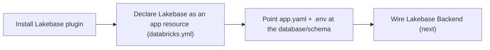
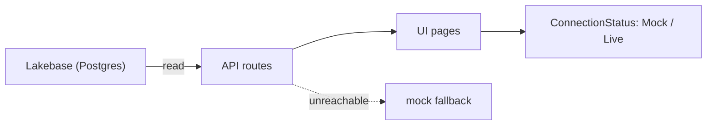
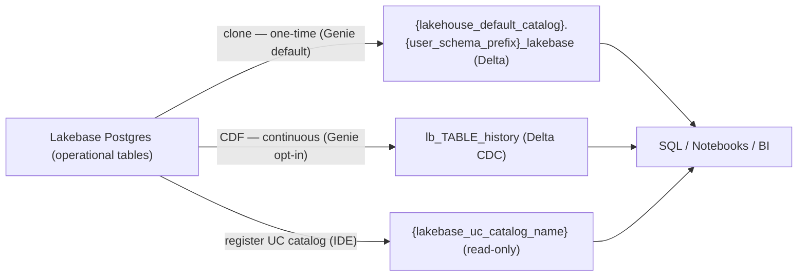

# Chapter 2 — Lakebase (OLTP)

Provision Lakebase Postgres, wire the app UI to it, and sync operational data back into the Lakehouse.

> Auto-generated from `02_seed_section_input_prompts.sql`. Each section below corresponds to one `section_tag` in the workshop builder's `section_input_prompts` table.

## Sections in this category

| Step (order) | Section | `section_tag` | Forks |
|---|---|---|---|
| 6 | [Setup Lakebase](#setup-lakebase) | `setup_lakebase` | genie-code |
| 7 | [Wire AppKit App to Lakebase](#wire-appkit-app-to-lakebase) | `wire_ui_lakebase` | genie-code |
| 9 | [Register Lakebase in Unity Catalog](#register-lakebase-in-unity-catalog) | `sync_from_lakebase` | genie-code |

---

## Setup Lakebase

| Field | Value |
|-------|-------|
| `input_id` | `16` |
| `section_tag` | `setup_lakebase` |
| `order_number` | `6` |
| `coding_assistant` | `__default__` |
| `bypass_llm` | `true` |

_Install Lakebase package, declare bundle resources in databricks.yml, configure valueFrom: postgres (config-only, no server.ts changes)_

**Input Template** (the prompt the section feeds to the LLM / pastes verbatim):

````
## Your Task

Install the Lakebase (PostgreSQL) package and configure bundle resources so the platform auto-provisions Lakebase on deploy. This is a **config-only** step — install the npm package and configure YAML files. Do NOT modify `server.ts` — plugin registration and database code happen in the **Wire Lakebase Backend** step.

**First:** Read `$APP_ROOT/.vibecoding-state.md` if it exists — it contains resolved issues and variable values from prior phases.

**Workspace:** `{workspace_url}`

**Working directory:** Run all commands from the **repo root**. The scaffolded AppKit app lives in its own top-level directory `$APP_ROOT/` (= `<app_name>/` at the repo root, a sibling of `apps_lakebase/` — NOT nested inside it).

> **MANDATORY:** Read `.vibecoding-state.md` first to get the `PROFILE` value from prior phases. Use `--profile $PROFILE` on every `databricks` CLI command in this step. If the returned email doesn't match the prior phase, stop and verify the profile.

---

### Step 1: Set Variables

```bash
PROFILE="{databricks_cli_profile}"  # From Session Settings → Profile (default DEFAULT)
USER_JSON=$(databricks current-user me --profile $PROFILE --output json)
EMAIL=$(echo "$USER_JSON" | jq -r '.userName')
FIRSTNAME=$(echo "$EMAIL" | cut -d'@' -f1 | cut -d'.' -f1)
LASTINITIAL=$(echo "$EMAIL" | cut -d'@' -f1 | cut -d'.' -f2 | cut -c1)
APP_PREFIX="${FIRSTNAME}-${LASTINITIAL}"
APP_NAME="${APP_PREFIX}-{use_case_slug}"
APP_ROOT="$APP_NAME"   # top-level app dir at the repo root (parity with {user_schema_prefix}_<use_case_slug>_dab)
DB_SCHEMA=$(echo "$APP_NAME" | tr '-' '_')
echo "PROFILE=$PROFILE  APP_NAME=$APP_NAME  APP_ROOT=$APP_ROOT  DB_SCHEMA=$DB_SCHEMA"
```

---

### Step 2: Install the Lakebase Package

```bash
cd $APP_ROOT
npm install @databricks/lakebase
```

---

### Step 3: Add Bundle Resources to `databricks.yml`

> **MANDATORY: Before proceeding, read `@apps_lakebase/skills/04-appkit-plugin-add/references/plugin-lakebase.md` section "3. Declare Bundle Resources".** It contains critical Terraform state warnings. Key rule: **never remove `postgres_projects` from `databricks.yml` after the first deploy.**

Lakebase Autoscaling uses a **two-phase** deploy process because the database ID is auto-generated and cannot be known until the project exists:

- **Phase 1 (this step):** Declare `postgres_projects` only. The first deploy creates the project. Lakebase automatically creates a default `production` branch and `primary` endpoint.
- **Phase 2 (Deploy and E2E Test step):** After the project exists, discover the database ID and add the `app.resources.postgres` binding so `valueFrom: postgres` resolves.

> **The first deploy WILL show the app in CRASHED state.** This is expected — `valueFrom: postgres` cannot resolve until `app.resources.postgres` is configured in Phase 2. Proceed to database ID discovery; the second deploy will succeed.

> **Do NOT declare `postgres_branches` or `postgres_endpoints`** in `databricks.yml`. Lakebase Autoscaling auto-creates these with the project. Declaring them causes Terraform errors: `branch already exists` / `read_write endpoint already exists`.

**Pre-check — does the project already exist?**

> **Client note:** IDE runs these in a terminal; Genie Code runs the `databricks …` commands via `runDatabricksCli` (pre-authenticated). See `genie-code-environment`.

```bash
databricks postgres get-project projects/$APP_NAME --profile $PROFILE --output json 2>&1
```

If this succeeds (project exists from a prior run), skip the `postgres_projects` declaration and note "Project already exists" in `.vibecoding-state.md`. If it fails with "not found", proceed normally.

Add the following to `databricks.yml`:

```yaml
resources:
  postgres_projects:
    my_db:
      project_id: <APP_NAME>
      display_name: '<APP_NAME>'
      pg_version: 17
      default_endpoint_settings:
        autoscaling_limit_min_cu: 0.5
        autoscaling_limit_max_cu: 2.0
        suspend_timeout_duration: "300s"
```

Replace `<APP_NAME>` with the actual `$APP_NAME` value. If `databricks.yml` already has a `resources:` section, merge the `postgres_projects` resource into it.

> **Keep `postgres_projects` during Phase 2.** After Phase 1 creates the project, Terraform state tracks the resource. The Phase 2 redeploy is idempotent. Do NOT remove `postgres_projects` between Phase 1 and Phase 2.
>
> **Re-running the workshop?** If the project exists from a **prior run or manual CLI creation** (current bundle has no Terraform state for it), either delete the project first (`databricks postgres delete-project projects/$APP_NAME --profile $PROFILE`) and proceed normally, or remove `postgres_projects` from `databricks.yml` and skip to Phase 2. If `databricks bundle deploy` fails with `"project already exists"`, this is the case — use one of these two options.

---

### Step 4: Configure `app.yaml` Environment Variables

Add to the `env:` section of `app.yaml`:

```yaml
  - name: LAKEBASE_ENDPOINT
    valueFrom: postgres
  - name: DB_SCHEMA
    value: '<value of $DB_SCHEMA from Step 1>'
```

The platform auto-injects `PGHOST`, `PGPORT`, `PGDATABASE`, `PGSSLMODE`, `PGUSER` from the bundle resource binding. Do NOT set these manually.

---

### Step 5: Configure `.env` for Local Development

Add to `.env` in the app root:

```env
DB_SCHEMA=<value of $DB_SCHEMA from Step 1>
```

Local development uses mock fallback data before the first deploy.

---

### Step 6: Verify Package Installation

```bash
cd $APP_ROOT
npm ls @databricks/lakebase
```

Must show `@databricks/lakebase` in the dependency tree.

---

### Step 7: Validate Configuration

```bash
cd $APP_ROOT
databricks apps validate --profile $PROFILE
```

Must pass with no errors. Common issues: YAML indentation errors (use 2-space indent), missing `resources:` key. A warning about `valueFrom: postgres` not resolving is expected until Phase 2.

---

### Checklist

- [ ] `@databricks/lakebase` installed in `package.json`
- [ ] `server/server.ts` is **unchanged** (plugin registration happens in the Wire Lakebase Backend step)
- [ ] `DB_SCHEMA` derived from `$APP_NAME` (hyphens to underscores)
- [ ] `databricks.yml` has `postgres_projects` resource (no `postgres_branches` or `postgres_endpoints` — auto-created)
- [ ] `app.yaml` has `LAKEBASE_ENDPOINT` with `valueFrom: postgres` and `DB_SCHEMA` as static value
- [ ] `databricks apps validate` passes (warning about `valueFrom: postgres` is expected)
- [ ] `.vibecoding-state.md` updated (see below)

**Before finishing**, append to `$APP_ROOT/.vibecoding-state.md` with:
- Step name (`## Setup Lakebase`)
- Key variable values (`DB_SCHEMA`, bundle resource project_id, `PROFILE`)
- Any resolved issues or workarounds encountered during this phase
- **Critical Notes for Next Phase:**
  - DO NOT remove `postgres_projects` from `databricks.yml` after Phase 1 deploy — Terraform state tracks it
  - Phase 2 redeploy is idempotent; Terraform sees no diff and skips the resource
````

**System Prompt:**

```
You are a full-stack developer adding the Lakebase (PostgreSQL) package to an existing AppKit application and configuring bundle resources for deployment. This is a **config-only** step — install the npm package and configure YAML files, but do NOT modify `server.ts`. Plugin registration happens in the **Wire Lakebase Backend** step.

Key requirements:

- Install `@databricks/lakebase` npm package (do NOT register the plugin in `server.ts` yet)
- Declare `postgres_projects` resource in `databricks.yml` (do NOT declare `postgres_branches` or `postgres_endpoints` — Lakebase auto-creates these)
- Configure `app.yaml` with `valueFrom: postgres` for `LAKEBASE_ENDPOINT` and a static `DB_SCHEMA`
- Derive `DB_SCHEMA` from `$APP_NAME` (hyphens to underscores) for user-scoped database isolation
- Do NOT deploy in this step — deployment happens in the **Deploy and E2E Test** step
- Do NOT create a Lakebase project via CLI — the bundle creates it automatically on first deploy
- Do NOT add `lakebase()` to `server.ts` — that happens in the **Wire Lakebase Backend** step

This prompt is returned as-is for direct use in Cursor/Copilot. No LLM processing.
```

<details><summary><strong>How to Apply</strong> (user-facing guidance)</summary>

## 1️⃣ How To Apply

Copy the prompt above, replace the placeholders, start a **new Agent chat** in your coding assistant, and paste it.

### Prerequisite

Ensure you have:
- ✅ A scaffolded AppKit app (from **Design & Build UI**)
- ✅ Replaced `{workspace_url}` and `{use_case_slug}` in the prompt with your values

### Steps to Apply

**Step 1:** Start a new Agent thread in your coding assistant
**Step 2:** Copy the prompt and paste it into your coding assistant
**Step 3:** The assistant adds the Lakebase plugin + bundle resource and wires the config
**Step 4:** Confirm the package is installed and `app.yaml` references the Lakebase resource, then stop — no database code yet

---

## 2️⃣ What Are We Building?

The **plumbing** that will let the app talk to Lakebase — not the database code itself. This step adds the AppKit **Lakebase plugin**, declares Lakebase as an app **resource**, and points the config at the right Postgres database and schema. The actual queries arrive in **Wire Lakebase Backend**.



Nothing connects yet. Declaring Lakebase as a **resource** is what lets the platform bind a real database and inject credentials at deploy time — so the app never hard-codes a connection string.

---

## 3️⃣ Why Are We Building It This Way? (Databricks Best Practices)

| Principle | Why it matters |
|-----------|----------------|
| **Lakebase is the app's operational store** | A managed, serverless Postgres built for fast app reads — the OLTP companion to the analytical lakehouse |
| **Declare resources, don't hard-code** | Lakebase is a declared app resource, so the platform provisions it and injects credentials — no secrets in code |
| **Config now, code later** | Separating setup from wiring keeps each step small and easy to review |
| **The plugin owns the connection** | AppKit's Lakebase plugin manages pooling and OAuth token refresh, so app code just runs queries |

---

## 4️⃣ What Happens Behind the Scenes?

1. **The Lakebase plugin package is installed** into the AppKit project.
2. **Lakebase is declared as a resource** in the bundle config so it can be bound at deploy.
3. **The app config is pointed** at the target database and schema via `app.yaml` and `.env`.
4. **The plugin stays unregistered** — registering it and writing queries happens in the next step, and the Lakebase project itself is created on first deploy.

</details>

<details><summary><strong>Expected Output</strong></summary>

## Expected Output

**Package verification:**

```
$ cd $APP_ROOT && npm ls @databricks/lakebase
└── @databricks/lakebase@x.x.x
```

**`app.yaml` env section after this step:**

```yaml
env:
  # ... existing env vars ...
  - name: LAKEBASE_ENDPOINT
    valueFrom: postgres
  - name: DB_SCHEMA
    value: '{user_schema_prefix}_booking_app'
```

</details>

#### Fork — `coding_assistant = genie-code`  (input_id 922)

> Fork rows override only `input_template`, `system_prompt`, and `bypass_llm`. All display fields are inherited from the default row above.

| Field | Value |
|-------|-------|
| `input_id` | `922` |
| `section_tag` | `setup_lakebase` |
| `order_number` | `(inherited)` |
| `coding_assistant` | `genie-code` |
| `bypass_llm` | `true` |

**Input Template** (the prompt the section feeds to the LLM / pastes verbatim):

````
Add Lakebase (Postgres) to your AppKit app and provision it, so the next deploy boots straight to a live database. Today the app has no database; after this step the `@databricks/lakebase` package, the `app.yaml` `valueFrom: postgres` wiring, and a bound, `ACTIVE` Lakebase project are all in place — ready for the wiring step to register the plugin.

This will involve the following steps:

- **Resolve your environment** — load the workshop state and the app's saved values (`APP_NAME`, `<APP_ROOT>`, `DB_SCHEMA`).
- **Add the package** — edit `package.json` to add `@databricks/lakebase` (no local install; the build runs server-side at deploy).
- **Configure `app.yaml`** — set `LAKEBASE_ENDPOINT` to `valueFrom: postgres` plus a static `DB_SCHEMA`.
- **Provision over REST** — create the Lakebase project and poll until it reports `ACTIVE`.
- **Bind before deploy** — attach the `postgres` resource to the app so the later deploy boots straight to `RUNNING` (no CRASHED hop).
- **Validate locally** — structurally check `app.yaml` + `package.json` (no `databricks apps validate`).

The steps below are the prescriptive runbook for those actions; follow them in order.

**Genie Code — this is a prescriptive runbook for Lakebase setup (config + provision). Follow the steps in order. Do NOT improvise paths, do NOT use bare relative paths, do NOT use `@`-mentions, and do NOT deploy in this step. This step adds the Lakebase package to `package.json`, configures `app.yaml` for `valueFrom: postgres`, PROVISIONS the Lakebase project over REST, and BINDS it to the app — so the plugin-bearing deploy in the wiring/deploy steps boots straight to RUNNING. The app is anchored to `<APP_ROOT>`; every skill is named by its full `skill_ref_root`-prefixed path.**

### 🔴 Non-negotiable execution rules (read before anything)

❌ **NEVER** run `npm install` / `npm run dev` locally or open `http://localhost:8000` — Genie Code is serverless with **no local Node toolchain** (`genie-code-environment` "AppKit/Node reality"). Add the Lakebase dependency by **editing `<APP_ROOT>/package.json` directly**; the Apps runtime runs the install + Vite build **server-side** at deploy time. [TESTED P34]

🛑 **NEVER delete or regenerate `<APP_ROOT>/package-lock.json`.** A missing lockfile hard-fails the SDK SNAPSHOT source-export in ~10s (`RESOURCE_DOES_NOT_EXIST`) before the server-side install ever runs. Add the dependency to `package.json` and leave the lockfile in place — the server-side install reconciles the new dependency. [TESTED P29/P34]

❌ **Do NOT add `postgres_projects` (or `postgres_branches` / `postgres_endpoints`) to `databricks.yml`.** On Genie Code the reliable deploy is the SDK SNAPSHOT path, which does **not** apply `databricks.yml` resources — a declared `postgres_projects` is inert and the project never materializes. Provision over REST in Step 5 instead. [TESTED P35]

❌ **Do NOT run `databricks apps validate`** — it is blocked / page-dependent on Genie Code. Use the local YAML structural check in Step 6 instead. [TESTED P36]

✅ The CLI you run here is **read-only** identity (`databricks current-user me`) via `runDatabricksCli`; everything that mutates state (project create, app bind) goes through `runDatabricksCli` postgres verbs or the SDK / REST via `executeCode`. You are pre-authenticated — do **NOT** run `databricks auth login`.

### Step 0 — Resolve your environment (once, before anything else)

Run `skills/vibecoding-state` operation `enter` with `prompt_id: "setup_lakebase"`. Read the resolved `## Environment Capabilities` values and use them literally:

- `client_context` = `genie_code`
- `artifact_root` = your workshop project root (e.g. `/Workspace/Users/<your-email>/vibe-coding-workshop`) — where all generated bundles/apps/docs build; the repo itself is cloned at `/Workspace/Users/<your-email>/.assistant/skills/vibe-coding-workshop` (skills load from there via `skill_ref_root`, NOT from `artifact_root`)
- `skill_ref_root` = `skills/vibe-coding-workshop` (substitute your clone folder if different)
- `app_root` = `<artifact_root>/<app_name>` — the self-contained AppKit app project authored in the build step (a TOP-LEVEL sibling of any `{user_schema_prefix}_<use_case_slug>_dab` bundle, NOT under `apps_lakebase/`). Referred to below as `<APP_ROOT>`; `<APP_ROOT>/.vibecoding-state.md`, `app.yaml`, `databricks.yml`, `server/`, and `client/` all live here.

**First:** read `<APP_ROOT>/.vibecoding-state.md` (full `<artifact_root>`-anchored path — NOT a bare `@…` mention) for `APP_NAME`, workspace, and any `DB_SCHEMA` / resolved issues captured by earlier steps.

### Step 1 — Confirm `APP_NAME`, `<APP_ROOT>`, and derive `DB_SCHEMA`

You are pre-authenticated — do **NOT** run `databricks auth login`. Re-derive identity read-only and re-confirm the app name (max 26 chars, lowercase/numbers/hyphens):

```bash
databricks current-user me --output json
```

- `APP_NAME` = `<FIRSTNAME>-<LASTINITIAL>-{use_case_slug}` (truncate to 26, strip trailing `-`) — must match the build/deploy steps.
- `<APP_ROOT>` = `<artifact_root>/<APP_NAME>`.
- `DB_SCHEMA` = `APP_NAME` with hyphens → underscores (user-scoped isolation).

> Workspace target: `{workspace_url}`. The session profile placeholder `{databricks_cli_profile}` is **inert on Genie Code** — runDatabricksCli/SDK are pre-authenticated, so omit `--profile`; do NOT run the IDE's `databricks auth login` profile-creation fallback.
>
> **Host of record is the runtime, not the template.** Derive the workspace from `w.config.host` (or `databricks current-user me`); if `databricks.yml`'s `host:` and `{workspace_url}` disagree, trust the runtime host.

### Step 2 — Load the Lakebase skill by its FULL `skill_ref_root`-prefixed path

Load with `readSkillFile` — NEVER a bare `@…` mention, NEVER a repo-relative path. The root-level `skills/` come FIRST as the highest-priority guardrails:

1. `readSkillFile("skills/vibe-coding-workshop/apps_lakebase/skills/05-appkit-lakebase-wiring/SKILL.md")` — Lakebase config + wiring patterns. Its `databricks.yml` `postgres_projects` / `npm run build` / `databricks apps validate` mechanics are the IDE path; on Genie Code substitute the REST provisioning + bind below.
2. `readSkillFile("skills/vibe-coding-workshop/apps_lakebase/skills/04-appkit-plugin-add/references/plugin-lakebase.md")` — the Lakebase plugin reference (resource shape, env injection).

Load every further mandatory reference the skill names the same way (repo-relative path prefixed with `skill_ref_root`). `AGENTS.md` root context does not carry across Genie Code threads — always prefix with `skill_ref_root`.

### Step 3 — Add the Lakebase dependency to `package.json` (no local install)

Edit `<APP_ROOT>/package.json` with `executeCode` and add `@databricks/lakebase` to `dependencies` (match the `@databricks/appkit` version line already present). Do **NOT** run `npm install` and do **NOT** touch `package-lock.json` — the server-side install at deploy reconciles the new dependency. [TESTED P34]

### Step 4 — Configure `app.yaml` for `valueFrom: postgres`

Add to the `env:` block of `<APP_ROOT>/app.yaml` (write via `executeCode`, preserve existing entries):

```yaml
  - name: LAKEBASE_ENDPOINT
    valueFrom: postgres
  - name: DB_SCHEMA
    value: '<value of $DB_SCHEMA from Step 1>'
```

The platform injects `PGHOST`, `PGPORT`, `PGDATABASE`, `PGSSLMODE`, `PGUSER` once the `postgres` resource is bound (Step 5). Do NOT set those manually.

### Step 5 — Provision the Lakebase project over REST and bind it to the app

Run via `executeCode` against warm compute (warm up once with `print("ready")` to absorb the serverless cold start). State-mutating calls go through the SDK / REST, with `runDatabricksCli` postgres verbs as an equivalent:

1. **Pre-check:** `runDatabricksCli databricks postgres get-project projects/<APP_NAME> --output json` (or `w.api_client.do("GET", f"/api/2.0/postgres/projects/{APP_NAME}")`). If it already exists from a prior run, reuse it — skip the create.
2. **Create (REST / postgres verb — NOT the Terraform path):** `runDatabricksCli databricks postgres create-project` for `projects/<APP_NAME>`, or `w.api_client.do("POST", "/api/2.0/postgres/projects?project_id=<APP_NAME>")`. Lakebase auto-creates the default branch + endpoint. If the postgres verb is blocked on the current page, fall through to the REST call — *blocked ≠ impossible*. [TESTED P35]
3. **Poll** the project/endpoint until its state is `ACTIVE` before binding.
4. **Bind the resource BEFORE any plugin-bearing deploy** — `w.apps.update(APP_NAME, ...)` / `PATCH /api/2.0/apps/{APP_NAME}` setting `resources: [{ name: "postgres", postgres: { branch: "<default-branch>", database: "<…/databases/databricks-postgres>", permission: "CAN_CONNECT_AND_CREATE" } }]`. The database path is the deterministic `…/branches/<default-branch>/databases/databricks-postgres` read back from the project in step 1/2.

> **Why bind now (no CRASHED hop).** An app carrying `valueFrom: postgres` that is deployed **unbound** boots `CRASHED` (the env var can't resolve); binding the `postgres` resource **before** the first plugin-bearing deploy makes it boot straight to `RUNNING` with no CRASHED hop and no fix-up redeploy. [TESTED P37b/P37d] This step does NOT deploy — it leaves the app bound and ready for the wiring + deploy steps. The IDE-path "first deploy WILL show CRASHED" note does **not** apply on Genie Code.

### Step 6 — Validate configuration locally (no `apps validate`)

`databricks apps validate` is blocked on Genie Code [TESTED P36]. Do a local structural check with `executeCode` instead — parse both YAMLs and assert the keys:

```python
import yaml, json, pathlib
ay = yaml.safe_load(pathlib.Path("<APP_ROOT>/app.yaml").read_text())
env = {e["name"]: e for e in ay.get("env", [])}
assert env.get("LAKEBASE_ENDPOINT", {}).get("valueFrom") == "postgres", "LAKEBASE_ENDPOINT must be valueFrom: postgres"
assert "DB_SCHEMA" in env and env["DB_SCHEMA"].get("value"), "DB_SCHEMA must be a static value"
pkg = json.loads(pathlib.Path("<APP_ROOT>/package.json").read_text())
assert "@databricks/lakebase" in pkg.get("dependencies", {}), "@databricks/lakebase missing from dependencies"
print("OK: app.yaml + package.json structurally valid")
```

`server/server.ts` is **unchanged** in this step — the `lakebase()` plugin registration and all database code happen in the **Wire AppKit App to Lakebase** step.

**State-lock:** this prompt runs between an `enter` (Step 0) and an `exit`. After the gate passes, run `skills/vibecoding-state` op `exit` — params: `prompt_id: "setup_lakebase"`, `gate: "Lakebase package + app.yaml configured, project provisioned + bound (REST)"`, `captured: {app_name, app_root, db_schema, postgres_project_id}`. **This `enter`/`exit` pair is a mandatory ritual, not advisory.** Step 0's `enter` MUST locate — or, if this is the first prompt of the track, bootstrap-create — the canonical live state file at `<app_root>/.vibecoding-state.md` (never the temporary `example/…` bootstrap path). The closing `exit` MUST append this prompt's Per-Step Log entry, Gate result, and `captured` vars to that file, then **re-read it and echo the appended section to prove the write landed**. **Gate completion rule:** this prompt is NOT complete until that re-read confirms the appended entry — the chat summary is NOT the state store.

**Gate:** `Lakebase package + app.yaml configured, project provisioned + bound (REST)` — `<APP_ROOT>/package.json` lists `@databricks/lakebase`, `package-lock.json` is intact, `app.yaml` has `LAKEBASE_ENDPOINT` with `valueFrom: postgres` and a static `DB_SCHEMA`, the Lakebase project reports `ACTIVE`, and the app's `postgres` resource is bound (`PATCH`/`update` confirmed). `server.ts` is unchanged; NOTHING was deployed and `databricks apps validate` was NOT run.

**➡️ Next step.** The **Wire AppKit App to Lakebase** step registers `lakebase()` via the `onPluginsReady` pattern and writes the DDL/routes; the deploy step then ships it (already bound → straight to RUNNING).
````

---

## Wire AppKit App to Lakebase

| Field | Value |
|-------|-------|
| `input_id` | `108` |
| `section_tag` | `wire_ui_lakebase` |
| `order_number` | `7` |
| `coding_assistant` | `__default__` |
| `bypass_llm` | `true` |

_Register lakebase() plugin and wire Lakebase backend via 05-appkit-lakebase-wiring skill, validate with npm run build only_

**Input Template** (the prompt the section feeds to the LLM / pastes verbatim):

````
## Your Task

Wire the AppKit web application to a Lakebase database so the UI fetches data from Lakebase PostgreSQL via Express API routes. This step registers the `lakebase()` plugin in `server.ts` (moved here from Setup Lakebase to avoid runtime crashes in local dev) AND writes all database code. Lakebase is the sole data source — there is no SQL warehouse in this flow. Local validation is **`npm run build` only** — `npm run dev` will crash because Lakebase env vars (`LAKEBASE_ENDPOINT`, `PGHOST`) are not set until after the first deploy. Deployment and live data verification happen in the **Deploy and E2E Test** step.

**First:** Read `$APP_ROOT/.vibecoding-state.md` if it exists — it contains resolved issues and variable values from prior phases (including `DB_SCHEMA` from the **Setup Lakebase** step).

**Workspace:** `{workspace_url}`

**Working directory:** Run all commands from the **repo root**. The scaffolded AppKit app lives in its own top-level directory `$APP_ROOT/` (= `<app_name>/` at the repo root, a sibling of `apps_lakebase/` — NOT nested inside it). `$APP_ROOT` is recorded in `.vibecoding-state.md` from the **Scaffold, Build & Test** step; if running standalone, set `APP_ROOT="$APP_NAME"`.

**Prerequisite:** The **Setup Lakebase** step must be complete — the `@databricks/lakebase` package is installed, bundle resources are declared in `databricks.yml`, and `app.yaml` has `valueFrom: postgres`. Note: `server.ts` was NOT modified in that step — this step adds the `lakebase()` plugin registration along with all database code.

---

### Wire UI to Backend

Read `@apps_lakebase/skills/05-appkit-lakebase-wiring/SKILL.md` and follow **Steps 1-3**. Use your PRD to derive the specific tables, API routes, and seed data. Work incrementally: complete each skill step (DDL, routes, frontend) with a build gate between them. Do not design all tables, routes, and page changes in a single planning pass.

The skill covers:

- **Step 1** — Database schema design: PRD-to-schema methodology, PostgreSQL type conventions, idempotent DDL, count-check seed pattern. Also read `@apps_lakebase/skills/05-appkit-lakebase-wiring/references/database-design-guide.md` for normalization rules and data type guidance.
- **Step 2** — API routes: `server.extend()` pattern, `{ data, source }` response contract, mock fallback, health endpoint
- **Step 3** — Frontend wiring: `useLakebaseData` hook, `ConnectionStatus` component, defensive data handling (DECIMAL coercion, DATE coercion, snake_case mapping). **Run `npm run build` after every 2-3 page rewrites** — do not rewrite all pages in a single pass. When removing a static data import, audit whether UI elements that depended on that data (e.g., property images from `PROPERTIES.find()`) are preserved via API or intentionally removed. Read `@apps_lakebase/skills/05-appkit-lakebase-wiring/references/multi-table-example.md` for cross-entity enrichment patterns (LEFT JOIN for lookup pages that need related entity data).

When deployed in the **Deploy and E2E Test** step, the Service Principal will run this code on first boot to create database objects.

---

### Build Gate

Before proceeding, verify the app builds cleanly:

```bash
cd $APP_ROOT
npm run build   # Must pass with zero errors
```

Fix any TypeScript, ESM, or import errors now. Each deploy cycle takes 3-5 minutes — catching errors locally saves significant time.

---

### Local Build Validation

Follow **Step 4** of the `05-appkit-lakebase-wiring` skill. In summary:

1. `npm run build` — must pass with zero errors

> **Do NOT run `npm run dev`.** The `lakebase()` plugin throws `ConfigurationError` when `LAKEBASE_ENDPOINT` and `PGHOST` are not set. These env vars are provisioned by the platform on first deploy. `npm run build` is sufficient — it validates all TypeScript, imports, and bundling without executing the code. Runtime testing happens in the **Deploy and E2E Test** step.

---

### Checklist

- [ ] DDL and seed data are idempotent (skill Step 1)
- [ ] API routes return `{ data, source }` with mock fallback (skill Step 2)
- [ ] `useLakebaseData` hook and `ConnectionStatus` component created (skill Step 3)
- [ ] All static mock data replaced with API calls
- [ ] DECIMAL/DATE coercion and snake_case mapping handled
- [ ] `npm run build` passes (do NOT run `npm run dev` — Lakebase env vars not set yet)
- [ ] "Critical Notes for Next Phase" from prior step's `.vibecoding-state.md` are preserved (especially: do NOT remove `postgres_projects` from `databricks.yml`)
- [ ] `.vibecoding-state.md` updated (see below)

**Before finishing**, append to `$APP_ROOT/.vibecoding-state.md` with:
- Step name (`## Wire Lakebase Backend`)
- Key variable values (`DB_SCHEMA`, API endpoints created)
- Any resolved issues or workarounds encountered during this phase
- Carry forward any "Critical Notes for Next Phase" from the Setup Lakebase step
````

**System Prompt:**

```
You are a full-stack developer wiring a Lakebase PostgreSQL backend into an AppKit web application. Follow the `05-appkit-lakebase-wiring` skill for all reusable patterns (database design, API routes, frontend hooks, testing). Use the PRD to derive application-specific tables, routes, and seed data.

Approach: Start coding after reading the skill. Do not plan the entire implementation in advance — follow the skill steps sequentially and make decisions using the Decision Defaults table in the skill. If a decision is not covered there, pick the simpler option and move on.

Key requirements:

- The `@databricks/lakebase` package is installed and YAML files are configured (from the **Setup Lakebase** step), but `server.ts` has NOT been modified yet
- This step registers `lakebase()` in the plugins array AND writes all database code (DDL, routes, frontend hooks)
- Follow the `05-appkit-lakebase-wiring` skill for DDL patterns, API route architecture, frontend hooks, and testing
- Use `DB_SCHEMA` (from `.vibecoding-state.md` or `.env`) in all DDL, queries, and grants
- Do NOT deploy in this step — deployment happens in the **Deploy and E2E Test** step
- Local validation is `npm run build` only — `npm run dev` will crash because Lakebase env vars are not set until after the first deploy

This prompt is returned as-is for direct use in Cursor/Copilot. No LLM processing.
```

<details><summary><strong>How to Apply</strong> (user-facing guidance)</summary>

## 1️⃣ How To Apply

Copy the prompt above, replace the placeholders, start a **new Agent chat** in your coding assistant, and paste it.

### Prerequisite

Ensure you have:
- ✅ Completed **Setup Lakebase** (the plugin + resource are configured)
- ✅ A deployed mock-data app (from **Deploy to Databricks Apps**)

### Steps to Apply

**Step 1:** Start a new Agent thread in your coding assistant
**Step 2:** Copy the prompt and paste it into your coding assistant
**Step 3:** The assistant registers the Lakebase plugin, designs the schema, and replaces mock data with live API calls
**Step 4:** Confirm `npm run build` succeeds, then stop — live data is verified after the next deploy

---

## 2️⃣ What Are We Building?

The switch from **mock to live**: the app's pages stop using placeholder data and start reading real rows from **Lakebase**, through API routes that gracefully fall back to mock if the database isn't reachable.



A **ConnectionStatus** badge and a `source` field on every response keep the data origin visible. The app validates with `npm run build` only — the live connection is exercised after deploy, once the platform has provisioned the database.

---

## 3️⃣ Why Are We Building It This Way? (Databricks Best Practices)

| Principle | Why it matters |
|-----------|----------------|
| **Live-with-mock-fallback** | A brief Lakebase hiccup returns mock data instead of erroring, so the experience never breaks |
| **Visible data provenance** | ConnectionStatus + a `source` field always tell the user whether they're seeing live or mock data |
| **The plugin manages the connection** | AppKit's `lakebase()` returns a pooled, OAuth-managed connection, so the code just runs queries |
| **Build-validate before deploy** | `npm run build` checks all the code without a live database — runtime verification comes after deploy |

---

## 4️⃣ What Happens Behind the Scenes?

1. **The Lakebase plugin is registered** in the app's plugin array.
2. **The database schema is designed** from the PRD.
3. **API routes are built** that read from Lakebase and fall back to mock on any error.
4. **Static mock data is replaced** with calls to those routes throughout the UI.
5. **The app is build-validated** — live data is confirmed after the next deploy provisions the database.

</details>

<details><summary><strong>Expected Output</strong></summary>

## Expected Output

**Build validation:**

```
$ cd $APP_ROOT && npm run build
... (build output) ...
Build completed successfully.
```

After the **Deploy and E2E Test** step, the ConnectionStatus switches from "Mock Data" to "Live Data" and all endpoints return `"source": "live"`.

> **Why no `npm run dev`?** The `lakebase()` plugin throws `ConfigurationError` at startup when `LAKEBASE_ENDPOINT` and `PGHOST` are not set. These env vars are provisioned by the Databricks Apps platform after the first deploy creates the Lakebase project. `npm run build` validates all code without executing it. Runtime testing with live or mock data happens after deployment.

</details>

#### Fork — `coding_assistant = genie-code`  (input_id 923)

> Fork rows override only `input_template`, `system_prompt`, and `bypass_llm`. All display fields are inherited from the default row above.

| Field | Value |
|-------|-------|
| `input_id` | `923` |
| `section_tag` | `wire_ui_lakebase` |
| `order_number` | `(inherited)` |
| `coding_assistant` | `genie-code` |
| `bypass_llm` | `true` |

**Input Template** (the prompt the section feeds to the LLM / pastes verbatim):

````
Wire the AppKit UI to the Lakebase database you provisioned in setup. Before this step the UI runs on mock data; after it, `server.ts` registers the `lakebase()` plugin (via `onPluginsReady`), the DDL and API routes are authored, and the frontend fetches live data with a mock fallback — ready for the deploy step to build and boot it.

This will involve the following steps:

- **Confirm context** — re-read the app's saved state for `APP_NAME`, `<APP_ROOT>`, and `DB_SCHEMA`, and the postgres-bound precondition from setup.
- **Load the wiring skill** — read the Lakebase wiring skill by its full `skill_ref_root`-prefixed path.
- **Register `lakebase()`** — author DDL, seed, and `{ data, source }` API routes inside the `onPluginsReady` callback (no `autoStart:false` / manual `start()`).
- **Wire the frontend** — swap mock imports for the `useLakebaseData` hook and `ConnectionStatus`.
- **Run the static gate** — scan `server.ts` for the known wiring traps; the build itself is proven server-side at deploy.

The steps below are the prescriptive runbook for those actions; follow them in order.

**Genie Code — this is a prescriptive runbook for wiring the AppKit UI to Lakebase. Follow the steps in order. Do NOT improvise paths, do NOT use bare relative paths, do NOT use `@`-mentions. This step registers the `lakebase()` plugin in `server.ts` (via the `onPluginsReady` pattern) and authors all database code — DDL, API routes, and frontend hooks. There is no local Node toolchain: the build is proven server-side by the **Deploy** step, not by a local `npm run build`. The app is anchored to `<APP_ROOT>`; every skill is named by its full `skill_ref_root`-prefixed path.**

### 🔴 Non-negotiable execution rules (read before anything)

❌ **NEVER** run `npm run build` / `npm run dev` locally or open `http://localhost:8000` — Genie Code is serverless with **no local Node toolchain** (`genie-code-environment` "AppKit/Node reality"). The IDE's `npm run build` validation has **no Genie equivalent**; build correctness is proven server-side by the **Deploy** step's SNAPSHOT build, where any error is read from `databricks apps logs <APP_NAME>` / `<app-url>/logz` (not from compute). Author the files here; the deploy step compiles them.

🔑 **Canonical plugin import — import `lakebase` from `@databricks/appkit`, NOT from `@databricks/lakebase`.** `@databricks/lakebase` (added to `package.json` in step 06) is the underlying driver; the **plugin factory** is re-exported by the framework: `import { createApp, server, lakebase } from "@databricks/appkit";`. Importing the plugin from `@databricks/lakebase` is a self-inflicted build failure. [TESTED P37]

🔑 **Register routes via `onPluginsReady` — do NOT use `autoStart: false` / `AppKit.server.start()`.** The `server()` plugin owns the HTTP listener; manually starting it double-`listen()`s and the app crashes on boot (`EADDRINUSE`). Put DDL + seed + `appkit.server.extend(...)` route registration inside the `onPluginsReady(appkit)` callback on `createApp`. [TESTED P37c/P37d]

✅ The CLI you run here is **read-only** identity via `runDatabricksCli`. You are pre-authenticated — do **NOT** run `databricks auth login`. File writes go through `executeCode` against warm compute.

### Step 0 — Resolve your environment (once, before anything else)

Run `skills/vibecoding-state` operation `enter` with `prompt_id: "wire_ui_lakebase"`. Read the resolved `## Environment Capabilities` values and use them literally:

- `client_context` = `genie_code`
- `artifact_root` = your workshop project root (e.g. `/Workspace/Users/<your-email>/vibe-coding-workshop`) — where all generated bundles/apps/docs build; the repo itself is cloned at `/Workspace/Users/<your-email>/.assistant/skills/vibe-coding-workshop` (skills load from there via `skill_ref_root`, NOT from `artifact_root`)
- `skill_ref_root` = `skills/vibe-coding-workshop` (substitute your clone folder if different)
- `app_root` = `<artifact_root>/<app_name>` — the self-contained AppKit app project (a TOP-LEVEL sibling of any `<use_case_slug>_dab` bundle, NOT under `apps_lakebase/`). Referred to below as `<APP_ROOT>`; `<APP_ROOT>/.vibecoding-state.md`, `app.yaml`, `databricks.yml`, `server/`, and `client/` all live here.

**First:** read `<APP_ROOT>/.vibecoding-state.md` (full `<artifact_root>`-anchored path — NOT a bare `@…` mention) for `APP_NAME`, `DB_SCHEMA`, and the resolved issues captured by the **Setup Lakebase** step.

**Precondition (from step 06):** `@databricks/lakebase` is in `package.json`, `app.yaml` has `LAKEBASE_ENDPOINT: valueFrom: postgres` + a static `DB_SCHEMA`, the Lakebase project is `ACTIVE`, and the app's `postgres` resource is **already bound**. With the binding in place, the deploy at the next step boots straight to `RUNNING` — no CRASHED hop. If the binding is missing, return to step 06 before wiring.

### Step 1 — Confirm `APP_NAME`, `<APP_ROOT>`, and `DB_SCHEMA`

You are pre-authenticated — do **NOT** run `databricks auth login`:

```bash
databricks current-user me --output json
```

- `APP_NAME` = `<FIRSTNAME>-<LASTINITIAL>-<use_case_slug>` (must match earlier steps); `<APP_ROOT>` = `<artifact_root>/<APP_NAME>`.
- `DB_SCHEMA` = the value recorded by step 06 (read it from `<APP_ROOT>/.vibecoding-state.md`).

> Workspace target: `{workspace_url}`. The session profile placeholder `{databricks_cli_profile}` is **inert on Genie Code** — runDatabricksCli/SDK are pre-authenticated, so omit `--profile`.

### Step 2 — Load the wiring skill by its FULL `skill_ref_root`-prefixed path

Load with `readSkillFile` — NEVER a bare `@…` mention, NEVER a repo-relative path. The root-level `skills/` come FIRST as the highest-priority guardrails:

1. `readSkillFile("skills/vibe-coding-workshop/apps_lakebase/skills/05-appkit-lakebase-wiring/SKILL.md")` — Steps 1-3: database schema design, idempotent DDL, count-check seed, the `{ data, source }` route contract with mock fallback, and the `useLakebaseData` / `ConnectionStatus` frontend hooks.
2. When the skill names further references (e.g. its `references/database-design-guide.md`, `references/multi-table-example.md`), load EACH the same way — take its repo-relative path and prefix it with `skill_ref_root`.

The skill's `npm run build` gates and `databricks apps validate` are the IDE path; on Genie Code substitute the deploy-time server-side build described in Step 5. Apply the skill's `onPluginsReady` Server Setup Pattern (Step 2a) verbatim — that is the supported wiring shape.

### Step 3 — Register `lakebase()` and author DDL + routes via `onPluginsReady`

Replace `<APP_ROOT>/server/server.ts` so the plugin is registered and routes are attached inside `onPluginsReady` (the window after plugins init but before the listener binds):

```typescript
import { createApp, server, lakebase } from "@databricks/appkit";

const DB_SCHEMA = process.env.DB_SCHEMA || "app";

await createApp({
  plugins: [server(), lakebase()],
  async onPluginsReady(appkit) {
    // 1. Idempotent DDL (CREATE SCHEMA / TABLE / INDEX IF NOT EXISTS) — skill Step 1
    // 2. Count-check seed — skill Step 1e
    appkit.server.extend((app) => {
      // 3. Routes returning { data, source } with mock fallback — skill Step 2
    });
  },
});
```

Derive the tables, routes, and seed data from your PRD. Do NOT pass `autoStart: false` and do NOT call `appkit.server.start()` — `server()` owns the listener.

### Step 4 — Wire the frontend

Follow skill Step 3: `useLakebaseData` hook, `ConnectionStatus` component, DECIMAL/DATE coercion, snake_case → camelCase mapping. Replace static mock-data imports with API calls. When you remove a static data import, audit whether UI elements that depended on it (e.g. images from a `.find()`) are preserved via the API or intentionally dropped. Write files via `executeCode` `open(path,"w").write(...)`; prefer Python triple-quoted raw strings and write literal `'`/`"` characters (never `\uXXXX` escapes).

### Step 5 — Static gate (the only local check) + deploy-time build

There is **no local `tsc`/`npm`** on Genie Code, so the build is validated server-side by the **Deploy** step's SNAPSHOT build; surface any error via `databricks apps logs <APP_NAME>` / `<app-url>/logz`. Before handing off, run the wiring-specific static scan with `executeCode` (read the file in Python + regex — do NOT depend on the IDE's shell `grep`):

```python
import re, pathlib
t = pathlib.Path("<APP_ROOT>/server/server.ts").read_text()
bad = []
# (F) wrong plugin import: the lakebase PLUGIN comes from @databricks/appkit, not the driver pkg
if re.search(r'import\s*\{[^}]*\blakebase\b[^}]*\}\s*from\s*["\']@databricks/lakebase["\']', t):
    bad.append("lakebase plugin imported from '@databricks/lakebase' -> import from '@databricks/appkit'")
# (E) stale server-wiring shape: autoStart:false / manual start() double-listens -> boot crash
if re.search(r'autoStart\s*:\s*false', t):
    bad.append("server({ autoStart: false }) -> register routes in onPluginsReady, no manual start()")
if re.search(r'\.server\.start\s*\(', t):
    bad.append("manual AppKit.server.start() -> remove; server() owns the listener")
if "onPluginsReady" not in t:
    bad.append("routes/DDL not inside onPluginsReady(appkit) -> extend() will register too late")
print("BLOCKING:\n" + ("\n".join(bad) or "OK"))
```

Fix every **BLOCKING** hit before declaring this step complete. `BLOCKING: OK` hands off to the **Deploy** step, which runs the server-side build and (with the `postgres` resource already bound) boots the app to `RUNNING`; the Service Principal runs the DDL on first boot to create the database objects.

**State-lock:** this prompt runs between an `enter` (Step 0) and an `exit`. After the gate passes, run `skills/vibecoding-state` op `exit` — params: `prompt_id: "wire_ui_lakebase"`, `gate: "Lakebase wired (onPluginsReady) + static gate clean; build deferred to deploy"`, `captured: {app_name, app_root, db_schema, api_endpoints}`. **This `enter`/`exit` pair is a mandatory ritual, not advisory.** Step 0's `enter` MUST locate — or, if this is the first prompt of the track, bootstrap-create — the canonical live state file at `<app_root>/.vibecoding-state.md` (never the temporary `example/…` bootstrap path). The closing `exit` MUST append this prompt's Per-Step Log entry, Gate result, and `captured` vars to that file, then **re-read it and echo the appended section to prove the write landed**. **Gate completion rule:** this prompt is NOT complete until that re-read confirms the appended entry — the chat summary is NOT the state store.

**Gate:** `Lakebase wired (onPluginsReady) + static gate clean; build deferred to deploy` — `<APP_ROOT>/server/server.ts` registers `lakebase()` from `@databricks/appkit` with DDL + seed + `appkit.server.extend(...)` routes inside `onPluginsReady` (no `autoStart: false`, no manual `start()`), the frontend fetches via `useLakebaseData` with mock fallback, and the wiring static scan prints `BLOCKING: OK`. NO local `npm run build`/`npm run dev` was attempted; the server-side build runs at the **Deploy** step.

**➡️ Next step.** The **Deploy** step ships `<APP_ROOT>` via the SDK SNAPSHOT path (build runs server-side). Because the `postgres` resource was bound in step 06, the app boots straight to `RUNNING` and the endpoints flip from `"source": "mock"` to `"source": "live"`.
````

---

## Register Lakebase in Unity Catalog

| Field | Value |
|-------|-------|
| `input_id` | `112` |
| `section_tag` | `sync_from_lakebase` |
| `order_number` | `9` |
| `coding_assistant` | `__default__` |
| `bypass_llm` | `true` |

_Register Lakebase as a read-only Unity Catalog database catalog_

**Input Template** (the prompt the section feeds to the LLM / pastes verbatim):

````
Copy and paste this prompt to the AI:

```
## Task: Register Lakebase as a Read-Only Unity Catalog Database Catalog

Register the Lakebase PostgreSQL database as a Unity Catalog database catalog so that all tables are automatically accessible via SQL, notebooks, and ETL pipelines with zero ETL.

### Configuration
- **Catalog name:** {lakebase_uc_catalog_name}
- **Lakebase instance:** {user_app_name}
- **Database name:** databricks_postgres (standard Lakebase database)
- **SQL Warehouse:** {default_warehouse}

### Step 1: Check if Catalog Already Exists

Run the following CLI command to check whether the catalog has already been registered:

> **Client note:** IDE runs these in a terminal; Genie Code runs the `databricks …` commands via `runDatabricksCli` (pre-authenticated). See `genie-code-environment`.

```bash
databricks catalogs get {lakebase_uc_catalog_name}
```

- If the command returns catalog info with **state: ACTIVE**, the catalog is already registered. Print a confirmation message: "Catalog '{lakebase_uc_catalog_name}' already exists and is ACTIVE. Skipping creation."
- If the command returns an error (e.g., "CATALOG_DOES_NOT_EXIST" or "not found"), proceed to Step 2.

### Step 2: Create the Database Catalog (only if it does not exist)

Register the Lakebase PostgreSQL database as a read-only Unity Catalog catalog:

```bash
databricks database create-database-catalog {lakebase_uc_catalog_name} {user_app_name} databricks_postgres
```

After creation, verify the catalog state:

```bash
databricks catalogs get {lakebase_uc_catalog_name}
```

Confirm the output shows **state: ACTIVE**. If the state is not ACTIVE, wait a few seconds and check again.

### Step 3: List All Schemas in the Catalog

Whether the catalog was just created or already existed, always run this final verification step to display all available schemas:

```sql
SELECT schema_name 
FROM {lakebase_uc_catalog_name}.information_schema.schemata 
ORDER BY schema_name;
```

Run this SQL query using the SQL Warehouse **{default_warehouse}**. Display the results to confirm which schemas are available in the registered catalog.

### Expected Result:
- Catalog `{lakebase_uc_catalog_name}` is registered and ACTIVE in Unity Catalog
- All schemas from the Lakebase PostgreSQL database are listed and visible
- Tables within those schemas are now queryable via standard SQL (e.g., `SELECT * FROM {lakebase_uc_catalog_name}.<schema>.<table>`)
```
````

<details><summary><strong>How to Apply</strong> (user-facing guidance)</summary>

## 1️⃣ How To Apply

Copy the prompt above, start a **new Agent chat** in your coding assistant, and paste it.

### Prerequisite

Ensure you have:
- ✅ A running Lakebase instance with operational tables (created earlier in the workshop)
- ✅ An existing user-scoped catalog/schema in `{lakehouse_default_catalog}` (no new catalog is created on the Genie track)
- ✅ Access to a SQL Warehouse for verification queries

### Steps to Apply

**Step 1:** Start a new Agent thread in your coding assistant
**Step 2:** Copy the prompt and paste it into your coding assistant
**Step 3:** The assistant checks whether the Lakebase data is already reachable from the lakehouse
**Step 4:** It lands the data so it's queryable, then **verifies** (row counts / streaming status)
**Step 5:** It lists what is now available and stops

> **Client note — same goal (make Lakebase data queryable in the lakehouse), different mechanism:**
> - **IDE (Cursor/Copilot):** registers Lakebase as a **read-only Unity Catalog database catalog**, so every Postgres table shows up in the lakehouse automatically (zero-ETL).
> - **Genie Code:** doesn't create a catalog — instead it ingests the operational tables into your existing lakehouse schema. The `{enable_lakebase_cdf}` flag picks a one-time **clone** (default) or live **CDF** (opt-in, with automatic fallback to clone).

---

## 2️⃣ What Are We Building?

The goal is the same regardless of client: **make your Lakebase operational data queryable from the lakehouse for analytics**, landing in your user-scoped schema. There are three ways to get there.



| Approach | Freshness | What you get | When to use |
|----------|-----------|--------------|-------------|
| **Clone** (Genie default) | Point-in-time snapshot | A Delta copy of each table; no change history; re-run to refresh | Simplest + most portable; works on any catalog |
| **CDF** (Genie opt-in) | Continuous (change data feed) | A live change history streamed into Delta | Always-current data; **requires a non-default-storage catalog** |
| **Register UC catalog** (IDE / legacy) | Live read-only | All PG tables auto-appear in UC, zero-ETL | IDE path; needs catalog-create permission |

> Whichever copy mode you choose, the app's PostgreSQL column types are translated to their Delta equivalents automatically, so the lakehouse tables are correctly typed for analytics.

---

## 3️⃣ Why Are We Building It This Way? (Databricks Best Practices)

| Practice | How It's Used Here |
|----------|--------------------|
| **User-scoped destination** | Data lands in `{user_schema_prefix}_lakebase` inside the existing `{lakehouse_default_catalog}` — no new catalog per user, no privilege escalation |
| **Clone as the safe default** | A one-time snapshot works on any workspace (including default-storage) and is trivially re-runnable to refresh |
| **CDF when freshness matters** | Change Data Feed streams inserts/updates/deletes into `lb_<table>_history`, enabling incremental downstream processing — opt-in because it needs a non-default-storage catalog |
| **Graceful fallback** | If CDF is requested but unavailable, the step announces it and falls back to clone instead of failing — the workshop never dead-ends |
| **Read-only source** | The operational database is only read — analytics never mutates the live data the app depends on |

---

## 4️⃣ What Happens Behind the Scenes?

1. **Environment + destination resolved** — the assistant resolves the Lakebase coordinates and idempotently creates the user-scoped destination schema (it never creates a catalog on the Genie track).
2. **Mode selected** — `{enable_lakebase_cdf}` decides the path: `false` → clone directly; `true` → attempt CDF, fall back to clone on failure.
3. **Clone path** — copies each operational table into Delta as a point-in-time snapshot, then verifies the row counts match the source.
4. **CDF path** — turns on Change Data Feed so inserts, updates, and deletes stream continuously into Delta change-history tables, then confirms the stream is live.
5. **Verify + lock** — a final summary echoes the mode, destination schema, table list, and row counts (clone) or streaming status (CDF).

</details>

<details><summary><strong>Expected Output</strong></summary>

## Expected Deliverables

- Catalog `{lakebase_uc_catalog_name}` is registered in Unity Catalog with state ACTIVE
- All schemas from the Lakebase PostgreSQL database are listed and displayed to the user
- Tables are queryable via standard SQL (e.g., `SELECT * FROM {lakebase_uc_catalog_name}.<schema>.<table>`)

</details>

#### Fork — `coding_assistant = genie-code`  (input_id 931)

> Fork rows override only `input_template`, `system_prompt`, and `bypass_llm`. All display fields are inherited from the default row above.

| Field | Value |
|-------|-------|
| `input_id` | `931` |
| `section_tag` | `sync_from_lakebase` |
| `order_number` | `(inherited)` |
| `coding_assistant` | `genie-code` |
| `bypass_llm` | `true` |

**Input Template** (the prompt the section feeds to the LLM / pastes verbatim):

````
Sync your Lakebase Postgres tables into the lakehouse, writing Delta into your existing user-scoped schema (no new catalog). Before this step the operational data lives only in Lakebase; after it, it is mirrored into `{lakehouse_default_catalog}` — as a one-time clone (default) or live Change Data Feed (opt-in, with automatic clone fallback).

This will involve the following steps:

- **Resolve context** — load the environment and the Lakebase coordinates from state and `reverse_etl.md`.
- **Load the skills** — full `skill_ref_root`-prefixed paths, then acknowledge each rule (hard gate).
- **Resolve the destination schema** — create the user-scoped `_lakebase` schema inside the existing catalog.
- **Branch on the CDF flag** — the clone path (default) or the CDF path (opt-in, auto-fallback to clone).
- **Verify and lock state** — echo row counts / stream status and record `sync_mode`.

The steps below are the prescriptive runbook for those actions; follow them in order.

**Genie Code — this is a prescriptive runbook. Follow the steps in order. Do NOT improvise paths, do NOT use bare relative paths, do NOT use `@`-mentions, and do NOT register a new Unity Catalog catalog. This step syncs your Lakebase Postgres tables INTO the lakehouse, writing to your EXISTING user-scoped schema. It has two modes, selected by the `{enable_lakebase_cdf}` flag: the default (`false`) does a one-time CLONE built from the app's own DDL; the opt-in (`true`) wires Lakebase Change Data Feed (CDF) and AUTOMATICALLY falls back to the clone — with an explicit notice — if this workspace cannot host CDF.**

### 🔴 Non-negotiable execution rules (read before anything)

❌ **NEVER register a Unity Catalog catalog and NEVER run `databricks database create-database-catalog`.** This workshop forbids creating/registering new catalogs (a Default-Storage workspace cannot, and it is not the pattern being taught), and that CLI group is blocked on Genie Code anyway. The original IDE step registered Lakebase as the read-only UC catalog `{lakebase_uc_catalog_name}` and queried it through the `{default_warehouse}` SQL warehouse — this fork does NEITHER. You write Delta tables into your existing `{lakehouse_default_catalog}` under a user-scoped schema instead, via in-process `spark.sql` (no SQL warehouse).

❌ **NEVER run `databricks auth login`** (you are pre-authenticated), **NEVER use the SDK `databricks.sdk.service.postgres` module** (absent on this runtime's SDK), and **NEVER use the `databricks postgres` / `databricks database` CLI groups** (blocked on Genie Code). Lakebase Postgres is reached with `psycopg2` using a short-lived token minted from the REST credentials endpoint (see Step 3).

✅ The ONLY things you run directly are (a) **read-only** inspection (`w.catalogs.get(...)`, `SHOW TABLES`, `SELECT count(*)`), (b) `spark.sql` Delta DDL + writes into your **user-scoped** destination schema, (c) `psycopg2` reads and (CDF mode) `REPLICA IDENTITY FULL` DDL against the `databricks_postgres` database, and (d) read-only CDF feed inspection. There is **no local server** — everything runs in-process via `executeCode` against warm serverless compute.

### Step 0 — Resolve your environment (once, before anything else)

Run `skills/vibecoding-state` operation `enter` with `prompt_id: "sync_from_lakebase"`. It writes and echoes the `## Environment Capabilities` block. Read these resolved values and use them literally throughout:

- `client_context` = `genie_code`
- `artifact_root` = your workshop project root (e.g. `/Workspace/Users/<your-email>/vibe-coding-workshop`) — where all generated bundles/apps/docs build; the repo itself is cloned at `/Workspace/Users/<your-email>/.assistant/skills/vibe-coding-workshop` (skills load from there via `skill_ref_root`, NOT from `artifact_root`)
- `skill_ref_root` = `skills/vibe-coding-workshop` (substitute your clone folder if you cloned somewhere other than `.assistant/skills/vibe-coding-workshop`)
- `app_root` = `<artifact_root>/<app_name>` — the AppKit app whose `server/server.ts` holds the Lakebase DDL. Referred to below as `<APP_ROOT>`.
- `enable_lakebase_cdf` = `{enable_lakebase_cdf}` — the mode flag (`true`/`false`, default `false`).

**Then read the resolved Lakebase coordinates.** Read `<APP_ROOT>/.vibecoding-state.md` and `<artifact_root>/docs/reverse_etl.md` (full `<artifact_root>`-anchored paths — NOT bare `@…` mentions) to resolve, and echo:

- `user_app_name` (= the Lakebase Autoscaling `project_id`)
- `lakebase_host` (the Postgres host; from `reverse_etl.md` or `GET /api/2.0/postgres/projects/{user_app_name}/branches/production/endpoints/primary` → `status.hosts.host`)
- `source_pg_schema` — the Postgres schema holding the operational app tables. This is the app's `DB_SCHEMA` = `<app_name>` with hyphens turned into underscores (e.g. `jane_d_booking_app`), set in `<APP_ROOT>/app.yaml`. It is NOT necessarily the same as `{user_schema_prefix}`.
- `lakebase_postgres_database` = `databricks_postgres` (fixed Lakebase default DB)
- `lakehouse_default_catalog` = `{lakehouse_default_catalog}` (existing pre-provisioned catalog — never create one)
- `user_schema_prefix` = `{user_schema_prefix}`

**On resume after a context reset:** trust the live state file over any chat summary — if this prompt's state entry shows its gate PASSED, it is DONE (do NOT re-run it). Before re-writing files, reconcile what is already on disk with `os.listdir(...)` (NOT `listFiles`, which lags FUSE writes) against the state file's captured paths.

If `enter` has not run in this thread, run it now — every step below depends on these values.

### Step 1 — Load the required skills by their FULL `skill_ref_root`-prefixed paths

Load each skill with `readSkillFile` using its fully-qualified `<skill_ref_root>`-prefixed path — NEVER a bare `@…` mention, NEVER a repo-relative path. **The root-level `skills/` come FIRST: they are the highest-priority, always-on guardrails.** Read independent skills in ONE batched `readSkillFile` turn (`genie-code-environment` §10 — Genie Code reads multiple files in parallel in a single turn).

1. `readSkillFile("skills/vibe-coding-workshop/skills/genie-code-environment/SKILL.md")` — the runtime contract: pre-authenticated `WorkspaceClient` (`w`), `executeCode` + `psycopg2`, the Postgres credentials endpoint, no local server, and the `os.listdir`-not-`listFiles` write-verify rule. Loading this flips the manifest-load gate.
2. `readSkillFile("skills/vibe-coding-workshop/skills/databricks-expert-agent/SKILL.md")` — core rule: extract names (tables, columns, schemas) from the source, never hardcode.
3. `readSkillFile("skills/vibe-coding-workshop/apps_lakebase/skills/05-appkit-lakebase-wiring/SKILL.md")` — confirms the Lakebase DDL lives in `<APP_ROOT>/server/server.ts` as idempotent `CREATE TABLE IF NOT EXISTS ${DB_SCHEMA}.<table> (...)` blocks (Step 1d "Write Idempotent DDL"). This is the authoritative table list + column types the clone path reuses.

**🔴 Preflight acknowledgement (hard gate).** Echo a one-line acknowledgement of each skill's rule before writing or running anything. If you cannot state a skill's rule, you have not read it — STOP and read it.

### Step 2 — Resolve the destination schema (shared by both modes; read-only-safe)

Create (idempotently) the user-scoped destination schema INSIDE the existing catalog — never a new catalog:

```python
spark.sql(
    "CREATE SCHEMA IF NOT EXISTS "
    "`{lakehouse_default_catalog}`.`{user_schema_prefix}_lakebase` "
    "COMMENT 'Lakebase -> lakehouse sync target (clone or CDF history) for {user_app_name}'"
)
```

All synced/cloned tables land in `{lakehouse_default_catalog}.{user_schema_prefix}_lakebase`. Echo the resolved destination so the operator sees exactly where data is written.

**Shared PostgreSQL -> Delta type map** (used by BOTH modes so tables land identically typed; matches the Lakebase CDF type mapping):

| PostgreSQL type | Delta type | Note |
|---|---|---|
| `BOOLEAN` | `BOOLEAN` | |
| `SMALLINT` / `INT` / `INTEGER` / `BIGINT` | `SMALLINT` / `INT` / `BIGINT` | |
| `SERIAL` / `BIGSERIAL` | `BIGINT` | drop the sequence default |
| `TEXT` / `VARCHAR(n)` / `CHAR(n)` | `STRING` | |
| `JSONB` / `JSON` | `STRING` | stored as JSON text |
| `NUMERIC(p,s)` / `DECIMAL(p,s)` | `DECIMAL(p,s)` | fall back to `STRING` if precision > 38 or unbounded |
| `DATE` | `DATE` | |
| `TIMESTAMP` | `TIMESTAMP_NTZ` | |
| `TIMESTAMPTZ` | `TIMESTAMP` | |
| `REAL` / `FLOAT` / `DOUBLE PRECISION` | `FLOAT` / `DOUBLE` | |
| `ARRAY` / composite / `geometry` / `geography` / `vector` / `hstore` | `STRING` | no direct Delta equivalent |

### Step 3 — Branch on `{enable_lakebase_cdf}`

```
if {enable_lakebase_cdf} == true:  attempt the CDF path (Step 3B). On Risk A/B failure -> announce, set sync_mode="clone", run the clone path (Step 3A).
else (default false):              run the clone path (Step 3A) directly; sync_mode="clone".
```

Track a `sync_mode` variable (`"clone"` or `"cdf"`) — it is captured in the gate so the state file records which path actually ran.

#### Step 3A — Clone path (default / fallback; fully programmatic)

A one-time, point-in-time snapshot of the operational Lakebase tables into Delta. **It carries no change history** (no `_pg_change_type`); re-run this step to refresh.

1. **Read the authoritative DDL from the app.** Read `<APP_ROOT>/server/server.ts` and regex-extract every `CREATE TABLE IF NOT EXISTS ${DB_SCHEMA}.<table> ( ... )` block. Build a `{table: [(column, pg_type, nullable, is_pk), ...]}` map. Use these names verbatim — never invent or guess column names (`databricks-expert-agent` rule). If `server.ts` has no DDL blocks, STOP and report (there is nothing to clone).

```python
import re, pathlib
src = pathlib.Path("<APP_ROOT>/server/server.ts").read_text()
# match: CREATE TABLE IF NOT EXISTS ${DB_SCHEMA}.<table> ( <cols> )
blocks = re.findall(r'CREATE TABLE IF NOT EXISTS\s+\$\{DB_SCHEMA\}\.(\w+)\s*\((.*?)\)\s*;', src, re.DOTALL)
print("tables found:", [b[0] for b in blocks])
```

2. **Create the Delta tables** in the destination schema by translating each column via the Step 2 type map. Drop PG-only clauses (`SERIAL`/`DEFAULT`/`REFERENCES`/inline `PRIMARY KEY`); keep `NOT NULL`. Run one `spark.sql("CREATE TABLE IF NOT EXISTS \`{lakehouse_default_catalog}\`.\`{user_schema_prefix}_lakebase\`.<table> ( ... )")` per table.

3. **Load current data (one-time).** Mint a short-lived Lakebase token, connect with `psycopg2`, and copy each table:

```python
from databricks.sdk import WorkspaceClient
import psycopg2, pandas as pd
w = WorkspaceClient()
cred = w.api_client.do("POST", "/api/2.0/postgres/credentials",
                       body={"endpoint": "projects/{user_app_name}/branches/production/endpoints/primary"})
token = cred["token"] if isinstance(cred, dict) else cred
user = w.current_user.me().user_name
conn = psycopg2.connect(host="<lakebase_host>", port=5432, dbname="databricks_postgres",
                        user=user, password=token, sslmode="require")
for tbl in ["<table>", ...]:
    pdf = pd.read_sql(f'SELECT * FROM "<source_pg_schema>"."{tbl}"', conn)
    sdf = spark.createDataFrame(pdf)
    sdf.write.mode("overwrite").saveAsTable(
        f"`{lakehouse_default_catalog}`.`{user_schema_prefix}_lakebase`.{tbl}")
conn.close()
```

4. **Verify** each Delta table's `SELECT count(*)` matches the Postgres `SELECT count(*) FROM "<source_pg_schema>"."<table>"`. Echo a per-table row-count table. Set `sync_mode = "clone"`.

#### Step 3B — CDF path (opt-in: `{enable_lakebase_cdf}` = true)

Lakebase Change Data Feed streams every insert/update/delete from the WAL into UC managed Delta `lb_<table>_history` tables (system columns `_pg_change_type`, `_pg_lsn`, `_pg_xid`, `_timestamp`, `_sort_by`). Two runtime risks gate it; **if either fails, print an explicit notice and fall back to Step 3A** (do NOT hard stop):

- **Risk A — destination storage (make-or-break).** CDF cannot target a default-storage catalog. Check read-only and, if it is default storage (or the CDF preview is not enabled), announce and fall back:

```python
c = w.catalogs.get("{lakehouse_default_catalog}")
print("storage_root:", getattr(c, "storage_root", None), "| type:", getattr(c, "catalog_type", None))
# null/empty external storage_root => default storage => CDF unsupported here => fall back to clone
```

  Announce verbatim when falling back: `"Lakebase CDF is not available in this workspace (destination catalog uses default storage / preview disabled). Falling back to a one-time clone. Re-run with a non-default-storage catalog for live CDC."`

- **Risk B — starting the feed.** On this runtime the SDK has no `postgres` module and the `databricks postgres` CLI is blocked, so a programmatic "start feed" may not exist. First probe for a route read-only (e.g. `GET`/`POST` under `/api/2.0/postgres/.../change_data_feed`); if none is reachable, this becomes an **operator UI handoff** — print the exact path: *Lakebase Postgres app → project `{user_app_name}` → branch `production` → Change Data Feed tab → Start*, with source database `databricks_postgres`, source schema `<source_pg_schema>`, destination catalog `{lakehouse_default_catalog}`, destination schema `{user_schema_prefix}_lakebase`.

Steps (only after Risk A clears):

1. **Set `REPLICA IDENTITY FULL`** on every source table (required for full before/after change capture) via `psycopg2` against `databricks_postgres`:

```sql
DO $$
DECLARE r record;
BEGIN
  FOR r IN SELECT table_schema, table_name FROM information_schema.tables
           WHERE table_schema = '<source_pg_schema>' AND table_type = 'BASE TABLE'
  LOOP EXECUTE format('ALTER TABLE %I.%I REPLICA IDENTITY FULL;', r.table_schema, r.table_name);
  END LOOP;
END $$;
```

2. **Start the feed** (programmatic route if Risk-B probe found one; otherwise the operator UI handoff above). Schema-level scope: all current + future tables in `<source_pg_schema>` are included; empty tables are skipped until they have ≥1 row.
3. **Verify ingest.** Poll `SELECT * FROM wal2delta.tables` (via `psycopg2`) until tables show `STREAMING` with a non-`-` `committed_lsn`, then confirm the `lb_<table>_history` Delta tables exist in `{lakehouse_default_catalog}.{user_schema_prefix}_lakebase` (`spark.sql SHOW TABLES`) and sample `_pg_change_type`. Note the ~15-second flush latency. Set `sync_mode = "cdf"`.

### Step 4 — Verify and lock state

Echo a final summary: `sync_mode`, the destination schema, the table list, and per-table row counts (clone) or `committed_lsn`/status (CDF).

**State-lock:** this prompt runs between an `enter` (Step 0) and an `exit`. After the gate passes, run `skills/vibecoding-state` op `exit` — params: `prompt_id: "sync_from_lakebase"`, `gate: "Lakebase->lakehouse sync live"`, `captured: {sync_mode, dest_schema, tables}`. **This `enter`/`exit` pair is a mandatory ritual, not advisory.** Step 0's `enter` MUST locate — or, if this is the first prompt of the track, bootstrap-create — the canonical live state file at `<app_root>/.vibecoding-state.md` (never the temporary `example/…` bootstrap path). The closing `exit` MUST append this prompt's Per-Step Log entry, Gate result, and `captured` vars to that file, then **re-read it and echo the appended section to prove the write landed**. **Gate completion rule:** this prompt is NOT complete until that re-read confirms the appended entry — the chat summary is NOT the state store.

**Gate:** `Lakebase->lakehouse sync live` — the Lakebase tables are synced into `{lakehouse_default_catalog}.{user_schema_prefix}_lakebase` and verified. In **clone** mode (`sync_mode = "clone"`), every table from `<APP_ROOT>/server/server.ts`'s DDL exists in the destination schema with row counts matching Postgres. In **CDF** mode (`sync_mode = "cdf"`), the `lb_<table>_history` Delta tables exist and `wal2delta.tables` reports `STREAMING`. NO new Unity Catalog catalog was created or registered, and NO `databricks database create-database-catalog` / `databricks auth login` was run. If CDF was requested but unavailable, the fallback to clone was explicitly announced and `sync_mode` records `"clone"`.
````

---
