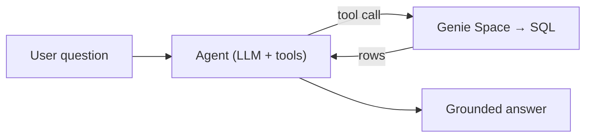
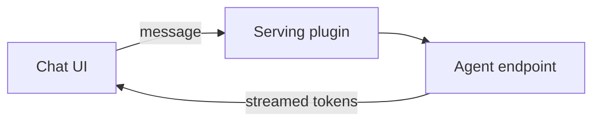

# Chapter 4 — Data Intelligence (Dashboard / Genie / Agent)

Plan the use case, build an AI/BI dashboard, a Genie Space, an agent, and wire the agent into the app.

> Auto-generated from `02_seed_section_input_prompts.sql`. Each section below corresponds to one `section_tag` in the workshop builder's `section_input_prompts` table.

## Sections in this category

| Step (order) | Section | `section_tag` | Forks |
|---|---|---|---|
| 13 | [Create Use-Case Plan](#create-use-case-plan) | `usecase_plan` | genie-code |
| 14 | [Build AI/BI Dashboard](#build-ai-bi-dashboard) | `aibi_dashboard` | genie-code |
| 15 | [Build Genie Space [Metric Views/TVFs]](#build-genie-space-metric-views-tvfs) | `genie_space` | genie-code |
| 16 | [Build & Deploy Agent](#build-deploy-agent) | `agent_framework` | genie-code |
| 17 | [Wire Agent to AppKit UI](#wire-agent-to-appkit-ui) | `wire_ui_agent` | genie-code |
| 24 | [Deploy Semantic Layer Assets (TVFs → Metric Views → Genie → Dashboard)](#deploy-semantic-layer-assets-tvfs-metric-views-genie-dashboard) | `deploy_di_assets` | genie-code |
| 25 | [Optimize Genie Space (Benchmark-Driven)](#optimize-genie-space-benchmark-driven) | `optimize_genie` | — |

---

## Create Use-Case Plan

| Field | Value |
|-------|-------|
| `input_id` | `10` |
| `section_tag` | `usecase_plan` |
| `order_number` | `13` |
| `coding_assistant` | `__default__` |
| `bypass_llm` | `true` |

_Generate implementation plans for operationalizing use cases with supporting artifacts_

**Input Template** (the prompt the section feeds to the LLM / pastes verbatim):

```
Perform project planning using @data_product_accelerator/skills/planning/00-project-planning/SKILL.md with planning_mode: workshop

This will involve the following steps:

- **Analyze Gold layer** — examine your completed Gold tables to identify natural business domains, key relationships, and analytical questions
- **Generate use-case plans** — create structured plans organized as Phase 1 addendums (1.2 TVFs, 1.3 Metric Views, 1.4 Monitors, 1.5 Dashboards, 1.6 Genie Spaces, 1.7 Alerts, 1.1 ML Models). Filenames must match the canonical numbering table at `data_product_accelerator/skills/planning/00-project-planning/assets/addendum-numbering.md`.
- **Produce YAML manifests** — generate 4 machine-readable manifest files (semantic-layer, observability, ML, GenAI agents) as contracts for downstream implementation stages
- **Emit Gold dependency manifest** — write `<ARTIFACT_ROOT>/plans/manifests/gold-dependency-manifest.yaml` with every Gold table/column referenced across all addendums, then intersect it against `{lakehouse_default_catalog}.information_schema` for `{user_schema_prefix}_gold`. If any reference is missing, the skill writes `<ARTIFACT_ROOT>/plans/gold-gap-remediation.md` and STOPS — downstream orchestrators (semantic layer, observability, ML, GenAI agents) will refuse to run until Gold is fixed.
- **Apply workshop mode caps** — enforce hard limits (3-5 TVFs, 1-2 Metric Views, 1 Genie Space) to keep the workshop focused on pattern variety over depth
- **Define deployment order** — establish build sequence: TVFs → Metric Views → Genie Spaces → Dashboards → Monitors → Alerts → Agents

If a PRD exists at @docs/design_prd.md, reference it for business requirements, user personas, and workflows.
```

<details><summary><strong>How to Apply</strong> (user-facing guidance)</summary>

> **Artifact root (client-aware).** Resolve the data-product bundle root via `vibecoding-state` (`dp_bundle_root` in `## Environment Capabilities`, = `<artifact_root>/{user_schema_prefix}_<use_case_slug>_dab`) and write **every plan document and manifest under `{user_schema_prefix}_<use_case_slug>_dab/plans/`** — NOT the bare repo/project root. This is the same dedicated bundle folder the Lakehouse + Gold-design steps build into, so the downstream deploy steps find `plans/manifests/*.yaml` right beside the bundle. The shape is identical on every client: on Cursor/Copilot it is `<repo-root>/{user_schema_prefix}_<use_case_slug>_dab/`; on Databricks Genie Code it is `<project-root>/{user_schema_prefix}_<use_case_slug>_dab/` (your user project root `/Workspace/Users/<email>/<repo>`, NOT the skills clone) — never the page's current working directory.

## 1️⃣ How To Apply

Copy the prompt above, start a **new Agent chat** in your coding assistant, and paste it. The AI will analyze your Gold layer and create use case plans.

### Prerequisite

**Run this in your cloned Template Repository** (see Prerequisites in Step 0).

Ensure you have:
- ✅ Gold Layer Design completed (Step 9)
- ✅ Gold Layer Implementation completed (Step 12)
- ✅ `data_product_accelerator/skills/planning/00-project-planning/SKILL.md` - The project planning skill
- ✅ `<ARTIFACT_ROOT>/docs/design_prd.md` - PRD with business requirements (optional, if available)

### Steps to Apply

1. **Start new Agent thread** — start a new Agent thread in your coding assistant for clean context
2. **Copy and paste the prompt** — Use the copy button, paste into your coding assistant; the AI will analyze your Gold layer and create use case plans
3. **Review generated plans** — Plans appear in `plans/` folder (Phase addendums, artifact specs, implementation priorities)
4. **Prioritize use cases** — Identify highest-value use cases, assign P0/P1/P2, determine implementation order
5. **Prepare for implementation** — Use plans to guide Step 14+ (implement artifacts based on plans)

---

## 2️⃣ What Are We Building?

### 📚 What is Use-Case Planning?

After building the Gold layer (data foundation), we now plan how to **operationalize** that data through various artifacts that serve different use cases.

### From Data to Value

| Layer | What You Have | What's Next |
|-------|---------------|--------------|
| **Bronze** | Raw data | ✅ Complete |
| **Silver** | Clean data | ✅ Complete |
| **Gold** | Business-ready data | ✅ Complete |
| **Artifacts** | Operational use cases | 👉 **THIS STEP** |

### 🎯 Why Plan Before Building?

**The Goal:** Identify use cases FIRST, then create artifacts to realize them.

| Approach | Result |
|----------|--------|
| ❌ Build random artifacts | Unused dashboards, irrelevant metrics |
| ✅ Plan use cases first | Every artifact serves a business need |

### PRD-Driven Planning

If a **Product Requirements Document (PRD)** exists at `<ARTIFACT_ROOT>/docs/design_prd.md`, it provides:

| PRD Element | How It Informs Planning |
|-------------|-------------------------|
| **User Personas** | Who needs what data? |
| **Workflows** | What questions do users ask? |
| **Business Requirements** | What metrics matter most? |
| **Success Criteria** | How do we measure value? |

**PRD → Use Cases → Artifacts**

### 🏗️ Agent Layer Architecture (How Artifacts Connect)

```
┌─────────────────────────────────────────────────────────────────────────────┐
│                   FROM GOLD LAYER TO USE CASES                               │
│                   (Agent Layer Architecture)                                  │
├─────────────────────────────────────────────────────────────────────────────┤
│                                                                             │
│  USERS (Natural Language)                                                   │
│       ↓                                                                     │
│  ┌─────────────────────────────────────────────────────────────────────┐    │
│  │ PHASE 3: Frontend App (Databricks App / Custom UI)                  │    │
│  └──────────────────────────────┬──────────────────────────────────────┘    │
│                                 ↓                                           │
│  ┌─────────────────────────────────────────────────────────────────────┐    │
│  │ PHASE 2: AI Agents (orchestrator → domain agents)                   │    │
│  │          Agents query through Genie Spaces — NEVER direct SQL       │    │
│  └──────────────────────────────┬──────────────────────────────────────┘    │
│                                 ↓                                           │
│  ┌─────────────────────────────────────────────────────────────────────┐    │
│  │ PHASE 1.6: Genie Spaces (NL-to-SQL interface, ≤ 25 assets each)    │    │
│  └──────────────────────────────┬──────────────────────────────────────┘    │
│                                 ↓                                           │
│  ┌─────────────────────────────────────────────────────────────────────┐    │
│  │ PHASE 1 DATA ASSETS (consumed by Genie & Dashboards):               │    │
│  │  1.3 Metric Views │ 1.2 TVFs │ 1.1 ML Tables │ 1.4 Monitors       │    │
│  └──────────────────────────────┬──────────────────────────────────────┘    │
│                                 ↓                                           │
│  ┌─────────────────────────────────────────────────────────────────────┐    │
│  │ GOLD LAYER (Foundation — completed in prior steps)                  │    │
│  │  dim_property │ dim_destination │ dim_user │ dim_host │ fact_booking │    │
│  └─────────────────────────────────────────────────────────────────────┘    │
│                                                                             │
└─────────────────────────────────────────────────────────────────────────────┘
```

> **Key principle:** Each layer consumes the layer below it. Agents never bypass Genie Spaces to query Gold directly. This provides abstraction, query optimization, and built-in guardrails.

### 📋 Phase 1 Addendums (Artifact Categories)

All analytics artifacts are organized as Phase 1 addendums:

| # | Addendum | Artifacts | Downstream Manifest |
|---|----------|-----------|---------------------|
| 1.1 | **ML Models** | Prediction models, feature tables | `ml-manifest.yaml` |
| 1.2 | **TVFs** | Parameterized SQL functions for Genie | `semantic-layer-manifest.yaml` |
| 1.3 | **Metric Views** | Semantic measures & dimensions | `semantic-layer-manifest.yaml` |
| 1.4 | **Lakehouse Monitoring** | Data quality monitors, custom metrics | `observability-manifest.yaml` |
| 1.5 | **AI/BI Dashboards** | Lakeview visualizations | `observability-manifest.yaml` |
| 1.6 | **Genie Spaces** | NL query interfaces (≤ 25 assets each) | `semantic-layer-manifest.yaml` |
| 1.7 | **Alerting Framework** | SQL Alerts with severity routing | `observability-manifest.yaml` |

> **Workshop default:** 1.2 TVFs, 1.3 Metric Views, and 1.6 Genie Spaces are included by default. Others included if requested.

### 🔄 Planning Methodology

The planning skill organizes work into **3 phases**, with Phase 1 containing **7 addendums** for all analytics artifacts:

### Phase & Addendum Structure

```
Phase 1: Use Cases (ALL analytics artifacts)
├── 1.1 ML Models           (demand predictors, pricing optimizers)
├── 1.2 TVFs                (parameterized queries for Genie)
├── 1.3 Metric Views        (semantic measures & dimensions)
├── 1.4 Lakehouse Monitoring (data quality monitors)
├── 1.5 AI/BI Dashboards    (Lakeview visualizations)
├── 1.6 Genie Spaces        (natural language query interfaces)
└── 1.7 Alerting Framework   (SQL alerts with severity routing)

Phase 2: Agent Framework (AI Agents with Genie integration)
└── Agents use Genie Spaces as query interface (never direct SQL)

Phase 3: Frontend App (User interface — optional)
└── Databricks Apps or custom UI consuming Phase 1-2 artifacts
```

> **Key insight:** ALL data artifacts (TVFs, Metric Views, Dashboards, Monitors, Alerts, ML, Genie Spaces) are addendums within Phase 1. Agents (Phase 2) and Frontend (Phase 3) **consume** Phase 1 artifacts — they are not separate artifact categories.

### Agent Domain Framework

**Domains emerge from business questions, not fixed categories.** The skill derives domains from your Gold table groupings and stakeholder questions:

| Rule | Why |
|------|-----|
| Domains come from Gold table relationships | Natural boundaries, not arbitrary labels |
| A domain needs ≥ 3 business questions | Fewer = merge into a neighbor domain |
| Two domains sharing > 70% of Gold tables → consolidate | Avoid duplicate artifacts |
| Don't force a fixed count (2-3 for 5-10 tables is fine) | More domains ≠ better |

**Example for your source data:**

| Domain | Focus Area | Key Gold Tables |
|--------|------------|----------------|
| 💰 **Revenue** | Bookings, pricing, revenue trends | `fact_booking_detail`, `dim_property` |
| 🏠 **Host Performance** | Host activity, ratings, response times | `dim_host`, `fact_review` |
| 👤 **Guest Experience** | Guest behavior, satisfaction, lifetime value | `dim_user`, `fact_booking_detail` |

> **Anti-pattern:** Creating 5+ generic domains (Cost, Performance, Quality, Reliability, Security) that don't map to your actual Gold tables.

### 💡 Use Case Examples for Vacation Rentals

Based on your Gold layer, typical use cases include:

### Revenue Analytics
- "What is our total booking revenue by destination?"
- "Which properties have the highest average nightly rate?"
- "Revenue trend over the past 12 months?"

### Host Performance
- "Who are our top-performing hosts?"
- "Which hosts have the best guest ratings?"
- "Host response time analysis?"

### Guest Insights
- "Customer lifetime value by segment?"
- "Repeat booking rate analysis?"
- "Guest demographics by destination?"

### Property Optimization
- "Property occupancy rates by season?"
- "Which amenities correlate with higher bookings?"
- "Pricing optimization recommendations?"

### Operational Monitoring
- "Data freshness alerts?"
- "Booking anomaly detection?"
- "Revenue target tracking?"

---

## 3️⃣ Why Are We Building It This Way? (Databricks Best Practices)

| Practice | How It's Used Here |
|----------|-------------------|
| **Agent Domain Framework** | Domains derived from business questions and Gold table groupings (not forced to a fixed count). Each domain maps to a potential Genie Space. |
| **Artifact Rationalization** | Every artifact must trace to a business question. TVFs only when Metric Views can't answer. No quota-filling. Prevents artifact bloat. |
| **Genie Space 25-Asset Limit** | Hard constraint: each Genie Space holds ≤ 25 data assets. Plan calculates total assets → determines space count. Under 10 assets = merge. |
| **Deployment Order Discipline** | Build order enforced: Phase 1 addendums (1.2→1.3→1.6→1.5→1.4→1.7→1.1) → Phase 2 (Agents). Genie Spaces MUST exist before Agents can use them. |
| **Agent Layer Architecture** | AI Agents (Phase 2) query data through Genie Spaces (Phase 1.6), never direct SQL. Provides abstraction, optimization, and guardrails. |
| **Serverless-First Architecture** | Every artifact designed for serverless execution — SQL warehouses for queries, serverless jobs for ETL, serverless DLT for pipelines |
| **Lakehouse Monitoring Integration** | Plans include monitor specifications leveraging Databricks Lakehouse Monitoring with custom business metrics (AGGREGATE, DERIVED, DRIFT) |
| **AI/BI Dashboard Planning** | Dashboard specs designed for Databricks AI/BI (Lakeview) — native format with widget-query alignment and parameter configuration |
| **Genie Space Optimization Targets** | Plans include benchmark questions with accuracy targets (95%+) and repeatability targets (90%+). General Instructions ≤ 20 lines. |
| **YAML Manifests as Contracts** | 4 machine-readable manifests bridge planning and implementation. Downstream skills parse manifests (not prose). `planning_mode: workshop` prevents expansion. |
| **Workshop Mode Hard Caps** | When `planning_mode: workshop` is active, artifact counts are capped (3-5 TVFs, 1-2 MVs, 1 Genie Space). Manifests propagate this ceiling to all downstream skills. |

---

## 4️⃣ What Happens Behind the Scenes?

When you paste the prompt, the AI reads `@data_product_accelerator/skills/planning/00-project-planning/SKILL.md` — the **Project Planning orchestrator**. Behind the scenes:

1. **Workshop mode detection** — `planning_mode: workshop` activates the workshop profile, which produces a **minimal representative plan** (3-5 TVFs, 1-2 Metric Views, 1 Genie Space) designed for hands-on workshops. The first line of output confirms: `**Planning Mode:** Workshop (explicit opt-in — artifact caps active)`.
2. **Interactive quick start** — the skill asks key decisions before generating plans:
   - Which domains to include (derived from business questions and Gold table groupings)
   - Which Phase 1 addendums to generate (1.1 ML through 1.7 Alerting)
   - Whether to include Phase 2 (Agents) and Phase 3 (Frontend)
   - Agent-to-Genie Space mapping strategy
3. **Artifact Rationalization** — the skill applies rigorous rules to prevent artifact bloat:
   - Every artifact must trace to a business question (no quota-filling)
   - TVFs only where Metric Views can't answer the question
   - Genie Spaces sized by total asset count (25-asset hard limit per space)
   - Domains consolidated when overlap exceeds 70% of Gold tables
4. **YAML manifest contracts** — 4 machine-readable manifests generated for downstream stages:
   - `semantic-layer-manifest.yaml` (TVFs + Metric Views + Genie Spaces)
   - `observability-manifest.yaml` (Monitors + Dashboards + Alerts)
   - `ml-manifest.yaml` and `genai-agents-manifest.yaml`
5. **Common skills auto-loaded:**
   - `databricks-expert-agent` — "Extract, Don't Generate" applied to plan-to-implementation handoff
   - `naming-tagging-standards` — enterprise naming conventions for all planned artifacts

**Key concept: Agent Layer Architecture** — Agents (Phase 2) use Genie Spaces (Phase 1.6) as their query interface, NOT direct SQL. This means Genie Spaces must be deployed before agents can consume them.

</details>

<details><summary><strong>Expected Output</strong></summary>

## Expected Deliverables

### 📁 Generated Plan Files

```
plans/
├── README.md                               # Plan index and navigation
├── prerequisites.md                        # Bronze/Silver/Gold summary
├── phase1-use-cases.md                     # Phase 1 master (all analytics artifacts)
│   ├── phase1-addendum-1.1-ml-models.md        # ML model specifications
│   ├── phase1-addendum-1.2-tvfs.md             # TVF definitions
│   ├── phase1-addendum-1.3-metric-views.md     # Metric view specifications
│   ├── phase1-addendum-1.4-lakehouse-monitoring.md  # Monitor configurations
│   ├── phase1-addendum-1.5-aibi-dashboards.md  # Dashboard specifications
│   ├── phase1-addendum-1.6-genie-spaces.md     # Genie Space setups
│   └── phase1-addendum-1.7-alerting.md         # Alert configurations
├── phase2-agent-framework.md               # AI agent specifications (optional)
├── phase3-frontend-app.md                  # App integration plans (optional)
└── manifests/                              # ⭐ Machine-readable contracts
    ├── semantic-layer-manifest.yaml        # TVFs + Metric Views + Genie Spaces
    ├── observability-manifest.yaml         # Monitors + Dashboards + Alerts
    ├── ml-manifest.yaml                    # Feature Tables + Models + Experiments
    ├── genai-agents-manifest.yaml          # Agents + Tools + Eval Datasets
    └── gold-dependency-manifest.yaml       # ⭐ Gold tables/columns referenced by ALL addendums
                                             #   (validated against live catalog; gaps → STOP)

# Emitted ONLY when the live-catalog intersection finds missing Gold references:
plans/gold-gap-remediation.md                # Lists missing tables/columns → fix Gold first
```

> **Key innovation: Plan-as-Contract.** The 4 YAML manifests serve as **contracts** between planning and implementation. When downstream skills (semantic layer, monitoring, ML, GenAI) run, they read their manifest to know exactly what to build — enforcing "Extract, Don't Generate" across the planning-to-implementation handoff. In workshop mode, manifests include `planning_mode: workshop` to prevent downstream skills from expanding beyond listed artifacts.

---

### 📊 Plan Document Structure

Each plan document includes:

```markdown
# Artifact Category Plan

## Overview
- Business objectives
- Target users
- Success metrics

## Artifact Specifications

### Artifact 1: [Name]
- **Agent Domain:** [Derived from your business questions]
- **Description:** [What it does]
- **Source Gold Tables:** [Gold tables used]
- **Business Questions Answered:** [Which stakeholder questions does this serve?]
- **Implementation Priority:** [P0/P1/P2]

### Artifact 2: [Name]
...

## Implementation Timeline
- Sprint assignments
- Dependencies
- Milestones

## Validation Criteria
- How to verify success
- Expected outcomes
```

---

### 🎯 Workshop Mode Artifact Caps

This workshop uses `planning_mode: workshop` — hard caps prevent artifact bloat:

| Category | Workshop Cap | Selection Criteria | Acceleration (default) |
|----------|-------------|-------------------|----------------------|
| **Domains** | 1-2 max | Richest Gold table relationships | Derived from business questions |
| **TVFs** | 3-5 total | One per parameter pattern (date-range, entity-filter, top-N) | ~1-2 per Gold table |
| **Metric Views** | 1-2 total | One per fact table (pick richest joins) | One per distinct grain |
| **Genie Spaces** | 1 unified | All workshop assets in one space (< 15 assets) | Based on 25-asset limit |
| **Dashboards** | 0-1 | Optional if time permits | 5-8 |
| **Monitors** | 1-2 | One fact + one dimension | 10-15 |
| **Alerts** | 2-3 | One CRITICAL + one WARNING (severity demo) | 10-15 |
| **ML Models** | 0-1 | Skip unless explicitly requested | 5-7 |
| **Phase 2 (Agents)** | Skip | Excluded by default in workshop | Full agent framework |
| **Phase 3 (Frontend)** | Skip | Excluded by default in workshop | Databricks App |

> **Selection principle:** Pick the **most representative** artifact for each pattern type. Prefer **variety of patterns** (date-range TVF, entity-filter TVF, top-N TVF) over depth in a single domain. The goal is to teach the full pattern vocabulary with minimum artifacts.

---

### 🔀 Deployment Order (Critical!)

**Phase 1 addendums must be deployed in this order:**

```
┌─────────────────────────────────────────────────────────────────────────────┐
│                  PHASE 1 DEPLOYMENT ORDER                                    │
├─────────────────────────────────────────────────────────────────────────────┤
│                                                                             │
│  1.2 TVFs ──────────▶ 1.3 Metric Views ──────────▶ 1.6 Genie Spaces       │
│  (parameterized         (semantic measures           (NL-to-SQL using       │
│   queries)               & dimensions)                TVFs + MVs + tables)  │
│                                                            │                │
│  1.4 Monitors ──────▶ 1.7 Alerts                          │                │
│  (data quality          (threshold/anomaly                 │                │
│   profiling)             notifications)                    │                │
│                                                            │                │
│  1.5 Dashboards                                            │                │
│  (visualizes Metric Views + TVFs + Monitors)               │                │
│                                                            │                │
│  1.1 ML Models                                             │                │
│  (predictions feed into Genie Spaces as tables)            │                │
│                                                            ▼                │
│  ┌─────────────────────────────────────────────────────────────────────┐    │
│  │ PHASE 2: AI Agents (consume Genie Spaces — deploy AFTER Phase 1.6) │    │
│  └─────────────────────────────────────────────────────────────────────┘    │
│                                          ↓                                  │
│  ┌─────────────────────────────────────────────────────────────────────┐    │
│  │ PHASE 3: Frontend App (consumes Agents + Dashboards — optional)     │    │
│  └─────────────────────────────────────────────────────────────────────┘    │
│                                                                             │
└─────────────────────────────────────────────────────────────────────────────┘
```

> **Why order matters:** Genie Spaces need TVFs and Metric Views to exist before they can be added as assets. Agents need Genie Spaces to exist before they can query through them. Violating this order causes deployment failures.

---

### ✅ Success Criteria Checklist

**Plan Structure:**
- [ ] First line confirms mode: `**Planning Mode:** Workshop (explicit opt-in)`
- [ ] `plans/README.md` provides navigation with links to all documents
- [ ] `plans/README.md`, `plans/prerequisites.md`, `plans/use-case-catalog.md`, and `plans/phase1-use-cases.md` all exist (workshop mode does NOT waive these)
- [ ] All selected Phase 1 addendum files exist in `plans/` (one per selected artifact type — 1.2 TVFs, 1.3 MVs, 1.6 Genie at minimum in workshop mode)
- [ ] Each plan document follows standard template (Overview, Specs, Timeline, Validation)

**Agent Domain Framework:**
- [ ] Domains derived from business questions and Gold table groupings
- [ ] Each domain has ≥ 3 business questions (or merged)
- [ ] No two domains share > 70% of Gold tables (or consolidated)
- [ ] Domain count justified (2-3 for 5-10 Gold tables)

**Artifact Rationalization (Prevent Bloat):**
- [ ] Every artifact traces to a business question
- [ ] No TVF duplicates what a Metric View already provides
- [ ] Each Genie Space has ≤ 25 data assets and ≥ 10 assets
- [ ] Genie Space count based on total asset volume (not domain count)
- [ ] Workshop caps respected: 3-5 TVFs, 1-2 MVs, 1 Genie Space
- [ ] No row in the Traceability Matrix has Genie Space as its ONLY coverage (every question must have a TVF, Metric View, or listed Gold table backing it)

**YAML Manifests (Plan-as-Contract):**
- [ ] 4 domain manifests generated in `plans/manifests/`
- [ ] `<ARTIFACT_ROOT>/plans/manifests/gold-dependency-manifest.yaml` generated AND intersected against the live `{lakehouse_default_catalog}.{user_schema_prefix}_gold` catalog with zero missing tables/columns (if gaps: `<ARTIFACT_ROOT>/plans/gold-gap-remediation.md` emitted and planning STOPS)
- [ ] `planning_mode: workshop` present in all manifests
- [ ] All table/column references validated against Gold YAML
- [ ] Artifact counts in manifests match plan addendum counts
- [ ] Observability manifest TimeSeries monitors use a business event date (FK to `dim_date`), NOT an audit column like `record_updated_timestamp`
- [ ] Zero literal schema names in manifest SQL — every query uses `${catalog}.${gold_schema}.*` (run `grep -n "gold" plans/manifests/*.yaml` and verify only the variable form appears in `query:` blocks)
- [ ] Any cross-domain Genie Space uses the documented `unified_genie_space` (singular) key — NOT an ad-hoc `unified_genie_spaces` or similar plural/alternative key

**Deployment Order:**
- [ ] Phase 1 addendum dependencies documented
- [ ] Genie Spaces listed as deployed AFTER TVFs + Metric Views
- [ ] Agents (Phase 2) listed as deployed AFTER Genie Spaces (if included)

**Use Case Coverage:**
- [ ] Key business questions documented per domain (≥ 3 each)
- [ ] All artifacts tagged with Agent Domain
- [ ] LLM-friendly comments specified for all artifacts
- [ ] Source Gold tables identified for each artifact

</details>

#### Fork — `coding_assistant = genie-code`  (input_id 906)

> Fork rows override only `input_template`, `system_prompt`, and `bypass_llm`. All display fields are inherited from the default row above.

| Field | Value |
|-------|-------|
| `input_id` | `906` |
| `section_tag` | `usecase_plan` |
| `order_number` | `(inherited)` |
| `coding_assistant` | `genie-code` |
| `bypass_llm` | `true` |

**Input Template** (the prompt the section feeds to the LLM / pastes verbatim):

```
Write the use-case plan documents and YAML manifests for the data product — a planning step that creates no resources. Before this step there is no plan; after it, every plan artifact lives under `<DP_BUNDLE_ROOT>/plans/`.

This will involve the following steps:

- **Load the planning skills** — full `skill_ref_root`-prefixed paths.
- **Run the planning workflow** — drive it from the orchestrator.
- **Write the artifacts** — every plan doc and YAML manifest under `<DP_BUNDLE_ROOT>/plans/` (no resources created).

The steps below are the prescriptive runbook for those actions; follow them in order.

**Genie Code — this is a prescriptive runbook. Follow the steps in order. Do NOT improvise paths, do NOT use bare relative paths, do NOT use `@`-mentions. This is a PLANNING / DOCUMENT-WRITING step: you WRITE plan documents and YAML manifests — you do NOT create tables, run SQL DDL, or deploy anything. Every skill is named by its full `skill_ref_root`-prefixed path; every artifact is anchored to `<DP_BUNDLE_ROOT>/plans/`.**

### 🔴 Non-negotiable rules (read before anything)

❌ **NEVER** create a catalog/schema/table, run `CREATE`/`MERGE`/DDL, or build/deploy an Asset Bundle in this step — planning produces FILES only. (Read-only inspection of the live Gold schema for validation is fine — see Step 2.)

❌ **NEVER** write the plans to the bare project root, `/tmp`, the page's current working directory, or a bare relative path. Genie Code's CWD is page-type-dependent, so a bare `plans/` lands in the wrong place.

✅ Write **every** plan document and manifest under `<DP_BUNDLE_ROOT>/plans/` — the SAME data-product bundle folder the Lakehouse + Gold-design steps build into, so the downstream deploy steps (semantic layer, dashboard, DI assets) find `plans/manifests/*.yaml` and `plans/deploy-checkpoint.md` right beside the bundle they deploy from.

### Step 0 — Resolve your environment (once, before anything else)

Run `skills/vibecoding-state` operation `enter` (params: `prompt_id: "usecase_plan"`) — it locates the canonical live state file at `<dp_bundle_root>/.vibecoding-state.md` (bootstrap-created by the first data-product step). Read these resolved values and use them literally throughout:

- `client_context` = `genie_code`
- `artifact_root` = your workshop project root (e.g. `/Workspace/Users/<your-email>/vibe-coding-workshop`) — where all generated bundles/apps/docs build; the repo itself is cloned at `/Workspace/Users/<your-email>/.assistant/skills/vibe-coding-workshop` (skills load from there via `skill_ref_root`, NOT from `artifact_root`)
- `skill_ref_root` = `skills/vibe-coding-workshop` (substitute your clone folder if you cloned somewhere other than `.assistant/skills/vibe-coding-workshop`)
- `dp_bundle_root` = `<artifact_root>/{user_schema_prefix}_<use_case_slug>_dab` — the **self-contained data-product Asset Bundle project** the whole pipeline builds into (e.g. `…/vibe-coding-workshop/{user_schema_prefix}_booking_app_dab`). Referred to below as `<DP_BUNDLE_ROOT>`. This step writes the plans INTO `<DP_BUNDLE_ROOT>/plans/`. Your Gold design (from step 9) lives at `<DP_BUNDLE_ROOT>/gold_layer_design/`; an optional PRD (from the PRD step) lives at `<artifact_root>/docs/design_prd.md`.

When this step intersects the gold dependency manifest against the live catalog, use the EXISTING `{lakehouse_default_catalog}` that the Bronze step resolved and persisted (its Step 0.5 hard-stop) — read it from state; **never create a catalog and do not re-prompt for it.** This is a read-only intersection against `information_schema`.

### Step 1 — Load the required skills by their FULL `skill_ref_root`-prefixed paths

Load each skill with `readSkillFile` using its fully-qualified `<skill_ref_root>`-prefixed path — NEVER a bare `@…` mention, NEVER a repo-relative path. **The root-level `skills/` come FIRST: they are the highest-priority, always-on guardrails and govern everything below.**

1. `readSkillFile("skills/vibe-coding-workshop/skills/databricks-expert-agent/SKILL.md")` — core "Extract, Don't Generate" rule applied to the plan-to-implementation handoff.

Then the planning orchestrator and its common skill (load in this order):

2. `readSkillFile("skills/vibe-coding-workshop/data_product_accelerator/skills/planning/00-project-planning/SKILL.md")` — the project-planning orchestrator. Run it with `planning_mode: workshop`. Honor the canonical addendum-numbering table it names (prefix that path with `skill_ref_root` too).
3. `readSkillFile("skills/vibe-coding-workshop/data_product_accelerator/skills/common/naming-tagging-standards/SKILL.md")` — enterprise naming conventions for every planned artifact.

When the orchestrator lists further **Mandatory Skill Dependencies**, load EACH the same way: take its repo-relative path and prefix it with `skill_ref_root`. Genie Code has no repo-root-relative resolution and `AGENTS.md` does not carry across threads — so always prefix with `skill_ref_root`. **Read them in one batched `readSkillFile` turn — Genie Code reads multiple skill files in parallel in a single turn, so never serialize independent reads (`genie-code-environment` §10).**

**🔴 Preflight acknowledgement (hard gate — do this BEFORE writing any file).** After the batched `readSkillFile` returns, echo a one-line acknowledgement for EACH skill you loaded — its full `<skill_ref_root>`-prefixed path + the single rule you will apply from it. If you cannot state the rule, you have not actually read the skill — STOP and read it before writing anything. Do not write any plan document or manifest until every listed skill is acknowledged — silently skipping a skill read is the regression this preflight exists to prevent.

### Step 2 — Run the planning workflow, writing every artifact under `<DP_BUNDLE_ROOT>/plans/`

Drive the orchestrator with `planning_mode: workshop`:

- **Analyze the Gold layer** — examine the completed Gold tables (read-only) to identify business domains, relationships, and analytical questions.
- **Generate use-case plans** — Phase 1 addendums (1.2 TVFs, 1.3 Metric Views, 1.6 Genie Spaces by default; 1.1/1.4/1.5/1.7 if requested). Filenames MUST match the canonical addendum-numbering table. For 1.3 Metric Views: the workshop runtime is serverless DBR ≥ 17.1, so **nested joins are the preferred multi-hop solution** — do NOT spend planning cycles designing subquery-source workarounds for transitive joins; reserve subquery-source as the fallback only for non-unique intermediate keys (see `01-metric-views-patterns` decision ladder).
- **Produce the 4 YAML manifests** (semantic-layer, observability, ML, GenAI agents) as machine-readable contracts for downstream stages.
- **Emit the Gold dependency manifest** at `<DP_BUNDLE_ROOT>/plans/manifests/gold-dependency-manifest.yaml`, then intersect it against the LIVE `{lakehouse_default_catalog}.information_schema` for `{user_schema_prefix}_gold` (read-only). If any reference is missing, write `<DP_BUNDLE_ROOT>/plans/gold-gap-remediation.md` and STOP — downstream orchestrators refuse to run until Gold is fixed.
- **Apply workshop caps** (3-5 TVFs, 1-2 Metric Views, 1 Genie Space) and **define deployment order** (TVFs → Metric Views → Genie Spaces → Dashboards → Monitors → Alerts → Agents).

If a PRD exists at `<artifact_root>/docs/design_prd.md`, reference it for business requirements, personas, and workflows.

Anchor EVERY output to `<DP_BUNDLE_ROOT>/plans/` — never the bare project root, never the page CWD. The key paths:

- `<DP_BUNDLE_ROOT>/plans/README.md`, `prerequisites.md`, `use-case-catalog.md`, `phase1-use-cases.md`
- `<DP_BUNDLE_ROOT>/plans/phase1-addendum-1.2-tvfs.md`, `…-1.3-metric-views.md`, `…-1.6-genie-spaces.md` (+ others if selected)
- `<DP_BUNDLE_ROOT>/plans/manifests/semantic-layer-manifest.yaml`, `observability-manifest.yaml`, `ml-manifest.yaml`, `genai-agents-manifest.yaml`, `gold-dependency-manifest.yaml`

Use `createAsset`/the workspace file APIs to write these under `<DP_BUNDLE_ROOT>/plans/`. If a parent folder does not exist yet, create it — do not retarget to the project root.

**File-write tiers + verify writes (Genie Code — see `genie-code-environment` §10).** Once compute is warm, write each plan/manifest with `executeCode` `open(path,"w").write(...)` (one call per file; make the FIRST `executeCode` a trivial `print("ready")` to absorb the ~3–5 min serverless cold start, and never set `timeoutMinutes` below 15). The compute-free `createAsset` → `readFile` → `workspaceUpdateFile` trio also works, but `workspaceUpdateFile` only updates a file that already exists AND was read this thread. 🔴 **Verify every write with `os.path.exists(path)` (or `os.listdir(dir)`) in the SAME `executeCode` block — NOT `listFiles`:** the workspace REST API behind `listFiles` lags FUSE-written files (a live run saw `listFiles`=7 while `os.listdir`=12), so `listFiles` returns false "missing-file" negatives and you waste turns recreating files that already exist.

**State-lock:** this prompt runs between an `enter` (Step 0) and an `exit`. After the gate passes, run `skills/vibecoding-state` op `exit` — params: `prompt_id: "usecase_plan"`, `gate: "Use-case plan complete"`, `captured: {usecase_plan_path}`. **This `enter`/`exit` pair is a mandatory ritual, not advisory.** Step 0's `enter` MUST locate — or, if this is the first prompt of the track, bootstrap-create — the canonical live state file at `<dp_bundle_root>/.vibecoding-state.md` (never the temporary `example/…` bootstrap path). The closing `exit` MUST append this prompt's Per-Step Log entry, Gate result, and `captured` vars to that file, then **re-read it and echo the appended section to prove the write landed**. **Gate completion rule:** this prompt is NOT complete until that re-read confirms the appended entry — the chat summary is NOT the state store.

**Gate:** `Use-case plan complete` — `<DP_BUNDLE_ROOT>/plans/` contains the README + Phase-1 master + the selected addendums + all 4 manifests, the first plan line confirms `**Planning Mode:** Workshop`, and `gold-dependency-manifest.yaml` was intersected against the live `{lakehouse_default_catalog}.{user_schema_prefix}_gold` catalog with zero missing references (gaps ⇒ `gold-gap-remediation.md` emitted and planning STOPS). No schema/table was created and nothing was deployed.
```

---

## Build AI/BI Dashboard

| Field | Value |
|-------|-------|
| `input_id` | `12` |
| `section_tag` | `aibi_dashboard` |
| `order_number` | `14` |
| `coding_assistant` | `__default__` |
| `bypass_llm` | `true` |

_Create an AI/BI (Lakeview) dashboard with KPI counters, charts, filters, and automated deployment from Gold layer data_

**Input Template** (the prompt the section feeds to the LLM / pastes verbatim):

```
Build an AI/BI (Lakeview) Dashboard using @data_product_accelerator/skills/monitoring/02-databricks-aibi-dashboards/SKILL.md

**Bundle root:** Extend the SAME data-product bundle the Lakehouse steps built — its dedicated top-level folder `{user_schema_prefix}_{use_case_slug}_dab/` at the repo root (`dp_bundle_root`). All relative paths (`src/`, `resources/`, `plans/`, `databricks.yml`) resolve UNDER `{user_schema_prefix}_{use_case_slug}_dab/`, never the bare repo root. Same folder on every coding agent.

This will involve the following end-to-end workflow:

- **Build Lakeview dashboard** — create a complete `.lvdash.json` configuration with KPI counters, charts, data tables, and filters for business self-service analytics
- **Use 6-column grid layout** — position all widgets on a 6-column grid (NOT 12!) with correct widget versions (KPIs=v2, Charts=v3, Tables=v2, Filters=v2)
- **Query Metric Views** — write dataset queries using `MEASURE()` function against Metric Views with `${catalog}.${gold_schema}` variable substitution
- **Use a mixed dataset strategy** — `MEASURE()` for KPIs, trends, and dimension breakdowns sourced from Metric Views; direct Gold SQL for detail/drill-down tables and filter value datasets (e.g., `SELECT DISTINCT ...`)
- **Validate SQL and widget alignment** — run pre-deployment validation ensuring every widget `fieldName` matches its SQL alias exactly (90% reduction in dev loop time)
- **Run Phase 0.5 pre-flight** — BEFORE any deploy, enumerate every `${var}` placeholder in the `.lvdash.json`, then assert the deploy job provides every one. Missing a single variable corrupts the upload silently (see `monitoring/02-databricks-aibi-dashboards/SKILL.md` → "Pre-loop variable enumeration").
- **Deploy via UPDATE-or-CREATE** — use Workspace Import API with `overwrite: true` AND base64-encoded ASCII content (raw UTF-8 bytes silently corrupts the file). Preserves dashboard URLs and viewer permissions.

Reference the dashboard plan at @{user_schema_prefix}_{use_case_slug}_dab/plans/phase1-addendum-1.5-aibi-dashboards.md (canonical numbering — see `data_product_accelerator/skills/planning/00-project-planning/assets/addendum-numbering.md`; the legacy name `1.1-dashboards.md` is forbidden).

The skill provides:
- Dashboard JSON structure with **6-column grid** layout (NOT 12!)
- Widget patterns: KPI counters (v2), charts (v3), tables (v2), filters (v2)
- Query patterns from Metric Views using `MEASURE()` function
- Pre-deployment SQL validation (90% reduction in dev loop time)
- UPDATE-or-CREATE deployment pattern (preserves URLs and permissions)
- Variable substitution (`${catalog}`, `${gold_schema}`) — no hardcoded schemas
- Monitoring table query patterns (window structs, CASE pivots) if Lakehouse Monitors exist

Before building, load prerequisite skills:
- **MUST READ** `semantic-layer/01-metric-views-patterns/SKILL.md` for MEASURE() syntax (since this dashboard queries Metric Views)
- **MUST READ** `common/databricks-expert-agent/SKILL.md` for "Extract Don't Generate" principle
- **MUST READ** `common/naming-tagging-standards/SKILL.md` for dashboard and file naming conventions
- Check installed skills for `databricks-lakeview-dashboard` (16+ widget patterns, mandatory query testing workflow)

Build the dashboard in this order:
0. Validate inputs — verify the plan file and manifests exist. If the plan file is missing, STOP and ask.
1. Plan layout (KPIs, filters, charts, tables)
2. Create datasets (validated SQL queries)
3. Build widgets with correct version specs
4. Configure parameters (DATE type, not DATETIME)
5. Add Global Filters page
6. Deploy via Workspace Import API

**State-lock (`skills/vibecoding-state`) — run this prompt between an `enter` and an `exit` so workshop state is resolved and locked:**

1. **Phase 0 — first, before any step below:** `skills/vibecoding-state` op `enter` — params: `prompt_id: "aibi_dashboard"`, `require_prior_gate: {prompt_id: "gold_layer_pipeline", gate: "Gold layer live"}`. `enter` resolves the `## Environment Capabilities` triple (deploy verb, CLI channel, `state_file_root`) so every deploy/run step below uses the resolved channel — `runDatabricksCli` on Genie Code — and writes state under `state_file_root`, never a bare-local assumption.
2. **Final — after the step succeeds:** `skills/vibecoding-state` op `exit` — params: `prompt_id: "aibi_dashboard"`, `gate: "Dashboard deployed"`, `captured: {dashboard_path, dashboard_deploy_job}`.

**Gate:** `Dashboard deployed` — the dashboard artifact is deployed, the widgets render, and every widget field maps to a validated SQL alias.
```

<details><summary><strong>How to Apply</strong> (user-facing guidance)</summary>

## 1️⃣ How To Apply

**Copy the prompt above**, start a **new Agent thread** in your coding assistant, and **paste it**. The AI will build the dashboard in phases.

---

### Prerequisites

**Run this in your cloned Template Repository** (see Prerequisites in Step 0).

Ensure you have:
- ✅ Gold Layer Implementation completed (Step 12) — with column COMMENTs
- ✅ Semantic Layer completed (Step 14) — Metric Views for dashboard queries
- ✅ Use-Case Plan created (Step 13) — with dashboard requirements
- ✅ Plan file exists: `plans/phase1-addendum-1.5-aibi-dashboards.md`
- ✅ Gold YAML schemas available for column name validation

---

### Steps to Apply

**Step 1:** Start new Agent thread — start a **new Agent thread** in your coding assistant for clean context.

**Step 2:** Copy and paste the prompt — Copy the entire prompt using the copy button, paste it into your coding assistant. The AI will build the dashboard in phases.

**Step 2.5:** Input Validation — The AI will verify the plan file exists at `plans/phase1-addendum-1.5-aibi-dashboards.md`. **If missing**, the AI should ask you for the correct path rather than silently proceeding. It will also load prerequisite skills (`metric-views-patterns` for MEASURE() syntax, `databricks-expert-agent` for extract-don't-generate).

**Step 3:** Plan Reading — The AI will read dashboard plan (`plans/phase1-addendum-1.5-aibi-dashboards.md`), extract KPI requirements, chart types, filter dimensions, and identify data sources (Metric Views preferred over raw Gold tables).

**Step 4:** Dataset Creation — The AI will create SQL queries for each widget (using `${catalog}` substitution), use `MEASURE()` function for Metric View queries, include "All" option for filter datasets, and handle NULLs with `COALESCE()` and SCD2 with `is_current = true`.

**Step 5:** Widget and Layout Creation — The AI will build KPI counters (version 2) for top-line metrics, build charts (version 3) for trends and comparisons, build data tables (version 2) for drill-down, and position using 6-column grid (widths 1-6, NOT 12!).

**Step 6:** Parameter and Filter Configuration — The AI will add DATE parameters with static defaults (not DATETIME), create Global Filters page (`PAGE_TYPE_GLOBAL_FILTERS`), and link filter widgets to dataset parameters.

**Step 7:** Validate and Deploy

> **Client note:** IDE runs these in a terminal; Genie Code runs the `databricks bundle …` commands via `runDatabricksCli` (be on the bundle's page; resolved channel in `## Environment Capabilities`). See `genie-code-environment`.

```bash
# Pre-deployment validation
python scripts/validate_dashboard_queries.py
python scripts/validate_widget_encodings.py

# Deploy via Asset Bundle or API
databricks bundle deploy -t dev
```

```sql
-- Verify Gold tables have COMMENTs (prerequisite for good queries)
SELECT table_name, comment FROM information_schema.tables 
WHERE table_schema = '{user_schema_prefix}_gold' AND comment IS NOT NULL;
```

---

## 2️⃣ What Are We Building?

### What is an AI/BI (Lakeview) Dashboard?

**AI/BI Dashboards** (formerly Lakeview) provide **visual, self-service analytics** for business users — no SQL required. They are built from JSON configuration files that define datasets, widgets, pages, and parameters.

**Core Philosophy: Self-Service Analytics**
- ✅ Visual insights for non-technical users
- ✅ Consistent metrics across the organization (via Metric Views)
- ✅ Professional, branded appearance with auto-refresh
- ✅ Automated deployment with validation
- ❌ NOT a code editor — business users interact through UI only

### Lakeview Dashboard Architecture

```
┌─────────────────────────────────────────────────────────────────────────────┐
│                     AI/BI (LAKEVIEW) DASHBOARD                              │
├─────────────────────────────────────────────────────────────────────────────┤
│                                                                             │
│  ┌─────────────────────────────────────────────────────────────────────┐   │
│  │                    DASHBOARD JSON                                    │   │
│  │              (.lvdash.json configuration file)                      │   │
│  │                                                                     │   │
│  │  ┌─────────────────────────────────────────────────────────────┐   │   │
│  │  │                    PAGES                                     │   │   │
│  │  │  Page 1: Overview    │  Page 2: Details   │  Global Filters │   │   │
│  │  └─────────────────────────────────────────────────────────────┘   │   │
│  │                                                                     │   │
│  │  ┌───────────────────────────────────────────────────────────────┐ │   │
│  │  │                  WIDGETS (6-Column Grid)                       │ │   │
│  │  │                                                               │ │   │
│  │  │  ┌──────┐ ┌──────┐ ┌──────┐ ┌──────┐ ┌──────┐ ┌──────┐    │ │   │
│  │  │  │ KPI  │ │ KPI  │ │ KPI  │ │ KPI  │ │ KPI  │ │ KPI  │    │ │   │
│  │  │  │ (v2) │ │ (v2) │ │ (v2) │ │ (v2) │ │ (v2) │ │ (v2) │    │ │   │
│  │  │  └──────┘ └──────┘ └──────┘ └──────┘ └──────┘ └──────┘    │ │   │
│  │  │  ┌─────────────────┐ ┌─────────────────┐                    │ │   │
│  │  │  │  Line Chart (v3)│ │  Bar Chart (v3) │                    │ │   │
│  │  │  │  Trend over time│ │  By dimension   │                    │ │   │
│  │  │  └─────────────────┘ └─────────────────┘                    │ │   │
│  │  │  ┌─────────────────────────────────────┐                    │ │   │
│  │  │  │         Data Table (v2)              │                    │ │   │
│  │  │  │         Detailed drill-down          │                    │ │   │
│  │  │  └─────────────────────────────────────┘                    │ │   │
│  │  └───────────────────────────────────────────────────────────────┘ │   │
│  │                                                                     │   │
│  │  ┌───────────────────────────────────────────────────────────────┐ │   │
│  │  │                    DATASETS                                    │ │   │
│  │  │  SQL queries → Metric Views / Gold tables / Monitoring tables │ │   │
│  │  │  Parameters: DATE type (not DATETIME), variable substitution  │ │   │
│  │  └───────────────────────────────────────────────────────────────┘ │   │
│  └─────────────────────────────────────────────────────────────────────┘   │
│                                                                             │
│  ┌──────────────────────┐  ┌──────────────────────┐                       │
│  │   DEPLOY via API     │  │   VALIDATE before     │                       │
│  │   UPDATE-or-CREATE   │  │   deploy (SQL + widget)│                       │
│  │   Preserves URLs     │  │   90% faster dev loop  │                       │
│  └──────────────────────┘  └──────────────────────┘                       │
│                                                                             │
└─────────────────────────────────────────────────────────────────────────────┘
```

---

### Key Concepts

| Concept | What It Means | Why It Matters |
|---------|--------------|----------------|
| **Lakeview JSON** | Dashboards are defined as `.lvdash.json` files | Version-controlled, deployable via API |
| **6-Column Grid** | Widget positions use columns 0-5 (NOT 12!) | #1 cause of widget snapping issues |
| **Widget Versions** | KPIs=v2, Charts=v3, Tables=v2, Filters=v2 | Wrong version causes rendering errors |
| **DATE Parameters** | Use DATE type (not DATETIME) with static defaults | DATETIME with dynamic expressions won't work |
| **`dataset_catalog`/`dataset_schema`** | Variable substitution for environment portability | Never hardcode catalog/schema in queries |
| **Widget-Query Alignment** | Widget `fieldName` MUST match query output alias | #1 cause of "no fields to visualize" errors |
| **Number Formatting** | Return raw numbers; widgets format them | `FORMAT_NUMBER()` or string concat breaks widgets |
| **Global Filters Page** | Dedicated page for cross-dashboard filtering | Required for consistent filter behavior |

---

### Dashboard Components

#### Widget Type Reference

| Widget Type | Version | Use Case | Grid Size |
|-------------|---------|----------|-----------|
| **KPI Counter** | v2 | Single metric display (revenue, count) | width: 1-2, height: 2 |
| **Bar Chart** | v3 | Category comparisons (revenue by destination) | width: 3, height: 6 |
| **Line Chart** | v3 | Trends over time (daily revenue) | width: 3, height: 6 |
| **Pie Chart** | v3 | Distribution (booking share by type) | width: 3, height: 6 |
| **Area Chart** | v3 | Stacked trends (revenue by category over time) | width: 3-6, height: 6 |
| **Data Table** | v2 | Detailed drill-down data | width: 6, height: 6+ |
| **Filter** | v2 | Single-select / multi-select / date range | width: 2, height: 2 |

#### Chart Scale Rules (Encoding Requirements)

```
Pie Charts:   color.scale = categorical, angle.scale = quantitative
Bar Charts:   x.scale = categorical, y.scale = quantitative
Line Charts:  x.scale = temporal, y.scale = quantitative
Area Charts:  x.scale = temporal, y.scale = quantitative, y.stack = "zero"
```

> **Missing `scale` in encodings** is the #2 cause of "unable to render visualization" errors.

#### Standard Dashboard Layout (6-Column Grid)

```
┌─────────────────────────────────────────────────────┐
│ Page 1: Overview                                     │
│                                                     │
│ Row 0 (height 2): Filters                           │
│ ┌──────────┐ ┌──────────┐ ┌──────────┐            │
│ │ Date (w2)│ │ Filter(w2│ │ Filter(w2│            │
│ └──────────┘ └──────────┘ └──────────┘            │
│                                                     │
│ Row 2 (height 2): KPI Counters                      │
│ ┌────┐ ┌────┐ ┌────┐ ┌────┐ ┌────┐ ┌────┐       │
│ │KPI │ │KPI │ │KPI │ │KPI │ │KPI │ │KPI │       │
│ │w=1 │ │w=1 │ │w=1 │ │w=1 │ │w=1 │ │w=1 │       │
│ └────┘ └────┘ └────┘ └────┘ └────┘ └────┘       │
│                                                     │
│ Row 4 (height 6): Charts                            │
│ ┌──────────────────┐ ┌──────────────────┐          │
│ │  Line Chart (w3) │ │  Bar Chart  (w3) │          │
│ │  Revenue Trend   │ │  By Destination  │          │
│ └──────────────────┘ └──────────────────┘          │
│                                                     │
│ Row 10 (height 6): Detail Table                     │
│ ┌──────────────────────────────────────┐            │
│ │         Data Table (w6)              │            │
│ │         Full-width drill-down        │            │
│ └──────────────────────────────────────┘            │
│                                                     │
├─────────────────────────────────────────────────────┤
│ Page: Global Filters                                 │
│ ┌──────────┐ ┌──────────┐ ┌──────────┐            │
│ │ Date (w2)│ │ Dim  (w2)│ │ Dim  (w2)│            │
│ └──────────┘ └──────────┘ └──────────┘            │
│ pageType: PAGE_TYPE_GLOBAL_FILTERS                  │
└─────────────────────────────────────────────────────┘
```

---

### Query Pattern Best Practices

#### Use Metric Views (Preferred)

> **Example names used below** (`<metric_view_name>`, `<dim_name>`, `<fact_name>`, `<dimension_col>`, `<measure_col>`) are generic placeholders — substitute with the concrete Metric View and column names from `plans/phase1-addendum-1.3-metric-views.md` and `plans/deploy-checkpoint.md`.

```sql
-- ✅ PREFERRED: Query Metric View with MEASURE()
-- No explicit GROUP BY needed — aggregation is implicit from dimensions in SELECT
SELECT
  <dimension_col>,
  MEASURE(`<measure_col_1>`) as <alias_1>,
  MEASURE(`<measure_col_2>`) as <alias_2>
FROM ${catalog}.${gold_schema}.<metric_view_name>
WHERE <date_col> BETWEEN :start_date AND :end_date
ORDER BY <alias_1> DESC
```

#### Direct Gold Table Query (Fallback)

```sql
-- When no Metric View exists for the data
SELECT
  d.<dim_label_col> as <dimension_col>,
  SUM(f.<amount_col>) as <alias_1>,
  COUNT(*) as <alias_2>
FROM ${catalog}.${gold_schema}.<fact_name> f
JOIN ${catalog}.${gold_schema}.<dim_name> d
  ON f.<fk_col> = d.<pk_col>
WHERE f.<date_col> BETWEEN :start_date AND :end_date
GROUP BY d.<dim_label_col>
ORDER BY <alias_1> DESC
```

#### Number Formatting Rules

| Return This | Widget Displays | Format Type |
|-------------|-----------------|-------------|
| `0.85` | `85%` | `number-percent` |
| `1234.56` | `$1,234.56` | `number-currency` |
| `1234` | `1,234` | `number-plain` |

> **NEVER** use `FORMAT_NUMBER()`, `CONCAT('$', ...)`, or `CONCAT(..., '%')` in queries. Return raw numbers; let widgets format them.

---

## 3️⃣ Why Are We Building It This Way? (Databricks Best Practices)

| Practice | How It's Used Here |
|----------|-------------------|
| **6-Column Grid (NOT 12!)** | Widget widths use 1-6 columns. `width: 6` = full width, `width: 3` = half. This is the #1 cause of layout issues — most platforms use 12 columns, Lakeview uses 6. |
| **Widget Version Specs** | KPI Counters = version 2, Charts (bar/line/pie/area) = version 3, Tables = version 2, Filters = version 2. Wrong version causes rendering failures. |
| **Widget-Query Column Alignment** | Every widget `fieldName` MUST exactly match the SQL alias in its dataset query. Mismatch = "no fields to visualize" error. |
| **Raw Number Formatting** | Queries return raw numbers (e.g., `0.85` for 85%). Widgets apply formatting (`number-percent`, `number-currency`, `number-plain`). NEVER use `FORMAT_NUMBER()` or string concatenation. |
| **DATE Parameters (Not DATETIME)** | Dashboard parameters use `DATE` type with static default values. `DATETIME` with dynamic expressions like `now-30d/d` does NOT work. |
| **Variable Substitution** | All queries use `${catalog}.${gold_schema}` — never hardcoded catalog/schema. Substitution done in Python at deployment time. |
| **Global Filters Page** | Every dashboard includes a `PAGE_TYPE_GLOBAL_FILTERS` page for cross-dashboard date range and dimension filtering. |
| **Metric View Queries** | Dashboards query Metric Views using `MEASURE()` function for consistent metric definitions. Metric Views are preferred over raw Gold tables. |
| **UPDATE-or-CREATE Deployment** | Workspace Import API with `overwrite: true` — single code path for create and update. Preserves dashboard URLs and viewer permissions. |
| **Pre-Deployment SQL Validation** | All dataset queries validated with `SELECT ... LIMIT 1` before dashboard import. Catches UNRESOLVED_COLUMN, TABLE_NOT_FOUND, UNBOUND_PARAMETER errors. |
| **SCD2 Handling in Queries** | Dimension queries use `QUALIFY ROW_NUMBER() OVER(PARTITION BY id ORDER BY change_time DESC) = 1` or `WHERE is_current = true` |
| **"All" Option for Filters** | Filter datasets include `SELECT 'All' UNION ALL SELECT DISTINCT ...` so users can clear filters |

---

## 4️⃣ What Happens Behind the Scenes?

When you paste the prompt, the AI reads `@data_product_accelerator/skills/monitoring/02-databricks-aibi-dashboards/SKILL.md` — the **AI/BI Dashboard worker skill**. Behind the scenes:

1. **Plan reading** — the skill reads your dashboard plan (`plans/phase1-addendum-1.5-aibi-dashboards.md`) to extract: KPIs, charts, filters, layout requirements
2. **Dashboard skill loaded** — provides complete JSON templates, widget specs, grid layout rules, query patterns, validation scripts, and deployment workflows
3. **6 Common skills auto-loaded:**
   - `databricks-expert-agent` — "Extract, Don't Generate" for table/column names
   - `semantic-layer/01-metric-views-patterns` — MEASURE() syntax for Metric View queries (loaded when dashboard uses MEASURE())
   - `databricks-asset-bundles` — dashboard resource deployment
   - `databricks-python-imports` — deployment script module patterns
   - `naming-tagging-standards` — dashboard and file naming conventions
   - `databricks-autonomous-operations` — self-healing deploy loop
4. **Query pattern selection:** Metric Views → Gold tables → Monitoring tables (priority order)
5. **Pre-deployment validation** — SQL validation + widget-encoding alignment check before import (catches 90% of errors before deploy)
6. **UPDATE-or-CREATE deployment** — Workspace Import API with `overwrite: true` preserves URLs and permissions

**Key principle:** The AI reads your plan to **extract** KPI/chart requirements. Dashboard queries use `${catalog}` and `${gold_schema}` variable substitution — never hardcoded schemas.

> **Important:** If the plan file at `plans/phase1-addendum-1.5-aibi-dashboards.md` doesn't exist, the AI should tell you and ask for the correct path — not silently reconstruct requirements from other sources.

> **Note:** For the full observability stack (Lakehouse Monitoring + Dashboards + SQL Alerts), use the orchestrator at `@data_product_accelerator/skills/monitoring/00-observability-setup/SKILL.md`. This step focuses specifically on the dashboard.

</details>

<details><summary><strong>Expected Output</strong></summary>

## Expected Deliverables

### 📁 Dashboard Files Created

```
docs/dashboards/
├── analytics_dashboard.lvdash.json   # Dashboard JSON config
└── README.md                                      # Dashboard documentation

scripts/
├── deploy_dashboard.py                            # UPDATE-or-CREATE deployment
├── validate_dashboard_queries.py                  # Pre-deploy SQL validation
└── validate_widget_encodings.py                   # Widget-query alignment check

resources/monitoring/
└── dashboard_deploy_job.yml                       # Asset Bundle deployment job
```

> **Key:** The `.lvdash.json` file IS the dashboard. It contains all datasets, pages, widgets, parameters, and theme settings. Version-control this file.

---

### 📊 Dashboard Configuration Summary (Workshop Scope)

| Element | Value |
|---------|-------|
| **Dashboard Name** | Analytics Dashboard |
| **Pages** | 2 (Overview + Global Filters) |
| **KPI Counters** | 3-6 top-line metrics (total revenue, bookings, avg rate) |
| **Charts** | 2-4 visualizations (trend line, bar comparison, pie distribution) |
| **Data Tables** | 1 drill-down table |
| **Filters** | Date range + 1-2 dimension filters |
| **Data Sources** | Metric Views (preferred) + Gold tables (fallback) |
| **Parameters** | DATE type with static defaults |
| **Deployment** | UPDATE-or-CREATE via Workspace Import API |

---

### 📊 What Each Widget Does

> **Illustrative example** from a bookings-domain dashboard — substitute with the concrete Metric View, fact, and dimension names from `plans/phase1-addendum-1.5-aibi-dashboards.md` and `plans/deploy-checkpoint.md` for your project. The pattern (KPIs/trends → `MEASURE()` on Metric Views; detail tables and filter lists → direct Gold SQL) is task-invariant.

| Widget | Type | Version | Data Source | Query Pattern | Insight |
|--------|------|---------|-------------|---------------|---------|
| Total <measure_1> | KPI Counter | v2 | `<metric_view_name>` (Metric View) | `MEASURE()` | Top-line figure (e.g., Total Revenue) |
| <count_metric> Count | KPI Counter | v2 | `<metric_view_name>` (Metric View) | `MEASURE()` | Total count in period (e.g., Booking Count) |
| Avg <rate_metric> | KPI Counter | v2 | `<metric_view_name>` (Metric View) | `MEASURE()` | Average metric (e.g., Avg Nightly Rate) |
| <measure_1> Trend | Line Chart | v3 | `<metric_view_name>` (Metric View) | `MEASURE()` with temporal dimension | Value over time |
| <measure_1> by <dim_label> | Bar Chart | v3 | `<metric_view_name>` (Metric View) | `MEASURE()` with categorical dimension | Breakdown by dimension |
| <fact_name> Details | Data Table | v2 | `<fact_name>` + dims (Gold) | Direct SQL with JOINs | Drill-down for analysis |
| Date Range | Filter | v2 | Parameter | n/a (parameter widget) | Cross-page date filtering |
| <dim_label> | Filter | v2 | `<dim_name>` (Gold) | `SELECT DISTINCT` | Categorical filtering |

> **Pattern rule:** Aggregates (KPIs, trends, breakdowns) use `MEASURE()` against Metric Views. Detail tables and filter value lists use direct Gold SQL. This mirrors the dataset strategy in `references/metric-view-dashboard-queries.md`.

---

### 📊 6-Column Grid Layout (Critical)

```
┌──────────────────────────────────────────┐
│ Grid columns: 0  1  2  3  4  5          │
│                                          │
│ width: 1 = one column (1/6 of page)     │
│ width: 2 = two columns (1/3 of page)    │
│ width: 3 = three columns (1/2 of page)  │
│ width: 6 = full width (entire page)     │
│                                          │
│ Common layouts:                          │
│ • 6 KPIs: [w1][w1][w1][w1][w1][w1]     │
│ • 3 KPIs: [w2  ][w2  ][w2  ]           │
│ • 2 charts: [w3     ][w3     ]          │
│ • Full table: [w6                ]       │
└──────────────────────────────────────────┘
```

> **#1 mistake:** Using width values from a 12-column grid. In Lakeview, `width: 6` = FULL width, not half!

---

### 📊 Dashboard JSON Structure (Simplified)

```json
{
  "datasets": [
    {
      "name": "kpi_totals",
      "query": "SELECT ... FROM ${catalog}.${gold_schema}.metric_view ..."
    }
  ],
  "pages": [
    {
      "name": "page_overview",
      "displayName": "Overview",
      "layout": [ /* widgets with positions */ ]
    },
    {
      "name": "page_global_filters",
      "displayName": "Global Filters",
      "pageType": "PAGE_TYPE_GLOBAL_FILTERS",
      "layout": [ /* filter widgets */ ]
    }
  ],
  "parameters": [
    {
      "keyword": "start_date",
      "dataType": "DATE",
      "defaultSelection": { "values": { "values": [{"value": "2024-01-01"}] } }
    }
  ]
}
```

---

### ✅ Success Criteria Checklist

**Grid and Layout:**
- [ ] All widget widths use 6-column grid (1-6, never 7-12)
- [ ] KPI row uses consistent heights (height: 2)
- [ ] Chart row uses consistent heights (height: 6)
- [ ] Full-width tables use width: 6
- [ ] Global Filters page included (`PAGE_TYPE_GLOBAL_FILTERS`)

**Widget Versions (non-negotiable):**
- [ ] KPI Counters use version 2 (not 3)
- [ ] Bar/Line/Pie/Area Charts use version 3
- [ ] Data Tables use version 2
- [ ] Filters use version 2

**Widget-Query Alignment:**
- [ ] Every widget `fieldName` matches its SQL alias exactly
- [ ] Pie charts have `scale` on both `color` and `angle` encodings
- [ ] Bar charts have `scale` on both `x` and `y` encodings
- [ ] Line charts use `temporal` scale on x-axis

**Number Formatting:**
- [ ] Percentages returned as 0-1 decimal (widget displays as %)
- [ ] Currency returned as raw number (widget displays as $)
- [ ] No `FORMAT_NUMBER()` or string concatenation in queries

**Parameters:**
- [ ] Date parameters use DATE type (never DATETIME)
- [ ] Static default values (never dynamic expressions like `now-30d`)
- [ ] All parameters defined in dataset's `parameters` array
- [ ] Filters include "All" option via `UNION ALL`

**Data Sources:**
- [ ] Queries use `${catalog}.${gold_schema}` variable substitution
- [ ] No hardcoded catalog or schema names in queries
- [ ] Metric View queries use `MEASURE()` function where applicable
- [ ] SCD2 dimensions filtered with `is_current = true` or `QUALIFY`
- [ ] NULL values handled with `COALESCE()`

**Deployment:**
- [ ] `.lvdash.json` file created and version-controlled
- [ ] Phase 0.5 variable-enumeration pre-flight run: every `${var}` placeholder in the JSON template is covered by a `--var` or `dbutils.widgets.get(...)` value before the deploy job starts (STOP if any is missing)
- [ ] `deploy_dashboard.py` uses UPDATE-or-CREATE pattern AND base64-encodes the rendered JSON (ASCII string) before calling `ws.workspace.import_` — never raw UTF-8 bytes
- [ ] `validate_dashboard_queries.py` passes all SQL checks
- [ ] `validate_widget_encodings.py` passes all alignment checks
- [ ] `databricks bundle deploy -t dev` succeeds

**Verification:**
```sql
-- Check dashboard exists in workspace
-- Navigate to: Databricks → Dashboards → find your dashboard

-- Verify data sources are connected (substitute <fact_name> from plans/deploy-checkpoint.md)
SELECT COUNT(*) FROM ${catalog}.${gold_schema}.<fact_name>;

-- Verify Metric Views exist
SELECT table_name, table_type 
FROM information_schema.tables 
WHERE table_schema = '{user_schema_prefix}_gold' AND table_type = 'METRIC_VIEW';
```

</details>

#### Fork — `coding_assistant = genie-code`  (input_id 907)

> Fork rows override only `input_template`, `system_prompt`, and `bypass_llm`. All display fields are inherited from the default row above.

| Field | Value |
|-------|-------|
| `input_id` | `907` |
| `section_tag` | `aibi_dashboard` |
| `order_number` | `(inherited)` |
| `coding_assistant` | `genie-code` |
| `bypass_llm` | `true` |

**Input Template** (the prompt the section feeds to the LLM / pastes verbatim):

```
Build an AI/BI dashboard — author the draft and deploy job, design it on the canvas, then deploy. Before this step there is no dashboard; after it, the dashboard draft and deploy job are authored under `<DP_BUNDLE_ROOT>`, the canvas layout is built, and the dashboard is deployed.

This will involve the following steps:

- **Load the skills** — full `skill_ref_root`-prefixed paths.
- **Author the dashboard draft and deploy job** — file-based.
- **Author on the canvas** — the mandatory navigation to lay out the dashboard.
- **Write and deploy** — write the bundle files to `<DP_BUNDLE_ROOT>`, then deploy from the bundle-editor page.

The steps below are the prescriptive runbook for those actions; follow them in order.

**Genie Code — this is a prescriptive runbook. Follow the steps in order. Do NOT improvise paths, do NOT use bare relative paths, do NOT use `@`-mentions. This is a HYBRID dashboard fork: AUTHOR the dashboard interactively on the Databricks canvas (mandatory navigation), then EXTRACT its `.lvdash.json` and persist it to the Asset Bundle so `dashboard_deploy_job` reproduces it. Every skill is named by its full `skill_ref_root`-prefixed path; every artifact is anchored to `<DP_BUNDLE_ROOT>`; the dashboard ends up as a persisted `.lvdash.json` that matches the live dashboard, with the deploy job having run once in dev — a live dashboard with no persisted file behind it, or drift, is the regression.**

### 🔴 Non-negotiable execution rule (read before anything)

This fork is **hybrid** with a dashboard-specific twist: AI/BI dashboards are AUTHORED interactively on the Databricks canvas (widget editing has no reliable remote API), then EXTRACTED to `.lvdash.json`, persisted to the bundle, and reproduced by `dashboard_deploy_job` (Step 3). The dashboard MUST satisfy three things:

1. **Persisted** — its `.lvdash.json` lives under `<DP_BUNDLE_ROOT>`. A live dashboard with no file behind it is the regression this fork prevents.
2. **Live matches file** — the extracted JSON matches what was authored on the canvas (Step 2.5). **Drift** fails the gate.
3. **Reproducible** — `bundle validate` passes and `dashboard_deploy_job` ran once in dev, so non-dev targets deploy by bundle alone.

✅ Sanctioned in the dev loop: `createAsset(assetType="dashboard")` + **`openAsset` auto-navigation** to author widgets on the canvas, `readAssetById(assetType="dashboard")` to extract `.lvdash.json`, read-only / local checks (`python scripts/validate_dashboard_queries.py`, `validate_widget_encodings.py`, the Phase-0.5 `${var}` enumeration, a read-only `SELECT … information_schema …` to confirm COMMENTs/Metric Views), and `databricks bundle validate` / `deploy` / `run` via `runDatabricksCli`.

❌ Forbidden: an **orphan** dashboard (no persisted `.lvdash.json`), **drift** (live ≠ file), publishing to a non-dev target by any path other than `bundle deploy`, or treating a hand-rolled `w.workspace.import_` as the source of truth. If `bundle deploy` is blocked, FIX the page context (open the bundle editor — Step 3) — do **not** fall back to a hand-rolled import, the Jobs REST API, or the SDK.

### Step 0 — Resolve your environment (once, before anything else)

Run `skills/vibecoding-state` operation `enter` with `prompt_id: "aibi_dashboard"` and `require_prior_gate: {prompt_id: "gold_layer_pipeline", gate: "Gold layer live"}`. It writes and echoes the `## Environment Capabilities` block. Read these resolved values and use them literally throughout:

- `client_context` = `genie_code`
- `artifact_root` = your workshop project root (e.g. `/Workspace/Users/<your-email>/vibe-coding-workshop`) — where all generated bundles/apps/docs build; the repo itself is cloned at `/Workspace/Users/<your-email>/.assistant/skills/vibe-coding-workshop` (skills load from there via `skill_ref_root`, NOT from `artifact_root`)
- `skill_ref_root` = `skills/vibe-coding-workshop` (substitute your clone folder if you cloned somewhere other than `.assistant/skills/vibe-coding-workshop`)
- `dp_bundle_root` = `<artifact_root>/{user_schema_prefix}_{use_case_slug}_dab` — the **SAME self-contained Asset Bundle** you built for Bronze + Silver + Gold (+ semantic layer) (e.g. `…/{user_schema_prefix}_booking_app_dab`). EXTEND it; do NOT make a new one. It is the **page you deploy from**. Referred to below as `<DP_BUNDLE_ROOT>`. Your dashboard plan lives at `<DP_BUNDLE_ROOT>/plans/phase1-addendum-1.5-aibi-dashboards.md`, the resolved names at `<DP_BUNDLE_ROOT>/plans/deploy-checkpoint.md`, and Gold design YAML at `<DP_BUNDLE_ROOT>/gold_layer_design/yaml/`.
- deploy verb = `bundle deploy --target dev`, run through the `runDatabricksCli` tool

If `enter` reports the Gold gate is not `Gold layer live`, STOP — finish the Gold pipeline step first. If `enter` has not run in this thread, run it now.

### Step 1 — Load the required skills by their FULL `skill_ref_root`-prefixed paths

Load each skill with `readSkillFile` using its fully-qualified `<skill_ref_root>`-prefixed path — NEVER a bare `@…` mention, NEVER a repo-relative path. **The root-level `skills/` come FIRST: they are the highest-priority, always-on guardrails and govern everything below.** Skills load in two tiers to keep context lean without weakening the preflight-ack gate.

**Tier A — read in FULL now (one batched `readSkillFile` turn) and acknowledge:**

1. `readSkillFile("skills/vibe-coding-workshop/skills/databricks-expert-agent/SKILL.md")` — "Extract, Don't Generate": validate every table/column against the Gold YAML before writing dataset SQL.
2. `readSkillFile("skills/vibe-coding-workshop/skills/databricks-asset-bundles/SKILL.md")` — the `dashboard_deploy_job` resource, serverless Environments V4, and the `${var.user_prefix}` "Shared Workspace Naming" pattern. **You will not write any `databricks.yml` or job YAML until you have read this.**
3. `readSkillFile("skills/vibe-coding-workshop/data_product_accelerator/skills/monitoring/02-databricks-aibi-dashboards/SKILL.md")` — the AI/BI dashboard worker: `.lvdash.json` structure, 6-column grid (NOT 12!), widget versions (KPI=v2, charts=v3, tables=v2, filters=v2), pre-deploy validation, UPDATE-or-CREATE + base64 deployment.
4. `readSkillFile("skills/vibe-coding-workshop/data_product_accelerator/skills/semantic-layer/01-metric-views-patterns/SKILL.md")` — `MEASURE()` syntax for the Metric-View datasets this dashboard queries.

**Tier B — acknowledge the inlined one-line rule now; defer the full `readSkillFile` to the phase that uses it** (this only DEFERS the read — the orchestrator's per-phase Pre-Conditions force the full read at the right moment — it does NOT skip it):

- `skills/vibe-coding-workshop/data_product_accelerator/skills/common/naming-tagging-standards/SKILL.md` — rule: snake_case dashboard + file naming, dual-purpose COMMENTs, governed `class.*` PII tags. Full read when you name the dashboard / files.
- `skills/vibe-coding-workshop/data_product_accelerator/skills/common/databricks-python-imports/SKILL.md` — rule: `deploy_dashboard.py` and the validators are PURE Python (no notebook header); import by module name, no `sys.path` hacks. Full read when you write those scripts.

When any skill lists further **Mandatory Skill Dependencies**, load EACH the same way: prefix its repo-relative path with `skill_ref_root`. Genie Code has no repo-root-relative resolution and `AGENTS.md` does not carry across threads. **Read independent Tier-A skills in one batched `readSkillFile` turn — Genie Code reads multiple skill files in parallel in a single turn, so never serialize independent reads (`genie-code-environment` §10).**

**🔴 Preflight acknowledgement (hard gate — do this BEFORE writing any file).** Echo a one-line acknowledgement for EVERY skill above — **both tiers**: for Tier A, the rule you took from the full read; for Tier B, the inlined rule above plus the phase at which you will full-read it. If you cannot state a Tier-A skill's rule, you have not actually read it — STOP and read it before writing anything. Do not author `databricks.yml`, job/pipeline YAML, notebooks, or any artifact until every listed skill (both tiers) is acknowledged — silently skipping a skill is the regression this preflight exists to prevent.

### Step 2 — Author the dashboard draft + deploy job (file-first). Do NOT execute anything yet.

Using the skills above and the plan at `<DP_BUNDLE_ROOT>/plans/phase1-addendum-1.5-aibi-dashboards.md` (extract specs — don't generate), AUTHOR (write files only — no execution):

- The `.lvdash.json` **draft**: 6-column grid (widths 1-6, NEVER 7-12), correct widget versions, `${catalog}.${gold_schema}` substitution in every dataset query (never hardcoded), `MEASURE()` for KPIs/trends/breakdowns from Metric Views, direct Gold SQL for detail tables and filter lists, DATE (not DATETIME) parameters with static defaults, and a `PAGE_TYPE_GLOBAL_FILTERS` page. Validate every column against `<DP_BUNDLE_ROOT>/gold_layer_design/yaml/` first; every widget `fieldName` must match its SQL alias exactly.
- `deploy_dashboard.py` (UPDATE-or-CREATE with `overwrite: true`, base64-encoding the rendered ASCII JSON — never raw UTF-8 bytes), `validate_dashboard_queries.py`, `validate_widget_encodings.py`.
- The bundle resource `dashboard_deploy_job.yml` that runs `deploy_dashboard.py`.

This `.lvdash.json` is the file-first DRAFT. The **mandatory canvas authoring in Step 2.5** finalizes the widgets on the live dashboard, and the extract-back reconciles this file to the live definition before Step 3 persists + deploys it.

IMPORTANT: Query the EXISTING Gold schema `{user_schema_prefix}_gold` in `{lakehouse_default_catalog}` — the dashboard reads from it; it does NOT create any catalog/schema/table. `{lakehouse_default_catalog}` was resolved and persisted by the Bronze step (its Step 0.5 hard-stop) — read it from `## Environment Capabilities`; **never create a catalog and do not re-prompt for it.**

NOTE: This is a shared workshop workspace. Put a `user_prefix` variable in the job `name:` and the dashboard display name to avoid collisions (see `databricks-asset-bundles` → "Shared Workspace Naming").

### Step 2.5 — Author on the canvas (MANDATORY navigation), then extract-back and persist

AI/BI dashboard widget editing has **no reliable remote API** — the canvas is the authoring surface. Do NOT try to build widgets via a hand-rolled API.

1. **Create + AUTO-NAVIGATE.** `createAsset(assetType="dashboard", …)` to mint the dashboard + ID, then **`openAsset(assetType="dashboard", assetId=<uuid>)`** to auto-navigate the operator to the canvas. Also print a clickable link so they can reopen it: `{host}/dashboardsv3/{dashboard_id}/published?o={o}` (draft: `{host}/dashboardsv3/{dashboard_id}/edit?o={o}`) — build it with the pre-authenticated `w` (`host = w.config.host`, `o = w.get_workspace_id()`). **Navigation is mandatory** — do not skip to deploy.
2. **Author / refine on the canvas** from the Step 2 draft: the 6-column grid, widget versions (KPI=v2, charts=v3, tables=v2, filters=v2), `MEASURE()` datasets, and the `PAGE_TYPE_GLOBAL_FILTERS` page.
3. **Extract back + reconcile.** `readAssetById(assetType="dashboard", assetId=<uuid>)` returns the live `.lvdash.json` (UUID = published; treeNodeId = draft + path). Diff it against the Step 2 draft, then **persist the extracted JSON** to `<DP_BUNDLE_ROOT>/docs/dashboards/` (Step 3) — the extracted live definition is the source of truth the bundle deploys. **Drift you cannot reconcile is a STOP.**

The canvas apply is the DEV loop; the persisted `.lvdash.json` + `dashboard_deploy_job` (Step 3) reproduce it and carry it to non-dev.

### Step 3 — Write bundle files to `<DP_BUNDLE_ROOT>`, then deploy FROM that page

- Write every generated file UNDER `<DP_BUNDLE_ROOT>` — never the project root (the "one level too high" bug), never `/tmp`, never a bare relative path (Genie Code's CWD is page-type-dependent):
  - `<DP_BUNDLE_ROOT>/docs/dashboards/` — `*.lvdash.json` (+ a short README)
  - `<DP_BUNDLE_ROOT>/scripts/` — `deploy_dashboard.py`, `validate_dashboard_queries.py`, `validate_widget_encodings.py`
  - `<DP_BUNDLE_ROOT>/resources/monitoring/` — `dashboard_deploy_job.yml`
  - extend the EXISTING `<DP_BUNDLE_ROOT>/databricks.yml`
- **Confirm `targets.dev.presets.source_linked_deployment: false` is present** in the inherited `databricks.yml` (Bronze set it). If absent, add it — never enable source-linked deployment; it breaks file-backed `notebook_task` sources.
- **Run the local validators first** (`python scripts/validate_dashboard_queries.py`, `python scripts/validate_widget_encodings.py`, Phase-0.5 `${var}` enumeration) — these are read-only/local and are allowed. STOP and fix on any failure before deploying.
- **Open the bundle editor BEFORE any `bundle` command — and surface its link.** `<DP_BUNDLE_ROOT>/databricks.yml` already exists, so the workspace file browser shows the **"Open in bundle editor"** affordance on that folder (and an **"Open in editor"** button at the top). Its page CWD IS `<DP_BUNDLE_ROOT>` — the bundle-root page `bundle deploy`/`run` require, where Genie Code runs deploy/run pre-approved. **Do not make the operator hunt for the icon** — build a clickable link with the pre-authenticated `WorkspaceClient` (`w`) and print it:
  - `host = w.config.host`; `o = w.get_workspace_id()`
  - `file_id = w.workspace.get_status("<DP_BUNDLE_ROOT>/databricks.yml").object_id`
  - `folder_id = w.workspace.get_status("<DP_BUNDLE_ROOT>").object_id`
  - **Bundle editor:** `{host}/editor/files/{file_id}?o={o}&contextId=folder%3A{folder_id}` (plain folder: `{host}/browse/folders/{folder_id}?o={o}`)

  Tell the operator to open the **bundle-editor link**, then run every `databricks bundle …` command below from that page. Edit the EXISTING on-page `databricks.yml` — files created via the workspace API may not reach the CLI's FUSE mount.
- **File-write tiers + verify writes (Genie Code — see `genie-code-environment` §10).** Once compute is warm, write each file with `executeCode` `open(path,"w").write(...)` (one call per file; make the FIRST `executeCode` a trivial `print("ready")` to absorb the ~3–5 min serverless cold start, and never set `timeoutMinutes` below 15). The compute-free `createAsset` → `readFile` → `workspaceUpdateFile` trio also works, but `workspaceUpdateFile` only updates a file that already exists AND was read this thread — reserve it for editing the on-page `databricks.yml`. 🔴 **Verify every write with `os.path.exists(path)` (or `os.listdir(dir)`) in the SAME `executeCode` block — NOT `listFiles`:** the workspace REST API behind `listFiles` lags FUSE-written files (a live run saw `listFiles`=7 while `os.listdir`=12), so `listFiles` returns false "missing-file" negatives and you waste turns recreating files that already exist.
- **Validate incrementally** — run `databricks bundle validate --target dev` after the `.lvdash.json` + scripts + `dashboard_deploy_job.yml` land, before deploy, so an error surfaces against the smallest change.
- **Then prove reproducibility ONCE in dev.** The dashboard already exists live from the Step 2.5 canvas authoring; this run proves the **persisted `.lvdash.json` reproduces it** (UPDATE-or-CREATE is idempotent). Run from the bundle-editor page, each with `--target dev` (mandatory — a target-less deploy is guardrail-blocked):
  - `databricks bundle validate --target dev`
  - `databricks bundle deploy --target dev`
  - `databricks bundle run --target dev dashboard_deploy_job`
- **Non-dev targets deploy by bundle ALONE** — there is no canvas step for staging/prod; `bundle deploy --target <env>` + `bundle run` is the only path; the persisted `.lvdash.json` is the single source of truth.
- **🛑 If a `bundle` command is blocked or fails, STOP — do not work around it.** A `databricks.yml not found` error or a "blocked by safety guardrails" message means you are NOT on the bundle page: open the **bundle-editor link** above and retry (CONFIRMED — the same `bundle deploy`/`run` that is "blocked" from a file page succeeds from the bundle editor). If it STILL fails from the bundle editor, STOP and report the blocker. Do **NOT** publish the dashboard via a hand-rolled `w.workspace.import_` call, the Jobs REST API (`jobs/create`), or the SDK to "get it done" — that silently defeats the bundle (no version control, no `bundle destroy` cleanup) and FAILS the gate. The REST/SDK route is an **escape hatch available only if the operator explicitly authorizes it.**

**State-lock:** this prompt runs between an `enter` (Step 0) and an `exit`. After the gate passes, run `skills/vibecoding-state` op `exit` — params: `prompt_id: "aibi_dashboard"`, `gate: "Dashboard deployed"`, `captured: {dashboard_path, dashboard_deploy_job}`. **This `enter`/`exit` pair is a mandatory ritual, not advisory.** Step 0's `enter` MUST locate — or, if this is the first prompt of the track, bootstrap-create — the canonical live state file at `<dp_bundle_root>/.vibecoding-state.md` (never the temporary `example/…` bootstrap path). The closing `exit` MUST append this prompt's Per-Step Log entry, Gate result, and `captured` vars to that file, then **re-read it and echo the appended section to prove the write landed**. **Gate completion rule:** this prompt is NOT complete until that re-read confirms the appended entry — the chat summary is NOT the state store.

**Gate:** `Dashboard deployed` — the hybrid invariant holds: (1) **persisted** — the `.lvdash.json` lives under `<DP_BUNDLE_ROOT>/docs/dashboards/`; (2) **live matches file** — it was authored on the canvas (Step 2.5), extracted via `readAssetById`, and the extracted JSON matches the persisted file (no drift); (3) **reproducible** — `bundle validate` passes and `dashboard_deploy_job` ran once in dev. The widgets render and every widget field maps to a validated SQL alias. An **orphan** dashboard (live but no persisted file), **drift** (live ≠ file), or publishing to a non-dev target by a hand-rolled import / the Jobs API instead of `bundle deploy` FAILS the gate.
```

---

## Build Genie Space [Metric Views/TVFs]

| Field | Value |
|-------|-------|
| `input_id` | `11` |
| `section_tag` | `genie_space` |
| `order_number` | `15` |
| `coding_assistant` | `__default__` |
| `bypass_llm` | `true` |

_Create semantic layer with TVFs, Metric Views, and Genie Space for natural language analytics_

**Input Template** (the prompt the section feeds to the LLM / pastes verbatim):

```
Set up the semantic layer using @data_product_accelerator/skills/semantic-layer/00-semantic-layer-setup/SKILL.md

**Bundle root:** Extend the SAME data-product bundle the Lakehouse steps built — its dedicated top-level folder `{user_schema_prefix}_{use_case_slug}_dab/` at the repo root (`dp_bundle_root`). All relative paths below (`src/`, `resources/`, `plans/`, `databricks.yml`) resolve UNDER `{user_schema_prefix}_{use_case_slug}_dab/`, never the bare repo root. Same folder on every coding agent.

This will involve the following end-to-end workflow:

- **Read plan manifests** — extract TVF, Metric View, and Genie Space specifications from the semantic-layer-manifest.yaml (from Step 13 planning)
- **Create Metric Views** — build Metric Views using `WITH METRICS LANGUAGE YAML` syntax with dimensions, measures, 3-5 synonyms each, and format specifications
- **Create Table-Valued Functions (TVFs)** — write parameterized SQL functions with STRING date params (non-negotiable for Genie), v3.0 bullet-point COMMENTs, and ROW_NUMBER for Top-N patterns
- **Configure Genie Space** — set up natural language query interface with data assets (Metric Views → TVFs → Gold tables priority), General Instructions (≤20 lines), and ≥10 benchmark questions with exact expected SQL
- **Create JSON exports** — export Genie Space configuration as JSON for CI/CD deployment across environments. Before every POST/PATCH, run the `_assert_sql_arrays` validator: every `sql:` field in the `serialized_space` payload must be a `List[str]` (never a bare string) — see `semantic-layer/04-genie-space-export-import-api/SKILL.md` → "Required `serialized_space` Invariants".
- **Bake `semantic_warehouse_id`** — the warehouse ID must be a CONCRETE value stamped into the exported JSON at deploy time, NOT a `--var` runtime parameter. Copy the resolved warehouse ID from `plans/deploy-checkpoint.md` (emitted by `bundle validate`).
- **Persist space IDs** — after the first successful POST, copy the `[ACTION REQUIRED]` `genie_space_id_<stem>` block from the deploy script output into `databricks.yml` so subsequent runs PATCH the existing space instead of creating duplicates.
- **Optimize for accuracy** — run benchmark questions via Conversation API and tune 6 control levers until accuracy ≥95% and repeatability ≥90%

Implement in this order:

1. **Table-Valued Functions (TVFs)** — using plan at @{user_schema_prefix}_{use_case_slug}_dab/plans/phase1-addendum-1.2-tvfs.md
2. **Metric Views** — using plan at @{user_schema_prefix}_{use_case_slug}_dab/plans/phase1-addendum-1.3-metric-views.md
3. **Genie Space** — using plan at @{user_schema_prefix}_{use_case_slug}_dab/plans/phase1-addendum-1.6-genie-spaces.md
4. **Genie JSON Exports** — create export/import deployment jobs

The orchestrator skill automatically loads worker skills for TVFs, Metric Views, Genie Space patterns, and export/import API.

**State-lock (`skills/vibecoding-state`) — run this prompt between an `enter` and an `exit` so workshop state is resolved and locked:**

1. **Phase 0 — first, before any step below:** `skills/vibecoding-state` op `enter` — params: `prompt_id: "genie_space"`, `require_prior_gate: {prompt_id: "gold_layer_pipeline", gate: "Gold layer live"}`. `enter` resolves the `## Environment Capabilities` triple (deploy verb, CLI channel, `state_file_root`) so every deploy/run step below uses the resolved channel — `runDatabricksCli` on Genie Code — and writes state under `state_file_root`, never a bare-local assumption.
2. **Final — after the step succeeds:** `skills/vibecoding-state` op `exit` — params: `prompt_id: "genie_space"`, `gate: "Genie Space live"`, `captured: {genie_space_id, semantic_warehouse_id}`.

**Gate:** `Genie Space live` — the Genie Space is live and meets the accuracy and repeatability targets on the benchmark questions.
```

<details><summary><strong>How to Apply</strong> (user-facing guidance)</summary>

## 1️⃣ How To Apply

Copy the prompt above, start a **new Agent chat** in your coding assistant, and paste it. The AI will process all 4 implementation steps in order.

---

### Prerequisite

**Run this in your cloned Template Repository** (see Prerequisites in Step 0).

Ensure you have:
- ✅ Gold Layer Implementation completed (Step 12) — with column COMMENTs on all tables
- ✅ Use-Case Plan created (Step 13) — with `planning_mode: workshop`
- ✅ Plan manifest exists: `plans/manifests/semantic-layer-manifest.yaml` (REQUIRED)
- Plan addendum files (if available — the manifest has sufficient detail without these):
  - `plans/phase1-addendum-1.2-tvfs.md`
  - `plans/phase1-addendum-1.3-metric-views.md`
  - `plans/phase1-addendum-1.6-genie-spaces.md`
- ✅ Gold YAML schemas available in `gold_layer_design/yaml/` (for schema validation)

---

### Steps to Apply

**Step 1: Start New Agent Thread** — start a new Agent thread in your coding assistant for clean context.

**Step 2: Copy and Paste the Prompt** — Copy the entire prompt using the copy button, paste it into your coding assistant. The AI will process all 4 implementation steps in order.

**Step 3: Phase 0 — Plan Reading** — The AI will read `plans/manifests/semantic-layer-manifest.yaml` (implementation checklist), extract exact TVF names, Metric View specs, Genie Space configuration. If no manifest exists, fall back to self-discovery from Gold tables.

**Step 4: Phase 1 — Metric Views** — The AI will read Metric View plan (`plans/phase1-addendum-1.3-metric-views.md`), create YAML definition files (dimensions, measures, synonyms, formats), create `create_metric_views.py` (reads YAML → `CREATE VIEW WITH METRICS LANGUAGE YAML`), create `metric_views_job.yml` for Asset Bundle deployment.

**Checkpoint:** After Phase 1 completes, review the generated Metric View artifacts before moving to the next phase.

**Step 5: Phase 2 — TVFs** — The AI will read TVF plan (`plans/phase1-addendum-1.2-tvfs.md`), validate Gold YAML schemas (confirm column names/types exist), create `table_valued_functions.sql` with v3.0 bullet-point COMMENTs, create `tvf_job.yml` (SQL task) for Asset Bundle deployment.

**Checkpoint:** After Phase 2 completes, review the generated TVF artifacts before moving to the next phase.

**Step 6: Phase 3 — Genie Space** — The AI will read Genie Space plan (`plans/phase1-addendum-1.6-genie-spaces.md`), verify ALL Gold tables have column COMMENTs (prerequisite), configure: data assets (MVs → TVFs → tables), General Instructions (≤20 lines), create ≥10 benchmark questions with exact expected SQL.

**Checkpoint:** After Phase 3 completes, review the generated Genie Space artifacts before deploying.

**Step 7: Deploy and Validate**

> **Client note:** IDE runs these in a terminal; Genie Code runs the `databricks bundle …` commands via `runDatabricksCli` (be on the bundle's page; resolved channel in `## Environment Capabilities`). See `genie-code-environment`.

```bash
# Deploy all semantic layer jobs
databricks bundle deploy -t dev
databricks bundle run tvf_job -t dev
databricks bundle run metric_views_job -t dev
```

```sql
-- Test TVFs (note: STRING date params, not DATE)
SELECT * FROM get_revenue_by_period('2024-01-01', '2024-12-31');
SELECT * FROM get_top_properties_by_revenue('2024-01-01', '2024-12-31', 10);

-- Verify Metric View created correctly
SELECT table_name, table_type 
FROM information_schema.tables 
WHERE table_schema = '{user_schema_prefix}_gold' AND table_type = 'METRIC_VIEW';
```

**Step 8: Phase 5 — Optimization Loop** — After Genie Space is created: run benchmark questions via Conversation API, check accuracy (target: ≥ 95%) and repeatability (target: ≥ 90%), apply 6 control levers if targets not met (UC metadata → Metric Views → TVFs → Monitoring → ML → Genie Instructions), re-test until targets achieved.

---

## 2️⃣ What Are We Building?

### What is the Semantic Layer?

The **Semantic Layer** sits between your Gold data and end users, providing:
- **Natural language** access to data
- **Standardized metrics** with business definitions
- **Reusable query patterns** via functions

### Semantic Layer Architecture

```
┌─────────────────────────────────────────────────────────────────────────────┐
│                          SEMANTIC LAYER STACK                               │
├─────────────────────────────────────────────────────────────────────────────┤
│                                                                             │
│  ┌─────────────────────────────────────────────────────────────────────┐   │
│  │                   GENIE SPACE (Phase 3)                              │   │
│  │              Natural Language Interface                              │   │
│  │   "What is our total revenue this month by destination?"            │   │
│  │   Serverless SQL Warehouse │ ≤20-line Instructions │ ≥10 Benchmarks │   │
│  └──────────────────────────────┬──────────────────────────────────────┘   │
│                                 │ Data Asset Priority:                      │
│                    ┌────────────┴────────────┐                             │
│                    │ 1st choice   2nd choice │                             │
│                    ▼                         ▼                             │
│  ┌─────────────────────────┐   ┌─────────────────────────┐                │
│  │  METRIC VIEWS (Phase 1) │   │    TVFs (Phase 2)       │                │
│  │  WITH METRICS YAML      │   │  STRING date params     │                │
│  │                         │   │                         │                │
│  │  • Dimensions + Synonyms│   │  • get_revenue_by_period│                │
│  │  • Measures + Formats   │   │  • get_top_properties   │                │
│  │  • Joins (snowflake)    │   │  • get_host_performance │                │
│  │  • v1.1 specification   │   │  • v3.0 bullet comments │                │
│  └────────────┬────────────┘   └────────────┬────────────┘                │
│               │                             │                              │
│               └──────────────┬──────────────┘                              │
│                              │ 3rd choice (raw tables)                     │
│                              ▼                                             │
│  ┌─────────────────────────────────────────────────────────────────────┐   │
│  │                    GOLD LAYER (prerequisite)                         │   │
│  │   dim_property │ dim_host │ dim_user │ fact_booking_detail │ ...    │   │
│  │   All tables must have column COMMENTs before Genie Space creation  │   │
│  └─────────────────────────────────────────────────────────────────────┘   │
│                                                                             │
│  ┌─────────────────────────────────────────────────────────────────────┐   │
│  │                    OPTIMIZATION (Phase 5)                            │   │
│  │   Benchmark → Test → Apply 6 Levers → Re-test                      │   │
│  │   Target: Accuracy ≥ 95%  │  Repeatability ≥ 90%                   │   │
│  └─────────────────────────────────────────────────────────────────────┘   │
│                                                                             │
└─────────────────────────────────────────────────────────────────────────────┘
```

---

### Why This Order Matters

| Phase | Artifact | Depends On | Enables | Non-Negotiable Rule |
|-------|----------|------------|---------|---------------------|
| 0 | **Read Plan** | Semantic layer manifest | All phases | Extract specs from plan, don't generate |
| 1 | **Metric Views** | Gold tables + COMMENTs | Genie + Dashboards | `WITH METRICS LANGUAGE YAML` syntax |
| 2 | **TVFs** | Gold YAML schemas | Genie NL queries | All date params STRING (not DATE) |
| 3 | **Genie Space** | MVs + TVFs + COMMENTs | End-user queries | ≥10 benchmarks, Serverless warehouse |
| 4 | **JSON Export** | Genie Space | CI/CD deployment | Variable substitution for env portability |
| 5 | **Optimization** | Genie Space deployed | Production readiness | ≥95% accuracy, ≥90% repeatability |

**Build bottom-up:** Metric Views and TVFs FIRST (both depend only on Gold), then Genie Space (depends on both), then Optimize.

---

### The Three Semantic Components

### 1️⃣ Table-Valued Functions (TVFs)

**What:** Parameterized SQL functions that return tables.

```sql
-- Example TVF (v3.0 bullet-point comment format)
CREATE OR REPLACE FUNCTION get_top_properties_by_revenue(
  start_date STRING COMMENT 'Start date (format: YYYY-MM-DD)',
  end_date STRING COMMENT 'End date (format: YYYY-MM-DD)',
  top_n INT DEFAULT 10 COMMENT 'Number of top properties to return'
)
RETURNS TABLE(
  rank INT COMMENT 'Property rank by revenue',
  property_name STRING COMMENT 'Property display name',
  destination STRING COMMENT 'Property location',
  total_revenue DECIMAL(18,2) COMMENT 'Total booking revenue for period'
)
COMMENT '
• PURPOSE: Returns top N properties ranked by booking revenue for a date range
• BEST FOR: "top properties by revenue" | "best performing properties" | "highest earning rentals"
• RETURNS: Individual property rows (rank, name, destination, revenue)
• PARAMS: start_date, end_date (YYYY-MM-DD), top_n (default: 10)
• SYNTAX: SELECT * FROM get_top_properties_by_revenue(''2024-01-01'', ''2024-12-31'', 10)
'
RETURN
  WITH ranked AS (
    SELECT 
      p.property_name,
      d.destination_name as destination,
      SUM(f.total_amount) as total_revenue,
      ROW_NUMBER() OVER (ORDER BY SUM(f.total_amount) DESC) as rank
    FROM {lakehouse_default_catalog}.{user_schema_prefix}_gold.fact_booking_detail f
    JOIN {lakehouse_default_catalog}.{user_schema_prefix}_gold.dim_property p 
      ON f.property_id = p.property_id AND p.is_current = true
    JOIN {lakehouse_default_catalog}.{user_schema_prefix}_gold.dim_destination d 
      ON f.destination_id = d.destination_id
    WHERE f.booking_date BETWEEN CAST(start_date AS DATE) AND CAST(end_date AS DATE)
    GROUP BY p.property_name, d.destination_name
  )
  SELECT rank, property_name, destination, total_revenue
  FROM ranked
  WHERE rank <= top_n;
```

**⚠️ Critical TVF Rules:**
- ✅ **STRING for date params** — Genie passes dates as strings. DATE type breaks Genie SQL generation.
- ✅ **ROW_NUMBER + WHERE** for Top N — never `LIMIT {param}` (SQL compilation error)
- ✅ **v3.0 bullet-point COMMENT** — `• PURPOSE:`, `• BEST FOR:`, `• RETURNS:`, `• PARAMS:`, `• SYNTAX:`
- ✅ **SCD2 filter** — `AND p.is_current = true` on dimension joins
- ✅ **NULLIF** for all divisions — prevents divide-by-zero errors

---

### 2️⃣ Metric Views

**What:** Semantic definitions with dimensions, measures, and synonyms using Databricks' `WITH METRICS LANGUAGE YAML` syntax.

```sql
-- Metric Views use YAML syntax, NOT regular SQL views:
CREATE OR REPLACE VIEW {lakehouse_default_catalog}.{user_schema_prefix}_gold.revenue_analytics_metrics
WITH METRICS
LANGUAGE YAML
COMMENT 'PURPOSE: Revenue and booking analytics...'
AS $$
version: "1.1"

source: {lakehouse_default_catalog}.{user_schema_prefix}_gold.fact_booking_detail

dimensions:
  - name: destination
    expr: source.destination_name
    comment: Travel destination for geographic analysis
    display_name: Destination
    synonyms: [location, city, travel destination]

measures:
  - name: total_revenue
    expr: SUM(source.total_amount)
    comment: Total booking revenue in USD
    display_name: Total Revenue
    format:
      type: currency
      currency_code: USD
    synonyms: [revenue, earnings, income, amount]

  - name: booking_count
    expr: COUNT(*)
    comment: Number of bookings
    display_name: Booking Count
    synonyms: [bookings, reservations, count]
$$
```

**⚠️ Critical Metric View Rules:**
- ✅ **`WITH METRICS LANGUAGE YAML`** — NOT regular `CREATE VIEW` with TBLPROPERTIES
- ✅ **`AS $$ ... $$`** — YAML wrapped in dollar-quote delimiters (no SELECT)
- ✅ **`version: "1.1"`** — required in every metric view YAML
- ✅ **3-5 synonyms** per dimension/measure — dramatically improves Genie NL accuracy
- ✅ **Format specs** — currency, percentage, number for proper display

---

### 3️⃣ Genie Space

**What:** Natural language interface to your data, configured with a **7-section deliverable structure.**

**Required sections:**

| # | Section | Requirement |
|---|---------|-------------|
| 1 | **Name & Description** | Domain-specific, descriptive name |
| 2 | **Data Assets** | Priority order: Metric Views → TVFs → Gold Tables (≤ 25 total) |
| 3 | **General Instructions** | ≤ 20 lines: table preferences, defaults, disambiguation |
| 4 | **Benchmark Questions** | ≥ 10 questions with exact expected SQL |
| 5 | **Sample Questions** | 5-10 curated examples shown to users |
| 6 | **Warehouse** | Serverless SQL Warehouse (non-negotiable) |
| 7 | **Column Comments** | Verify ALL Gold tables have COMMENTs before creation |

**Data Asset Priority:** Genie uses Metric Views FIRST (pre-aggregated), then TVFs (parameterized), then raw Gold tables. This priority order maximizes accuracy.

**Example benchmark question (with exact SQL):**
```
Q: "What is our total revenue this month?"
SQL: SELECT MEASURE(total_revenue) FROM revenue_analytics_metrics
     WHERE booking_date >= DATE_TRUNC('month', CURRENT_DATE())
```

---

---

## 💡 TVF Design Best Practices

### v3.0 Bullet-Point Comment Format (CRITICAL for Genie)

```sql
COMMENT '
• PURPOSE: [One-line description of what it returns]
• BEST FOR: [Question 1] | [Question 2] | [Question 3]
• RETURNS: [Description of output rows — what each row represents]
• PARAMS: [param1] (required), [param2] (optional, default: X)
• SYNTAX: SELECT * FROM function_name(''value1'', ''value2'')
'
```

> **Why bullet format?** Genie's SQL generation engine parses these structured comments to decide WHEN to invoke a TVF and WHICH parameters to pass. Unstructured prose comments reduce Genie accuracy.

### Parameter Rules (Non-Negotiable)

| Rule | Do This | Never Do This |
|------|---------|---------------|
| **Date params** | `start_date STRING COMMENT 'Format: YYYY-MM-DD'` | ❌ `start_date DATE` (breaks Genie) |
| **Param ordering** | Required first, DEFAULT params last | ❌ Optional before required |
| **Top N** | `ROW_NUMBER() OVER(...) + WHERE rank <= top_n` | ❌ `LIMIT top_n` (SQL error in TVF) |
| **Null safety** | `NULLIF(denominator, 0)` for all divisions | ❌ Bare division (divide-by-zero) |
| **SCD2 joins** | `AND dim.is_current = true` | ❌ Joining without SCD2 filter (duplicates) |

### Schema Validation BEFORE Writing SQL

**100% of TVF compilation errors are caused by not consulting Gold YAML schemas first.**

```python
# ALWAYS validate before writing SQL:
# 1. Read gold_layer_design/yaml/{domain}/{table}.yaml
# 2. Confirm column names and types exist
# 3. Then write TVF SQL using validated names
```

---

## 💡 Metric View Best Practices

### COMMENT Format (on the CREATE VIEW, not inside YAML)

```sql
COMMENT 'PURPOSE: Revenue and booking analytics by property and destination.
BEST FOR: "total revenue" | "bookings by destination" | "average nightly rate"
NOT FOR: Host-level metrics (use host_performance_metrics instead)
DIMENSIONS: destination, property_type, booking_month
MEASURES: total_revenue, booking_count, avg_nightly_rate
SOURCE: fact_booking_detail (bookings domain)'
```

### Schema Validation (100% Error Prevention)

```python
# Before writing YAML, validate column names exist:
# 1. Read gold_layer_design/yaml/bookings/fact_booking_detail.yaml
# 2. Confirm "destination_name", "total_amount", "property_type" exist
# 3. Only THEN write dimension/measure expressions using validated names
```

### Synonym Guidelines (3-5 per field)

```yaml
synonyms:
  - exact_alternative    # "revenue" for "total_revenue"
  - business_term        # "earnings" for "total_revenue"
  - abbreviation         # "qty" for "quantity"
  - common_variation     # "amount" for "total_amount"
  - colloquial           # "income" for "total_revenue"
```

> **Why 3-5?** Fewer synonyms miss natural language variations. More than 5 creates ambiguity where Genie can't distinguish which measure the user means.

---

## 💡 Genie Space Configuration

### General Instructions (≤ 20 Lines)

```
-- These instructions tell Genie HOW to query your data:
1. For revenue queries, prefer revenue_analytics_metrics (Metric View) first
2. For parameterized queries (date ranges, top-N), use TVFs
3. For detail-level queries, use Gold tables directly
4. Default date range: last 30 days if not specified
5. Always join dimensions with is_current = true (SCD2)
6. For host queries, use dim_host; for property queries, use dim_property
7. Revenue = SUM(total_amount) from fact_booking_detail
8. When asked "top N", use get_top_properties_by_revenue TVF
```

> **Why ≤ 20 lines?** Genie's instruction processing degrades with too many rules. Focus on table preferences, defaults, and common disambiguation.

### Benchmark Questions (Minimum 10, with Exact SQL)

```
-- Each benchmark includes the question AND the expected SQL:
Q1: "What is total revenue this month?"
SQL: SELECT MEASURE(total_revenue) FROM revenue_analytics_metrics WHERE ...

Q2: "Top 10 properties by revenue last year"
SQL: SELECT * FROM get_top_properties_by_revenue('2025-01-01', '2025-12-31', 10)

Q3: "How many bookings per destination?"
SQL: SELECT destination, MEASURE(booking_count) FROM revenue_analytics_metrics GROUP BY ...
-- ... (minimum 10 total)
```

> **Why exact SQL?** Benchmark SQL enables automated testing via the Conversation API — you can programmatically verify Genie generates correct queries.

---

## 3️⃣ Why Are We Building It This Way? (Databricks Best Practices)

| Practice | How It's Used Here |
|----------|-------------------|
| **Metric View `WITH METRICS LANGUAGE YAML`** | Metric views use Databricks' native YAML syntax (`CREATE VIEW ... WITH METRICS LANGUAGE YAML AS $$ ... $$`) — NOT regular views with TBLPROPERTIES |
| **TVFs with STRING Parameters** | All TVF date parameters use STRING type — non-negotiable for Genie compatibility. Genie passes dates as strings; DATE type breaks SQL generation. |
| **v3.0 Bullet-Point Comments** | `• PURPOSE:`, `• BEST FOR:`, `• RETURNS:`, `• PARAMS:`, `• SYNTAX:` — Genie parses these structured bullets to decide when to invoke each TVF |
| **Schema Validation Before SQL** | Always read Gold YAML schemas before writing TVF SQL. 100% of compilation errors are caused by referencing non-existent columns. |
| **ROW_NUMBER for Top-N** | Never `LIMIT {param}` in TVFs (SQL compilation error). Use `ROW_NUMBER() OVER(...) + WHERE rank <= top_n` instead. |
| **SCD2 Filter on Dimension Joins** | Every TVF joining dimensions must include `AND dim.is_current = true` — omitting this causes row duplication from historical SCD2 records |
| **Genie Space General Instructions** | ≤20 lines of focused instructions telling Genie which tables to prefer, default time ranges, and disambiguation rules |
| **Minimum 10 Benchmark Questions** | Each Genie Space requires ≥ 10 benchmark questions with exact expected SQL — enables automated accuracy testing via the Conversation API |
| **Column Comments Required** | All Gold tables must have column COMMENTs BEFORE creating a Genie Space — Genie uses these to understand column semantics for SQL generation |
| **Export/Import API for CI/CD** | Genie Space configuration exported as JSON — enables version-controlled deployment across dev/staging/prod environments |
| **Optimization Loop (6 Levers)** | Iterative tuning: UC metadata → Metric Views → TVFs → Monitoring tables → ML tables → Genie Instructions, targeting 95%+ accuracy, 90%+ repeatability |
| **Serverless SQL Warehouse** | Genie Spaces MUST use a Serverless SQL warehouse — required for natural language query execution. NEVER Classic or Pro. |
| **Synonym-Rich Definitions** | 3-5 synonyms per dimension/measure (e.g., "revenue" → "earnings", "income", "amount") — dramatically improves Genie NL understanding |

### Known Pitfalls (from deployment retrospectives)

These issues have caused real deployment failures. The agent MUST avoid them:

1. **Read ALL common skills before generating code.** Skipping `databricks-python-imports` causes fragile workspace paths. Skipping `databricks-asset-bundles` causes missing job parameters.

2. **Verify DBR version before using snowflake nested joins in Metric Views.** Nested joins require DBR 17.1+. If unsure, ask the user or use denormalized columns instead.

3. **Genie Space JSON must have `"version": 2` at root.** Omitting it causes API failures.

4. **`data_sources.tables` and `data_sources.metric_views` do NOT have `id` fields.** Only `config.sample_questions`, `instructions.sql_functions`, `instructions.text_instructions`, and `benchmarks.questions` have `id` fields.

5. **Use Databricks SQL dialect in all benchmark SQL.** Common mistakes: `TRUNC()` should be `DATE_TRUNC()`, `NVL()` should be `COALESCE()`, `SYSDATE` should be `CURRENT_DATE()`.

6. **Do not bulk-create all files without checkpoints.** After each phase (Metric Views, TVFs, Genie Space), pause and confirm with the user before proceeding.

7. **Treat complex domains (cross-table joins, engagement analytics) with higher risk flagging** than simple domains (single-table aggregation).

---

## 4️⃣ What Happens Behind the Scenes?

When you paste the prompt, the AI reads `@data_product_accelerator/skills/semantic-layer/00-semantic-layer-setup/SKILL.md` — the **Semantic Layer orchestrator**. Behind the scenes:

1. **Phase 0: Read Plan** — the orchestrator first looks for `plans/manifests/semantic-layer-manifest.yaml`. If found, it uses this as the implementation checklist (every TVF, Metric View, and Genie Space pre-defined). If not found, it falls back to self-discovery from Gold tables.
2. **5 Worker skills auto-loaded:**
   - `01-metric-views-patterns` — `WITH METRICS LANGUAGE YAML` syntax, schema validation, join patterns (including snowflake schema)
   - `02-databricks-table-valued-functions` — STRING parameters (non-negotiable), v3.0 bullet-point comments, Top-N via ROW_NUMBER, SCD2 handling
   - `03-genie-space-patterns` — 7-section deliverable structure, General Instructions (≤20 lines), minimum 10 benchmark questions
   - `04-genie-space-export-import-api` — REST API JSON schema for programmatic Genie Space deployment (CI/CD)
   - `05-genie-space-optimization` — iterative 6-lever optimization loop targeting 95%+ accuracy, 90%+ repeatability
3. **5 Common skills auto-loaded:**
   - `databricks-expert-agent` — "Extract, Don't Generate" applied to all schema references
   - `databricks-asset-bundles` — SQL task jobs for TVF deployment, Python jobs for Metric Views
   - `databricks-python-imports` — pure Python module patterns for Metric View creation scripts
   - `naming-tagging-standards` — enterprise naming for all semantic layer artifacts
   - `databricks-autonomous-operations` — self-healing deploy loop when jobs fail
4. **Phase-ordered execution:** Metric Views → TVFs → Genie Space → API Export → Optimization. Each phase only begins after the previous completes.
5. **Phase 5: Optimization Loop** — after Genie Space creation, the orchestrator runs benchmark questions via the Conversation API and tunes 6 control levers (UC metadata, Metric Views, TVFs, Monitoring tables, ML tables, Genie Instructions) until accuracy ≥95% and repeatability ≥90%.

**Key principle:** The AI reads your plan manifest to **extract** specifications — it doesn't generate them from scratch. This ensures the semantic layer matches your approved plan exactly.

</details>

<details><summary><strong>Expected Output</strong></summary>

## Expected Deliverables

### 📁 Semantic Layer Files Created

```
src/{project}_gold/
├── table_valued_functions.sql           # All TVFs in one SQL file (3-5 functions)
├── semantic/
│   └── metric_views/
│       ├── <metric_view_name>.yaml      # Metric view YAML (one file per MV; names in plans/deploy-checkpoint.md)
│       └── create_metric_views.py       # Script: reads YAML → CREATE VIEW WITH METRICS
├── genie/
│   └── genie_space_config.json          # Exported Genie Space config (CI/CD)
resources/
├── semantic-layer/
│   ├── tvf_job.yml                      # SQL task to deploy TVFs
│   ├── metric_views_job.yml             # Python task to deploy Metric Views
│   └── genie_deploy_job.yml             # Genie Space import job (optional)
```

**TVF Count:** 3-5 functions (workshop mode) — one per parameter pattern (date-range, entity-filter, top-N)

---

### 📊 Metric View Deployment Pattern

Each Metric View is created via a Python script that reads YAML and runs:

```python
# create_metric_views.py reads YAML → generates DDL
create_sql = f"""
CREATE OR REPLACE VIEW {lakehouse_default_catalog}.{user_schema_prefix}_gold.{view_name}
WITH METRICS
LANGUAGE YAML
COMMENT '{view_comment}'
AS $$
{yaml_content}
$$
"""
spark.sql(create_sql)
```

> **Key:** Metric Views use `WITH METRICS LANGUAGE YAML` — NOT regular views with TBLPROPERTIES. This is a non-negotiable syntax requirement.

**Metric View Count:** 1-2 metric views (workshop mode) — one per fact table with richest dimension joins

---

### 📊 TVF Summary Table (Workshop Scope: 3-5 TVFs)

| Pattern | Function | Parameters (all STRING for dates) | Returns |
|---------|----------|----------------------------------|---------|
| **Date Range** | `get_revenue_by_period` | start_date STRING, end_date STRING | Revenue aggregates by destination |
| **Top-N** | `get_top_properties_by_revenue` | start_date STRING, end_date STRING, top_n INT | Top N properties ranked by revenue |
| **Entity Filter** | `get_host_performance` | host_id STRING DEFAULT NULL, min_bookings STRING DEFAULT '5' | Host performance metrics |

> **Workshop selection:** One per parameter pattern to teach the full TVF vocabulary. Production would add 10-15 more.

---

### 📊 Metric View Summary (Workshop Scope: 1-2)

| Metric View | Source | Dimensions | Measures | Synonyms |
|-------------|--------|------------|----------|----------|
| `revenue_analytics_metrics` | fact_booking_detail + dim_property + dim_destination | destination, property_type, booking_month | total_revenue, booking_count, avg_nightly_rate | revenue→earnings, bookings→reservations |

> **Workshop selection:** One metric view with richest joins to demonstrate full YAML syntax (dimensions, measures, joins, formats, synonyms).

---

### 🔗 Genie Space Configuration (1 Unified Space)

| Element | Value |
|---------|-------|
| **Name** | Analytics |
| **Data Assets** | 1 Metric View + 3-5 TVFs + 4 Gold Tables (< 15 total) |
| **General Instructions** | ≤ 20 lines (table preferences, defaults, disambiguation) |
| **Benchmark Questions** | ≥ 10 with exact expected SQL |
| **Sample Questions** | 5-10 curated examples shown to users |
| **Warehouse** | Serverless SQL Warehouse (non-negotiable) |
| **Optimization Target** | Accuracy ≥ 95%, Repeatability ≥ 90% |

---

### ✅ Success Criteria Checklist

**TVFs (non-negotiable):**
- [ ] All date parameters use STRING type (never DATE — breaks Genie)
- [ ] v3.0 bullet-point COMMENT format on every TVF (`• PURPOSE:`, `• BEST FOR:`, etc.)
- [ ] Top-N uses `ROW_NUMBER() + WHERE rank <=` (never `LIMIT {param}`)
- [ ] SCD2 dimension joins include `AND dim.is_current = true`
- [ ] `NULLIF(denominator, 0)` for all divisions
- [ ] Schema validated against Gold YAML before writing SQL
- [ ] 3-5 TVFs created (workshop mode)

**Metric Views (non-negotiable):**
- [ ] Created with `WITH METRICS LANGUAGE YAML` syntax (not regular VIEW)
- [ ] `table_type = 'METRIC_VIEW'` in `information_schema.tables`
- [ ] 3-5 synonyms per dimension/measure
- [ ] Format specifications (currency, percentage) where applicable
- [ ] Source table references validated against Gold YAML
- [ ] 1-2 metric views created (workshop mode)

**Genie Space (non-negotiable):**
- [ ] All Gold tables have column COMMENTs (prerequisite verified)
- [ ] Uses Serverless SQL Warehouse (never Classic or Pro)
- [ ] General Instructions ≤ 20 lines
- [ ] ≥ 10 benchmark questions with exact expected SQL
- [ ] Data assets: Metric Views → TVFs → Gold Tables (priority order)
- [ ] Total data assets ≤ 25 per space (< 15 for workshop)
- [ ] Natural language queries producing correct SQL

**Optimization (target):**
- [ ] Accuracy ≥ 95% (benchmark questions answered correctly)
- [ ] Repeatability ≥ 90% (same question → same SQL each time)
- [ ] 6-lever optimization applied if targets not met

**Deployment:**
- [ ] `tvf_job.yml` — SQL task for TVF deployment
- [ ] `metric_views_job.yml` — Python task for Metric View deployment
- [ ] JSON export created for Genie Space CI/CD (optional)
- [ ] `_assert_sql_arrays` validator passes on every `serialized_space` payload BEFORE POST/PATCH — every `sql:` field is a `List[str]`, never a bare string
- [ ] `semantic_warehouse_id` is a concrete value baked into the exported JSON at deploy time (sourced from `plans/deploy-checkpoint.md`), NOT a runtime `--var`
- [ ] First-run `space_id`s persisted back into `databricks.yml` (`genie_space_id_<stem>`) so subsequent runs PATCH the existing space instead of creating duplicates
- [ ] `databricks bundle deploy -t dev` succeeds

</details>

#### Fork — `coding_assistant = genie-code`  (input_id 908)

> Fork rows override only `input_template`, `system_prompt`, and `bypass_llm`. All display fields are inherited from the default row above.

| Field | Value |
|-------|-------|
| `input_id` | `908` |
| `section_tag` | `genie_space` |
| `order_number` | `(inherited)` |
| `coding_assistant` | `genie-code` |
| `bypass_llm` | `true` |

**Input Template** (the prompt the section feeds to the LLM / pastes verbatim):

```
Build the semantic layer and a Genie Space — author TVFs → Metric Views, apply them natively in dev, then extract back into the bundle. Before this step there is no semantic layer; after it, the semantic bundle is authored, applied, extracted back, deployed, and the Genie Space is live.

This will involve the following steps:

- **Load the skills** — full `skill_ref_root`-prefixed paths.
- **Author the semantic-layer bundle** — TVFs → Metric Views → Genie Space.
- **Apply natively in dev, then extract back** — reconcile the dev-applied objects into the bundle.
- **Write and deploy** — write the bundle files to `<DP_BUNDLE_ROOT>`, then deploy from the bundle-editor page.

The steps below are the prescriptive runbook for those actions; follow them in order.

**Genie Code — this is a prescriptive runbook. Follow the steps in order. Do NOT improvise paths, do NOT use bare relative paths, do NOT use `@`-mentions. This is a HYBRID semantic-layer fork: AUTHOR each artifact's definition file first, APPLY it with native tools for a fast dev loop, then EXTRACT it back and persist it to the Asset Bundle so a bundle job reproduces it. Every skill is named by its full `skill_ref_root`-prefixed path; every artifact is anchored to `<DP_BUNDLE_ROOT>`; every TVF, Metric View, and Genie Space ends up as a persisted bundle resource that matches the live asset, with the bundle job having run once in dev — an orphan live asset with no file behind it, or drift between file and live, is the regression.**

### 🔴 Non-negotiable execution rule (read before anything)

This fork is **hybrid**: author the definition file FIRST, apply it with native tools for a fast dev loop (Step 2.5), then keep the Asset Bundle as the version-controlled source of truth and the non-dev deploy mechanism (Step 3). Every artifact (TVF, Metric View, Genie Space) MUST satisfy three things:

1. **Persisted** — its definition file lives under `<DP_BUNDLE_ROOT>` (TVF `.sql`, Metric View `.yaml`, Genie full `serialized_space` JSON). An **orphan** live asset with no file behind it is the regression this fork prevents.
2. **Live matches file** — the deployed asset matches the file, proven by extract-back (Step 2.5). **Drift** (live ≠ file) fails the gate.
3. **Reproducible** — `bundle validate` passes and the bundle job ran once in dev, so non-dev targets deploy by bundle alone.

✅ Sanctioned in the dev loop: `executeCode` SQL (`CREATE OR REPLACE FUNCTION` / `… WITH METRICS LANGUAGE YAML`), `createAsset(assetType="genie")` + `PATCH /api/2.0/genie/spaces/{id}`, read-only inspection (`SHOW`/`DESCRIBE`, `SELECT … FROM information_schema …`, a benchmark `SELECT`, a read-only Conversation-API call), and `databricks bundle validate` / `deploy` / `run` through `runDatabricksCli`. Each native apply MUST read from the persisted file (never author twice) and be followed by the Step 2.5 extract-back.

❌ Forbidden: an **orphan** asset (no persisted file), **drift** (live ≠ file), a **shell** Genie Space (0 instructions / 0 benchmarks), or shipping to a non-dev target by any path other than `bundle deploy`. Never `PATCH /api/2.0/data-rooms/{id}` — it silently wipes the space; the only Genie mutation surface is `PATCH /api/2.0/genie/spaces/{id}` with a full body. If `bundle deploy` is blocked, FIX the page context (open the bundle editor — Step 3) — do **not** ship to non-dev by direct SQL, the Jobs REST API, or the SDK.

### Step 0 — Resolve your environment (once, before anything else)

Run `skills/vibecoding-state` operation `enter` with `prompt_id: "genie_space"` and `require_prior_gate: {prompt_id: "gold_layer_pipeline", gate: "Gold layer live"}`. It writes and echoes the `## Environment Capabilities` block. Read these resolved values and use them literally throughout:

- `client_context` = `genie_code`
- `artifact_root` = your workshop project root (e.g. `/Workspace/Users/<your-email>/vibe-coding-workshop`) — where all generated bundles/apps/docs build; the repo itself is cloned at `/Workspace/Users/<your-email>/.assistant/skills/vibe-coding-workshop` (skills load from there via `skill_ref_root`, NOT from `artifact_root`)
- `skill_ref_root` = `skills/vibe-coding-workshop` (substitute your clone folder if you cloned somewhere other than `.assistant/skills/vibe-coding-workshop`)
- `dp_bundle_root` = `<artifact_root>/{user_schema_prefix}_{use_case_slug}_dab` — the **SAME self-contained Asset Bundle** you built for Bronze + Silver + Gold (e.g. `…/{user_schema_prefix}_booking_app_dab`). EXTEND it; do NOT make a new one. `databricks.yml`, `src/`, `resources/` live here, and it is the **page you deploy from**. Referred to below as `<DP_BUNDLE_ROOT>`. Your plan manifest lives at `<DP_BUNDLE_ROOT>/plans/manifests/semantic-layer-manifest.yaml`, plan addendums at `<DP_BUNDLE_ROOT>/plans/`, and Gold design YAML at `<DP_BUNDLE_ROOT>/gold_layer_design/yaml/`.
- deploy verb = `bundle deploy --target dev`, run through the `runDatabricksCli` tool

If `enter` reports the Gold gate is not `Gold layer live`, STOP — finish the Gold pipeline step first. If `enter` has not run in this thread, run it now.

### Step 1 — Load the required skills by their FULL `skill_ref_root`-prefixed paths

Load each skill with `readSkillFile` using its fully-qualified `<skill_ref_root>`-prefixed path — NEVER a bare `@…` mention, NEVER a repo-relative path. **The root-level `skills/` come FIRST: they are the highest-priority, always-on guardrails and govern everything below.** Skills load in two tiers to keep context lean without weakening the preflight-ack gate.

**Tier A — read in FULL now (one batched `readSkillFile` turn) and acknowledge:**

1. `readSkillFile("skills/vibe-coding-workshop/skills/databricks-expert-agent/SKILL.md")` — "Extract, Don't Generate": validate every table/column against the Gold YAML before writing SQL.
2. `readSkillFile("skills/vibe-coding-workshop/skills/databricks-asset-bundles/SKILL.md")` — SQL-task job for TVFs, Python/notebook job for Metric Views, the Genie export/import job, serverless Environments V4, and the `${var.user_prefix}` "Shared Workspace Naming" pattern. **You will not write any `databricks.yml` or job YAML until you have read this.**
3. `readSkillFile("skills/vibe-coding-workshop/data_product_accelerator/skills/semantic-layer/00-semantic-layer-setup/SKILL.md")` — the orchestrator (Phase 0 gold-inventory check, phase gates, template-first workflow). Any task touching 2+ semantic-layer asset types MUST route through this skill.

**Tier B — acknowledge the inlined one-line rule now; defer the full `readSkillFile` to the phase that uses it** (this only DEFERS the read — the orchestrator's per-phase Pre-Conditions force the full read at the right moment — it does NOT skip it):

- `skills/vibe-coding-workshop/data_product_accelerator/skills/common/naming-tagging-standards/SKILL.md` — rule: snake_case, dual-purpose (human + Genie/LLM) COMMENTs on every TVF/Metric View, governed `class.*` PII tags. Full read when you name/comment an asset.
- `skills/vibe-coding-workshop/data_product_accelerator/skills/common/databricks-python-imports/SKILL.md` — rule: `create_metric_views.py` and the Genie deploy script are PURE Python (no notebook header); import by module name, no `sys.path` hacks. Full read when you write those scripts.

**Worker loading is just-in-time and native-first (`genie-code-environment` §6c) — do NOT batch-read all five semantic-layer workers up front:**

- **TVFs + Metric Views are FULLY native.** Author them with your native `using-metric-views` and SQL (`writing-sql`) capabilities — these understand the syntax (`WITH METRICS LANGUAGE YAML`, `MEASURE()`, `RETURNS TABLE`) more reliably than the workshop docs. Load the workshop workers `01-metric-views-patterns` and `02-databricks-table-valued-functions` **only as CI/validation references** (the `MEASURE()` checks, STRING-date params, `ROW_NUMBER` Top-N, `is_current` SCD2 joins, transitive-join ladder) — read them when you VALIDATE, not to learn the syntax. Note: on the workshop runtime (DBR ≥ 17.1) **nested joins are the preferred multi-hop solution**; reserve the subquery-source pattern for non-unique keys.
- **Genie Space needs the workshop schema.** Load `04-genie-space-export-import-api` NOW — native Genie creation does NOT know the `serialized_space` JSON contract or the `_assert_sql_arrays` validator. Defer `03-genie-space-patterns` (content design) until the Genie authoring phase; defer `05-genie-space-optimization` unless you tune benchmarks.

Prefix every worker path with `skill_ref_root`; Genie Code has no repo-root-relative resolution and `AGENTS.md` does not carry across threads. When you read multiple independent workers at once, batch them in one `readSkillFile` turn (`genie-code-environment` §10).

**🔴 Preflight acknowledgement (hard gate — do this BEFORE writing any file).** Echo a one-line acknowledgement for EVERY skill above — **both tiers**: for Tier A, the rule you took from the full read; for Tier B, the inlined rule above plus the phase at which you will full-read it. If you cannot state a Tier-A skill's rule, you have not actually read it — STOP and read it before writing anything. Do not author `databricks.yml`, job/pipeline YAML, notebooks, or any artifact until every listed skill (both tiers) is acknowledged — silently skipping a skill is the regression this preflight exists to prevent.

### Step 2 — Author the semantic-layer bundle (TVFs → Metric Views → Genie). Do NOT execute anything yet.

Using the skills above and the plan manifest at `<DP_BUNDLE_ROOT>/plans/manifests/semantic-layer-manifest.yaml` (extract specs — don't generate), AUTHOR (write files only — no execution) the resources whose jobs, when run, will:

- **Metric Views** — `WITH METRICS LANGUAGE YAML` views (dimensions, measures, 3-5 synonyms each, formats), built by `create_metric_views.py` reading per-MV YAML. Validate every column against `<DP_BUNDLE_ROOT>/gold_layer_design/yaml/` first.
- **TVFs** — parameterized SQL functions with **STRING** date params (non-negotiable for Genie), v3.0 bullet-point COMMENTs, `ROW_NUMBER` for Top-N (never `LIMIT {param}`), `is_current = true` on SCD2 joins, `NULLIF` on divisions.
- **Genie Space** — the FULL `serialized_space` config (`"version": 2` at root; IDs via `uuid.uuid4().hex`; arrays sorted; every text field — `question`, `sql`, `content`, `general_instructions` — a `List[str]`), a **concrete** `semantic_warehouse_id` baked in from `<DP_BUNDLE_ROOT>/plans/deploy-checkpoint.md`, a Serverless SQL Warehouse (non-negotiable), General Instructions ≤ 20 lines, **≥ 10 benchmark questions with exact SQL inside `answer[].content`** (NOT a top-level `sql` field), and a `sql_functions` entry per TVF. 🔴 **Metric Views go under `data_sources.metric_views`, NOT `data_sources.tables`** (native `createAsset` miscategorizes them under `tables`), and `data_sources` entries carry **NO `id`** (the API rejects `id` with `Cannot find field: id`). Author this from the `deploy_genie_spaces.py` template and run its canonical `_assert_sql_arrays` validator before any POST/PATCH — **never hand-roll a minimal/shell payload** (a shell with 0 instructions / 0 benchmarks is the #1 Genie regression).

IMPORTANT: Use the EXISTING catalog `{lakehouse_default_catalog}` and the Gold schema `{user_schema_prefix}_gold` — all TVFs/Metric Views are created there by the jobs. `{lakehouse_default_catalog}` was resolved and persisted by the Bronze step (its Step 0.5 hard-stop) — read it from `## Environment Capabilities`; **never create a catalog and do not re-prompt for it.** Use `${catalog}` / `${gold_schema}` variable substitution in configs; never hardcode.

NOTE: This is a shared workshop workspace. Put a `user_prefix` variable in every job `name:` field to avoid collisions — `bundle deploy --force` does NOT resolve these (see `databricks-asset-bundles` → "Shared Workspace Naming").

### Step 2.5 — Apply natively in dev, then extract-back and diff (the hybrid dev loop)

Before the bundle deploy, prove each artifact in dev with native tools — but ALWAYS author the file first and apply FROM the file (never author twice; a single source avoids the variable-substitution / YAML round-trip drift that breaks re-serialized configs). After each apply, EXTRACT the live asset back and diff it against the file; **drift (live ≠ file) is a STOP.**

- **TVFs** (native, `executeCode`): run the `.sql` file's `CREATE OR REPLACE FUNCTION …` against `{lakehouse_default_catalog}.{user_schema_prefix}_gold`, then INVOKE-test (`SELECT * FROM <fn>(…) LIMIT 5`). Extract back with `DESCRIBE FUNCTION EXTENDED` / `information_schema.routines.routine_definition` and confirm the body matches the file. (`SHOW CREATE FUNCTION` is blocked — do not use it.)
- **Metric Views** (native, `executeCode`): run the file's `CREATE OR REPLACE VIEW … WITH METRICS LANGUAGE YAML AS $$…$$`, then validate with a `MEASURE()` query. Extract back with `readTable → metadata.view_query_text` and diff the YAML against the file. Substitute `${catalog}` / `${gold_schema}` **once** at apply time — never hand-edit the YAML body after authoring. (`SHOW CREATE TABLE` is blocked for METRIC_VIEW.)
- **Genie Space** (native shell + REST): `createAsset(assetType="genie", tableIdentifiers=[…])` to mint a shell + ID, run `_assert_sql_arrays(serialized_space)` (fail-loud) on the FULL config from the file, then `PATCH /api/2.0/genie/spaces/{id}` with that body. **Never `PATCH /api/2.0/data-rooms/{id}`** (it wipes the space). Extract back with `GET /api/2.0/genie/spaces/{id}?include_serialized_space=true` and **assert the live config has non-zero `general_instructions`, ≥ 10 benchmarks, a `sql_functions` entry per TVF, and the metric view under `data_sources.metric_views`** — a shell (0/0) fails. Capture the resulting `genie_space_id` for the bundle/state.

The native apply is the DEV loop only; the persisted file + bundle job (Step 3) is the source of truth and the path to non-dev. If you cannot author-then-apply-from-file cleanly, FIX the file — do not improvise a second definition.

### Step 3 — Write bundle files to `<DP_BUNDLE_ROOT>`, then deploy FROM that page

- Write every generated file UNDER `<DP_BUNDLE_ROOT>` — never the project root (the "one level too high" bug), never `/tmp`, never a bare relative path (Genie Code's CWD is page-type-dependent):
  - `<DP_BUNDLE_ROOT>/src/{user_schema_prefix}_semantic/` — `table_valued_functions.sql`, `semantic/metric_views/*.yaml` + `create_metric_views.py`, `genie/genie_space_config.json`, `deploy_genie_spaces.py`
  - `<DP_BUNDLE_ROOT>/resources/semantic-layer/` — `tvf_job.yml`, `metric_views_job.yml`, `genie_deploy_job.yml`
  - extend the EXISTING `<DP_BUNDLE_ROOT>/databricks.yml` (from Bronze + Silver + Gold)
- **Confirm `targets.dev.presets.source_linked_deployment: false` is present** in the inherited `databricks.yml` (Bronze set it). If absent, add it — never enable source-linked deployment; it breaks file-backed `notebook_task` sources.
- **Open the bundle editor BEFORE any `bundle` command — and surface its link.** `<DP_BUNDLE_ROOT>/databricks.yml` already exists, so the workspace file browser shows the **"Open in bundle editor"** affordance on that folder (and an **"Open in editor"** button at the top). Its page CWD IS `<DP_BUNDLE_ROOT>` — the bundle-root page `bundle deploy`/`run` require, where Genie Code runs deploy/run pre-approved. **Do not make the operator hunt for the icon** — build a clickable link with the pre-authenticated `WorkspaceClient` (`w`) and print it:
  - `host = w.config.host`; `o = w.get_workspace_id()`
  - `file_id = w.workspace.get_status("<DP_BUNDLE_ROOT>/databricks.yml").object_id`
  - `folder_id = w.workspace.get_status("<DP_BUNDLE_ROOT>").object_id`
  - **Bundle editor:** `{host}/editor/files/{file_id}?o={o}&contextId=folder%3A{folder_id}` (plain folder: `{host}/browse/folders/{folder_id}?o={o}`)

  Tell the operator to open the **bundle-editor link**, then run every `databricks bundle …` command below from that page. Edit the EXISTING on-page `databricks.yml` — files created via the workspace API may not reach the CLI's FUSE mount.
- **File-write tiers + verify writes (Genie Code — see `genie-code-environment` §10).** Once compute is warm, write each file with `executeCode` `open(path,"w").write(...)` (one call per file; make the FIRST `executeCode` a trivial `print("ready")` to absorb the ~3–5 min serverless cold start, and never set `timeoutMinutes` below 15). The compute-free `createAsset` → `readFile` → `workspaceUpdateFile` trio also works, but `workspaceUpdateFile` only updates a file that already exists AND was read this thread — reserve it for editing the on-page `databricks.yml`. 🔴 **Verify every write with `os.path.exists(path)` (or `os.listdir(dir)`) in the SAME `executeCode` block — NOT `listFiles`:** the workspace REST API behind `listFiles` lags FUSE-written files (a live run saw `listFiles`=7 while `os.listdir`=12), so `listFiles` returns false "missing-file" negatives and you waste turns recreating files that already exist.
- **Validate incrementally as you write** — run `databricks bundle validate --target dev` after each file group lands (TVF files → MV files → Genie files), not just once at the end, so a YAML/JSON error surfaces against the smallest possible change.
- **Then prove reproducibility ONCE in dev.** The TVFs / Metric Views / Genie Space already exist live from the Step 2.5 native apply; this bundle run proves the **persisted files reproduce them identically** (`CREATE OR REPLACE` and the Genie PATCH are idempotent). Run, from the bundle-editor page, each with `--target dev` (mandatory — a target-less deploy is guardrail-blocked):
  - `databricks bundle validate --target dev`
  - `databricks bundle deploy --target dev`
  - `databricks bundle run --target dev tvf_job`  ← TVFs first (Metric Views / Genie depend on them)
  - `databricks bundle run --target dev metric_views_job`
  - `databricks bundle run --target dev genie_deploy_job`  ← idempotently re-applies the FULL `serialized_space` via the export/import API job
- **Non-dev targets deploy by bundle ALONE** — there is NO native apply for staging/prod. `bundle deploy --target <env>` + `bundle run` is the only path; the persisted files are the single source of truth.
- **🛑 If a `bundle` command is blocked or fails, STOP — do not work around it.** A `databricks.yml not found` error or a "blocked by safety guardrails" message means you are NOT on the bundle page: open the **bundle-editor link** above and retry (CONFIRMED — the same `bundle deploy`/`run` that is "blocked" from a file page succeeds from the bundle editor). If it STILL fails from the bundle editor, STOP and report the blocker. Do **NOT** create the TVFs/Metric Views/Genie Space via direct SQL, the Jobs REST API (`jobs/create`), or a hand-rolled Genie/workspace API call to "get it done" — that silently defeats the bundle (no version control, no `bundle destroy` cleanup) and FAILS the gate. The REST/SDK route is an **escape hatch available only if the operator explicitly authorizes it.**

**State-lock:** this prompt runs between an `enter` (Step 0) and an `exit`. After the gate passes, run `skills/vibecoding-state` op `exit` — params: `prompt_id: "genie_space"`, `gate: "Genie Space live"`, `captured: {genie_space_id, semantic_warehouse_id}`. **This `enter`/`exit` pair is a mandatory ritual, not advisory.** Step 0's `enter` MUST locate — or, if this is the first prompt of the track, bootstrap-create — the canonical live state file at `<dp_bundle_root>/.vibecoding-state.md` (never the temporary `example/…` bootstrap path). The closing `exit` MUST append this prompt's Per-Step Log entry, Gate result, and `captured` vars to that file, then **re-read it and echo the appended section to prove the write landed**. **Gate completion rule:** this prompt is NOT complete until that re-read confirms the appended entry — the chat summary is NOT the state store.

**Gate:** `Genie Space live` — the hybrid invariant holds for every artifact: (1) **persisted** — each TVF `.sql`, Metric View `.yaml`, and the full Genie `serialized_space` JSON live under `<DP_BUNDLE_ROOT>`; (2) **live matches file** — the Step 2.5 extract-back diffs clean (no drift), and the Genie GET shows **non-zero** general_instructions, **≥ 10** benchmarks, a `sql_functions` entry per TVF, and the metric view under `data_sources.metric_views`; (3) **reproducible** — `bundle validate` passes and the jobs ran once in dev (`tvf_job` → `metric_views_job` → `genie_deploy_job`); the Genie Space uses a Serverless SQL Warehouse and meets the benchmark accuracy/repeatability targets. An **orphan** asset (live but no persisted file), **drift** (live ≠ file), a **shell** Genie Space (0 instructions / 0 benchmarks), or shipping to a non-dev target by any path other than `bundle deploy` FAILS the gate.
```

---

## Build & Deploy Agent

| Field | Value |
|-------|-------|
| `input_id` | `13` |
| `section_tag` | `agent_framework` |
| `order_number` | `16` |
| `coding_assistant` | `__default__` |
| `bypass_llm` | `true` |

_Create an MCP tool-calling agent with Genie Space access and deploy it to Databricks Model Serving using the canonical ResponsesAgent pattern_

**Input Template** (the prompt the section feeds to the LLM / pastes verbatim):

````
## Your Task

Build and deploy an MCP tool-calling agent that connects to the Genie Spaces created in Step 15, then deploy it to Databricks Model Serving.

**First:** Read `$APP_ROOT/.vibecoding-state.md` if it exists — it contains Genie Space IDs from the Build Genie Space step (Step 15) and variable values from prior phases.

**Workspace:** `{workspace_url}`

**Prerequisite:** Step 15 completed. **Before writing any agent code, run the Genie Space connectivity test in the skill's Prerequisites section** — a space that exists but can't answer questions will produce a greeting-only agent. Genie Space ID(s) available from Step 15 output or `.vibecoding-state.md`.

---

### Step 0: Gather Context

Verify prerequisites and set up the UC schema for model registration:

> **Client note:** IDE runs these in a terminal; Genie Code runs the `databricks …` commands via `runDatabricksCli` (pre-authenticated; resolved channel in `## Environment Capabilities`). See `genie-code-environment`.

```bash
GENIE_SPACE_ID="<FROM_STEP_15_OR_VIBECODING_STATE>"

databricks serving-endpoints get databricks-claude-sonnet-4-6 --profile $PROFILE --output json | jq '.state'

UC_CATALOG="{lakehouse_default_catalog}"
UC_SCHEMA="{user_schema_prefix}_agents"
```

The UC agent schema `$UC_CATALOG.$UC_SCHEMA` is created by the deploy job's notebook via direct SQL (`CREATE SCHEMA IF NOT EXISTS`) — the deliberate schema exception, **not** a bundle resource. Do **not** run `databricks schemas create` here (it is also hard-blocked on Genie Code).

Steps 2–5 deploy as a **bundle job** (`agent_deploy_job`): `bundle deploy -t dev` then `bundle run -t dev agent_deploy_job` — the same spine as Bronze/Silver/Gold. See the skill's Step 2 "Deploy Steps 2–5 as a bundle job" section (`references/agent_deploy_job.yml` + `references/agent-deploy-notebook.py`).

---

### Build and Deploy the Agent

Read `@data_product_accelerator/skills/genai-agents/09-simple-agent-scaffold/SKILL.md` and follow **Steps 1-5**.

The skill's Step 5a disambiguates `PERMISSION_DENIED`; Step 5b auto-discovers **all** (rotation-aware) endpoint system SP(s) and applies UC grants (`USE CATALOG`, `USE SCHEMA`, `SELECT`, `EXECUTE`) **best-effort** for the M2M fallback — do not paste a `TODO_SP_UUID` or grep a UUID out of an error, and do not gate on it (`SHOW GRANTS` is empty for system SPs). The real gate is the OBO query. Step 5c emits a `DEPLOY_CHECKPOINT.md` file that Step 17 reads verbatim.

The skill covers:

- **Step 1** — Write `agent.py`: copy template from `references/`, configure `agent-config.yaml` with the Genie Space ID from Step 15 and a domain-specific system prompt
- **Step 2** — Test locally: verify `predict()` and `predict_stream()` in a Databricks notebook (MCP servers require workspace connectivity)
- **Step 3** — Log with MLflow: `log_model()` with a dual `auth_policy` (`SystemAuthPolicy` resources incl. the mandatory `DatabricksSQLWarehouse` + `UserAuthPolicy(api_scopes=["mcp.genie","sql"])`); pin `databricks-ai-bridge` for OBO
- **Step 4** — Register in Unity Catalog: use `{lakehouse_default_catalog}.{user_schema_prefix}_agents.{use_case_slug}-genie-agent` as the UC model name
- **Step 5** — Deploy to Model Serving: `databricks.agents.deploy(endpoint_name=…)` with an explicit, stable name (idempotent); then Step 5a disambiguates `PERMISSION_DENIED`, Step 5b applies **best-effort** UC grants to the endpoint system SP (M2M fallback only), and Step 5c writes `DEPLOY_CHECKPOINT.md` for Step 17

After Step 5, verify the tool-calling path with a **domain-specific data question** — a Playground greeting is insufficient because it never exercises the Genie tool path. The agent is OBO-first: with a dual `auth_policy` (`UserAuthPolicy(api_scopes=["mcp.genie","sql"])`) the Genie MCP call runs On-Behalf-Of the caller, so no system-SP grant is required. On IDE you can verify with either `curl + PAT` against `/invocations` (the PAT call is forwarded OBO) or the SDK `w.serving_endpoints.query(...)`; PASS = a `function_call` to the Genie MCP tool followed by a `message` with real numbers.

---

### Checklist

- [ ] `agent-config.yaml` has no `TODO_REPLACE` strings remaining (skill Step 1 gate)
- [ ] `predict()` and `predict_stream()` return valid responses in notebook (skill Step 2 gate)
- [ ] `mlflow.models.predict()` pre-deployment validation passes (skill Step 3 gate)
- [ ] Model registered in Unity Catalog with version number (skill Step 4 gate)
- [ ] Serving endpoint in `READY` state (skill Step 5 gate)
- [ ] Step 5 gate passed: a domain-specific data question (`curl + PAT` or SDK `serving_endpoints.query`, both forwarded OBO) returned a `function_call` to the Genie MCP tool followed by a `message` with data (see skill Step 5 verification gate)
- [ ] Step 5b ran **best-effort** (see skill): UC privileges on `{lakehouse_default_catalog}.{gold_schema}` attempted for all discovered endpoint system SP(s) — this is the M2M fallback only and is NOT part of the gate; `SHOW GRANTS` is not a valid check for system SPs
- [ ] `DEPLOY_CHECKPOINT.md` written to `$APP_ROOT/agents/` (Step 17 reads the explicit endpoint name + auth model from it)
- [ ] `.vibecoding-state.md` updated (see below)

**Before finishing**, append to `$APP_ROOT/.vibecoding-state.md`:
- Step name (`## Build & Deploy Agent (Step 16)`)
- UC Model Name (`{catalog}.{schema}.{model_name}`)
- Serving Endpoint Name (the explicit `endpoint_name` passed to `agents.deploy()`)
- Genie Space ID used
- AI Playground: verified working

**State-lock (`skills/vibecoding-state`) — run this prompt between an `enter` and an `exit` so workshop state is resolved and locked:**

1. **Phase 0 — first, before any step below:** `skills/vibecoding-state` op `enter` — params: `prompt_id: "agent_framework"`, `require_prior_gate: {prompt_id: "genie_space", gate: "Genie Space live"}`. `enter` resolves the `## Environment Capabilities` triple (deploy verb, CLI channel, `state_file_root`) so every deploy/run step below uses the resolved channel — `runDatabricksCli` on Genie Code — and writes state under `state_file_root`, never a bare-local assumption.
2. **Final — after the step succeeds:** `skills/vibecoding-state` op `exit` — params: `prompt_id: "agent_framework"`, `gate: "Agent endpoint READY"`, `captured: {agent_serving_endpoint, genie_space_id, agent_schema}`.

**Gate:** `Agent endpoint READY` — the agent serving endpoint reaches READY and a probe of the invocations route returns a tool call to the Genie MCP.
````

**System Prompt:**

```
You are a senior ML engineer deploying an MCP tool-calling agent to Databricks Model Serving. Follow the canonical OpenAI MCP Tool Calling Agent notebook pattern exactly — no custom orchestration, no LangGraph, no bespoke tool-calling loops.

Approach: Read the skill, then execute each step sequentially. Use the skill's Decision Defaults table for any choices. If a decision is not covered there, pick the simpler option and move on.

This prompt is returned as-is for direct use in Cursor/Copilot. No LLM processing.
```

<details><summary><strong>How to Apply</strong> (user-facing guidance)</summary>

## 1️⃣ How To Apply

Copy the prompt above, replace the placeholders, start a **new Agent chat** in your coding assistant, and paste it.

### Prerequisite

Ensure you have:
- ✅ A Genie Space created in the prior step (its ID is in `.vibecoding-state.md`)
- ✅ Replaced `{workspace_url}`, `{lakehouse_default_catalog}`, `{user_schema_prefix}`, and `{use_case_slug}` in the prompt

### Steps to Apply

**Step 1:** Start a new Agent thread in your coding assistant
**Step 2:** Copy the prompt and paste it into your coding assistant
**Step 3:** The assistant builds the agent and deploys it to a Model Serving endpoint
**Step 4:** Verify the endpoint is **READY** and answers a question in the AI Playground

---

## 2️⃣ What Are We Building?

An **AI agent** that can answer questions about your data — an LLM equipped with **tools** (your Genie Spaces) — deployed as a **Model Serving endpoint** the app can call. When asked a question, the agent decides when to query the data and turns the result into an answer.



The agent is deployed as an **endpoint**, not embedded in the app — so it scales independently and any app can call it. Genie is the tool that turns natural language into governed SQL over your Unity Catalog tables.

---

## 3️⃣ Why Are We Building It This Way? (Databricks Best Practices)

| Principle | Why it matters |
|-----------|----------------|
| **An agent is an LLM + tools** | Reasoning plus governed data access — the model decides when to call a tool, not just chat |
| **Genie as a tool** | Genie translates natural language to SQL over Unity Catalog tables, enforcing the same permissions |
| **Deploy as a Model Serving endpoint** | A scalable, monitored REST endpoint the app calls like any model — decoupled from the UI |
| **Notebook-based build** | The agent's tools need workspace connectivity, so it's authored and deployed from the workspace |

---

## 4️⃣ What Happens Behind the Scenes?

1. **The assistant reads the Genie Space IDs** captured in the prior step.
2. **It follows the agent scaffold skill** to assemble a tool-calling agent (LLM + Genie tools).
3. **It deploys the agent** to a Model Serving endpoint with scaling and monitoring built in.
4. **It verifies** the endpoint reaches READY and answers a question in the AI Playground, ready for the app to call.

</details>

<details><summary><strong>Expected Output</strong></summary>

## Expected Output

**Endpoint status:**

```
$ databricks serving-endpoints get $ENDPOINT_NAME --profile $PROFILE --output json | jq '.state'
{
  "ready": "READY",
  "config_update": "NOT_UPDATING"
}
```

**AI Playground test:** Navigate to Workspace → Machine Learning → Serving → your endpoint → Query. Ask a question your Genie Space can answer and verify the agent returns a valid response.

**Files created:**

```
agent.py                # MCPToolCallingAgent class (from skill template)
agent-config.yaml       # ModelConfig parameters (LLM endpoint, system prompt, Genie Space IDs)
```

</details>

#### Fork — `coding_assistant = genie-code`  (input_id 910)

> Fork rows override only `input_template`, `system_prompt`, and `bypass_llm`. All display fields are inherited from the default row above.

| Field | Value |
|-------|-------|
| `input_id` | `910` |
| `section_tag` | `agent_framework` |
| `order_number` | `(inherited)` |
| `coding_assistant` | `genie-code` |
| `bypass_llm` | `true` |

**Input Template** (the prompt the section feeds to the LLM / pastes verbatim):

```
Author the GenAI agent and its deploy job, then deploy the endpoint. Before this step there is no agent; after it, the agent and its deploy job are authored, deployed from the bundle editor, and the endpoint reports READY.

This will involve the following steps:

- **Load the skills** — full `skill_ref_root`-prefixed paths.
- **Author the agent and deploy job** — write files only, do NOT execute anything yet.
- **Deploy and verify** — deploy from the bundle-editor page, run the job, then verify the endpoint.

The steps below are the prescriptive runbook for those actions; follow them in order.

**Genie Code — this is a prescriptive runbook. Follow the steps in order. Do NOT improvise paths, do NOT use bare relative paths, do NOT use `@`-mentions, and do NOT deploy the agent by hand. Every skill is named by its full `skill_ref_root`-prefixed path; every artifact is anchored to `<DP_BUNDLE_ROOT>`; the agent serving endpoint is created by RUNNING a deployed bundle job (`agent_deploy_job`) — never by an ad-hoc `agents.deploy()`, never by `databricks jobs submit`.**

### 🔴 Non-negotiable execution rule (read before anything)

❌ **NEVER** run `agents.deploy()`, `mlflow.register_model()`, `log_model()`, or any endpoint/model creation directly via `executeCode` / `spark.sql` / a loose notebook cell. Those calls are the **body of the bundle job** (`agent_deploy_job`'s notebook task). The bundle **is** the execution mechanism — never bypass it, even though calling `agents.deploy()` straight from `executeCode` is faster. Creating a live endpoint with no versioned bundle behind it is the regression this fork exists to prevent.

⚠️ **The one exception — the UC agent schema.** Schemas are NOT modeled as bundle resources in this workshop; the agent schema `{lakehouse_default_catalog}.{user_schema_prefix}_agents` is created with direct SQL (`CREATE SCHEMA IF NOT EXISTS`) **inside the job notebook** (Genie Code's `databricks schemas create` is hard-blocked anyway). That single `CREATE SCHEMA` is the only DDL allowed, and it still runs inside the deployed job — not as a hand-run statement.

✅ The ONLY things you run directly are (a) **read-only** inspection (`databricks serving-endpoints get`, `SHOW SCHEMAS`, a `w.serving_endpoints.query(...)` smoke test) and (b) `databricks bundle validate` / `deploy` / `run` through `runDatabricksCli`. If `bundle deploy` is blocked, FIX the page context (open the bundle editor — Step 3) — do **not** fall back to direct SQL, `jobs submit`, the Jobs REST API, or a bare `agents.deploy()`.

### Step 0 — Resolve your environment (once, before anything else)

Run `skills/vibecoding-state` operation `enter` with `prompt_id: "agent_framework"` and `require_prior_gate: {prompt_id: "genie_space", gate: "Genie Space live"}`. It writes and echoes the `## Environment Capabilities` block. Read these resolved values and use them literally throughout:

- `client_context` = `genie_code`
- `artifact_root` = your workshop project root (e.g. `/Workspace/Users/<your-email>/vibe-coding-workshop`) — where all generated bundles/apps/docs build; the repo itself is cloned at `/Workspace/Users/<your-email>/.assistant/skills/vibe-coding-workshop` (skills load from there via `skill_ref_root`, NOT from `artifact_root`)
- `skill_ref_root` = `skills/vibe-coding-workshop` (substitute your clone folder if you cloned somewhere other than `.assistant/skills/vibe-coding-workshop`)
- `dp_bundle_root` = `<artifact_root>/{user_schema_prefix}_<use_case_slug>_dab` — the **SAME self-contained Asset Bundle** you built for Bronze/Silver/Gold/semantic (e.g. `…/vibe-coding-workshop/{user_schema_prefix}_booking_app_dab`). EXTEND it; do NOT make a new one. This is the **page you deploy from**. Referred to below as `<DP_BUNDLE_ROOT>`.
- Workspace: `{workspace_url}`
- Genie Space ID(s): from the Build Genie Space step's `exit` capture in `.vibecoding-state.md` (under `state_file_root`). A space that exists but can't answer questions yields a greeting-only agent — run the connectivity probe in the scaffold skill's Prerequisites first.
- deploy verb = `bundle deploy --target dev`, run through the `runDatabricksCli` tool

If `enter` reports the Genie Space gate is not `Genie Space live`, STOP — finish the Build Genie Space step first. If `enter` has not run in this thread, run it now.

### Step 1 — Load the required skills by their FULL `skill_ref_root`-prefixed paths

Load each skill with `readSkillFile` using its fully-qualified `<skill_ref_root>`-prefixed path — NEVER a bare `@…` mention, NEVER a repo-relative path. **The root-level `skills/` come FIRST: they are the highest-priority, always-on guardrails and govern everything below.**

1. `readSkillFile("skills/vibe-coding-workshop/skills/databricks-expert-agent/SKILL.md")` — core rule: extract names/IDs from the source and from `.vibecoding-state.md`, never hardcode or hallucinate.
2. `readSkillFile("skills/vibe-coding-workshop/skills/databricks-asset-bundles/SKILL.md")` — serverless job YAML, Environments V4, `notebook_task`, `base_parameters`, the `sync` mapping, and the multi-user `${var.user_prefix}` "Shared Workspace Naming" pattern. **You will not write any `databricks.yml` or job YAML until you have read this.**

Then the agent scaffold orchestrator and its deploy-job references (load in this order):

3. `readSkillFile("skills/vibe-coding-workshop/data_product_accelerator/skills/genai-agents/09-simple-agent-scaffold/SKILL.md")` — the orchestrator (Steps 1–5 + 5a/5b/5c). Drive the "Deploy Steps 2–5 as a bundle job" path from it. **This fork is OBO-first** (proven end-to-end): the agent runs the Genie MCP call On-Behalf-Of the caller; the system-SP grant is a best-effort fallback, never the gate.
4. `readSkillFile("skills/vibe-coding-workshop/data_product_accelerator/skills/genai-agents/09-simple-agent-scaffold/references/agent_deploy_job.yml")` — the canonical bundle-job resource (serverless, `base_parameters`).
5. `readSkillFile("skills/vibe-coding-workshop/data_product_accelerator/skills/genai-agents/09-simple-agent-scaffold/references/agent-deploy-notebook.py")` — the notebook-task body (schema-via-SQL + Steps 2–5 + best-effort 5b + 5c checkpoint).
6. `readSkillFile("skills/vibe-coding-workshop/genai-agents/tracks/A-custom-agent-apps/04-authentication/references/obo-authentication.md")` — the OBO pattern: dual `auth_policy`, per-request `McpServerToolkit(workspace_client=ws)`, and the `mcp.genie` scope for the Managed MCP path.
7. `readSkillFile("skills/vibe-coding-workshop/genai-agents/tracks/A-custom-agent-apps/04-authentication/references/model-serving-auth-passthrough.md")` — `SystemAuthPolicy` resources (incl. the mandatory `DatabricksSQLWarehouse`) and why `SHOW GRANTS` is not a valid system-SP check.
8. `readSkillFile("skills/vibe-coding-workshop/data_product_accelerator/skills/common/naming-tagging-standards/SKILL.md")` — schema/model naming (`_agents`, `-genie-agent`), COMMENTs, governed tags. **NEVER name a schema or model without reading this.**

When the orchestrator names further references (`references/post-deploy-permissions.md`, etc.), load EACH the same way — prefix its repo-relative path with `skill_ref_root`. Genie Code has no repo-root-relative resolution and `AGENTS.md` does not carry across threads — so always prefix with `skill_ref_root`. Read independent files in one batched `readSkillFile` turn.

### Step 2 — Author the agent + its deploy job (write files only — do NOT execute anything yet)

Using the skills above, AUTHOR (write files only — no execution) under `<DP_BUNDLE_ROOT>`:

- `<DP_BUNDLE_ROOT>/agents/agent.py` — the **OBO-first** `MCPToolCallingAgent(ResponsesAgent)` from the scaffold template. NO `signature` param; `input` key not `messages`; `nest_asyncio.apply()` at top. **Build the `McpServerToolkit(workspace_client=ws)` per request inside `predict_stream()`** with an OBO `WorkspaceClient` (`ModelServingUserCredentials`), system-SP fallback — NEVER at module/`__init__` load (that hard-binds the system SP and defeats OBO).
- `<DP_BUNDLE_ROOT>/agents/agent-config.yaml` — resolve all three TODO blocks: `llm_endpoint` (`databricks-claude-sonnet-4-6` or your model), a domain-specific `system_prompt`, and each Genie Space ID from Step 0. No `TODO_REPLACE` strings may remain.
- `<DP_BUNDLE_ROOT>/agents/deploy_agent.py` — copy `references/agent-deploy-notebook.py` verbatim. It logs the agent with a **dual `auth_policy`** (`SystemAuthPolicy` resources incl. the mandatory `DatabricksSQLWarehouse` + `UserAuthPolicy(api_scopes=["mcp.genie","sql"])`), pins `databricks-ai-bridge` (required for OBO), deploys with an **explicit `endpoint_name`** after a `NOT_UPDATING` idempotency poll, applies best-effort SP grants, and writes the checkpoint.
- `<DP_BUNDLE_ROOT>/resources/agent_deploy_job.yml` — copy `references/agent_deploy_job.yml`.
- Extend the EXISTING `<DP_BUNDLE_ROOT>/databricks.yml` (the one from Bronze/Silver/Gold) — add the `agent_deploy_job` resource AND its `variables:` block.

🔴 **CRITICAL bundle wiring (without it the job cannot find the agent source or its inputs):** in the EXISTING `<DP_BUNDLE_ROOT>/databricks.yml`, set the `variables:` so the job's `base_parameters` resolve to YOUR values, and point `agents_folder_ws_path` at where `bundle deploy` syncs the source (`${workspace.file_path}/agents`):

- `catalog` = `{lakehouse_default_catalog}`
- `agent_schema` = `{user_schema_prefix}_agents` (created by the job via direct SQL — NOT a `schemas:` resource)
- `agent_model_name` = `{use_case_slug}-genie-agent` — so the UC model name is `{catalog}.{schema}.{model_name}` → `{lakehouse_default_catalog}.{user_schema_prefix}_agents.{use_case_slug}-genie-agent`
- `agent_endpoint_name` = `{use_case_slug}-genie-agent` (explicit, stable, ≤63 chars) — passed straight to `agents.deploy(endpoint_name=…)`. NEVER rely on auto-naming (it prepends `agents_` and truncates, silently mismatching the AppKit wiring downstream).
- `gold_schema` = `{gold_schema}` (the Genie Space's gold tables — granted to the endpoint system SP **best-effort** in Step 5b, for the M2M fallback only; OBO needs no grant)
- `semantic_warehouse_id`, `genie_space_id` = read from `.vibecoding-state.md`

NOTE: This is a shared workshop workspace. Put a `user_prefix` variable in the job `name:` (e.g. `"[${bundle.target} ${var.user_prefix}] Agent Deploy"`) to avoid name collisions — `bundle deploy --force` does NOT resolve these (see `databricks-asset-bundles` → "Shared Workspace Naming").

### Step 3 — Deploy FROM the bundle-editor page, run the job, then verify

- Write every generated file UNDER `<DP_BUNDLE_ROOT>` — never the project root (the "one level too high" bug), never `/tmp`, never a bare relative path (Genie Code's CWD is page-type-dependent).
- **Open the bundle editor BEFORE any `bundle` command — and surface its link.** `<DP_BUNDLE_ROOT>/databricks.yml` already exists (from Bronze/Silver/Gold), so the workspace file browser shows the **"Open in bundle editor"** affordance on that folder (and an **"Open in editor"** button at the top). Its page CWD IS `<DP_BUNDLE_ROOT>` — the bundle-root page `bundle deploy`/`run` require, where Genie Code runs deploy/run pre-approved. **Do not make the operator hunt for the icon** — build a clickable link with the pre-authenticated `WorkspaceClient` (`w`) and print it:
  - `host = w.config.host`; `o = w.get_workspace_id()`
  - `file_id = w.workspace.get_status("<DP_BUNDLE_ROOT>/databricks.yml").object_id`
  - `folder_id = w.workspace.get_status("<DP_BUNDLE_ROOT>").object_id`
  - **Bundle editor:** `{host}/editor/files/{file_id}?o={o}&contextId=folder%3A{folder_id}` (plain folder: `{host}/browse/folders/{folder_id}?o={o}`)

  Tell the operator to open the **bundle-editor link**, then run every `databricks bundle …` command below from that page. Edit the EXISTING on-page `databricks.yml` — files created via the workspace API may not reach the CLI's FUSE mount.
- Validate → deploy → run the agent deploy job through `runDatabricksCli`, **from the bundle-editor page**, each with `--target dev` (mandatory — a target-less deploy is guardrail-blocked); omit `--profile` (pre-authenticated) and do NOT `databricks sync` (deploy syncs the source):
  - `databricks bundle validate --target dev`
  - `databricks bundle deploy --target dev`
  - `databricks bundle run --target dev agent_deploy_job`
- The job creates the agent schema (direct SQL), logs/registers/deploys the agent (explicit `endpoint_name`, idempotent), waits for READY, applies **best-effort** UC grants to the endpoint system SP(s) on `{lakehouse_default_catalog}.{gold_schema}` (Step 5b — for the M2M fallback only; never gated), runs the OBO verification query, and writes `DEPLOY_CHECKPOINT.md`. Read the run output for the endpoint name — do not rederive it.
- **🛑 If a `bundle` command is blocked or fails, STOP — do not work around it.** A `databricks.yml not found` error or a "blocked by safety guardrails" message means you are NOT on the bundle page: open the **bundle-editor link** above and retry (CONFIRMED — the same `bundle deploy`/`run` that is "blocked" from a file page succeeds from the bundle editor). If it STILL fails from the bundle editor, STOP and report the blocker. Do **NOT** create the job via the Jobs REST API (`jobs/create`), `databricks jobs submit`, the SDK, or call `agents.deploy()` directly to "get it done" — that silently defeats the bundle (no version control, no `bundle destroy` cleanup) and FAILS the gate. Those routes are an **escape hatch available only if the operator explicitly authorizes it.**
- **Verify (read-only) — the OBO tool-calling path, not just a greeting.** After READY, run a domain-specific data question through the pre-authenticated SDK via `executeCode` — `w.serving_endpoints.query(name="<endpoint>", inputs={"input":[{"role":"user","content":"<domain-specific data question>"}]})`. The call is forwarded On-Behalf-Of you, so it exercises the OBO + Genie MCP path. Do NOT use `curl + databricks auth token` — `auth token` is hard-blocked on Genie Code. PASS = the response contains a `function_call` to the Genie MCP tool followed by a `message` with real numbers (a Playground greeting is a smoke test, NOT the gate). If you hit `PERMISSION_DENIED` here, it means YOUR own UC grants are missing on the space's tables (the query runs as you) — not an SP problem. Then open AI Playground (Serving → your endpoint → Query) and confirm the same question answers there.

**State-lock:** this prompt runs between an `enter` (Step 0) and an `exit`. After the gate passes, run `skills/vibecoding-state` op `exit` — params: `prompt_id: "agent_framework"`, `gate: "Agent endpoint READY"`, `captured: {agent_serving_endpoint, genie_space_id, agent_schema}`. **This `enter`/`exit` pair is a mandatory ritual, not advisory.** Step 0's `enter` MUST locate — or, if this is the first prompt of the track, bootstrap-create — the canonical live state file at `<agent_app_root>/.vibecoding-state.md` (never the temporary `example/…` bootstrap path). The closing `exit` MUST append this prompt's Per-Step Log entry, Gate result, and `captured` vars to that file, then **re-read it and echo the appended section to prove the write landed**. **Gate completion rule:** this prompt is NOT complete until that re-read confirms the appended entry — the chat summary is NOT the state store.

**Gate:** `Agent endpoint READY` — the `agent_deploy_job` was **created by `bundle deploy` and executed by `bundle run`** (visible in Workflows with a successful run ID), the serving endpoint reached READY, and a `w.serving_endpoints.query(...)` probe with a domain-specific question returned a tool call to the Genie MCP. The endpoint existing is **necessary but NOT sufficient** — if it was created by a direct `agents.deploy()` / `jobs submit` instead of the deployed bundle job, the gate FAILS and you must redo it via the bundle.
```

---

## Wire Agent to AppKit UI

| Field | Value |
|-------|-------|
| `input_id` | `113` |
| `section_tag` | `wire_ui_agent` |
| `order_number` | `17` |
| `coding_assistant` | `__default__` |
| `bypass_llm` | `true` |

_Connect the deployed Model Serving agent endpoint to the existing AppKit application using the Serving plugin with streaming chat hooks_

**Input Template** (the prompt the section feeds to the LLM / pastes verbatim):

````
## Your Task

Wire the deployed agent endpoint from Step 16 into the existing AppKit application using the Serving plugin.

**First:** Read `$APP_ROOT/.vibecoding-state.md` — it contains the serving endpoint name and UC model name from Step 16 (Build & Deploy Agent).

**Workspace:** `{workspace_url}`

**Working directory:** Run all commands from the **repo root**. The scaffolded AppKit app lives in its own top-level directory `$APP_ROOT/` (= `<app_name>/` at the repo root, a sibling of `apps_lakebase/` — NOT nested inside it). `$APP_ROOT` is recorded in `.vibecoding-state.md` from the **Scaffold, Build & Test** step; if running standalone, set `APP_ROOT="$APP_NAME"`.

**Prerequisite:** Step 16 completed — the agent endpoint is deployed on Databricks Model Serving and in `READY` state. The AppKit app is already deployed with Lakebase wiring (from Step 19).

---

### Step 1: Verify Endpoint

> **Client note:** IDE runs these in a terminal; Genie Code runs the `databricks …` commands via `runDatabricksCli` (resolved channel in `## Environment Capabilities`; SDK `w.apps.deploy(...)` fallback per `genie-code-environment`).

```bash
ENDPOINT_NAME="<FROM_STEP_16_OR_VIBECODING_STATE>"
databricks serving-endpoints get $ENDPOINT_NAME --profile $PROFILE --output json | jq '.state'
```

---

### Step 2: Register the Serving Plugin

Read and follow `@apps_lakebase/skills/04-appkit-plugin-add/SKILL.md` with `@apps_lakebase/skills/04-appkit-plugin-add/references/plugin-serving.md` to add the Serving plugin to the existing AppKit project.

The skill covers: importing `serving` in `server/server.ts`, adding the serving endpoint as an app resource with `CAN_QUERY`, and configuring `app.yaml`.

**Before importing `serving`**, run the plugin availability check from `@apps_lakebase/skills/04-appkit-plugin-add/SKILL.md` Step 1b. If `serving` is `undefined` in your installed AppKit version, stop and follow `@apps_lakebase/skills/06-appkit-serving-wiring/references/custom-proxy-fallback.md` instead of Step 3 below.

> **Critical gotcha — env var name mismatch:** The platform injects `SERVING_ENDPOINT=<name>` via the resource binding, but the AppKit Serving plugin reads `DATABRICKS_SERVING_ENDPOINT_NAME`. You MUST use the name `DATABRICKS_SERVING_ENDPOINT_NAME` with `valueFrom: serving-endpoint` in `app.yaml`.

---

### Step 3: Wire Frontend and Deploy

Read `@apps_lakebase/skills/06-appkit-serving-wiring/SKILL.md` starting at **Step 4** for the streaming chat pattern. Also read `@apps_lakebase/skills/06-appkit-serving-wiring/references/chat-ui-patterns.md` for conversation state management.

The skill covers:

- **Step 4** — Streaming chat: `useServingStream` hook, conversation state in `useState`, `onComplete` handler, `reset()` between turns
- **Step 5** — Invoke (optional): `useServingInvoke` for single-shot queries
- **Step 6** — Server-side proxy (optional): `server.extend()` for post-processing agent responses
- **Step 8** — Build gate: `npm run build` must pass (do NOT run `npm run dev` — env vars not set yet)
- **Step 9** — Deploy and test: `databricks apps deploy`, verify `/api/serving/invoke`, check frontend

---

### Build Gate

```bash
cd $APP_ROOT
npm run build
```

> **Do NOT run `npm run dev`.** The Serving plugin throws `ConfigurationError` when `DATABRICKS_SERVING_ENDPOINT_NAME` is not set. This env var is injected by the platform after deploy.

---

### Deploy

Before `databricks apps deploy`, read `@apps_lakebase/skills/03-appkit-deploy/SKILL.md` Prerequisites — in particular the `package-lock.json` rule in `@apps_lakebase/skills/03-appkit-deploy/references/lockfile-and-recreation.md`. Do NOT run `rm -f package-lock.json && npm install` locally before deploying.

Deploy using the `03-appkit-deploy` skill pattern:

```bash
cd $APP_ROOT
databricks apps deploy --profile $PROFILE
```

If deployment fails, check logs with `databricks apps logs $APP_NAME --tail-lines 100 --profile $PROFILE` and match against the Gotchas table in the `06-appkit-serving-wiring` skill. Fix and redeploy up to 3 times.

---

### Checklist

- [ ] Plugin export verified via `node -e` one-liner BEFORE importing (skill 04 Step 1b)
- [ ] If `serving` is undefined, Step 6c custom proxy used (not a guessed import)
- [ ] Custom proxy (if used) calls `config.authenticate(headers)` — NOT `config.getToken()` (skill 06 Step 6c)
- [ ] Custom proxy (if used) transforms `messages` → `input` before forwarding (skill 06 Step 6c)
- [ ] Frontend parser handles BOTH Responses API and OpenAI chunk formats (skill 06 Step 4c)
- [ ] `databricks.yml` serving_endpoint resource uses `name:` NOT `endpoint_name:` (skill 04 references/plugin-serving.md)
- [ ] Domain question (e.g., "what are top bookings?") returns real data, not just a greeting (skill 06 Step 9d)
- [ ] Serving plugin registered in `server/server.ts` (skill 04 plugin-add)
- [ ] `DATABRICKS_SERVING_ENDPOINT_NAME` in `app.yaml` with `valueFrom: serving-endpoint`
- [ ] Streaming chat component renders in the UI (skill 06 Step 4)
- [ ] `npm run build` passes with zero errors (skill 06 Step 8)
- [ ] `package-lock.json` not regenerated locally before deploy (skill 03 references/lockfile-and-recreation.md)
- [ ] App redeployed and in RUNNING state (skill 06 Step 9)
- [ ] `/api/serving/invoke` returns a valid agent response
- [ ] Multi-turn conversation works (second message includes first exchange)
- [ ] `.vibecoding-state.md` updated (see below)

**Before finishing**, append to `$APP_ROOT/.vibecoding-state.md`:
- Step name (`## Wire Agent to AppKit UI (Step 17)`)
- Serving plugin registered in `server/server.ts`
- `DATABRICKS_SERVING_ENDPOINT_NAME` bound in `app.yaml`
- Chat component added to UI
- Streaming responses verified
- Agent endpoint name (from Step 16)

**State-lock (`skills/vibecoding-state`) — run this prompt between an `enter` and an `exit` so workshop state is resolved and locked:**

1. **Phase 0 — first, before any step below:** `skills/vibecoding-state` op `enter` — params: `prompt_id: "wire_ui_agent"`, `require_prior_gate: {prompt_id: "agent_framework", gate: "Agent endpoint READY"}`. `enter` resolves the `## Environment Capabilities` triple (deploy verb, CLI channel, `state_file_root`) so every deploy/run step below uses the resolved channel — `runDatabricksCli` on Genie Code. This is an app-track prompt, so `state_file_root` resolves to `app_root` (`<artifact_root>/<app_name>` = `$APP_ROOT`) and state is written to `$APP_ROOT/.vibecoding-state.md`, never a bare-local assumption.
2. **Final — after the step succeeds:** `skills/vibecoding-state` op `exit` — params: `prompt_id: "wire_ui_agent"`, `gate: "Agent wired to UI"`, `captured: {serving_endpoint_name, app_name}`.

**Gate:** `Agent wired to UI` — the app build passes, the app is RUNNING, and the serving-invoke route returns a valid agent response.
````

**System Prompt:**

```
You are a senior AppKit engineer wiring a Databricks Model Serving endpoint into an existing AppKit application. You use the AppKit Serving plugin — not custom API routes, not direct fetch calls, not FastAPI middleware.

Key requirements:

- Use the `06-appkit-serving-wiring` skill for all wiring patterns
- Use the `04-appkit-plugin-add` skill to register the Serving plugin
- Do NOT improvise npm lifecycle hooks, platform-detection conditionals, or workarounds that skip the platform's build pipeline
- Use `npm run build` as the build gate — do NOT run `npm run dev` before the first deploy with the Serving plugin (env vars won't be set)
- Run from the repo root; the app lives at `$APP_ROOT/` (top-level app dir)

> **When in doubt, consult these authoritative sources before improvising:**
> - Serving plugin docs: https://databricks.github.io/appkit/docs/plugins/serving
> - AppKit deploy docs: https://databricks.github.io/appkit/docs/app-management
> - In-terminal: `npx @databricks/appkit docs "serving"`

This prompt is returned as-is for direct use in Cursor/Copilot. No LLM processing.
```

<details><summary><strong>How to Apply</strong> (user-facing guidance)</summary>

## 1️⃣ How To Apply

Copy the prompt above, replace the placeholders, start a **new Agent chat** in your coding assistant, and paste it.

### Prerequisite

Ensure you have:
- ✅ A deployed agent endpoint in **READY** state (from **Build the Agent**) — its name is in `.vibecoding-state.md`
- ✅ A deployed AppKit app to extend

### Steps to Apply

**Step 1:** Start a new Agent thread in your coding assistant
**Step 2:** Copy the prompt and paste it into your coding assistant
**Step 3:** The assistant adds the Serving plugin and a streaming chat UI wired to the agent endpoint
**Step 4:** Redeploy and confirm the chat streams answers from the agent

---

## 2️⃣ What Are We Building?

A **chat interface** inside the already-deployed app, wired to the agent endpoint — users ask questions in natural language and watch the answer **stream** back token by token.



The **Serving plugin** calls the agent endpoint the same way it would call any model, so the app doesn't need to know how the agent works internally — only its endpoint. Streaming makes long answers feel responsive.

---

## 3️⃣ Why Are We Building It This Way? (Databricks Best Practices)

| Principle | Why it matters |
|-----------|----------------|
| **The Serving plugin abstracts the endpoint** | The app calls the agent like any model endpoint — swap the agent without touching the UI |
| **Streaming UX** | Progressive token-by-token responses feel fast, even for long answers |
| **Extend, don't rebuild** | Adding a plugin and redeploying reuses the app you already shipped |
| **Endpoint must be READY first** | A healthy agent endpoint is a precondition, so the chat has something live to call |

---

## 4️⃣ What Happens Behind the Scenes?

1. **The assistant reads the agent endpoint name** captured in the prior step.
2. **It registers the Serving plugin** in the app.
3. **It wires a streaming chat UI** that sends messages to the endpoint and renders the streamed reply.
4. **It builds, redeploys, and verifies** the app, confirming the agent chat works end to end.

</details>

<details><summary><strong>Expected Output</strong></summary>

## Expected Output

**App redeployed with agent chat:**

```
$ databricks apps get $APP_NAME --output json --profile $PROFILE | jq '{status: .status.state}'
{
  "status": "RUNNING"
}
```

**Agent endpoint responds via AppKit:**

```
$ TOKEN=$(databricks auth token --profile $PROFILE | jq -r '.access_token')
$ curl -s -X POST "${APP_URL}/api/serving/invoke" \
    -H "Content-Type: application/json" \
    -H "Authorization: Bearer $TOKEN" \
    -d '{"messages": [{"role": "user", "content": "What were total sales last month?"}]}' | jq .
```

**Browser:** The app shows a streaming chat interface where user messages get progressive responses from the agent.

</details>

#### Fork — `coding_assistant = genie-code`  (input_id 930)

> Fork rows override only `input_template`, `system_prompt`, and `bypass_llm`. All display fields are inherited from the default row above.

| Field | Value |
|-------|-------|
| `input_id` | `930` |
| `section_tag` | `wire_ui_agent` |
| `order_number` | `(inherited)` |
| `coding_assistant` | `genie-code` |
| `bypass_llm` | `true` |

**Input Template** (the prompt the section feeds to the LLM / pastes verbatim):

````
Wire a deployed Model Serving / Agent endpoint into the existing AppKit app and redeploy. Before this step the app has no agent chat; after it, the Serving plugin is registered, the endpoint resource is bound, a streaming chat UI is authored, and the redeployed app's chat is confirmed live.

This will involve the following steps:

- **Confirm context** — `APP_NAME`, `<APP_ROOT>`, and that the endpoint is READY (read-only).
- **Load the skills** — full `skill_ref_root`-prefixed paths.
- **Register the Serving plugin** — bind the endpoint resource.
- **Author the streaming chat UI** — files only, no server.
- **Static gate and redeploy** — scan, then redeploy via the SDK SNAPSHOT path and verify the deployed chat.

The steps below are the prescriptive runbook for those actions; follow them in order.

**Genie Code — this is a prescriptive runbook for wiring a deployed Model Serving / Agent endpoint into the existing AppKit app and redeploying it. Follow the steps in order. Do NOT improvise paths, do NOT use bare relative paths, do NOT use `@`-mentions. This step registers the AppKit **Serving plugin** in `server.ts`, authors a streaming chat UI, redeploys the AppKit app via the SDK SNAPSHOT call, and verifies the agent chat against the DEPLOYED URL. There is no local Node toolchain: the build runs server-side at redeploy, not via a local `npm run build`. The app is anchored to `<APP_ROOT>`; every skill is named by its full `skill_ref_root`-prefixed path.**

### 🔴 Non-negotiable execution rules (read before anything)

❌ **NEVER** run `npm run build` / `npm run dev` locally or open `http://localhost:8000` — Genie Code is serverless with **no local Node toolchain** (`genie-code-environment` "AppKit/Node reality"). The IDE's `npm run build` gate has **no Genie equivalent**; build correctness is proven server-side by the redeploy's SNAPSHOT build, where any error is read from `databricks apps logs <APP_NAME>` / `<app-url>/logz` (not from compute). Also do NOT run `npm run dev` — the `serving()` plugin throws `ConfigurationError` when `DATABRICKS_SERVING_ENDPOINT_NAME` is unset (the platform injects it only after deploy).

🔑 **Canonical plugin import — import `serving` from `@databricks/appkit`, NOT from `@databricks/serving` or any driver package.** `import { createApp, server, serving } from "@databricks/appkit";`. The Serving plugin **auto-registers** its HTTP routes (`/api/serving/invoke` + `/api/serving/stream`) through the plugin lifecycle — so, unlike Lakebase wiring, you do **NOT** need `onPluginsReady` or `server.extend()` for the basic invoke/stream path. Use `server.extend()` only for an optional custom proxy (Step 3 fallback / post-processing).

🔴 **Verify the `serving` export before importing it.** On Genie Code there is no local `node_modules`/`node -e` check — instead confirm `serving` exists in the AppKit docs (WebFetch `https://databricks.github.io/appkit/docs/plugins/serving`) and treat the server-side build logs as authoritative. If `serving` is **undefined** in the installed AppKit version, do NOT write `import { serving }` (the bundler accepts it silently and the redeploy fails) — use the custom-proxy fallback in Step 3.

✅ The CLI you run here is **read-only** identity/endpoint inspection via `runDatabricksCli` (`databricks current-user me`, `databricks serving-endpoints get …`). You are pre-authenticated — do **NOT** run `databricks auth login`, and do **NOT** use `databricks auth token` + a raw `Authorization: Bearer` `curl` (the Apps OAuth gate rejects it). File writes + the SDK redeploy go through `executeCode` against warm compute.

### Step 0 — Resolve your environment (once, before anything else)

Run `skills/vibecoding-state` operation `enter` with `prompt_id: "wire_ui_agent"` and `require_prior_gate: {prompt_id: "agent_framework", gate: "Agent endpoint READY"}`. Read the resolved `## Environment Capabilities` values and use them literally:

- `client_context` = `genie_code`
- `artifact_root` = your workshop project root (e.g. `/Workspace/Users/<your-email>/vibe-coding-workshop`) — where all generated bundles/apps/docs build; the repo itself is cloned at `/Workspace/Users/<your-email>/.assistant/skills/vibe-coding-workshop` (skills load from there via `skill_ref_root`, NOT from `artifact_root`)
- `skill_ref_root` = `skills/vibe-coding-workshop` (substitute your clone folder if different)
- `app_root` = `<artifact_root>/<app_name>` — the self-contained AppKit app project (a TOP-LEVEL sibling of any `{use_case_slug}_dab` bundle, NOT under `apps_lakebase/`). Referred to below as `<APP_ROOT>`; `<APP_ROOT>/.vibecoding-state.md`, `app.yaml`, `databricks.yml`, `server/`, and `client/` all live here.
- `app_deploy.verb` = `apps deploy` — the gated deploy verb; on Genie Code it resolves to the SDK SNAPSHOT call (CLI deploy is the IDE path).

**First:** read `<APP_ROOT>/.vibecoding-state.md` (full `<artifact_root>`-anchored path — NOT a bare `@…` mention) for `APP_NAME` and the prior app state. The agent serving endpoint name comes from the `agent_framework` step's `exit` capture (`agent_serving_endpoint`) — read it from state, do **NOT** re-derive it.

**Precondition (from `agent_framework`, gate `Agent endpoint READY`):** the agent is deployed on Databricks Model Serving and READY, and the AppKit app from earlier chapters is already scaffolded/deployed under `<APP_ROOT>`. If `enter` reports the prior gate is unmet, STOP — finish the **Build & Deploy Agent** step first.

### Step 1 — Confirm `APP_NAME`, `<APP_ROOT>`, and the endpoint is READY (read-only)

You are pre-authenticated — do **NOT** run `databricks auth login`:

```bash
databricks current-user me --output json
```

- `APP_NAME` = `<FIRSTNAME>-<LASTINITIAL>-{use_case_slug}` (must match earlier steps); `<APP_ROOT>` = `<artifact_root>/<APP_NAME>`.
- `ENDPOINT_NAME` = `agent_serving_endpoint` from `<APP_ROOT>/.vibecoding-state.md`.

Confirm the endpoint is reachable and READY via `runDatabricksCli` (read-tier, omit `--profile`):

```bash
databricks serving-endpoints get <ENDPOINT_NAME> --output json
```

Expect `.state.ready == "READY"`. Optionally run a domain-specific smoke test through the pre-authenticated SDK via `executeCode` — `w.serving_endpoints.query(name="<ENDPOINT_NAME>", inputs={"input":[{"role":"user","content":"<domain-specific data question>"}]})` (the same OBO probe the agent step used). Do NOT use `databricks auth token` + `curl`.

> Workspace target: `{workspace_url}`. The session profile placeholder `{databricks_cli_profile}` is **inert on Genie Code** — runDatabricksCli/SDK are pre-authenticated, so omit `--profile`. **Host of record is the runtime, not the template** — derive it from `w.config.host`; if `databricks.yml`'s `host:` disagrees with `{workspace_url}`, trust the runtime host.

### Step 2 — Load the required skills by their FULL `skill_ref_root`-prefixed paths

Load each with `readSkillFile` — NEVER a bare `@…` mention, NEVER a repo-relative path. **The root-level `skills/` come FIRST as the highest-priority guardrails.** Read them in ONE batched `readSkillFile` turn:

1. `readSkillFile("skills/vibe-coding-workshop/apps_lakebase/skills/04-appkit-plugin-add/SKILL.md")` + `readSkillFile("skills/vibe-coding-workshop/apps_lakebase/skills/04-appkit-plugin-add/references/plugin-serving.md")` — plugin registration, the `app.yaml` env mapping, and the `databricks.yml` serving-endpoint resource (with the `name` vs `endpoint_name` trap).
2. `readSkillFile("skills/vibe-coding-workshop/apps_lakebase/skills/06-appkit-serving-wiring/SKILL.md")` — Step 4 streaming chat, conversation state, and the dual-format chunk parser; plus `readSkillFile("skills/vibe-coding-workshop/apps_lakebase/skills/06-appkit-serving-wiring/references/chat-ui-patterns.md")` and `readSkillFile("skills/vibe-coding-workshop/apps_lakebase/skills/06-appkit-serving-wiring/references/sse-format-patterns.md")`.

When either skill names further mandatory references, load EACH the same way (repo-relative path prefixed with `skill_ref_root`). The skills' `npm run build` gates and `databricks apps validate` are the IDE path; on Genie Code substitute the deploy-time server-side build in Step 6.

**🔴 Preflight acknowledgement (hard gate).** Echo a one-line acknowledgement of the dual-format SSE rule (Responses API vs OpenAI chunk shapes) before authoring the chat UI. If you cannot state it, you have not read `sse-format-patterns.md` — read it first.

### Step 3 — Register the Serving plugin + bind the endpoint resource

Edit `<APP_ROOT>/server/server.ts` to add the plugin to the `plugins` array (no `onPluginsReady`, no `server.extend()` for the happy path — the plugin owns the routes):

```typescript
import { createApp, server, serving } from "@databricks/appkit";

await createApp({
  plugins: [server(), serving()],
});
```

With no config the plugin reads `DATABRICKS_SERVING_ENDPOINT_NAME` and registers the `default` alias at `/api/serving/invoke` + `/api/serving/stream`.

Bind the endpoint so the app's service principal can query it:

- `<APP_ROOT>/app.yaml` — add the env var the plugin reads, mapped from the resource:

```yaml
env:
  - name: DATABRICKS_SERVING_ENDPOINT_NAME
    valueFrom: serving-endpoint
```

  🔴 **Env-var name trap:** the platform injects `SERVING_ENDPOINT=<name>` via the resource binding, but the plugin reads `DATABRICKS_SERVING_ENDPOINT_NAME`. You MUST declare the longer name explicitly with `valueFrom: serving-endpoint`.

- `<APP_ROOT>/databricks.yml` — declare the serving-endpoint resource with `CAN_QUERY`. 🔴 **The field is `name`, NOT `endpoint_name`** (using `endpoint_name` fails validation):

```yaml
resources:
  apps:
    <APP_NAME>:
      resources:
        - name: serving-endpoint
          serving_endpoint:
            name: <ENDPOINT_NAME>
            permission: CAN_QUERY
```

**Custom-proxy fallback (ONLY if `serving` is undefined in the installed AppKit version).** Replace the plugin with a `server.extend()` proxy (per `06`'s `references/custom-proxy-fallback.md`) that mirrors the plugin's route surface so the Step 4 hooks work unchanged. The three pieces agents most commonly get wrong:

- **Auth:** use `await config.authenticate(headers)` from `getExecutionContext().client.config` — NOT `config.getToken()` (does not exist), and NOT `process.env.DATABRICKS_HOST` (may lack `https://`; use `config.host`).
- **Payload:** transform `{ messages }` → `{ input }` before forwarding — Agent endpoints expect `input` at top level (sending `messages` yields `400: Model is missing inputs ['input']`).
- **Routes:** expose `/api/serving/invoke` + `/api/serving/stream` (SSE passthrough), and use `server({ autoStart: false })` + `AppKit.server.start()` after `extend()`.

### Step 4 — Author the streaming chat UI (files only — no server)

Author the chat under `<APP_ROOT>/client/` using `useServingStream` (recommended for agents). It is **stateless** — manage conversation history in `useState<Message[]>`, pass the FULL history on every call, append the assistant turn **in `onComplete`**, then `reset()`:

```tsx
import { useServingStream } from "@databricks/appkit-ui/react";
// messages: useState<{ role: string; content: string }[]>
// onComplete(finalChunks): join extractDelta(c) -> append {user},{assistant} -> reset()
```

🔴 **Dual-format SSE parser (must-keep correctness rule).** Databricks emits chunks in two shapes depending on how the endpoint was deployed; a parser that reads only `choices[0].delta.content` produces silent empty output against a Responses-API endpoint:

```typescript
function extractDelta(chunk: any): string {
  if (chunk.type === "response.output_text.delta") return chunk.delta ?? "";
  return chunk.choices?.[0]?.delta?.content ?? "";
}
```

Write files via `executeCode` `open(path,"w").write(...)` against warm compute (warm up once with a trivial `print("ready")` to absorb the serverless cold start; keep `timeoutMinutes` generous). 🔴 **Write literal characters — do not over-escape**; prefer Python triple-quoted raw strings (`r"""…"""`) and write the real `'`/`"`, never `\uXXXX`. 🔴 **Preserve the scaffold's import specifiers verbatim** (`@databricks/appkit-ui/react`, `@import "@databricks/appkit-ui/styles.css";`) — edit `App.tsx`/`index.css` incrementally, never regenerate them from memory, and keep the scaffold's `client/src/ErrorBoundary.tsx`.

### Step 5 — Static gate (the only local check) + deploy-time build

There is **no local `tsc`/`npm`** on Genie Code, so the build is validated server-side by the redeploy's SNAPSHOT build; surface any error via `databricks apps logs <APP_NAME>` / `<app-url>/logz`. Before redeploying, run the serving-specific static scan with `executeCode` (read the file in Python + regex — do NOT depend on the IDE's shell `grep`):

```python
import re, pathlib
srv = pathlib.Path("<APP_ROOT>/server/server.ts").read_text()
bad = []
# wrong plugin import: the serving PLUGIN comes from @databricks/appkit, not a driver pkg
if re.search(r'import\s*\{[^}]*\bserving\b[^}]*\}\s*from\s*["\'](?!@databricks/appkit["\'])', srv):
    bad.append("serving plugin not imported from '@databricks/appkit' -> fix the import specifier")
# app.yaml env mapping the plugin actually reads
appyaml = pathlib.Path("<APP_ROOT>/app.yaml")
ay = appyaml.read_text() if appyaml.exists() else ""
if "DATABRICKS_SERVING_ENDPOINT_NAME" not in ay or "valueFrom: serving-endpoint" not in ay:
    bad.append("app.yaml missing DATABRICKS_SERVING_ENDPOINT_NAME with valueFrom: serving-endpoint")
# client-side build/runtime killers (over-escape + escaped attribute quote)
for f in pathlib.Path("<APP_ROOT>/client/src").rglob("*"):
    if f.suffix in {".ts", ".tsx", ".css"}:
        t = f.read_text()
        if re.search(r'\\u00[0-9a-fA-F]{2}', t):
            bad.append(f"{f}: literal \\uXXXX escape -> write the real character")
        if re.search(r"=\s*'[^']*\\'", t):
            bad.append(f"{f}: escaped single-quote in attribute -> use double quotes or {{\"...\"}}")
        if re.search(r'from\s+["\']@databricks/appkit-ui["\']', t):
            bad.append(f"{f}: bare '@databricks/appkit-ui' -> use '/react'")
print("BLOCKING:\n" + ("\n".join(bad) or "OK"))
```

Fix every **BLOCKING** hit before redeploying. `BLOCKING: OK` clears you to Step 6.

### Step 6 — Redeploy via the SDK SNAPSHOT path, then verify the DEPLOYED chat

Run via `executeCode` against warm compute. **DO NOT** rely on `databricks apps deploy` via `runDatabricksCli` — it is page-dependent (hard-blocked on dashboard/file-editor pages) and CWD-defeated. *blocked ≠ impossible — fall through to the SDK path.* 🛑 **NEVER delete or regenerate `<APP_ROOT>/package-lock.json`** — a missing lockfile hard-fails the source-export phase in ~10s.

1. Ensure the app exists — `w.apps.get(APP_NAME)`; confirm the `serving-endpoint` resource is bound (Step 3) so the redeployed app boots straight to `RUNNING`.
2. Redeploy source directly (the Node/Vite build runs server-side): `w.apps.deploy(APP_NAME, AppDeployment(source_code_path="<APP_ROOT>", mode=AppDeploymentMode.SNAPSHOT))`.
3. Poll the returned deployment until `SUCCEEDED`; confirm `w.apps.get(APP_NAME).compute_status.state == "ACTIVE"`.

**On `FAILED` → `/logz`-human escalation (build logs are NOT readable from compute).** `databricks apps logs <APP_NAME>` returns an OAuth-token error and raw `/logz` hits PKCE/401; the only place the exact error appears is `<app-url>/logz` in a browser. Print `f"{w.apps.get(APP_NAME).url}/logz"`, have the operator paste the failing `file(line,col): error TS####` line, fix it, and redeploy. No-browser fallback: the 2–3-file batch ladder (revert to last `SUCCEEDED`, re-apply 2–3 files at a time, redeploy ~50s each, bisect the batch that flips green→`FAILED`).

**Verify the DEPLOYED app (not localhost).** A deployed App sits behind the Apps OAuth gate — a raw Bearer token is rejected (`/api/health` → 401). Verify one of two ways (`genie-code-environment` §7):

- **Browser (required for the render check)** — print `w.apps.get(APP_NAME).url`, have the operator open it (OAuth establishes the session) and confirm the chat UI renders, streams progressively, and — critically — **a domain-specific data question returns real data, not just a greeting** (a greeting can pass while the tool-calling path is broken). For deeper errors open `<app-url>/logz` in the same browser.
- **Programmatic** — replay the **3-hop Apps OAuth handshake in one `requests.Session()`** (CSRF cookie persists through the PKCE callback), then POST to `/api/serving/invoke`. Reusable snippet: `readSkillFile("skills/vibe-coding-workshop/skills/genie-code-environment/references/app-verification.md")`.

**State-lock:** this prompt runs between an `enter` (Step 0) and an `exit`. After the gate passes, run `skills/vibecoding-state` op `exit` — params: `prompt_id: "wire_ui_agent"`, `gate: "Agent wired to UI"`, `captured: {serving_endpoint_name, app_name}`. **This `enter`/`exit` pair is a mandatory ritual, not advisory.** Step 0's `enter` MUST locate — or, if this is the first prompt of the track, bootstrap-create — the canonical live state file at `<app_root>/.vibecoding-state.md` (never the temporary `example/…` bootstrap path). The closing `exit` MUST append this prompt's Per-Step Log entry, Gate result, and `captured` vars to that file, then **re-read it and echo the appended section to prove the write landed**. **Gate completion rule:** this prompt is NOT complete until that re-read confirms the appended entry — the chat summary is NOT the state store.

**Gate:** `Agent wired to UI` — `<APP_ROOT>/server/server.ts` registers `serving()` from `@databricks/appkit`, `app.yaml` carries `DATABRICKS_SERVING_ENDPOINT_NAME` (`valueFrom: serving-endpoint`) with the endpoint bound `CAN_QUERY`, the static scan prints `BLOCKING: OK`, `w.apps.get(APP_NAME)` reports `compute_status.state: "ACTIVE"` with the latest deployment `SUCCEEDED`, and the deployed `/api/serving/invoke` (or the chat UI) returned a valid agent response — a domain-data answer, not just a greeting — reached through the OAuth session. Verification used the DEPLOYED URL — NO `http://localhost:8000` check and NO hand-created UI assets as a workaround.

**🛑 STOP — do not work around a blocked redeploy.** If the SDK SNAPSHOT redeploy or the OAuth verification fails, STOP and report the exact error and which path (CLI vs SDK) was attempted. Do NOT hand-create the app, do NOT fabricate a URL, and do NOT skip verification. Only take an alternate path if the user explicitly authorizes it.
````

---

## Deploy Semantic Layer Assets (TVFs → Metric Views → Genie → Dashboard)

| Field | Value |
|-------|-------|
| `input_id` | `117` |
| `section_tag` | `deploy_di_assets` |
| `order_number` | `24` |
| `coding_assistant` | `__default__` |
| `bypass_llm` | `true` |

_Deploy TVFs, Metric Views, Genie Spaces (via Export/Import API), and AI/BI Dashboards in dependency order_

**Input Template** (the prompt the section feeds to the LLM / pastes verbatim):

````
Deploy all Data Intelligence assets (TVFs, Metric Views, Genie Spaces, and AI/BI Dashboards). Follow this orchestrator first, then its referenced worker skills:

- **Primary orchestrator (read first):** @data_product_accelerator/skills/semantic-layer/00-semantic-layer-setup/SKILL.md — owns Phase 0 (gold inventory check), phase gates, and template-first workflow. Any task touching 2+ semantic-layer asset types MUST route through this skill.
- **Worker skills (referenced by the orchestrator):** @data_product_accelerator/skills/common/databricks-asset-bundles/SKILL.md and @data_product_accelerator/skills/semantic-layer/04-genie-space-export-import-api/SKILL.md

Before starting:
- **Verify Gold schema inventory.** Query `information_schema.tables` / `information_schema.columns` in the live catalog and only deploy artifacts whose target tables and columns exist on disk AND in the live Gold schema. Do NOT trust `semantic-layer-manifest.yaml` as ground truth.
- **Use templates, don't write from scratch.** Start `src/{project}_semantic/deploy_genie_spaces.py` from `data_product_accelerator/skills/semantic-layer/04-genie-space-export-import-api/assets/templates/deploy_genie_spaces.py`, and `resources/semantic/genie_deploy_job.yml` from `genie-deployment-job-template.yml` — then customize. Hand-written versions are the #1 source of multi-cycle deploy failures.
- **Read `plans/deploy-checkpoint.md` for concrete values.** Template variables below (e.g. `{lakehouse_default_catalog}`, `{user_schema_prefix}_gold`, job names like `tvf_job`) are project-invariant placeholders; the concrete resolved values for THIS deployment — actual job names, metric-view names, `semantic_warehouse_id`, workspace paths — live in `plans/deploy-checkpoint.md`, emitted by the Asset Bundles skill immediately after `databricks bundle validate`. If that file is missing, run the checkpoint emitter first (see `data_product_accelerator/skills/common/databricks-asset-bundles/SKILL.md` → "Emit Deploy Checkpoint") — do NOT invent names.
- **Run Phase 0.5 local pre-flight.** Before any `bundle deploy`, execute the four local checks in `data_product_accelerator/skills/semantic-layer/00-semantic-layer-setup/SKILL.md` → "Phase 0.5: Local Pre-Flight": variable enumeration, DDL smoke test, Genie `_assert_sql_arrays`, live-catalog intersection. Any STOP rule triggering here halts deployment.

This is a **semantic layer deployment checkpoint** — it deploys and verifies all Data Intelligence assets in the correct order.

**Bundle root:** Run every `bundle` command from the SAME data-product bundle folder the Lakehouse + semantic steps built — its dedicated top-level directory `{user_schema_prefix}_{use_case_slug}_dab/` at the repo root (`dp_bundle_root`). All relative paths (`src/{project}_semantic/`, `resources/semantic/`, `plans/`, `databricks.yml`) resolve UNDER `{user_schema_prefix}_{use_case_slug}_dab/`; `cd` there before deploying (on Genie Code, be on that folder's bundle-editor page). Same folder on every coding agent.

## Deployment Order (Mandatory)

Deploy in this sequence — each component depends on the previous:

> **Client note:** IDE runs these in a terminal; Genie Code runs the `databricks bundle …` commands via `runDatabricksCli` (be on the bundle's page; resolved channel in `## Environment Capabilities`). See `genie-code-environment`.

```bash
# 1. Validate the bundle
databricks bundle validate -t dev

# 2. Deploy all assets to workspace
databricks bundle deploy -t dev

# 3. Deploy TVFs (SQL task — creates parameterized functions in Gold schema)
databricks bundle run -t dev tvf_job

# 4. Deploy Metric Views (Python task — creates WITH METRICS LANGUAGE YAML views)
databricks bundle run -t dev metric_views_job

# 5. Deploy AI/BI Dashboard (if applicable)
databricks bundle run -t dev dashboard_deploy_job

# 6. Deploy Genie Space via Export/Import API
#    Uses UPDATE-or-CREATE pattern with variable substitution
databricks bundle run -t dev genie_deploy_job
```

## Genie Space API Deployment

The Genie Space is deployed programmatically using the Export/Import API skill:
- JSON config exported with `${catalog}` and `${gold_schema}` template variables
- All IDs use `uuid.uuid4().hex` (32-char hex, no dashes)
- `serialized_space` is a JSON string (`json.dumps()`), not a nested object
- Data asset arrays sorted before submission (tables by `table_name`, TVFs by `function_name`)
- Genie Space MUST use a **Serverless SQL Warehouse** (non-negotiable)

## Verification (per-task, NOT end-of-flow)

Run the **per-task verification** table in `data_product_accelerator/skills/semantic-layer/00-semantic-layer-setup/SKILL.md` → "Per-task verification (MANDATORY — run AFTER each task completes)". Each row lists pass criteria and a STOP rule. Do NOT defer verification to the end of the deploy — a failed TVF will silently break Metric Views, which will silently break the Genie Space.

Concrete TVF / Metric View names for THIS deployment come from `plans/deploy-checkpoint.md` (emitted after `bundle validate`). The snippets below use placeholder names — replace with the concrete names from the checkpoint.

```sql
-- Verify TVFs are created (replace <tvf_name> / params with values from plans/deploy-checkpoint.md)
SELECT * FROM {lakehouse_default_catalog}.{user_schema_prefix}_gold.<tvf_name>(<args>);

-- Verify Metric Views exist
SELECT table_name, table_type FROM {lakehouse_default_catalog}.information_schema.tables
WHERE table_schema = '{user_schema_prefix}_gold' AND table_type = 'METRIC_VIEW';

-- Test a Metric View query (replace <metric_view_name> / <measure_name> with values from plans/deploy-checkpoint.md)
SELECT MEASURE(<measure_name>) FROM {lakehouse_default_catalog}.{user_schema_prefix}_gold.<metric_view_name>;
```

Target catalog: `{lakehouse_default_catalog}`
Gold schema: `{user_schema_prefix}_gold`
Concrete job names, metric-view names, TVF names, warehouse IDs, workspace paths: `plans/deploy-checkpoint.md`

**State-lock (`skills/vibecoding-state`) — run this prompt between an `enter` and an `exit` so workshop state is resolved and locked:**

1. **Phase 0 — first, before any step below:** `skills/vibecoding-state` op `enter` — params: `prompt_id: "deploy_di_assets"`, `require_prior_gate: {prompt_id: "deploy_lakehouse_assets", gate: "Lakehouse assets deployed"}`. `enter` resolves the `## Environment Capabilities` triple (deploy verb, CLI channel, `state_file_root`) so every deploy/run step below uses the resolved channel — `runDatabricksCli` on Genie Code — and writes state under `state_file_root`, never a bare-local assumption.
2. **Final — after the step succeeds:** `skills/vibecoding-state` op `exit` — params: `prompt_id: "deploy_di_assets"`, `gate: "Semantic layer assets deployed"`, `captured: {tvf_job, metric_views_job, dashboard_deploy_job, genie_deploy_job}`.

**Gate:** `Semantic layer assets deployed` — the TVFs, Metric Views, Dashboard, and Genie Space are brought up in order and the deploy checkpoint is recorded.
````

<details><summary><strong>How to Apply</strong> (user-facing guidance)</summary>

## 1️⃣ How To Apply

Copy the prompt from the **Prompt** tab, start a **new Agent chat** in your coding assistant, paste it, and press Enter.

---

### Prerequisite

**Run this in your cloned Template Repository** (see Prerequisites in Step 0).

Ensure you have:
- ✅ Lakehouse Deployment Checkpoint passed (Step 23) — Bronze, Silver, Gold tables populated
- ✅ Semantic layer code generated (Step 15): `src/{project}_semantic/table_valued_functions.sql`, `src/{project}_semantic/metric_views/`, `src/{project}_semantic/genie/` (or the actual directory names in `plans/deploy-checkpoint.md`)
- ✅ AI/BI Dashboard generated (Step 14): `docs/dashboards/*.lvdash.json`, `scripts/deploy_dashboard.py`
- ✅ Plan files: `plans/phase1-addendum-1.2-tvfs.md`, `plans/phase1-addendum-1.3-metric-views.md`, `plans/phase1-addendum-1.6-genie-spaces.md`
- ✅ Serverless SQL Warehouse available in your workspace
- ✅ Databricks CLI installed and authenticated

---

### Steps to Apply

**Step 1: Start New Agent Thread** — start a new Agent thread in your coding assistant for clean context.

**Step 2: Copy and Paste the Prompt** — Use the copy button, paste it into your coding assistant. The AI reads the Asset Bundles skill and the Genie Space Export/Import API skill.

**Step 3: Deploy TVFs** — SQL task creates parameterized functions (STRING date params, v3.0 bullet COMMENTs, ROW_NUMBER for Top-N).

**Step 4: Deploy Metric Views** — Python task creates `WITH METRICS LANGUAGE YAML` views with dimensions, measures, and synonyms.

**Step 5: Deploy AI/BI Dashboard** — Workspace Import API with `overwrite: true` (UPDATE-or-CREATE pattern preserving URLs and permissions).

**Step 6: Deploy Genie Space** — Export/Import API with:
- `${catalog}` / `${gold_schema}` variable substitution
- Data assets in priority order: Metric Views → TVFs → Gold Tables
- General Instructions (≤ 20 lines)
- ≥ 10 benchmark questions with exact expected SQL
- Serverless SQL Warehouse (non-negotiable)

**Step 7: Verify All Components (per-task — run AFTER each step, not at the end)**

Follow the per-task verification matrix in `data_product_accelerator/skills/semantic-layer/00-semantic-layer-setup/SKILL.md` — each of TVFs / Metric Views / Dashboard / Genie Space has its own pass criteria and STOP rule. Concrete names come from `plans/deploy-checkpoint.md` (never invent).

```sql
-- Test TVFs (replace <tvf_name> / args with names from plans/deploy-checkpoint.md)
SELECT * FROM {lakehouse_default_catalog}.{user_schema_prefix}_gold.<tvf_name>(<args>);

-- Verify Metric Views
SELECT table_name, table_type FROM {lakehouse_default_catalog}.information_schema.tables
WHERE table_schema = '{user_schema_prefix}_gold' AND table_type = 'METRIC_VIEW';

-- Navigate to Genie Space in Databricks UI (Space ID from plans/deploy-checkpoint.md) and ask a benchmark question.
```

---

## 2️⃣ What Are We Building?

This deployment checkpoint verifies the complete **Data Intelligence layer** — everything end users interact with for analytics and natural language queries.

### Semantic Layer Deployment Architecture

```
┌─────────────────────────────────────────────────────────────────────────────┐
│                 SEMANTIC LAYER DEPLOYMENT CHECKPOINT                         │
├─────────────────────────────────────────────────────────────────────────────┤
│                                                                             │
│  Step 1: VALIDATE & DEPLOY BUNDLE                                           │
│  databricks bundle validate → databricks bundle deploy                      │
│         ↓                                                                   │
│  Step 2: DEPLOY IN ORDER                                                    │
│  ┌─────────────┐  ┌──────────────┐  ┌─────────────┐  ┌──────────────┐     │
│  │    TVFs     │→ │ Metric Views │→ │  Dashboard  │→ │ Genie Space  │     │
│  │  (SQL task) │  │ (Python task)│  │ (Import API)│  │(Export/Import)│     │
│  └─────────────┘  └──────────────┘  └─────────────┘  └──────────────┘     │
│                                                                             │
│  Step 3: VERIFY                                                             │
│  TVF execution │ Metric View queries │ Dashboard renders │ Genie NL test   │
│                                                                             │
│  Genie Space API Rules:                                                     │
│  • serialized_space = json.dumps() (string, not nested object)             │
│  • All IDs = uuid.uuid4().hex (32-char, no dashes)                         │
│  • All arrays sorted before submission                                      │
│  • Template vars: ${catalog}, ${gold_schema} (never hardcoded)             │
│  • Serverless SQL Warehouse ONLY                                            │
│                                                                             │
└─────────────────────────────────────────────────────────────────────────────┘
```

### Files Deployed

```
src/{project}_semantic/                     # actual directory name in plans/deploy-checkpoint.md
├── table_valued_functions.sql              # TVFs (STRING params, v3.0 comments)
├── semantic/
│   └── metric_views/
│       ├── <metric_view_name>.yaml         # Metric View YAML (one file per MV — names in checkpoint)
│       └── create_metric_views.py          # Reads YAML → CREATE VIEW WITH METRICS
├── genie/
│   └── genie_space_config.json             # Exported Genie Space (CI/CD)
docs/dashboards/
├── analytics_dashboard.lvdash.json         # Dashboard JSON config
scripts/
├── deploy_dashboard.py                     # UPDATE-or-CREATE deployment
├── deploy_genie_space.py                   # Genie Space API deployment
resources/semantic-layer/
├── tvf_job.yml                             # SQL task for TVF deployment
├── metric_views_job.yml                    # Python task for Metric Views
└── genie_deploy_job.yml                    # Genie Space API deployment job
resources/monitoring/
└── dashboard_deploy_job.yml                # Dashboard deployment job
```

---

## 3️⃣ Why Are We Building It This Way? (Databricks Best Practices)

| Practice | How It''s Used Here |
|----------|-------------------|
| **Dependency-Ordered Deployment** | TVFs → Metric Views → Dashboard → Genie Space — each depends on the previous |
| **Genie Space Export/Import API** | Programmatic deployment via REST API with `serialized_space` as JSON string, UUID IDs, sorted arrays, and variable substitution |
| **Serverless SQL Warehouse** | Genie Spaces MUST use Serverless SQL warehouse — required for NL query execution (never Classic or Pro) |
| **Variable Substitution** | `${catalog}` and `${gold_schema}` in all queries and configs — never hardcoded catalog/schema |
| **UPDATE-or-CREATE Pattern** | Dashboard and Genie Space deploy use idempotent update-or-create — preserves URLs and permissions |
| **Asset Bundles for SQL Tasks** | TVFs deployed via `sql_task` in bundle YAML; Metric Views via `notebook_task` |
| **Dual Validation** | Pre-deploy SQL validation for dashboards (`validate_dashboard_queries.py`) and TVF compilation checks |

---

## 4️⃣ What Happens Behind the Scenes?

When you paste the prompt, the AI reads two skills:

1. **`@data_product_accelerator/skills/common/databricks-asset-bundles/SKILL.md`** — validates bundle structure, ensures serverless environments, proper task types
2. **`@data_product_accelerator/skills/semantic-layer/04-genie-space-export-import-api/SKILL.md`** — provides the JSON schema, ID generation, array sorting, and variable substitution patterns for programmatic Genie Space deployment

The Genie Space deployment follows this protocol:
1. Load `genie_space_config.json` from repo
2. Substitute `${catalog}` → actual catalog, `${gold_schema}` → actual schema
3. Generate UUIDs for all ID fields (`uuid.uuid4().hex`)
4. Sort all arrays (tables by `table_name`, TVFs by `function_name`, etc.)
5. Serialize as `json.dumps()` for the `serialized_space` field
6. Call Create or PATCH API (update-or-create pattern)
7. Verify with GET API

**Key constraint:** After this checkpoint passes, the Genie Space is live and queryable — required before running Genie Optimization (Step 25).

</details>

<details><summary><strong>Expected Output</strong></summary>

## Expected Deliverables

### ✅ Deployment Verification

**TVFs:**
- [ ] All TVFs created in `{lakehouse_default_catalog}.{user_schema_prefix}_gold` schema
- [ ] DATE parameters use STRING type (non-negotiable for Genie)
- [ ] v3.0 bullet-point COMMENTs applied
- [ ] TVF execution returns expected results

**Metric Views:**
- [ ] Created with `WITH METRICS LANGUAGE YAML` syntax
- [ ] `table_type = 'METRIC_VIEW'` in `information_schema.tables`
- [ ] `MEASURE()` queries return correct aggregations
- [ ] 3-5 synonyms per dimension/measure

**AI/BI Dashboard:**
- [ ] `.lvdash.json` deployed via Workspace Import API
- [ ] Dashboard renders correctly in Databricks UI
- [ ] Widget-query alignment verified (fieldName matches SQL alias)
- [ ] 6-column grid layout correct

**Genie Space:**
- [ ] Genie Space accessible in Databricks UI
- [ ] Uses Serverless SQL Warehouse (non-negotiable)
- [ ] Data assets include Metric Views, TVFs, and Gold tables
- [ ] General Instructions present (≤ 20 lines)
- [ ] ≥ 10 benchmark questions with expected SQL
- [ ] Natural language queries produce correct SQL
- [ ] JSON export saved for CI/CD (`genie_space_config.json`)

**Deploy Checkpoint (emitted by Asset Bundles skill):**
- [ ] `plans/deploy-checkpoint.md` exists and lists every resolved job name, task name, warehouse ID, catalog, Gold schema, Metric View name, TVF name, dashboard path, and Genie Space ID for this deployment
- [ ] Every concrete name in subsequent steps/prompts is sourced from the checkpoint (never invented)

**Per-Task Verification (run AFTER each task, not at the end):**
- [ ] TVF verification SQL passes (see semantic-layer orchestrator per-task table) — STOP if any TVF fails
- [ ] Metric View `table_type = 'METRIC_VIEW'` check passes AND `MEASURE(...)` smoke query returns rows — STOP on failure
- [ ] Dashboard opens in the AI/BI editor without parse errors — STOP on failure (usually means base64 encoding or a missing `${var}`)
- [ ] Genie Space `_assert_sql_arrays` passed pre-POST AND GET API returns the new/updated Space — STOP on failure

**End-to-End:**
- [ ] All 4 components deployed and functional
- [ ] Variable substitution working (`${catalog}`, `${gold_schema}`)
- [ ] Ready for Genie Optimization (Step 25)

</details>

#### Fork — `coding_assistant = genie-code`  (input_id 909)

> Fork rows override only `input_template`, `system_prompt`, and `bypass_llm`. All display fields are inherited from the default row above.

| Field | Value |
|-------|-------|
| `input_id` | `909` |
| `section_tag` | `deploy_di_assets` |
| `order_number` | `(inherited)` |
| `coding_assistant` | `genie-code` |
| `bypass_llm` | `true` |

**Input Template** (the prompt the section feeds to the LLM / pastes verbatim):

```
Deploy the data-intelligence (semantic-layer) assets from the bundle page in dependency order. Before this step the DI assets are authored but not deployed; after it, the semantic-layer assets are deployed and confirmed.

This will involve the following steps:

- **Load the skills** — full `skill_ref_root`-prefixed paths.
- **Pre-flight** — confirm the bundle resources are present.
- **Deploy from the bundle page** — in dependency order.

The steps below are the prescriptive runbook for those actions; follow them in order.

**Genie Code — this is a prescriptive runbook. Follow the steps in order. Do NOT improvise paths, do NOT use bare relative paths, do NOT use `@`-mentions. This is the semantic-layer DEPLOYMENT CHECKPOINT for the HYBRID forks: the TVFs, Metric Views, Dashboard, and Genie Space were authored as files and applied natively in dev by the prior steps; this checkpoint proves each is persisted, deploys + runs the bundle jobs ONCE in dev in dependency order to prove reproducibility, verifies live-matches-file per task, and is the only path to non-dev. An orphan asset (no persisted file) or drift (live ≠ file) is the regression.**

### 🔴 Non-negotiable execution rule (read before anything)

This is the deployment checkpoint of the **hybrid** semantic-layer forks. The artifacts were authored as files and applied natively in dev upstream; here every artifact MUST satisfy three things, proven in this order:

1. **Persisted** — its definition file lives under `<DP_BUNDLE_ROOT>` (TVF `.sql`, Metric View `.yaml`, dashboard `.lvdash.json`, Genie full `serialized_space` JSON). An **orphan** live asset with no file behind it is the regression this fork prevents.
2. **Live matches file** — the per-task extract-back verification (Step 3) diffs clean. **Drift** (live ≠ file) is a STOP.
3. **Reproducible** — `bundle validate` passes and the bundle jobs ran once in dev in dependency order, so non-dev targets deploy by bundle alone.

✅ The things you run directly: the Phase-0.5 pre-flight (variable enumeration, DDL smoke test, Genie `_assert_sql_arrays`, live-catalog intersection), the per-task verification `SELECT`s / extract-back reads, a read-only Conversation-API benchmark call, and `databricks bundle validate` / `deploy` / `run` through `runDatabricksCli`.

❌ Forbidden: an **orphan** asset (no persisted file), **drift** (live ≠ file), or shipping to a non-dev target by any path other than `bundle deploy`. Never `PATCH /api/2.0/data-rooms/{id}` (it silently wipes the Genie space) — the only Genie mutation surface is `PATCH /api/2.0/genie/spaces/{id}` with a full body. If `bundle deploy` is blocked, FIX the page context (open the bundle editor — Step 3) — do **not** fall back to direct SQL, the Jobs REST API, a hand-rolled `w.workspace.import_`, or the SDK.

### Step 0 — Resolve your environment (once, before anything else)

Run `skills/vibecoding-state` operation `enter` with `prompt_id: "deploy_di_assets"` and `require_prior_gate: {prompt_id: "deploy_lakehouse_assets", gate: "Lakehouse assets deployed"}`. It writes and echoes the `## Environment Capabilities` block. Read these resolved values and use them literally throughout:

- `client_context` = `genie_code`
- `artifact_root` = your workshop project root (e.g. `/Workspace/Users/<your-email>/vibe-coding-workshop`) — where all generated bundles/apps/docs build; the repo itself is cloned at `/Workspace/Users/<your-email>/.assistant/skills/vibe-coding-workshop` (skills load from there via `skill_ref_root`, NOT from `artifact_root`)
- `skill_ref_root` = `skills/vibe-coding-workshop` (substitute your clone folder if you cloned somewhere other than `.assistant/skills/vibe-coding-workshop`)
- `dp_bundle_root` = `<artifact_root>/{user_schema_prefix}_{use_case_slug}_dab` — the **SAME self-contained Asset Bundle** that holds the Lakehouse + semantic-layer + dashboard resources you authored in the prior steps (e.g. `…/{user_schema_prefix}_booking_app_dab`). EXTEND/DEPLOY it; do NOT make a new one. It is the **page you deploy from**. Referred to below as `<DP_BUNDLE_ROOT>`. The resolved concrete names (job names, MV/TVF names, `semantic_warehouse_id`, workspace paths) live at `<DP_BUNDLE_ROOT>/plans/deploy-checkpoint.md`; Gold design YAML at `<DP_BUNDLE_ROOT>/gold_layer_design/yaml/`.
- deploy verb = `bundle deploy --target dev`, run through the `runDatabricksCli` tool

If `enter` reports the prior gate is not `Lakehouse assets deployed`, STOP — finish the Lakehouse deploy checkpoint first. If `enter` has not run in this thread, run it now.

**Catalog:** `{lakehouse_default_catalog}` was resolved and persisted by the Bronze step (its Step 0.5 hard-stop) — read it from `## Environment Capabilities`; **never create a catalog and do not re-prompt for it.** Every TVF/Metric View/Genie asset targets the Gold schema inside that existing catalog.

### Step 1 — Load the required skills by their FULL `skill_ref_root`-prefixed paths

Load each skill with `readSkillFile` using its fully-qualified `<skill_ref_root>`-prefixed path — NEVER a bare `@…` mention, NEVER a repo-relative path. **The root-level `skills/` come FIRST: they are the highest-priority, always-on guardrails and govern everything below.**

1. `readSkillFile("skills/vibe-coding-workshop/skills/databricks-expert-agent/SKILL.md")` — "Extract, Don't Generate": only deploy artifacts whose tables/columns exist on disk AND in the live Gold schema. Do NOT trust `semantic-layer-manifest.yaml` as ground truth.
2. `readSkillFile("skills/vibe-coding-workshop/skills/databricks-asset-bundles/SKILL.md")` — bundle structure, serverless Environments V4, "Emit Deploy Checkpoint", and the `${var.user_prefix}` "Shared Workspace Naming" pattern.

Then the Semantic Layer orchestrator and the Genie export/import worker (load in this order):

3. `readSkillFile("skills/vibe-coding-workshop/data_product_accelerator/skills/semantic-layer/00-semantic-layer-setup/SKILL.md")` — owns Phase 0 (gold inventory check), Phase 0.5 (local pre-flight), the phase gates, and the per-task verification matrix. Any task touching 2+ semantic-layer asset types MUST route through it.
4. `readSkillFile("skills/vibe-coding-workshop/data_product_accelerator/skills/semantic-layer/04-genie-space-export-import-api/SKILL.md")` — the `serialized_space` invariants (`json.dumps()` string, `uuid.uuid4().hex` IDs, sorted arrays, every `sql:` field a `List[str]`).

**This is a deploy + verify checkpoint, not an authoring step — load workers just-in-time as VALIDATION references only; do NOT batch-read the full semantic-layer worker set up front (`genie-code-environment` §6c).** Pull `01-metric-views-patterns` / `02-databricks-table-valued-functions` only for the per-task verification rules (`MEASURE()`, `routine_definition`/`view_query_text` extract-back), and `03`/`05` only if a Genie benchmark fails. Prefix every worker path with `skill_ref_root`; Genie Code has no repo-root-relative resolution and `AGENTS.md` does not carry across threads. When you do read multiple independent workers at once, batch them in one `readSkillFile` turn (`genie-code-environment` §10).

**🔴 Preflight acknowledgement (hard gate — do this BEFORE writing any file).** After the batched `readSkillFile` returns, echo a one-line acknowledgement for EACH skill you loaded — its full `<skill_ref_root>`-prefixed path + the single rule you will apply from it. If you cannot state the rule, you have not actually read the skill — STOP and read it before writing anything. Do not author `databricks.yml`, job/pipeline YAML, notebooks, or any artifact until every listed skill is acknowledged — silently skipping a skill read is the regression this preflight exists to prevent.

### Step 2 — Pre-flight, then confirm the bundle resources exist. Do NOT deploy yet.

- **Verify the Gold schema inventory** (read-only): query `information_schema.tables` / `.columns` in the live `{lakehouse_default_catalog}.{user_schema_prefix}_gold` and only deploy artifacts whose target tables/columns exist on disk AND in the live Gold schema.
- **Confirm templates were used** (from the genie_space + aibi_dashboard steps): `<DP_BUNDLE_ROOT>/src/{project}_semantic/deploy_genie_spaces.py` (the `{project}_semantic` directory), `<DP_BUNDLE_ROOT>/resources/semantic-layer/*.yml`, `<DP_BUNDLE_ROOT>/resources/monitoring/dashboard_deploy_job.yml` all exist. If missing, go back and author them — do NOT hand-write from scratch (the #1 source of multi-cycle deploy failures).
- **Confirm the persisted artifacts are FULL, not shells/drafts.** The Genie `serialized_space` JSON must have non-zero `general_instructions`, ≥ 10 benchmarks, and a `sql_functions` entry per TVF, with the metric view under `data_sources.metric_views` (NOT `data_sources.tables`, no `id` on entries). The `.lvdash.json` must be the canvas-extracted definition, not the file-first draft. A persisted shell/draft means the upstream hybrid step did not complete its extract-back — go back and finish it before deploying.
- **Read `<DP_BUNDLE_ROOT>/plans/deploy-checkpoint.md` for concrete values** — actual job names, metric-view names, `semantic_warehouse_id`, workspace paths. The `{lakehouse_default_catalog}` / `{user_schema_prefix}_gold` / `tvf_job` tokens below are project-invariant placeholders; resolve them from the checkpoint. If the checkpoint is missing, run the Asset Bundles "Emit Deploy Checkpoint" step first — do NOT invent names.
- **Run Phase 0.5 local pre-flight** (read-only/local, allowed): variable enumeration, DDL smoke test, Genie `_assert_sql_arrays`, live-catalog intersection. Any STOP rule here halts deployment.

### Step 3 — Deploy FROM the bundle page, in dependency order

- **Open the bundle editor BEFORE any `bundle` command — and surface its link.** `<DP_BUNDLE_ROOT>/databricks.yml` already exists, so the workspace file browser shows the **"Open in bundle editor"** affordance on that folder (and an **"Open in editor"** button at the top). Its page CWD IS `<DP_BUNDLE_ROOT>` — the bundle-root page `bundle deploy`/`run` require, where Genie Code runs deploy/run pre-approved. **Do not make the operator hunt for the icon** — build a clickable link with the pre-authenticated `WorkspaceClient` (`w`) and print it:
  - `host = w.config.host`; `o = w.get_workspace_id()`
  - `file_id = w.workspace.get_status("<DP_BUNDLE_ROOT>/databricks.yml").object_id`
  - `folder_id = w.workspace.get_status("<DP_BUNDLE_ROOT>").object_id`
  - **Bundle editor:** `{host}/editor/files/{file_id}?o={o}&contextId=folder%3A{folder_id}` (plain folder: `{host}/browse/folders/{folder_id}?o={o}`)

  Tell the operator to open the **bundle-editor link**, then run every `databricks bundle …` command below from that page. Edit the EXISTING on-page `databricks.yml` — files created via the workspace API may not reach the CLI's FUSE mount.
- **File-write tiers + verify writes (Genie Code — see `genie-code-environment` §10).** Once compute is warm, write each file with `executeCode` `open(path,"w").write(...)` (one call per file; make the FIRST `executeCode` a trivial `print("ready")` to absorb the ~3–5 min serverless cold start, and never set `timeoutMinutes` below 15). The compute-free `createAsset` → `readFile` → `workspaceUpdateFile` trio also works, but `workspaceUpdateFile` only updates a file that already exists AND was read this thread — reserve it for editing the on-page `databricks.yml`. 🔴 **Verify every write with `os.path.exists(path)` (or `os.listdir(dir)`) in the SAME `executeCode` block — NOT `listFiles`:** the workspace REST API behind `listFiles` lags FUSE-written files (a live run saw `listFiles`=7 while `os.listdir`=12), so `listFiles` returns false "missing-file" negatives and you waste turns recreating files that already exist.
- **Confirm `targets.dev.presets.source_linked_deployment: false` is present** in the bundle's `databricks.yml` (set by Bronze) — `bundle validate --target dev` must report no source-linked warning. Never enable it; it breaks file-backed `notebook_task` sources.
- **Validate incrementally** — `databricks bundle validate --target dev` after confirming each resource group is present (TVF/MV resources → dashboard resource → Genie resource), not just once at the end, so an error surfaces against the smallest scope.
- **Prove reproducibility ONCE in dev, in dependency order.** The assets already exist live from the upstream native applies; this run proves the **persisted files reproduce them** (all jobs are idempotent). Run through `runDatabricksCli`, **from the bundle-editor page**, each with `--target dev` (mandatory — a target-less deploy is guardrail-blocked). **Verify live-matches-file per task AFTER each `run`, never at the end** — a failed TVF silently breaks Metric Views, which silently breaks the Genie Space:
  - `databricks bundle validate --target dev`
  - `databricks bundle deploy --target dev`
  - `databricks bundle run --target dev tvf_job`            ← then verify each TVF: run a TVF `SELECT`, and confirm `information_schema.routines.routine_definition` matches the `.sql` file; STOP on failure
  - `databricks bundle run --target dev metric_views_job`   ← then verify `table_type = 'METRIC_VIEW'` + a `MEASURE()` query, and confirm `readTable → view_query_text` matches the `.yaml` file; STOP on failure
  - `databricks bundle run --target dev dashboard_deploy_job` ← then verify the dashboard opens without parse errors and `readAssetById` matches the persisted `.lvdash.json`; STOP on failure
  - `databricks bundle run --target dev genie_deploy_job`    ← then `GET /api/2.0/genie/spaces/{id}?include_serialized_space=true` and assert **non-zero** `general_instructions`, **≥ 10** benchmarks, a `sql_functions` entry per TVF, and the metric view under `data_sources.metric_views` (a shell 0/0 fails); STOP on failure
- **Non-dev targets deploy by bundle ALONE** — `bundle deploy --target <env>` + `bundle run`; there is no native apply for staging/prod, the persisted files are the single source of truth.
- **🛑 If a `bundle` command is blocked or fails, STOP — do not work around it.** A `databricks.yml not found` error or a "blocked by safety guardrails" message means you are NOT on the bundle page: open the **bundle-editor link** above and retry (CONFIRMED — the same `bundle deploy`/`run` that is "blocked" from a file page succeeds from the bundle editor). If it STILL fails from the bundle editor, STOP and report the blocker. Do **NOT** create the TVFs/Metric Views/Dashboard/Genie Space via direct SQL, the Jobs REST API (`jobs/create`), a hand-rolled `w.workspace.import_`, or a hand-rolled Genie API call to "get it done" — that silently defeats the bundle (no version control, no `bundle destroy` cleanup) and FAILS the gate. The REST/SDK route is an **escape hatch available only if the operator explicitly authorizes it.**

**State-lock:** this prompt runs between an `enter` (Step 0) and an `exit`. After the gate passes, run `skills/vibecoding-state` op `exit` — params: `prompt_id: "deploy_di_assets"`, `gate: "Semantic layer assets deployed"`, `captured: {tvf_job, metric_views_job, dashboard_deploy_job, genie_deploy_job}`. **This `enter`/`exit` pair is a mandatory ritual, not advisory.** Step 0's `enter` MUST locate — or, if this is the first prompt of the track, bootstrap-create — the canonical live state file at `<dp_bundle_root>/.vibecoding-state.md` (never the temporary `example/…` bootstrap path). The closing `exit` MUST append this prompt's Per-Step Log entry, Gate result, and `captured` vars to that file, then **re-read it and echo the appended section to prove the write landed**. **Gate completion rule:** this prompt is NOT complete until that re-read confirms the appended entry — the chat summary is NOT the state store.

**Gate:** `Semantic layer assets deployed` — the hybrid invariant holds for every artifact: (1) **persisted** — each TVF `.sql`, Metric View `.yaml`, dashboard `.lvdash.json`, and the full Genie `serialized_space` JSON live under `<DP_BUNDLE_ROOT>`; (2) **live matches file** — each per-task extract-back diffed clean (TVF `routine_definition`, MV `view_query_text`, dashboard `readAssetById`, Genie GET with non-zero instructions / ≥ 10 benchmarks / a `sql_functions` entry per TVF / MV under `metric_views`); (3) **reproducible** — `bundle validate` passed and the jobs ran once in dev in dependency order (`tvf_job` → `metric_views_job` → `dashboard_deploy_job` → `genie_deploy_job`), with the deploy checkpoint recorded at `<DP_BUNDLE_ROOT>/plans/deploy-checkpoint.md`. An **orphan** asset (live but no file), **drift** (live ≠ file), a **shell** Genie Space (0 instructions / 0 benchmarks), or shipping to a non-dev target by any path other than `bundle deploy` FAILS the gate.
```

---

## Optimize Genie Space (Benchmark-Driven)

| Field | Value |
|-------|-------|
| `input_id` | `118` |
| `section_tag` | `optimize_genie` |
| `order_number` | `25` |
| `coding_assistant` | `__default__` |
| `bypass_llm` | `true` |

_Systematically optimize Genie Space accuracy using 4 workers, 8 quality scorers, 6 control levers, and MLflow experiment tracking_

**Input Template** (the prompt the section feeds to the LLM / pastes verbatim):

```
Optimize your Genie Space for production accuracy using @data_product_accelerator/skills/semantic-layer/05-genie-optimization-orchestrator/SKILL.md

This orchestrator runs a systematic **benchmark → evaluate → optimize → apply → re-evaluate** loop with 4 specialized workers and MLflow experiment tracking.

## Optimization Loop

The orchestrator executes up to **5 iterations**, applying 6 control levers in priority order until all quality targets are met:

### Phase 1: Baseline Evaluation
1. Snapshot current Genie Space metadata (instructions, assets, benchmarks)
2. Create MLflow LoggedModel for the Genie Space
3. Run the **Benchmark Generator** — create/validate benchmark dataset with ≥ 10 questions and ground-truth SQL
4. Run the **Benchmark Evaluator** — evaluate all benchmarks using 8 quality scorers via `mlflow.genai.evaluate()`
5. Record baseline scores as iteration 0

### Phase 2: Per-Lever Optimization (Levers 1→5)
For each control lever in priority order:
1. Run the **Metadata Optimizer** — analyze evaluation results and propose metadata changes for the current lever
2. Run the **Optimization Applier** — apply proposals with **dual persistence** (Genie API + repo files)
3. Wait 30 seconds for Genie to pick up changes
4. Run slice evaluation (affected benchmarks only)
5. If slice passes → run P0 gate (full evaluation)
6. If P0 fails → **rollback** and move to next lever

### Phase 3: GEPA (Lever 6) — Only if Still Below Target
- General-Purpose Architecture changes (add/remove data assets, restructure instructions)
- Applied ONLY after Levers 1-5 have been attempted
- Requires dual persistence verification (`git diff`)

### Phase 4: Deploy and Verify
- Promote best model iteration
- Run held-out evaluation (benchmarks not seen during optimization)
- Post-deploy verification

## 6 Control Levers (Priority Order)

| Lever | Target | What Gets Changed |
|-------|--------|-------------------|
| **1: UC Metadata** | Column/table COMMENTs, tags | Add synonyms, clarify ambiguous columns |
| **2: Metric Views** | YAML definitions, measures | Add missing measures, fix aggregation logic |
| **3: TVFs** | Function signatures, COMMENTs | Fix parameter types, improve BEST FOR guidance |
| **4: Monitoring Tables** | DQ metrics, freshness views | Add monitoring assets to Genie Space |
| **5: ML Tables** | Feature tables, predictions | Add ML outputs as Genie data assets |
| **6: GEPA** | Instructions, data assets | Restructure Genie Space architecture |

## 8 Quality Targets

| Scorer | Target | What It Measures |
|--------|--------|-----------------|
| **Syntax Correctness** | ≥ 98% | Generated SQL parses without errors |
| **Schema Accuracy** | ≥ 95% | All tables/columns exist in the catalog |
| **Logical Correctness** | ≥ 90% | SQL logic matches the question intent |
| **Semantic Equivalence** | ≥ 90% | Results equivalent to ground-truth SQL |
| **Completeness** | ≥ 90% | All requested dimensions/measures present |
| **Result Correctness** | ≥ 85% | Actual query results match expected values |
| **Asset Routing** | ≥ 95% | Genie uses the right table/view/TVF |
| **Repeatability** | ≥ 90% | Same question → same SQL on repeated runs |

Target catalog: `{lakehouse_default_catalog}`
Gold schema: `{user_schema_prefix}_gold`

**State-lock (`skills/vibecoding-state`) — run this prompt between an `enter` and an `exit` so workshop state is resolved and locked:**

1. **Phase 0 — first, before any step below:** `skills/vibecoding-state` op `enter` — params: `prompt_id: "optimize_genie"`. `enter` resolves the `## Environment Capabilities` triple (deploy verb, CLI channel, `state_file_root`) so every deploy/run step below uses the resolved channel — `runDatabricksCli` on Genie Code — and writes state under `state_file_root`, never a bare-local assumption.
2. **Final — after the step succeeds:** `skills/vibecoding-state` op `exit` — params: `prompt_id: "optimize_genie"`, `gate: "Genie quality targets passed"`, `captured: {optimization_progress, genie_space_config}`.

**Gate:** `Genie quality targets passed` — all eight Genie quality targets pass on the benchmark.
```

<details><summary><strong>How to Apply</strong> (user-facing guidance)</summary>

## 1️⃣ How To Apply

Copy the prompt from the **Prompt** tab, start a **new Agent chat** in your coding assistant, paste it, and press Enter.

---

### Prerequisite

**Run this in your cloned Template Repository** (see Prerequisites in Step 0).

Ensure you have:
- ✅ Semantic Layer Deployment Checkpoint passed (Step 24) — Genie Space live and queryable
- ✅ Gold layer tables populated with data
- ✅ Serverless SQL Warehouse running
- ✅ Databricks CLI authenticated (profile resolved from `databricks.yml` → `workspace.profile`)
- ✅ MLflow access configured (`DATABRICKS_HOST`, `DATABRICKS_TOKEN`, `MLFLOW_TRACKING_URI=databricks`)

**Critical:** The Genie Space MUST be live and queryable before running optimization. This step runs ONLY after the Semantic Layer Deployment Checkpoint (Step 24) has passed.

---

### Steps to Apply

**Step 1: Start New Agent Thread** — start a new Agent thread in your coding assistant for clean context.

**Step 2: Copy and Paste the Prompt** — Use the copy button, paste it into your coding assistant. The AI reads the Genie Optimization Orchestrator skill which automatically loads 4 worker skills.

**Step 3: Phase 1 — Baseline** — The AI:
1. Snapshots current Genie Space metadata
2. Creates MLflow experiment under `/Users/<your-email>/`
3. Creates LoggedModel for the Genie Space
4. Runs **Benchmark Generator** — creates/validates ≥ 10 benchmark questions with ground-truth SQL
5. Runs **Benchmark Evaluator** — 8 scorers via `mlflow.genai.evaluate(model_id=...)`, records baseline

**Step 4: Phase 2 — Per-Lever Optimization** — For each lever (1→5):
1. **Metadata Optimizer** analyzes evaluation results, proposes changes for current lever
2. **Optimization Applier** applies with dual persistence (API + repo), waits 30s
3. Slice evaluation on affected benchmarks
4. P0 gate (full evaluation) — if fails, rollback and try next lever

**Step 5: Phase 3 — GEPA (if needed)** — Lever 6 applied only if still below target after Levers 1-5.

**Step 6: Phase 4 — Deploy and Verify** — Promote best model, held-out evaluation, post-deploy check.

**Step 7: Review Results** — Check MLflow experiment for iteration scores, view `optimization-progress.json` for session state.

---

## 2️⃣ What Are We Building?

A **production-ready Genie Space** that consistently generates accurate SQL from natural language queries, verified by systematic benchmark evaluation.

### Optimization Architecture

```
┌─────────────────────────────────────────────────────────────────────────────┐
│                    GENIE OPTIMIZATION LOOP                                   │
├─────────────────────────────────────────────────────────────────────────────┤
│                                                                             │
│  ┌─────────────────────────────────────────────────────────────────────┐   │
│  │  PHASE 1: BASELINE                                                   │   │
│  │  Snapshot → LoggedModel → Benchmark Generator → Evaluator (iter 0)  │   │
│  └──────────────────────────────┬──────────────────────────────────────┘   │
│                                 ↓                                           │
│  ┌─────────────────────────────────────────────────────────────────────┐   │
│  │  PHASE 2: PER-LEVER OPTIMIZATION (max 5 iterations)                 │   │
│  │                                                                     │   │
│  │  For lever = 1 → 5:                                                 │   │
│  │    Metadata Optimizer → Optimization Applier → wait 30s             │   │
│  │         ↓                                                           │   │
│  │    Slice eval → P0 gate → if fail: rollback, next lever            │   │
│  │                         → if pass: check all targets                │   │
│  └──────────────────────────────┬──────────────────────────────────────┘   │
│                                 ↓                                           │
│  ┌─────────────────────────────────────────────────────────────────────┐   │
│  │  PHASE 3: GEPA (Lever 6) — only if still below target              │   │
│  │  Architecture-level changes with dual persistence verification     │   │
│  └──────────────────────────────┬──────────────────────────────────────┘   │
│                                 ↓                                           │
│  ┌─────────────────────────────────────────────────────────────────────┐   │
│  │  PHASE 4: DEPLOY & VERIFY                                           │   │
│  │  Promote best model → held-out eval → post-deploy check            │   │
│  └─────────────────────────────────────────────────────────────────────┘   │
│                                                                             │
│  MLflow Tracking: Every evaluation logged │ Session: optimization-progress │
│                                                                             │
└─────────────────────────────────────────────────────────────────────────────┘
```

### 4 Worker Skills (Loaded by Orchestrator)

| Worker | Path | Purpose |
|--------|------|---------|
| **01-genie-benchmark-generator** | `data_product_accelerator/skills/semantic-layer/genie-optimization-workers/01-*/SKILL.md` | Create/validate benchmarks, sync to MLflow dataset |
| **02-genie-benchmark-evaluator** | `data_product_accelerator/skills/semantic-layer/genie-optimization-workers/02-*/SKILL.md` | 8 scorers via `mlflow.genai.evaluate()`, eval scopes (full/slice/P0/held-out) |
| **03-genie-metadata-optimizer** | `data_product_accelerator/skills/semantic-layer/genie-optimization-workers/03-*/SKILL.md` | Lever-aware analysis (L1-L5: targeted, L6: GEPA), 6 control levers |
| **04-genie-optimization-applier** | `data_product_accelerator/skills/semantic-layer/genie-optimization-workers/04-*/SKILL.md` | Apply proposals with dual persistence (Genie API + repo files) |

### Dual Persistence (Non-Negotiable)

Every metadata change must be applied to BOTH:
1. **Genie API** — live Genie Space updated via PATCH/Create API
2. **Repo files** — `genie_space_config.json` and source SQL files updated

Verify with `git diff` after each apply. If either persistence fails, the optimization is incomplete.

---

## 3️⃣ Why Are We Building It This Way? (Databricks Best Practices)

| Practice | How It''s Used Here |
|----------|-------------------|
| **MLflow Experiment Tracking** | Every evaluation iteration logged to MLflow with model_id, scores, and metadata — enables comparison across iterations |
| **LoggedModel per Genie Space** | `mlflow.genai.evaluate(model_id=...)` ties evaluations to a specific Genie Space version |
| **8 Quality Scorers** | Comprehensive evaluation: syntax, schema, logic, semantics, completeness, results, asset routing, repeatability |
| **6 Control Levers in Priority Order** | Levers 1→5 applied sequentially (targeted fixes first), Lever 6 (GEPA) only as last resort |
| **Dual Persistence** | Changes applied to BOTH Genie API (live) and repo files (version-controlled) — prevents drift |
| **Slice → P0 → Held-Out Evaluation** | Slice eval (affected benchmarks) → P0 gate (full suite) → held-out (unseen benchmarks) — prevents overfitting |
| **Rollback on Regression** | If P0 gate fails after applying a lever, changes are rolled back before trying the next lever |
| **SQL Sanitization** | All Genie SQL processed through `sanitize_sql()` before `EXPLAIN` or `spark.sql()` — handles multi-statement, comments, markdown |
| **Ground-Truth Variable Resolution** | `${catalog}` / `${gold_schema}` in ground-truth SQL resolved via `resolve_sql()` before execution |
| **Max 5 Iterations** | Hard limit prevents infinite optimization loops — escalate with context if targets not met |

---

## 4️⃣ What Happens Behind the Scenes?

When you paste the prompt, the AI reads `@data_product_accelerator/skills/semantic-layer/05-genie-optimization-orchestrator/SKILL.md` — the **Genie Optimization Orchestrator**. Behind the scenes:

1. **CLI profile resolution** — resolves Databricks profile from `databricks.yml` → `workspace.profile` before any API call
2. **MLflow setup** — creates experiment under `/Users/<email>/`, registers judge prompts to MLflow Prompt Registry
3. **Worker routing table** — mandatory routing; every worker invocation reads its SKILL.md
4. **Session state** — persisted in `optimization-progress.json` and MLflow experiment tags; enables resume after interruption
5. **Lever-aware optimization** — Metadata Optimizer receives the current lever number and only proposes changes within that lever''s scope
6. **GEPA (Lever 6)** — General-Purpose Architecture changes applied ONLY after Levers 1-5; includes add/remove data assets and instruction restructuring
7. **Dual persistence verification** — after every apply, verifies both API success AND `git diff` shows expected repo changes

**Key constraint:** The orchestrator MUST start with the Benchmark Generator (never skip to Evaluator) and MUST create a LoggedModel before the first evaluation.

</details>

<details><summary><strong>Expected Output</strong></summary>

## Expected Deliverables

### ✅ Optimization Results

**MLflow Tracking:**
- [ ] MLflow experiment created under `/Users/<email>/`
- [ ] LoggedModel created for the Genie Space
- [ ] Baseline evaluation logged (iteration 0)
- [ ] Each lever iteration logged with scores

**Quality Targets (all must pass):**
- [ ] Syntax Correctness ≥ 98%
- [ ] Schema Accuracy ≥ 95%
- [ ] Logical Correctness ≥ 90%
- [ ] Semantic Equivalence ≥ 90%
- [ ] Completeness ≥ 90%
- [ ] Result Correctness ≥ 85%
- [ ] Asset Routing ≥ 95%
- [ ] Repeatability ≥ 90%

**Dual Persistence:**
- [ ] Genie API updated with optimized metadata
- [ ] Repo files updated (`genie_space_config.json`, source SQL)
- [ ] `git diff` confirms expected changes

**Session State:**
- [ ] `optimization-progress.json` records all iterations
- [ ] Best model iteration identified and promoted
- [ ] Held-out evaluation passes (unseen benchmarks)

**Optimization Report:**
- [ ] Summary of levers applied and their impact
- [ ] Before/after scores for each quality dimension
- [ ] Remaining known limitations (if any)
- [ ] Recommendations for future optimization cycles

</details>

---
