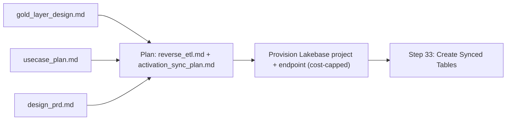
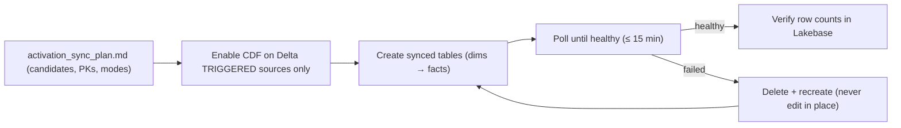
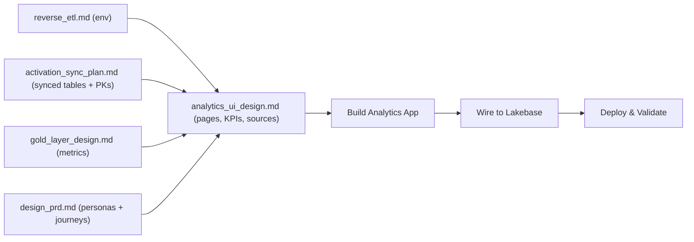
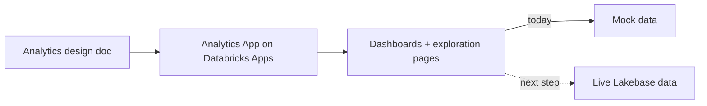
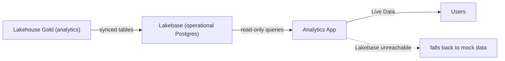
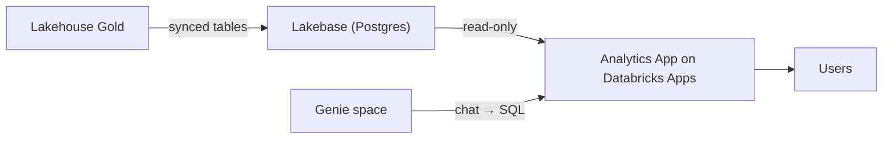

# Activation — Reverse ETL

Push curated gold insights back to an operational store and surface them in an activation app.

> Auto-generated from `02_seed_section_input_prompts.sql`. Each section below corresponds to one `section_tag` in the workshop builder's `section_input_prompts` table.

## Sections in this category

| Step (order) | Section | `section_tag` | Forks |
|---|---|---|---|
| 32 | [Plan Synced Tables](#plan-synced-tables) | `activation_table_design` | genie-code |
| 33 | [Create Synced Tables](#create-synced-tables) | `activation_reverse_sync` | genie-code |
| 34 | [Design Analytics App](#design-analytics-app) | `activation_app_design` | genie-code |
| 35 | [Build Analytics App](#build-analytics-app) | `activation_build_wire` | genie-code |
| 36 | [Wire to Lakebase](#wire-to-lakebase) | `activation_wire_lakebase` | genie-code |
| 37 | [Deploy & Validate](#deploy-validate) | `activation_deploy_validate` | genie-code |

---

## Plan Synced Tables

| Field | Value |
|-------|-------|
| `input_id` | `141` |
| `section_tag` | `activation_table_design` |
| `order_number` | `32` |
| `coding_assistant` | `__default__` |
| `bypass_llm` | `true` |

_Design which Gold assets to sync into Lakebase via Synced Tables, including keys, modes, and types_

**Input Template** (the prompt the section feeds to the LLM / pastes verbatim):

````
## Your Task

Plan which Gold layer assets to sync from the Lakehouse into Lakebase PostgreSQL using Databricks Synced Tables, then emit two design artifacts for every downstream reverse-ETL step: a shared reverse-ETL context document and a sync plan.

- **Source:** `{lakehouse_default_catalog}.{user_schema_prefix}` (Gold)
- **Target:** Lakebase Autoscaling project `{user_app_name}` (one project per student)
- **Output artifacts (both required):**
  - `@docs/reverse_etl.md` -- shared single source of truth for every downstream step
  - `@docs/activation_sync_plan.md` -- per-candidate sync plan

---

### Mandatory Reads

- `@docs/gold_layer_design.md` -- Gold tables, Metric Views, TVFs, and relationships
- `@docs/usecase_plan.md` -- which artifacts the app needs
- `@docs/design_prd.md` -- personas and analytics use cases the app must serve

---

### Steps

1. Write `@docs/reverse_etl.md` first so Steps 33-37 can read back a single, authoritative environment block. It must contain **exactly** these fields:

   ```
   workspace_url:            {workspace_url}
   lakehouse_default_catalog: {lakehouse_default_catalog}
   user_schema_prefix:       {user_schema_prefix}
   user_app_name:            {user_app_name}    # also Lakebase project_id
   lakebase_instance_name:   {lakebase_instance_name}
   lakebase_postgres_database: databricks_postgres   # fixed Lakebase default DB
   lakebase_postgres_schema: {user_schema_prefix}    # custom schema; NOT public, NOT _gold
   lakebase_root_branch:     production               # root branch is always production
   endpoint_name:            projects/{user_app_name}/branches/production/endpoints/primary
   lakebase_mode:            autoscaling               # workshop is Autoscaling-only

   # Cost controls (workshop defaults; every later step MUST respect these)
   autoscaling_limit_min_cu:     0.5                   # floor compute; allows scale-to-zero
   autoscaling_limit_max_cu:     2.0                   # ceiling compute; do NOT raise during workshop
   suspend_timeout_duration:     1800s                 # idle -> suspend after 30 minutes (long enough that a student reading docs or stepping away does NOT trigger mid-workshop cold starts)
   endpoint_type:                ENDPOINT_TYPE_READ_WRITE
   sync_mode_allowlist:          ["SNAPSHOT", "TRIGGERED"]   # CONTINUOUS is banned for cost reasons
   triggered_min_cron_interval:  24h                   # TRIGGERED cadence floor
   ```

2. **Ensure the Lakebase project exists with cost-optimized sizing** (idempotent; safe to re-run):

   > **Client note:** IDE runs these in a terminal; Genie Code runs the `databricks …` commands via `runDatabricksCli` (pre-authenticated; resolved channel in `## Environment Capabilities`). See `genie-code-environment`.

   ```bash
   # Create the per-student project if it does not already exist (ignore "already exists")
   databricks postgres create-project {user_app_name} --json ''{"spec": {"display_name": "{user_app_name}"}}''

   # Apply or re-apply the cost-control settings on the primary endpoint
   databricks postgres update-endpoint projects/{user_app_name}/branches/production/endpoints/primary "spec" --json ''{"spec": {"endpoint_type": "ENDPOINT_TYPE_READ_WRITE", "autoscaling_limit_min_cu": 0.5, "autoscaling_limit_max_cu": 2.0, "suspend_timeout_duration": "1800s"}}''

   # Verify the settings round-trip
   databricks postgres get-endpoint projects/{user_app_name}/branches/production/endpoints/primary --output json
   ```

   If `get-endpoint` comes back with `autoscaling_limit_max_cu > 2.0`, `suspend_timeout_duration` unset, or `suspend_timeout_duration < 1800s` or `> 1800s`, re-run `update-endpoint` -- do not proceed to Step 3 until the endpoint reports the workshop defaults (including the 30-minute suspend window). Record the actual host (`status.hosts.host`) into `@docs/reverse_etl.md` as `lakebase_host`.

3. Inventory sync candidates from the Gold design (tables, Metric Views, TVFs) and map each to a stable primary key.
4. Choose a sync mode per candidate -- **SNAPSHOT or TRIGGERED only** (see Technical Guardrails; CONTINUOUS is banned as a cost control).
5. Flag columns that need type mitigation (ARRAY/MAP/STRUCT -> JSONB; GEOGRAPHY/GEOMETRY/VARIANT/OBJECT unsupported -- drop or cast).
6. Order the candidates so dependencies (dims) are created before dependents (facts).
7. Save the plan to `@docs/activation_sync_plan.md`. Reference `@docs/reverse_etl.md` for the environment block instead of re-inlining values. Include a candidate table (source object, synced name, PK, mode, type notes), creation order, and CDF enablement notes per candidate. Every TRIGGERED candidate must cite a cron expression `>= 24h`.

---

### Technical Guardrails (IDE agent cannot guess these)

- **Autoscaling-only workshop.** Students each own one Lakebase project identified by `project_id = {user_app_name}`; the root branch is `production`. Do not design around Provisioned Lakebase, resource links, or PGPASSWORD flows.
- **Target Postgres schema is `{user_schema_prefix}`** (no `_gold` suffix, not `public`). Lakebase creates a default `public` schema per database but this workshop uses a custom schema; record this in `@docs/reverse_etl.md` and reference it from every later step.
- **Synced table names MUST differ from source** -- append a `_synced` suffix (e.g., `fact_flights` -> `fact_flights_synced`). Names must be `[A-Za-z0-9_]+` only.
- **SNAPSHOT is the only valid mode for non-Delta sources.** Metric Views, Table-Valued Functions (TVFs), and Iceberg sources do NOT support Change Data Feed and therefore cannot be TRIGGERED. Mark these as SNAPSHOT in the sync plan and add a one-line note "non-Delta; SNAPSHOT only; CDF not applicable" so Step 33 will not attempt to enable CDF on them.
- **TRIGGERED** for Delta tables that change on a known cadence (CDF required on the source Delta table).
- Type map and unsupported types are in this step's "How to Apply" reference -- use it, do not guess.

---

### Cost Controls (workshop hard limits -- the IDE agent MUST enforce these)

- **CONTINUOUS sync mode is banned.** It incurs streaming compute 24/7 and blows the workshop budget in hours. If any candidate is marked CONTINUOUS in the Gold design, convert it to SNAPSHOT (or TRIGGERED with >=24h cron for Delta sources) and note the conversion in the sync plan. No exceptions.
- **Endpoint sizing is capped.** `autoscaling_limit_min_cu = 0.5`, `autoscaling_limit_max_cu = 2.0`. Do NOT call `update-endpoint` with a higher `max_cu` at any point in Steps 32-37, and do not disable autoscaling. If a student reports slow queries, document it -- do not raise the ceiling in the workshop.
- **Scale-to-zero must stay on, but must not trigger mid-workshop.** `suspend_timeout_duration = 1800s` (30 minutes). This window is intentionally long enough that a student reading docs, watching a demo video, or stepping away briefly will NOT hit a cold start in the middle of their workshop -- a 5-minute window would cause repeated mid-session cold-starts and is not acceptable. It is still short enough that a forgotten endpoint suspends within half an hour of true idle. Never set it to `0s` / `never` / any value other than `1800s`. A suspended Lakebase project costs $0 compute; a non-suspending one can idle-bill the whole workshop.
- **TRIGGERED cron floor is 24h.** Sub-daily schedules multiply sync compute and Lakebase write cost.
- **One project per student.** Do not create additional projects/branches/endpoints beyond the required `production` branch + `primary` endpoint -- each extra endpoint is independently billable.

---

### Done When

- `@docs/reverse_etl.md` exists with all fields listed above, including the cost-control block and the actual `lakebase_host` from `get-endpoint`.
- The Lakebase project `{user_app_name}` exists and `get-endpoint` returns `autoscaling_limit_min_cu=0.5`, `autoscaling_limit_max_cu=2.0`, `suspend_timeout_duration=1800s` (30 minutes).
- `@docs/activation_sync_plan.md` exists with: candidate table, per-candidate PK + sync mode + type notes, creation order, and per-candidate CDF notes (including explicit "CDF not applicable" rows for Metric Views / TVFs / Iceberg).
- Every synced name uses the `_synced` suffix.
- No candidate is marked CONTINUOUS. Every TRIGGERED candidate cites a `>=24h` cron.
- STOP after saving -- do not create synced tables in this step.

**State-lock (`skills/vibecoding-state`) — run this prompt between an `enter` and an `exit` so workshop state is resolved and locked:**

1. **Phase 0 — first, before any step below:** `skills/vibecoding-state` op `enter` — params: `prompt_id: "activation_table_design"`. `enter` resolves the `## Environment Capabilities` triple (deploy verb, CLI channel, `state_file_root`) so every deploy/run step below uses the resolved channel — `runDatabricksCli` on Genie Code — and writes state under `state_file_root`, never a bare-local assumption.
2. **Final — after the step succeeds:** `skills/vibecoding-state` op `exit` — params: `prompt_id: "activation_table_design"`, `gate: "Synced tables planned"`, `captured: {user_app_name, endpoint_name}`.

**Gate:** `Synced tables planned` — the reverse-ETL and synced-table plan checklists are complete and the Lakebase project and endpoint are identified.
````

**System Prompt:**

```
You are a data architect planning reverse ETL sync from Databricks Lakehouse to Lakebase PostgreSQL using Synced Tables.

This prompt is returned as-is for direct use in Cursor/Copilot. No LLM processing.
```

<details><summary><strong>How to Apply</strong> (user-facing guidance)</summary>

## 1️⃣ How To Apply

Copy the prompt above, start a **new Agent chat** in your coding assistant, and paste it.

### Prerequisite

**Run this in your cloned Template Repository** (see Prerequisites in Step 0).

Ensure you have:
- ✅ Completed Gold layer design, use-case plan, and PRD
- ✅ Access to your `{lakehouse_default_catalog}.{user_schema_prefix}` Gold schema
- ✅ Permission to create a Lakebase project (one per student, `{user_app_name}`)

### Steps to Apply

**Step 1:** Start a new Agent thread in your coding assistant
**Step 2:** Copy the prompt and paste it into your coding assistant
**Step 3:** The assistant reads the Gold design, use-case plan, and PRD, then inventories sync candidates (PKs + modes)
**Step 4:** It writes `reverse_etl.md` (the shared environment block) and `activation_sync_plan.md` (the per-candidate plan)
**Step 5:** It ensures the **cost-capped** Lakebase project + endpoint exist, then **STOPS** (no synced tables yet)
**Step 6:** Review the plan against your actual Gold schema before proceeding

> **Client note — same plan + same cost caps, different provisioning mechanism:**
> - **IDE (Cursor/Copilot):** creates and sizes the Lakebase project imperatively with the Databricks CLI.
> - **Genie Code:** declares the Lakebase project as a **Databricks Asset Bundle** resource and lets the bundle deploy create it — so the cost caps live in version-controlled config rather than a one-off command.

---

## 2️⃣ What Are We Building?

Two design artifacts plus a **cost-capped Lakebase project** to receive the synced tables. `reverse_etl.md` is the single source of truth every downstream step reads back; `activation_sync_plan.md` lists exactly what to sync, how, and in what order.



**Sync modes** — choose one per candidate:

| Mode | Use for | Cadence | CDF on source |
|------|---------|---------|---------------|
| **SNAPSHOT** | Metric Views, TVFs, Iceberg, any non-Delta source; full refresh | full copy on demand/schedule | not applicable |
| **TRIGGERED** | Delta tables that change on a known cadence | cron **≥ 24h** | required |
| ~~**CONTINUOUS**~~ | **Banned** — 24/7 streaming compute blows the budget | — | — |

> **The plan also captures two practical rules:** complex Lakehouse types (arrays, maps, structs, geospatial) get a mapping note for Postgres, and every synced table gets a `_synced` suffix (`fact_flights` → `fact_flights_synced`) so it never collides with its source.

---

## 3️⃣ Why Are We Building It This Way? (Databricks Best Practices)

| Practice | How It's Used Here |
|----------|--------------------|
| **Cost caps enforced** | A capped compute ceiling plus scale-to-zero — Lakebase suspends when idle (costing nothing) and never scales beyond the workshop budget |
| **CONTINUOUS banned** | Streaming compute runs 24/7 — every candidate is SNAPSHOT or TRIGGERED (≥24h cron) instead |
| **Plan before sync** | `reverse_etl.md` + `activation_sync_plan.md` are authored and reviewed before any table is created, so Steps 33-37 read them back instead of re-deriving |
| **Declarative provisioning** (Genie) | Lakebase lives as bundle resources under source control — caps are reviewable, and `bundle destroy` cleans up; a hand-created project has no versioned trail |
| **One project per student** | A single `production` branch + `primary` endpoint — every extra endpoint is independently billable |
| **Dependency ordering** | Dimensions are created before facts so foreign-key targets exist first |

---

## 4️⃣ What Happens Behind the Scenes?

1. **Inputs read** — the assistant reads the Gold design, use-case plan, and PRD to find sync candidates.
2. **Candidates inventoried** — each gets a stable primary key, a sync mode (SNAPSHOT/TRIGGERED), and type-mitigation notes; CONTINUOUS candidates are converted.
3. **Docs written** — `reverse_etl.md` (environment + cost-control block) and `activation_sync_plan.md` (ordered candidate table) are saved.
4. **Project ensured** — the cost-capped Lakebase project + `primary` endpoint are created (IDE: `postgres` CLI; Genie: `bundle deploy` of the resource YAML).
5. **Caps verified** — a read-only check confirms the cost caps held, and the resolved connection details are recorded into `reverse_etl.md` for the downstream steps.

</details>

<details><summary><strong>Expected Output</strong></summary>

## Expected Output

- `@docs/reverse_etl.md` with:
  - [ ] Workspace, catalog, schema, app name, and Lakebase instance fields from the environment block
  - [ ] `lakebase_postgres_database: databricks_postgres` and `lakebase_postgres_schema: {user_schema_prefix}`
  - [ ] `endpoint_name: projects/{user_app_name}/branches/production/endpoints/primary`
  - [ ] `lakebase_mode: autoscaling`
  - [ ] Cost-control block: `autoscaling_limit_min_cu: 0.5`, `autoscaling_limit_max_cu: 2.0`, `suspend_timeout_duration: 1800s` (30 min so students don't cold-start mid-workshop), `triggered_min_cron_interval: 24h`, `sync_mode_allowlist: ["SNAPSHOT","TRIGGERED"]`
  - [ ] `lakebase_host` recorded from `databricks postgres get-endpoint`

- Lakebase project `{user_app_name}` exists with `get-endpoint` reporting min_cu=0.5, max_cu=2.0, suspend_timeout=1800s (30 minutes)

- `@docs/activation_sync_plan.md` with:
  - [ ] List of Gold tables, Metric Views, and TVFs targeted for sync
  - [ ] Primary key strategy per synced object
  - [ ] Sync mode (SNAPSHOT / TRIGGERED) per object — no CONTINUOUS (hard cost control)
  - [ ] SNAPSHOT forced for Metric Views / TVFs / Iceberg (CDF not applicable)
  - [ ] Each TRIGGERED entry cites a `>=24h` cron
  - [ ] Data type mapping notes and mitigations
  - [ ] Ordered creation checklist

</details>

#### Fork — `coding_assistant = genie-code`  (input_id 924)

> Fork rows override only `input_template`, `system_prompt`, and `bypass_llm`. All display fields are inherited from the default row above.

| Field | Value |
|-------|-------|
| `input_id` | `924` |
| `section_tag` | `activation_table_design` |
| `order_number` | `(inherited)` |
| `coding_assistant` | `genie-code` |
| `bypass_llm` | `true` |

**Input Template** (the prompt the section feeds to the LLM / pastes verbatim):

````
Plan the reverse-ETL synced tables and author the Lakebase bundle resource. Before this step there is no sync plan; after it, the planning docs and the Lakebase bundle resource are authored and deployed from the bundle editor, with endpoint caps verified.

This will involve the following steps:

- **Resolve the target catalog** — no-create invariant (HARD STOP if absent).
- **Load the skills** — full `skill_ref_root`-prefixed paths.
- **Author the plan and the Lakebase bundle resource** — write only, do NOT deploy yet.
- **Wire the resource** — into the bundle `include:`.
- **Deploy from the bundle editor** — validate, summary, then deploy from that page.
- **Verify the endpoint caps** — read-only, and record the host.

The steps below are the prescriptive runbook for those actions; follow them in order.

**Genie Code — this is a prescriptive runbook. Follow the steps in order. Do NOT improvise paths, do NOT use bare relative paths, do NOT use `@`-mentions, and do NOT provision Lakebase by hand. Every skill is named by its full `skill_ref_root`-prefixed path; every artifact is anchored to `<artifact_root>` or `<DP_BUNDLE_ROOT>`; the Lakebase project + endpoint are provisioned by a deployed bundle — never by the `databricks postgres` CLI, the REST create API, or the SDK.**

### 🔴 Non-negotiable execution rule (read before anything)

❌ **NEVER** create or size the Lakebase project/endpoint with `databricks postgres create-project` / `update-endpoint` (the `postgres` CLI group is **blocked** on Genie Code), nor with a raw REST `POST`/`PATCH` create, nor with the `databricks.sdk.service.postgres` module (**absent** in this runtime — SDK 0.67.0). Provisioning is the **body of the bundle**: you declare `postgres_projects` + `postgres_endpoints` resources and let `bundle deploy` create them. The bundle **is** the execution mechanism — never bypass it, even though a direct CLI/REST call is faster. A live project with no versioned bundle behind it (no `bundle destroy` cleanup, no cost caps under source control) is the regression this fork exists to prevent.

✅ The ONLY things you run directly are (a) **read-only** inspection (`w.catalogs.list()`, REST `GET …/endpoints/primary`) and (b) `databricks bundle validate` / `summary` / `deploy` through `runDatabricksCli`. If `bundle deploy` is blocked, FIX the page context (open the bundle editor — Step 3) — do **not** fall back to the `postgres` CLI, REST create, or the SDK.

### Step 0 — Resolve your environment (once, before anything else)

Run `skills/vibecoding-state` operation `enter` with `prompt_id: "activation_table_design"` and `require_prior_gate: {prompt_id: "gold_layer_pipeline", gate: "Gold layer live"}` (or the latest upstream Gold/semantic gate your track defines). It writes and echoes the `## Environment Capabilities` block. Read these resolved values and use them literally throughout:

- `client_context` = `genie_code`
- `artifact_root` = your workshop project root (e.g. `/Workspace/Users/<your-email>/vibe-coding-workshop`) — where all generated bundles/apps/docs build; the repo itself is cloned at `/Workspace/Users/<your-email>/.assistant/skills/vibe-coding-workshop` (skills load from there via `skill_ref_root`, NOT from `artifact_root`)
- `skill_ref_root` = `skills/vibe-coding-workshop` (substitute your clone folder if you cloned somewhere other than `.assistant/skills/vibe-coding-workshop`)
- `dp_bundle_root` = `<artifact_root>/{user_schema_prefix}_{use_case_slug}_dab` — the **self-contained Databricks Asset Bundle project** for the whole data-product pipeline (e.g. `…/vibe-coding-workshop/{user_schema_prefix}_booking_app_dab`). This is the SAME bundle you created for Bronze/Silver/Gold — **extend it; do NOT make a new one.** It is where `databricks.yml`, `src/`, and `resources/` live, and the **page you deploy from**. Referred to below as `<DP_BUNDLE_ROOT>`.
- `user_app_name` = your per-student app name, which is ALSO the Lakebase `project_id` (one project per student).
- deploy verb = `bundle deploy --target dev`, run through the `runDatabricksCli` tool.

If `enter` reports the upstream Gold gate is not met, STOP — finish the Gold step first. If `enter` has not run in this thread, run it now — every step below depends on these values.

**On resume after a context reset:** trust the live state file over any chat summary — a prompt whose state entry shows its gate PASSED is DONE (do NOT re-run it), and before re-writing files reconcile what is already on disk with `os.listdir(...)` (NOT `listFiles`, which lags FUSE writes) against the state file's captured paths, so you resume rather than recreate.

### Step 0.5 — Resolve the target catalog (no-create invariant — HARD STOP if absent)

Catalogs are pre-provisioned in this workshop — you must **NEVER** create one. Resolve the catalog read-only, BEFORE authoring anything:

1. **List existing catalogs (read-only):** `executeCode` → `[c.name for c in w.catalogs.list()]` (or `SHOW CATALOGS`).
2. **If `{lakehouse_default_catalog}` is present** → proceed; use it literally everywhere below as the Gold source catalog.
3. **If `{lakehouse_default_catalog}` is ABSENT → 🛑 HARD STOP. Do NOT create it.** Print the existing catalogs as a numbered list and ask the operator to pick the catalog to use. Re-run this step with their choice and record it so the `exit` capture persists it.

### Step 1 — Load the required skills by their FULL `skill_ref_root`-prefixed paths

Load each skill with `readSkillFile` using its fully-qualified `<skill_ref_root>`-prefixed path — NEVER a bare `@…` mention, NEVER a repo-relative path. **The root-level `skills/` come FIRST: they are the highest-priority, always-on guardrails and govern everything below.** Read independent skills in ONE batched `readSkillFile` turn (`genie-code-environment` §10 — Genie Code reads multiple files in parallel in a single turn).

1. `readSkillFile("skills/vibe-coding-workshop/skills/databricks-asset-bundles/SKILL.md")` — bundle structure, the `include:` glob list, `targets.dev`, serverless config, and the multi-user `${var.user_prefix}` "Shared Workspace Naming" pattern. **You will not write any resource YAML or touch `databricks.yml` until you have read this.**
2. `readSkillFile("skills/vibe-coding-workshop/skills/genie-code-environment/SKILL.md")` — Genie Code runtime facts: the `postgres`/`database` CLI groups are blocked; `runDatabricksCli` and `w` are pre-authenticated; the file-write tiers; and the bundle-page requirement for any `databricks bundle …` command.

**🔴 Preflight acknowledgement (hard gate — do this BEFORE writing any file).** Echo a one-line acknowledgement of EACH skill's rule. If you cannot state a skill's rule, you have not read it — STOP and read it before writing anything. Do not author `reverse_etl.md`, the sync plan, or the resource YAML until both skills are acknowledged.

### Step 2 — Author the planning docs AND the Lakebase bundle resource (write only — do NOT deploy yet)

Write all three artifacts; do NOT run any provisioning command in this step.

**(a) `<artifact_root>/docs/reverse_etl.md`** — the shared single source of truth for Steps 33+ (`<artifact_root>`-anchored path, NOT `@docs/…`). It MUST contain exactly these fields:

```
workspace_url:              {workspace_url}
lakehouse_default_catalog:  {lakehouse_default_catalog}
user_schema_prefix:         {user_schema_prefix}
user_app_name:              {user_app_name}    # also Lakebase project_id
lakebase_instance_name:     {lakebase_instance_name}   # Autoscaling project instance reference (passthrough for later steps)
lakebase_postgres_database: databricks_postgres   # fixed Lakebase default DB
lakebase_postgres_schema:   {user_schema_prefix}  # custom schema; NOT public, NOT _gold
lakebase_root_branch:       production              # root branch is always production
endpoint_name:              projects/{user_app_name}/branches/production/endpoints/primary
lakebase_mode:              autoscaling             # workshop is Autoscaling-only
lakebase_host:              <filled in Step 4 from the endpoint GET>

# Cost controls (workshop defaults; every later step MUST respect these)
autoscaling_limit_min_cu:    0.5                    # floor compute; allows scale-to-zero
autoscaling_limit_max_cu:    2.0                    # ceiling compute; do NOT raise during workshop
suspend_timeout_duration:    1800s                  # idle -> suspend after 30 minutes
endpoint_type:               ENDPOINT_TYPE_READ_WRITE
sync_mode_allowlist:         ["SNAPSHOT", "TRIGGERED"]   # CONTINUOUS is banned for cost reasons
triggered_min_cron_interval: 24h                    # TRIGGERED cadence floor
```

**(b) `<artifact_root>/docs/activation_sync_plan.md`** — per-candidate sync plan. Reference `reverse_etl.md` for the environment block instead of re-inlining values. Inventory sync candidates from the Gold design (tables, Metric Views, TVFs), and for each record: source object, `_synced` target name, primary key, sync mode, type-mitigation notes, and a per-candidate CDF note. Ordering rules:
- **SNAPSHOT or TRIGGERED only** (CONTINUOUS is banned — convert any CONTINUOUS candidate and note the conversion).
- **SNAPSHOT forced for Metric Views / TVFs / Iceberg** (non-Delta; CDF not applicable — add a one-line "CDF not applicable" note so Step 33 skips them).
- **TRIGGERED** only for Delta tables that change on a known cadence; each TRIGGERED candidate cites a cron `>= 24h`.
- Type map: `ARRAY`/`MAP`/`STRUCT` → JSONB; `GEOGRAPHY`/`GEOMETRY`/`VARIANT`/`OBJECT` unsupported (drop or cast).
- Order candidates so dependencies (dims) are created before dependents (facts).
- Synced names MUST differ from source, end in `_synced`, and be `[A-Za-z0-9_]+` only.

**(c) `<DP_BUNDLE_ROOT>/resources/lakebase/lakebase_project.yml`** — the declarative Lakebase provisioning, cost caps baked in. `postgres_projects` and `postgres_endpoints` are first-class, schema-validated DAB resource types (confirmed via `bundle validate` + `bundle summary` — see Step 3):

```yaml
resources:
  postgres_projects:
    activation:
      project_id: {user_app_name}
      display_name: {user_app_name}
      pg_version: 17
  postgres_endpoints:
    primary:
      endpoint_id: primary
      endpoint_type: ENDPOINT_TYPE_READ_WRITE
      parent: projects/{user_app_name}/branches/production
      autoscaling_limit_min_cu: 0.5
      autoscaling_limit_max_cu: 2.0
      suspend_timeout_duration: "1800s"
```

🔴 **The caps above are workshop hard limits.** Do NOT raise `autoscaling_limit_max_cu` above `2.0`, do NOT change `suspend_timeout_duration` away from `1800s` (a suspended project costs $0 compute; the 30-minute window is long enough that a student reading docs will not cold-start mid-workshop), and do NOT declare any extra branches or endpoints — each extra endpoint is independently billable. One project, one `production` branch, one `primary` endpoint per student.

Write each file with `executeCode` `open(path,"w").write(...)` against warm compute (make the FIRST `executeCode` a trivial `print("ready")` to absorb the ~3–5 min serverless cold start; never set `timeoutMinutes` below 15). 🔴 **Verify every write with `os.path.exists(path)` (or `os.listdir(dir)`) in the SAME `executeCode` block — NOT `listFiles`:** the workspace REST API behind `listFiles` lags FUSE-written files and returns false "missing-file" negatives.

### Step 2.5 — Wire the new resource dir into the bundle `include:`

The DP bundle pulls resources via **subdirectory globs** (`resources/bronze/*.yml`, `resources/silver/*.yml`, `resources/gold/*.yml`, …) — a bare `resources/*.yml` is **NOT** globbed (confirmed by probe: a file dropped at `resources/` root is never parsed). Edit the EXISTING on-page `<DP_BUNDLE_ROOT>/databricks.yml` to add `resources/lakebase/*.yml` to the `include:` list, alongside the existing layer globs. Confirm `targets.dev.presets.source_linked_deployment: false` is still present (inherited from Bronze) — never enable source-linked deployment. Edit the on-page `databricks.yml` (workspaceUpdateFile or `executeCode`) — files created via the workspace API may not reach the CLI's FUSE mount.

### Step 3 — Open the bundle editor, then validate → summary → deploy FROM that page

- **Open the bundle editor BEFORE any `bundle` command — and surface its link.** `<DP_BUNDLE_ROOT>/databricks.yml` already exists (from Bronze), so the workspace file browser shows the **"Open in bundle editor"** affordance on that folder (and an **"Open in editor"** button at the top). Its page CWD IS `<DP_BUNDLE_ROOT>` — the bundle-root page `bundle deploy`/`validate`/`summary` require, where Genie Code runs them pre-approved. **Do not make the operator hunt for the icon** — build a clickable link with the pre-authenticated `WorkspaceClient` (`w`) and print it:
  - `host = w.config.host`; `o = w.get_workspace_id()`
  - `file_id = w.workspace.get_status("<DP_BUNDLE_ROOT>/databricks.yml").object_id`
  - `folder_id = w.workspace.get_status("<DP_BUNDLE_ROOT>").object_id`
  - **Bundle editor:** `{host}/editor/files/{file_id}?o={o}&contextId=folder%3A{folder_id}` (plain folder: `{host}/browse/folders/{folder_id}?o={o}`)

  Tell the operator to open the **bundle-editor link**, then run every `databricks bundle …` command below from that page. Edit the EXISTING on-page `databricks.yml` — files created via the workspace API may not reach the CLI's FUSE mount.
- Run through `runDatabricksCli`, **from the bundle-editor page**, each with `--target dev` (mandatory — a target-less deploy is guardrail-blocked):
  - `databricks bundle validate --target dev` — expect **zero** warnings on the lakebase resources. A `Warning: unknown field …` on `postgres_projects`/`postgres_endpoints` means a typo (the schema is strict) — fix the field name and re-validate.
  - `databricks bundle summary --target dev` — confirm `Postgres projects: activation` and `Postgres endpoints: primary` appear in the resolved resource graph. A silently-ignored resource never shows in `summary`; their appearance proves the bundle will manage them.
  - `databricks bundle deploy --target dev` — creates the project + primary endpoint with the caps.
- **🛑 If a `bundle` command is blocked or fails, STOP — do not work around it.** A `databricks.yml not found` error or a "blocked by safety guardrails" message means you are NOT on the bundle page: open the **bundle-editor link** above and retry (CONFIRMED — the same `bundle` command that is "blocked" from a file page succeeds from the bundle editor). If it STILL fails from the bundle editor, STOP and report the blocker. Do **NOT** provision via the `postgres` CLI, the REST create API, or the SDK to "get it done" — that silently defeats the bundle and FAILS the gate. The REST/SDK route is an **escape hatch available only if the operator explicitly authorizes it.**
- 🔴 **Adoption residual — settle it here, at deploy.** Declaring `endpoint_id: primary` may adopt the auto-created primary endpoint, and deploying a `project_id` that already exists may adopt or conflict. If `bundle deploy` errors with an "already exists" / ownership conflict, **STOP and report the exact message** — do NOT delete the live project and do NOT fall to a REST create. Adoption/import is an operator decision.

### Step 4 — Verify the endpoint caps (read-only) and record the host

Read-only REST GET — do NOT use the blocked `postgres` CLI:

```python
ep = w.api_client.do(
    "GET",
    "/api/2.0/postgres/projects/{user_app_name}/branches/production/endpoints/primary",
)
```

Assert the round-tripped settings: `autoscaling_limit_min_cu == 0.5`, `autoscaling_limit_max_cu == 2.0`, `suspend_timeout_duration == "1800s"`, `endpoint_type == "ENDPOINT_TYPE_READ_WRITE"`. If anything drifted, fix the YAML and re-deploy (Step 3) — do NOT call `update-endpoint`. Record the actual host (`status.hosts[...].host` / `status.host`) into `<artifact_root>/docs/reverse_etl.md` as `lakebase_host`.

**State-lock:** this prompt runs between an `enter` (Step 0) and an `exit`. After the gate passes, run `skills/vibecoding-state` op `exit` — params: `prompt_id: "activation_table_design"`, `gate: "Synced tables planned"`, `captured: {user_app_name, endpoint_name, lakebase_host}`. **This `enter`/`exit` pair is a mandatory ritual, not advisory.** The closing `exit` MUST append this prompt's Per-Step Log entry, Gate result, and `captured` vars to the canonical live state file at `<dp_bundle_root>/.vibecoding-state.md`, then **re-read it and echo the appended section to prove the write landed**. **Gate completion rule:** this prompt is NOT complete until that re-read confirms the appended entry — the chat summary is NOT the state store.

**Gate:** `Synced tables planned` — `<artifact_root>/docs/reverse_etl.md` and `<artifact_root>/docs/activation_sync_plan.md` exist with all required fields (including the cost-control block and the `lakebase_host` from the endpoint GET), AND the Lakebase project + primary endpoint were **created by `bundle deploy`** (visible in `bundle summary`) with a read-only GET confirming `min_cu=0.5, max_cu=2.0, suspend=1800s`. Docs existing is **necessary but NOT sufficient** — if the project/endpoint were provisioned by the `postgres` CLI, REST create, or SDK instead of the deployed bundle, the gate FAILS and you must redo it via the bundle.

**➡️ Next step — keep the bundle editor open.** Step 33 (**Create Synced Tables**) creates the synced tables via the pre-authenticated REST client (`w.api_client.do` — synced tables are NOT a bundle resource type) against the project this step provisioned.
````

---

## Create Synced Tables

| Field | Value |
|-------|-------|
| `input_id` | `142` |
| `section_tag` | `activation_reverse_sync` |
| `order_number` | `33` |
| `coding_assistant` | `__default__` |
| `bypass_llm` | `true` |

_Create Synced Tables from Gold layer into Lakebase using the Databricks REST API_

**Input Template** (the prompt the section feeds to the LLM / pastes verbatim):

````
## Your Task

Create Synced Tables in Lakebase by calling the Databricks Postgres REST API for each candidate in Step 32's sync plan, then poll each to a healthy state and verify row counts.

Environment values (workspace, project, root branch, endpoint, Postgres database/schema, source schema) come from `@docs/reverse_etl.md`. Candidate list, PKs, sync modes, and dependency order come from `@docs/activation_sync_plan.md`. Do not restate them here -- read them back from those docs at runtime.

---

### Mandatory Reads

- `@docs/reverse_etl.md` -- authoritative environment block (workspace, catalog, schema, project, branch, endpoint, mode)
- `@docs/activation_sync_plan.md` -- the source of truth for which objects to sync, PKs, and modes
- `@docs/gold_layer_design.md` -- confirm source table names and columns actually exist

---

### Steps

1. Authenticate to Databricks (`databricks auth login --host {workspace_url}`) and fetch a bearer token for API calls via `databricks auth token`.
2. For every **Delta-sourced TRIGGERED** candidate, enable Change Data Feed on the source Delta table (`ALTER TABLE ... SET TBLPROPERTIES (delta.enableChangeDataFeed = true)`). Skip for SNAPSHOT and skip for any non-Delta source (Metric Views, TVFs, Iceberg) -- these must be SNAPSHOT per Step 32.
3. In dependency order (dims before facts), create one synced table per candidate by POSTing to the synced tables endpoint (see API Contract below).
4. After each create, poll the GET endpoint on a 10-second interval until `status.detailed_state` is a terminal healthy value (`ONLINE_TRIGGERED_UPDATE` / `ONLINE_NO_PENDING_UPDATE` / `ONLINE_SNAPSHOT_UPDATED`). Cap the wait at 15 minutes per table; if still not healthy, DELETE and recreate or surface the `status` payload for troubleshooting.
5. Query each synced table in Lakebase Postgres (`SELECT count(*) FROM {user_schema_prefix}.<synced_table>`) and confirm rows match expectations from the Gold source.
6. If a definition is wrong, DELETE the synced table and recreate -- do not edit in place.

---

### Technical Guardrails (IDE agent cannot guess these)

**SDK pitfalls -- do NOT use these:**
- `databricks.sdk.service.postgres` -- manages Lakebase infrastructure (projects/branches), NOT synced tables.
- `databricks.sdk.service.database.DatabaseInstancesAPI` -- Provisioned Lakebase only; this workshop is Autoscaling-only.
- Use the `requests` library directly (pre-installed on Databricks) with the bearer token from `databricks auth token`.

**API contract (the non-obvious bits):**
- Method + endpoint: `POST {workspace_url}/api/2.0/postgres/synced_tables` (underscores in path, not hyphens).
- `synced_table_id` is a **query parameter**, not a body field. Value shape: `{lakehouse_default_catalog}.{user_schema_prefix}.<table>_synced`.
- Request body is `{"spec": {...}}` at the root. Do NOT nest under `"synced_table"`.
- Required `spec` fields (Autoscaling, one project per student):
  - `source_table_full_name` -- three-level UC name of the Gold source
  - `project` -- `projects/{user_app_name}` (one project per student; matches `@docs/reverse_etl.md`)
  - `branch` -- `projects/{user_app_name}/branches/production` (root branch is always `production` for Autoscaling)
  - `primary_key_columns` -- list
  - `scheduling_policy` -- `SNAPSHOT` or `TRIGGERED` (no `CONTINUOUS`). Must match `@docs/activation_sync_plan.md`.
  - `postgres_database` -- `databricks_postgres` (Lakebase's default database)
  - `postgres_schema` -- `{user_schema_prefix}` (NOT `public`, NOT `_gold`)
  - `create_database_objects_if_missing` -- `true`
- GET status: `GET {workspace_url}/api/2.0/postgres/synced_tables/{synced_table_id}` -- read `status.detailed_state`.
- DELETE: `DELETE {workspace_url}/api/2.0/postgres/synced_tables/{synced_table_id}`.

**Polling pattern (required):**
```
import time, requests
deadline = time.time() + 900   # 15 minutes
while time.time() < deadline:
    state = requests.get(url, headers=auth).json()["status"]["detailed_state"]
    if state in {"ONLINE_TRIGGERED_UPDATE", "ONLINE_NO_PENDING_UPDATE", "ONLINE_SNAPSHOT_UPDATED"}:
        break
    if state.startswith("FAILED") or state == "OFFLINE_FAILED":
        raise RuntimeError(state)
    time.sleep(10)
```

**Workshop overrides (override the sync plan if it conflicts):**
- Synced table names must differ from source and end in `_synced`.
- Per-synced-table limits: up to 16 Lakebase connections; 8 TB total logical data across all synced tables; schema evolution is additive-only for TRIGGERED.
- **CDF is Delta-only.** Never attempt `ALTER TABLE ... SET TBLPROPERTIES (delta.enableChangeDataFeed = true)` on a Metric View, TVF, or Iceberg table -- it will fail. These must be SNAPSHOT.

**Cost Controls (hard limits -- re-checked here in case Step 32 was skipped):**
- **CONTINUOUS sync mode is banned** (per `@docs/reverse_etl.md` `sync_mode_allowlist`). If a candidate in `@docs/activation_sync_plan.md` says CONTINUOUS, convert it to SNAPSHOT (or TRIGGERED with a cron at the `triggered_min_cron_interval` floor from `@docs/reverse_etl.md` for a Delta source) and update the plan before calling the API. Do NOT POST a synced table with `scheduling_policy: "CONTINUOUS"`.
- **Honor the TRIGGERED cron floor** from `@docs/reverse_etl.md`. Reject any cron tighter than that floor -- even a single sub-floor TRIGGERED sync can dominate workshop cost.
- **Do NOT create new branches or endpoints.** Reuse the existing `production` branch and `primary` endpoint only. Any API call that would spawn an additional branch/endpoint is a cost regression and is not allowed in the workshop.
- **Do NOT call `update-endpoint`** to change sizing in this step. Endpoint sizing was set in Step 32 and must stay at the values recorded in `@docs/reverse_etl.md`.
- Before the first POST, re-run `databricks postgres get-endpoint projects/{user_app_name}/branches/production/endpoints/primary --output json` and confirm the sizing matches `@docs/reverse_etl.md`. If it has drifted, stop and re-apply from Step 32 before creating synced tables.

**CLI sandbox note:** run `databricks auth login`, `databricks auth token`, and any `databricks apps ...` commands outside the IDE sandbox to avoid SSL/TLS certificate errors.

**Docs:**
- Lakebase projects (Autoscaling): https://docs.databricks.com/aws/en/oltp/projects/manage-projects
- Synced Tables: https://docs.databricks.com/aws/en/oltp/projects/sync-tables
- createSyncedTable REST API: https://docs.databricks.com/api/workspace/postgres/createsyncedtable

---

### Done When

- Pre-flight `get-endpoint` confirms `min_cu=0.5`, `max_cu=2.0`, `suspend_timeout=1800s` (matches `@docs/reverse_etl.md`).
- CDF is enabled on every Delta source that a TRIGGERED candidate points at; no CDF attempts were made on non-Delta sources.
- No synced table was created with `scheduling_policy: "CONTINUOUS"`; every TRIGGERED entry uses a `>=24h` cron.
- Every candidate in `@docs/activation_sync_plan.md` has been created via the REST API contract above, with `spec.project = projects/{user_app_name}` and `spec.branch = projects/{user_app_name}/branches/production`, in dependency order.
- Polling shows a healthy `detailed_state` for each synced table within the 15-minute cap.
- `SELECT count(*) FROM {user_schema_prefix}.<synced_table>` returns non-zero row counts consistent with the Gold source.
- STOP after verification -- analytics app design is the next step.

**State-lock (`skills/vibecoding-state`) — run this prompt between an `enter` and an `exit` so workshop state is resolved and locked:**

1. **Phase 0 — first, before any step below:** `skills/vibecoding-state` op `enter` — params: `prompt_id: "activation_reverse_sync"`, `require_prior_gate: {prompt_id: "activation_table_design", gate: "Synced tables planned"}`. `enter` resolves the `## Environment Capabilities` triple (deploy verb, CLI channel, `state_file_root`) so every deploy/run step below uses the resolved channel — `runDatabricksCli` on Genie Code — and writes state under `state_file_root`, never a bare-local assumption.
2. **Final — after the step succeeds:** `skills/vibecoding-state` op `exit` — params: `prompt_id: "activation_reverse_sync"`, `gate: "Synced tables live"`, `captured: {synced_schema, synced_tables}`.

**Gate:** `Synced tables live` — every candidate table is synced with a healthy state and non-zero row counts.
````

**System Prompt:**

```
You are a Databricks engineer implementing Synced Tables for reverse ETL from the Lakehouse Gold layer into Lakebase PostgreSQL.

CLI Best Practices:
- Run CLI commands outside the IDE sandbox to avoid SSL/TLS certificate errors

This prompt is returned as-is for direct use in Cursor/Copilot. No LLM processing.
```

<details><summary><strong>How to Apply</strong> (user-facing guidance)</summary>

## 1️⃣ How To Apply

Copy the prompt above, start a **new Agent chat** in your coding assistant, and paste it.

### Prerequisite

**Run this in your cloned Template Repository.**

Ensure you have:
- ✅ Completed **Plan Synced Tables** (Step 32) — `reverse_etl.md` + `activation_sync_plan.md` exist and the Lakebase project is provisioned
- ✅ The cost-capped `primary` endpoint reachable (sizing unchanged from Step 32)

### Steps to Apply

**Step 1:** Start a new Agent thread in your coding assistant
**Step 2:** Copy the prompt and paste it into your coding assistant
**Step 3:** The assistant reads the sync plan + Gold design and enables CDF where needed
**Step 4:** It creates one synced table per candidate (in dependency order), then **polls** each to a healthy state
**Step 5:** It **verifies** row counts in Lakebase and stops

> **Client note — same outcome (synced tables created and healthy), different auth plumbing:**
> - **IDE (Cursor/Copilot):** you authenticate to the workspace, then the assistant drives the Databricks API to create and poll each synced table.
> - **Genie Code:** runs already authenticated inside the workspace, so it calls the same API directly — no login step.

---

## 2️⃣ What Are We Building?

**Synced Tables** that replicate your Gold layer into Lakebase PostgreSQL so the operational app can read low-latency rows. Each candidate is created, polled to health, and verified — in dependency order so dimensions exist before facts.



A synced table is **healthy** once its state reaches a terminal "online" value — the first load has finished and the table is ready to serve reads.

---

## 3️⃣ Why Are We Building It This Way? (Databricks Best Practices)

| Practice | How It's Used Here |
|----------|--------------------|
| **CDF only where valid** | Change Data Feed is enabled only on Delta sources backing TRIGGERED candidates — never on Metric Views, TVFs, or Iceberg (it fails there) |
| **DELETE + recreate** | A wrong definition is deleted and recreated, never edited in place, so state stays consistent |
| **Cost re-checks** | CONTINUOUS stays banned, the ≥24h cron floor is honored, and no new branch/endpoint is created — re-enforced here in case Step 32 was skipped |
| **Dependency ordering** | Dims sync before facts so foreign-key targets land first |

---

## 4️⃣ What Happens Behind the Scenes?

1. **Pre-flight** — the assistant reads the plan docs and confirms the endpoint caps did not drift from `reverse_etl.md`.
2. **CDF gate** — it turns on Change Data Feed for each Delta source behind a TRIGGERED candidate (skipping non-Delta sources, where it doesn't apply).
3. **Create** — it creates one synced table per candidate in dependency order, so dimensions land before the facts that reference them.
4. **Poll** — it waits for each table to finish its first load and reach a healthy state (≤15 min), deleting and recreating any that fail.
5. **Verify** — it confirms each table landed a non-zero row count in Lakebase before handing off.

### Reference: Capacity Constraints

- Each synced table uses up to **16 connections** to the Lakebase database
- Total logical data limit: **8 TB** across all synced tables
- Schema evolution: only **additive changes** for Triggered mode
- Throughput: ~150 rows/sec/CU (Triggered), ~2,000 rows/sec/CU (Snapshot)

### Reference: Scheduling Subsequent Syncs

After initial sync, Snapshot and Triggered modes need explicit triggers via REST API or Lakeflow Jobs cron schedule.

### Docs

- [Synced Tables](https://docs.databricks.com/aws/en/oltp/projects/sync-tables)
- [createSyncedTable REST API](https://docs.databricks.com/api/workspace/postgres/createsyncedtable)

</details>

<details><summary><strong>Expected Output</strong></summary>

## Expected Output

- [ ] CDF enabled on required source tables
- [ ] All synced tables created in dependency order
- [ ] Sync status confirmed healthy for each table
- [ ] Row counts verified in Lakebase

</details>

#### Fork — `coding_assistant = genie-code`  (input_id 925)

> Fork rows override only `input_template`, `system_prompt`, and `bypass_llm`. All display fields are inherited from the default row above.

| Field | Value |
|-------|-------|
| `input_id` | `925` |
| `section_tag` | `activation_reverse_sync` |
| `order_number` | `(inherited)` |
| `coding_assistant` | `genie-code` |
| `bypass_llm` | `true` |

**Input Template** (the prompt the section feeds to the LLM / pastes verbatim):

````
Reverse-sync the gold Lakehouse tables into Lakebase as synced tables. Before this step Lakebase has no data; after it, each synced table is created in dependency order, healthy, and row-count-verified in Lakebase.

This will involve the following steps:

- **Read the plan docs** — `<artifact_root>`-anchored paths.
- **Pre-flight** — confirm the endpoint caps did not drift (read-only).
- **Enable CDF** — on Delta sources for TRIGGERED candidates only (gated).
- **Create the synced tables** — via the REST client, in dependency order.
- **Poll and verify** — poll each to a healthy state, then verify row counts in Lakebase.

The steps below are the prescriptive runbook for those actions; follow them in order.

**Genie Code — this is a prescriptive runbook. Follow the steps in order. Do NOT improvise paths, do NOT use bare relative paths, do NOT use `@`-mentions, and do NOT use the `postgres` SDK module, the Provisioned `database` API, or the `databricks postgres` CLI. Synced tables are created with the pre-authenticated REST client (`w.api_client.do`); you are already authenticated — never run `databricks auth login`.**

### 🔴 Non-negotiable execution rule (read before anything)

❌ **NEVER** create synced tables with `databricks.sdk.service.postgres` (**absent** in this runtime — SDK 0.67.0), `databricks.sdk.service.database.DatabaseInstancesAPI` (**Provisioned** Lakebase only — this workshop is Autoscaling), or the `databricks postgres` CLI (**blocked** on Genie Code). ❌ **NEVER** run `databricks auth login` / `databricks auth token` — `runDatabricksCli` and the `w` client are already pre-authenticated to `{workspace_url}`.

✅ Create / poll / verify synced tables with the pre-authenticated `WorkspaceClient` via `executeCode`: `w.api_client.do("POST" | "GET" | "DELETE", "/api/2.0/postgres/synced_tables…")`. ✅ Enabling Change Data Feed on a **source Delta table** with `spark.sql` IS allowed here — it is a source-table property, not a synced-table create (the bundle-only invariant from the data-layer forks does not apply to a one-off `ALTER TABLE` on an already-deployed Gold table).

### Step 0 — Resolve your environment (once, before anything else)

Run `skills/vibecoding-state` operation `enter` with `prompt_id: "activation_reverse_sync"` and `require_prior_gate: {prompt_id: "activation_table_design", gate: "Synced tables planned"}`. Read the resolved `## Environment Capabilities` values and use them literally:

- `client_context` = `genie_code`
- `artifact_root` = your workshop project root (e.g. `/Workspace/Users/<your-email>/vibe-coding-workshop`) — where all generated bundles/apps/docs build; the repo itself is cloned at `/Workspace/Users/<your-email>/.assistant/skills/vibe-coding-workshop` (skills load from there via `skill_ref_root`, NOT from `artifact_root`)
- `skill_ref_root` = `skills/vibe-coding-workshop`
- `dp_bundle_root` = `<artifact_root>/{user_schema_prefix}_{use_case_slug}_dab` — the data-product bundle whose `.vibecoding-state.md` is the activation track's live state file (the SAME one Step 32 wrote). Referred to below as `<DP_BUNDLE_ROOT>`.

If `enter` reports the prior gate is not `Synced tables planned`, STOP — finish the **Plan Synced Tables** step (32) first. If `enter` has not run in this thread, run it now.

**On resume after a context reset:** trust the live state file over any chat summary — a synced table already created and healthy is DONE; before recreating, GET it first (`/api/2.0/postgres/synced_tables/{synced_table_id}`) and skip if already `ONLINE`.

### Step 1 — Read the plan docs (`<artifact_root>`-anchored paths, NOT `@docs/…`)

Read these back at runtime; do NOT restate their values in the prompt:

- `<artifact_root>/docs/reverse_etl.md` — authoritative environment block (workspace, catalog, `user_app_name`/project, `production` branch, endpoint, `databricks_postgres` database, `{user_schema_prefix}` Postgres schema, mode, and the cost-control block).
- `<artifact_root>/docs/activation_sync_plan.md` — the source of truth for which objects to sync, PKs, sync modes, type notes, and dependency order.
- `<artifact_root>/docs/gold_layer_design.md` — confirm the Gold source table names and columns actually exist.

### Step 2 — Pre-flight: confirm the endpoint caps did not drift (read-only)

Before the first create, read-only GET the endpoint and confirm it still matches `reverse_etl.md`:

```python
ep = w.api_client.do(
    "GET",
    "/api/2.0/postgres/projects/<user_app_name>/branches/production/endpoints/primary",
)
# assert min_cu == 0.5, max_cu == 2.0, suspend_timeout_duration == "1800s"
```

If sizing has drifted, STOP and re-apply from Step 32 (re-run the **Plan Synced Tables** provisioning step) — do NOT call `update-endpoint` here.

### Step 3 — Enable CDF on Delta sources for TRIGGERED candidates only (gated)

For every **Delta-sourced TRIGGERED** candidate, enable Change Data Feed. **Skip SNAPSHOT, and skip any non-Delta source** (Metric Views, TVFs, Iceberg) — those are SNAPSHOT-only per Step 32 and `ALTER TABLE … delta.enableChangeDataFeed` fails on them. Gate each with a format check so you never attempt CDF on a non-Delta source:

```python
fmt = spark.sql("DESCRIBE DETAIL <cat>.<schema>.<source>").collect()[0].asDict().get("format")
if fmt == "delta":
    spark.sql("ALTER TABLE <cat>.<schema>.<source> SET TBLPROPERTIES (delta.enableChangeDataFeed = true)")
else:
    print(f"skip CDF — <source> is {fmt}, not delta (SNAPSHOT only)")
```

### Step 4 — Create each synced table via the REST client (dependency order)

For each candidate in `activation_sync_plan.md`, in dependency order (dims before facts), POST with the **unwrapped `SyncedTable` body** and `synced_table_id` as a **query parameter** (the create-body shape pinned for the Autoscaling `/postgres/` route — the fields go directly under `spec`, NOT nested inside an extra `"synced_table"` wrapper):

```python
synced_table_id = "{lakehouse_default_catalog}.{user_schema_prefix}." + name + "_synced"
body = {
    "name": synced_table_id,
    "spec": {
        "source_table_full_name": "<cat>.<schema>.<gold_source>",
        "branch": "projects/{user_app_name}/branches/production",   # Autoscaling target
        "primary_key_columns": [ ... ],                              # from the sync plan
        "scheduling_policy": "SNAPSHOT",   # or "TRIGGERED"; NEVER "CONTINUOUS"
        "postgres_database": "databricks_postgres",
        "postgres_schema": "{user_schema_prefix}",                   # NOT public, NOT _gold
        "create_database_objects_if_missing": True,
    },
}
op = w.api_client.do(
    "POST", "/api/2.0/postgres/synced_tables",
    query={"synced_table_id": synced_table_id}, body=body,
)
```

🔴 **Confirm field-exactness on the FIRST create.** The body shape is pinned from probing, but if the first POST returns a validation error, advance it (read the error, adjust the offending field) BEFORE looping the rest — do not blast the whole candidate list against an unverified body. Synced names MUST differ from source, end in `_synced`, and be `[A-Za-z0-9_]+` only.

### Step 5 — Poll the long-running operation to a healthy state

The create returns a long-running `Operation`. Poll it until `done: true` (the API guide's LRO contract — do NOT rely on `detailed_state` alone), then read the synced table's `status.detailed_state` for a terminal healthy `SYNCED_TABLE_*` value. Cap at 15 minutes per table:

```python
import time
op_name = (op.get("operation") or {}).get("name") or op.get("name")   # operations/{id}
deadline = time.time() + 900
while time.time() < deadline:
    o = w.api_client.do("GET", f"/api/2.0/{op_name}")
    if o.get("done"):
        break
    time.sleep(10)
st = w.api_client.do("GET", f"/api/2.0/postgres/synced_tables/{synced_table_id}")
state = (st.get("status") or {}).get("detailed_state", "")
# healthy terminal states: SYNCED_TABLE_ONLINE_TRIGGERED_UPDATE /
#   SYNCED_TABLE_ONLINE_NO_PENDING_UPDATE / SYNCED_TABLE_ONLINE_SNAPSHOT_UPDATED (and ONLINE_*)
```

If `detailed_state` reaches a `FAILED` / `OFFLINE_FAILED` value, surface the full `status` payload, then DELETE and recreate — never edit in place:

```python
w.api_client.do("DELETE", f"/api/2.0/postgres/synced_tables/{synced_table_id}")
```

(The `Operation` carries its own `name`/path in the create response — poll exactly that path; adjust the `operations/{id}` shape to whatever the response returns.)

### Step 6 — Verify row counts in Lakebase

Confirm each synced table actually landed rows. Two equivalent paths:

- **API-only (no DB connection):** read `status.synced_row_count` from the GET in Step 5 and confirm it is non-zero and consistent with the Gold source `SELECT count(*)`.
- **Postgres via `psycopg2` (pre-installed):** mint a short-lived OAuth token and connect to the endpoint host:

```python
cred = w.api_client.do(
    "POST", "/api/2.0/postgres/credentials",
    body={"endpoint": "projects/{user_app_name}/branches/production/endpoints/primary"},
)
# use the returned token as the Postgres password against lakebase_host:5432,
# dbname=databricks_postgres, then:
#   SELECT count(*) FROM {user_schema_prefix}.<table>_synced
```

Confirm counts are non-zero and consistent with the Gold source row counts.

### Cost re-checks (hard limits — re-enforced here in case Step 32 was skipped)

- **CONTINUOUS sync mode is banned.** Never POST `scheduling_policy: "CONTINUOUS"`. Convert any CONTINUOUS candidate to SNAPSHOT (or TRIGGERED with a `>=24h` cron for a Delta source) and update the plan before calling the API.
- **Honor the TRIGGERED cron floor** (`triggered_min_cron_interval` from `reverse_etl.md`, default 24h). Reject any cron tighter than the floor.
- **Do NOT create new branches or endpoints.** Reuse the existing `production` branch and `primary` endpoint only — each extra endpoint is independently billable.
- **Do NOT call `update-endpoint`** — endpoint sizing was set by Step 32's bundle and must stay at the recorded values.

**State-lock:** this prompt runs between an `enter` (Step 0) and an `exit`. After the gate passes, run `skills/vibecoding-state` op `exit` — params: `prompt_id: "activation_reverse_sync"`, `gate: "Synced tables live"`, `captured: {synced_schema, synced_tables}`. **This `enter`/`exit` pair is a mandatory ritual, not advisory.** The closing `exit` MUST append this prompt's Per-Step Log entry, Gate result, and `captured` vars to the canonical live state file at `<dp_bundle_root>/.vibecoding-state.md`, then **re-read it and echo the appended section to prove the write landed**. **Gate completion rule:** this prompt is NOT complete until that re-read confirms the appended entry — the chat summary is NOT the state store.

**Gate:** `Synced tables live` — every candidate in `<artifact_root>/docs/activation_sync_plan.md` was created via `w.api_client.do POST /api/2.0/postgres/synced_tables` (unwrapped `SyncedTable` body, `synced_table_id` query param), polled to a healthy `detailed_state` within the 15-minute cap, and `SELECT count(*)` (or `status.synced_row_count`) returns non-zero rows consistent with the Gold source. No synced table used `CONTINUOUS`; CDF was enabled only on Delta TRIGGERED sources (never on Metric Views / TVFs / Iceberg); no new branch/endpoint was created; `update-endpoint` and `auth login` were never run.
````

---

## Design Analytics App

| Field | Value |
|-------|-------|
| `input_id` | `143` |
| `section_tag` | `activation_app_design` |
| `order_number` | `34` |
| `coding_assistant` | `__default__` |
| `bypass_llm` | `true` |

_Design analytics dashboards and exploration UI on top of synced Lakebase data_

**Input Template** (the prompt the section feeds to the LLM / pastes verbatim):

```
## Your Task

Design the UI for an analytics Databricks App powered by the Lakebase synced tables from Step 33, and save the design as `@docs/analytics_ui_design.md`.

Synced data location (project, Postgres database, schema, Lakehouse source) comes from `@docs/reverse_etl.md`, and the concrete synced-table names and columns available to the UI come from `@docs/activation_sync_plan.md`. App code will live under `apps_lakebase/` (Steps 35-37); this step produces only the design doc in `@docs/`.

---

### Mandatory Reads

- `@docs/reverse_etl.md` -- authoritative environment block; reference values instead of inventing them
- `@docs/activation_sync_plan.md` -- which tables are now in Lakebase and their PKs
- `@docs/gold_layer_design.md` -- entity relationships and metrics semantics
- `@docs/design_prd.md` -- personas, journeys, and analytics needs
- `@docs/ui_design.md` -- only if Chapter 1 built an existing app you are extending (optional)

---

### Steps

1. Decide **extend vs greenfield** using the explicit rule below, then record the decision and the evidence (files you looked at) at the top of `@docs/analytics_ui_design.md`.
2. Design analytics pages (dashboards with KPIs/charts/summary cards; exploration views with filters, sort, drill-downs) assuming a **mock-data-first** contract -- every page must work with placeholder data before any DB is wired.
3. Map each visualization back to a specific synced Lakebase table and column from `@docs/activation_sync_plan.md`. No UI element is allowed that cannot cite its source.
4. If a Genie-powered Agent exists from earlier in the workshop, include a natural-language search bar that calls the Agent endpoint alongside the structured dashboards.
5. Save `@docs/analytics_ui_design.md` with: page/route list, per-page KPIs + charts + data sources, component hierarchy, navigation flow, and the extend-vs-greenfield note from Step 1.

---

### Technical Guardrails (IDE agent cannot guess these)

- **Extend-vs-greenfield rule (apply it mechanically):**
  - **Extend** if BOTH `apps_lakebase/app.py` AND `@docs/ui_design.md` exist -- add new analytics routes and pages without replacing existing CRUD flows, navigation, or ConnectionStatus placement.
  - **Greenfield** if either `apps_lakebase/app.py` is missing OR `@docs/ui_design.md` is missing -- design a standalone analytics app and Step 35 will scaffold the directory.
  - Do NOT guess from filenames alone; open `apps_lakebase/app.py` and `@docs/ui_design.md` to confirm both exist.
- **Mock-data-first:** the design must not assume a live DB; Step 35 will implement with placeholder data, Step 36 wires Lakebase. Keep all visualizations mock-compatible.
- **Reference synced objects exactly as written in `@docs/activation_sync_plan.md`** (names include the `_synced` suffix) and qualify them with the Postgres schema from `@docs/reverse_etl.md`. Do not invent names or restate values here.
- Only candidates listed in `@docs/activation_sync_plan.md` are available -- no CONTINUOUS-mode data, no Gold objects that were not synced.

---

### Done When

- `@docs/analytics_ui_design.md` exists with pages, per-page KPIs/charts, data sources (`{user_schema_prefix}.<synced_table>` + columns), navigation, and the extend-vs-greenfield decision with file evidence.
- Every visualization cites a synced Lakebase table from the sync plan.
- STOP after saving -- do not build the app in this step.

**State-lock (`skills/vibecoding-state`) — run this prompt between an `enter` and an `exit` so workshop state is resolved and locked:**

1. **Phase 0 — first, before any step below:** `skills/vibecoding-state` op `enter` — params: `prompt_id: "activation_app_design"`, `require_prior_gate: {prompt_id: "activation_reverse_sync", gate: "Synced tables live"}`. `enter` resolves the `## Environment Capabilities` triple (deploy verb, CLI channel, `state_file_root`) so every deploy/run step below uses the resolved channel — `runDatabricksCli` on Genie Code — and writes state under `state_file_root`, never a bare-local assumption.
2. **Final — after the step succeeds:** `skills/vibecoding-state` op `exit` — params: `prompt_id: "activation_app_design"`, `gate: "Analytics app designed"`, `captured: {analytics_ui_design}`.

**Gate:** `Analytics app designed` — the analytics UI design doc is complete with pages, KPIs, and data sources.
```

**System Prompt:**

```
You are a UI/UX designer creating analytics dashboards powered by Lakebase synced data.

This prompt is returned as-is for direct use in Cursor/Copilot. No LLM processing.
```

<details><summary><strong>How to Apply</strong> (user-facing guidance)</summary>

## 1️⃣ How To Apply

Copy the prompt above, start a **new Agent chat** in your coding assistant, and paste it.

### Prerequisite

**Run this in your cloned Template Repository** (see Prerequisites in Step 0).

Ensure you have:
- ✅ Completed **Create Synced Tables** (Step 33) — synced tables exist in Lakebase
- ✅ `@docs/reverse_etl.md`, `@docs/activation_sync_plan.md`, `@docs/gold_layer_design.md`, and `@docs/design_prd.md` available
- ✅ (Optional) `@docs/ui_design.md` if Chapter 1 built an app you are extending

### Steps to Apply

**Step 1:** Start a new Agent thread in your coding assistant
**Step 2:** Copy the prompt and paste it into your coding assistant
**Step 3:** The assistant reads the sync plan, Gold design, and PRD, then decides **extend vs greenfield**
**Step 4:** It designs analytics pages (KPIs, charts, exploration views), each mapped to a synced table + column
**Step 5:** It saves the design doc and **STOPS** — no app is built in this step

> **Client note — the mechanics differ, the design is identical:**
> - **IDE (Cursor/Copilot):** inputs are `@docs/…` mentions; the assistant writes `@docs/analytics_ui_design.md` in your repo.
> - **Genie Code:** runs serverless with no local server — inputs are read by full workspace paths and the design doc is written to your workshop folder (no `@`-mentions).

---

## 2️⃣ What Are We Building?

A **design document** for the analytics app — not code yet. It defines the dashboards and exploration views that will sit on top of your synced Lakebase tables, with every visualization traced to a real synced source. This is the contract the next three steps build, wire, and deploy.



Every UI element must cite its synced source:

| Page | Visualization | Synced source (`{user_schema_prefix}.<table>`) |
|------|---------------|--------------------------------------------------|
| Overview | Bookings KPI cards | `{user_schema_prefix}.bookings_synced` |
| Overview | Revenue trend chart | `{user_schema_prefix}.payments_synced` |
| Explore | Property listing + filters | `{user_schema_prefix}.properties_synced` |

> **Mock-data-first:** every page must render with placeholder data before any database is wired. Design nothing that cannot run mock-first.

---

## 3️⃣ Why Are We Building It This Way? (Databricks Best Practices)

| Practice | How It's Used Here |
|----------|--------------------|
| **Design before build** | A reviewed design doc prevents rework — Steps 35-37 implement against a fixed contract |
| **Mock-data-first** | Pages work with placeholder data first, so UI and data wiring are decoupled and independently testable |
| **Source-cited visualizations** | Every chart maps to a specific synced table + column — no UI element without a real data source |
| **Extend vs greenfield** | A mechanical rule (existing app + UI design doc → extend; else greenfield) avoids accidentally replacing a Chapter 1 app |
| **Reuse only synced data** | Only candidates in the sync plan are available — no CONTINUOUS-mode data, no un-synced Gold objects |

---

## 4️⃣ What Happens Behind the Scenes?

1. **Inputs read** — the assistant reads `reverse_etl.md`, `activation_sync_plan.md`, `gold_layer_design.md`, and `design_prd.md`, referencing their values instead of inventing them.
2. **Design-quality skill applied** — it loads the AppKit build skill's design-quality conventions for analytics dashboards before describing pages.
3. **Extend-vs-greenfield decided** — it checks whether a Chapter 1 app and its UI design doc exist, then records the decision and the evidence at the top of the design doc.
4. **Design doc written** — pages, per-page KPIs/charts, data sources, component hierarchy, and navigation are saved to `analytics_ui_design.md`; the step STOPS before building.
5. **Handoff** — **Build Analytics App** scaffolds/extends the app and authors the pages with mock data; **Wire to Lakebase** then points them at the synced project.

</details>

<details><summary><strong>Expected Output</strong></summary>

## Expected Output

- `@docs/analytics_ui_design.md` with:
  - [ ] Page or route list for the analytics experience
  - [ ] KPIs and charts per page with data sources (synced tables + columns)
  - [ ] Exploration patterns (filters, sort, detail panels)
  - [ ] Clear note of extensions to existing app vs greenfield

</details>

#### Fork — `coding_assistant = genie-code`  (input_id 926)

> Fork rows override only `input_template`, `system_prompt`, and `bypass_llm`. All display fields are inherited from the default row above.

| Field | Value |
|-------|-------|
| `input_id` | `926` |
| `section_tag` | `activation_app_design` |
| `order_number` | `(inherited)` |
| `coding_assistant` | `genie-code` |
| `bypass_llm` | `true` |

**Input Template** (the prompt the section feeds to the LLM / pastes verbatim):

```
Design the analytics app's pages over the reverse-synced Lakebase tables — a design-only step, no build or deploy. Before this step there is no analytics design; after it, one design doc captures the pages with every UI element sourced to a synced table, ready for the build step.

This will involve the following steps:

- **Read the inputs** — load the plan and design docs by their `<artifact_root>`-anchored paths.
- **Load the design-quality skill** — read it by its full `skill_ref_root`-prefixed path.
- **Decide extend vs greenfield** — apply the rekeyed decision mechanically.
- **Design the analytics pages** — mock-data-first, every element sourced to a synced table.
- **Save the design doc** — write only, no build.

The steps below are the prescriptive runbook for those actions; follow them in order.

**Genie Code — this is a prescriptive runbook. Follow the steps in order. Do NOT improvise paths, do NOT use bare relative paths, do NOT use `@`-mentions, and do NOT build or deploy. This is a DESIGN-ONLY step: you AUTHOR one analytics design doc over the SYNCED Lakebase tables — you do NOT scaffold a project, you do NOT write `client/`/`server/` code, you do NOT run a local server, and you do NOT deploy. Building is the next step. Every skill is named by its full `skill_ref_root`-prefixed path; the design doc is anchored to `<artifact_root>/docs/`, and the app it describes is anchored to `<APP_ROOT>`.**

### 🔴 Non-negotiable execution rules (read before anything)

❌ **NEVER** scaffold (`databricks apps init`), author component/server code, run `npm run dev`, open `http://localhost:8000`, or deploy in this step — Genie Code is serverless with **no local Node toolchain** (`genie-code-environment` "AppKit/Node reality"), and this step produces ONLY the design doc `<artifact_root>/docs/analytics_ui_design.md`. Scaffolding + authoring happen in the **Build Analytics App** step; wiring in **Wire to Lakebase**; deploy in **Deploy & Validate**.

❌ **Mock-data-first is the design contract.** The analytics pages you describe MUST work with placeholder data before any DB is wired — design nothing that cannot run mock-first.

✅ The ONLY CLI you run here is **read-only** identity via `runDatabricksCli` (`databricks current-user me`) to resolve `<APP_NAME>`/`<APP_ROOT>`. You are pre-authenticated — do **NOT** run `databricks auth login`.

### Step 0 — Resolve your environment (once, before anything else)

Run `skills/vibecoding-state` operation `enter` with `prompt_id: "activation_app_design"` and `require_prior_gate: {prompt_id: "activation_reverse_sync", gate: "Synced tables live"}`. Read the resolved `## Environment Capabilities` values and use them literally:

- `client_context` = `genie_code`
- `artifact_root` = your workshop project root (e.g. `/Workspace/Users/<your-email>/vibe-coding-workshop`) — where all generated bundles/apps/docs build; the repo itself is cloned at `/Workspace/Users/<your-email>/.assistant/skills/vibe-coding-workshop` (skills load from there via `skill_ref_root`, NOT from `artifact_root`)
- `skill_ref_root` = `skills/vibe-coding-workshop` (substitute your clone folder if different)
- `app_root` = `<artifact_root>/<app_name>` — the self-contained AppKit app project from Chapter 1 (a TOP-LEVEL sibling of any `{use_case_slug}_dab` bundle, NOT under `apps_lakebase/`). Referred to below as `<APP_ROOT>`; `<APP_ROOT>/.vibecoding-state.md`, `app.yaml`, `server/`, and `client/` all live here when an app already exists.

If `enter` reports the prior gate is not `Synced tables live`, STOP — finish the **Create Synced Tables** step first so the synced tables exist before you design against them.

**On resume after a context reset:** trust the live state file over any chat summary — if `analytics_ui_design.md` already exists and the gate shows PASSED, this step is DONE; reconcile on-disk files with `os.path.exists(...)` (NOT `listFiles`) before re-writing.

### Step 1 — Read the inputs (`<artifact_root>`-anchored paths, NOT `@docs/…`)

Read these back at runtime; reference their values rather than re-inventing them:

- `<artifact_root>/docs/reverse_etl.md` — authoritative environment block (project, Postgres database/schema, Lakehouse source, cost controls).
- `<artifact_root>/docs/activation_sync_plan.md` — the concrete synced-table names (each ends in `_synced`) and columns available to the UI, with PKs and modes.
- `<artifact_root>/docs/gold_layer_design.md` — entity relationships and metric semantics.
- `<artifact_root>/docs/design_prd.md` — personas, journeys, and analytics needs.
- `<artifact_root>/docs/ui_design.md` — ONLY if Chapter 1 built an app you are extending (optional).

### Step 2 — Load the design-quality skill by its FULL `skill_ref_root`-prefixed path

Load with `readSkillFile` — NEVER a bare `@…` mention, NEVER a repo-relative path. The root-level `skills/` come FIRST as the highest-priority guardrails:

1. `readSkillFile("skills/vibe-coding-workshop/apps_lakebase/skills/02-appkit-build/SKILL.md")` — UI/page patterns and design quality; read its referenced `references/design-quality.md` for the analytics-dashboard conventions before describing pages.

**🔴 Preflight acknowledgement (hard gate).** Echo a one-line acknowledgement of the skill's design-quality rule before writing the design doc. If you cannot state it, you have not read it — read it first.

### Step 3 — Decide extend vs greenfield (genie-rekeyed; apply it mechanically)

The IDE rule keys on `apps_lakebase/app.py` + `@docs/ui_design.md`; on the genie track the Chapter-1 app is the AppKit project at `<APP_ROOT>`, so re-key the rule:

- **Extend** if BOTH `<APP_ROOT>/server/server.ts` AND `<artifact_root>/docs/ui_design.md` exist — add new analytics routes/pages WITHOUT replacing existing flows, navigation, or the ConnectionStatus placement.
- **Greenfield** if either is missing — design a standalone analytics AppKit app; the **Build Analytics App** step will scaffold it.
- Do NOT guess from filenames alone — confirm with `executeCode` `os.path.exists(...)` (NOT `listFiles`, which lags FUSE writes). Record the decision and the evidence (the paths you checked) at the TOP of `<artifact_root>/docs/analytics_ui_design.md`.

### Step 4 — Design the analytics pages (mock-data-first, every element sourced)

Design dashboards (KPIs, charts, summary cards) and exploration views (filters, sort, drill-downs), all mock-compatible. Rules the agent cannot guess:

- **Map each visualization back to a specific synced Lakebase table and column** from `<artifact_root>/docs/activation_sync_plan.md`, qualified with the Postgres schema `{user_schema_prefix}` from `reverse_etl.md`. No UI element is allowed that cannot cite its synced source.
- Reference synced objects EXACTLY as written in the sync plan (names include the `_synced` suffix). Do not invent names or restate `reverse_etl.md` values inline.
- Only candidates listed in `activation_sync_plan.md` are available — no CONTINUOUS-mode data, no Gold objects that were not synced.
- If a Genie-powered Agent exists from earlier in the workshop, you MAY include a natural-language search bar that calls the Agent endpoint alongside the structured dashboards (the wiring of that chat path is the separate `appkit_agent_app_proxy_chat` step — here you only note it in the design). Optional.

### Step 5 — Save the analytics design doc (write only — no build)

Write `<artifact_root>/docs/analytics_ui_design.md` via `executeCode` `open(path,"w").write(...)` against warm compute (first `executeCode` = a trivial `print("ready")` to absorb the serverless cold start; keep `timeoutMinutes` generous). 🔴 Verify the write with `os.path.exists(path)` in the SAME block — NOT `listFiles`. The doc MUST contain: the page/route list, per-page KPIs + charts + data sources (`{user_schema_prefix}.<synced_table>` + columns), component hierarchy, navigation flow, and the extend-vs-greenfield note from Step 3. STOP after saving — do NOT build the app in this step.

**State-lock:** this prompt runs between an `enter` (Step 0) and an `exit`. After the gate passes, run `skills/vibecoding-state` op `exit` — params: `prompt_id: "activation_app_design"`, `gate: "Analytics app designed"`, `captured: {analytics_ui_design}`. **This `enter`/`exit` pair is a mandatory ritual, not advisory.** Step 0's `enter` MUST locate — or, if this is the first prompt of the track, bootstrap-create — the canonical live state file at `<app_root>/.vibecoding-state.md` (never the temporary `example/…` bootstrap path). The closing `exit` MUST append this prompt's Per-Step Log entry, Gate result, and `captured` vars to that file, then **re-read it and echo the appended section to prove the write landed**. **Gate completion rule:** this prompt is NOT complete until that re-read confirms the appended entry — the chat summary is NOT the state store.

**Gate:** `Analytics app designed` — `<artifact_root>/docs/analytics_ui_design.md` exists with pages, per-page KPIs/charts, data sources (`{user_schema_prefix}.<synced_table>` + columns), navigation, and the extend-vs-greenfield decision with file evidence; every visualization cites a synced Lakebase table from the sync plan. NOTHING was scaffolded, built, or deployed in this step.

**➡️ Next step.** The **Build Analytics App** step scaffolds/extends the AppKit app under `<APP_ROOT>` and authors the analytics pages with mock data; **Wire to Lakebase** then points them at the synced project read-only.
```

---

## Build Analytics App

| Field | Value |
|-------|-------|
| `input_id` | `144` |
| `section_tag` | `activation_build_wire` |
| `order_number` | `35` |
| `coding_assistant` | `__default__` |
| `bypass_llm` | `true` |

_Build FastAPI + React analytics app with placeholder data and ConnectionStatus indicator, test locally_

**Input Template** (the prompt the section feeds to the LLM / pastes verbatim):

````
## Your Task

You are a full-stack developer building an analytics web application. Your goal is to **generate analytics UI + backend APIs** from the prior-step design and **test locally** against placeholder data. Lakebase wiring happens in the next step.

Environment values live in `@docs/reverse_etl.md`; analytics scope lives in `@docs/analytics_ui_design.md` and `@docs/activation_sync_plan.md`. Run all app commands and create/edit app files under `apps_lakebase/`. Design docs stay in `@docs/` at repo root.

---

### Mandatory Reads

- `@docs/reverse_etl.md` -- authoritative environment block (workspace, schema, endpoint, mode)
- `@docs/analytics_ui_design.md` -- pages, KPIs, charts, data sources, extend-vs-greenfield decision
- `@docs/activation_sync_plan.md` -- which synced tables and columns the APIs will eventually serve
- `@docs/design_prd.md` -- personas and journeys
- `@docs/ui_design.md` -- only if extending an existing Chapter 1 app (optional)

---

### Local Development (Priority 0)

The app MUST run locally with zero external dependencies on first try.

- Placeholder (mock) data path is the default; control it with a `MOCK_DATA=true` env var.
- No Docker, no running database, no API keys required for the default dev path.
- **FastAPI entrypoint is `apps_lakebase/app.py` and is launched with `python app.py`** (the file calls `uvicorn.run(app, host="0.0.0.0", port=int(os.environ.get("PORT", 8000)))` from its `__main__` block). Do NOT launch with `uvicorn <module>:app` -- that contract is legacy and diverges from the parent repo.
- Frontend boots with `npm run dev`.
- Lazy-import any database drivers behind the `MOCK_DATA` check -- do not import at module level.

The ConnectionStatus indicator shows "Mock Data" by default. It flips to "Live Data" only after Step 36 wires Lakebase.

---

### Directory Scaffolding (only if `apps_lakebase/app.py` does not exist -- otherwise extend in place)

```
apps_lakebase/
  app.py                FastAPI entrypoint; run with `python app.py`
  app.yaml              Databricks App config (filled in Step 37)
  requirements.txt      Python dependencies (see minimums below)
  package.json          Node dependencies
  src/
    backend/
      api/routes.py     analytics API endpoints; {data, source} envelope
      services/         (Step 36 will add lakebase.py here)
    components/         React components for analytics pages
    pages/              route-level React pages
```

**`apps_lakebase/app.py` contract (mirror the parent repo):**
- imports `FastAPI`, `CORSMiddleware`, `StaticFiles`, `FileResponse`, `JSONResponse`
- mounts `src/backend` on `sys.path` so `from src.backend.api.routes import router as api_router` works
- `app.include_router(api_router, prefix="/api")`
- registers `GET /health` returning `{"status": "healthy", ...}`
- serves the built React `dist/` as static + SPA fallback
- `if __name__ == "__main__": uvicorn.run(app, host="0.0.0.0", port=int(os.environ.get("PORT", 8000)))`

**`apps_lakebase/requirements.txt` minimums (Autoscaling-only):**

```
fastapi>=0.109.0
uvicorn[standard]>=0.27.0
pydantic>=2.5.0
databricks-sdk>=0.81.0
psycopg[binary,pool]>=3.2.0
```

Do NOT add `psycopg2-binary` -- Lakebase Autoscaling uses `psycopg3` with a custom OAuth-aware connection (Step 36). Both drivers on the same app will cause import ambiguity.

---

### Steps

1. Read `@docs/analytics_ui_design.md` and apply its extend-vs-greenfield decision. Only scaffold the tree above if `apps_lakebase/app.py` is missing.
2. Create or extend `apps_lakebase/app.py` per the contract above. Keep it runnable with `python app.py` directly; the `PORT` env var must default to 8000.
3. Add analytics API routes in `apps_lakebase/src/backend/api/routes.py`. Every route returns a `{ data, source }` envelope with `source: "mock"` -- realistic shapes that match the design, no database calls yet.
4. Build React components under `apps_lakebase/src/components/` (and route-level pages under `apps_lakebase/src/pages/`) for the design. UI must call the backend APIs -- no hardcoded data in components. Include loading and error states.
5. Add a ConnectionStatus indicator at the top center of the page header. Render "Mock Data" when any page's `source` is `"mock"`; it will flip to "Live Data" after Step 36.
6. Wire navigation -- extend the existing router if a Chapter 1 app exists, else add a minimal navigation component for the greenfield app.
7. Test locally from `apps_lakebase/`: `pip install -r requirements.txt && npm install`, then boot the backend (`python app.py`) and frontend (`npm run dev`). Open `http://localhost:8000` and confirm pages render, ConnectionStatus shows "Mock Data", and there are no console errors.

---

### Technical Guardrails (IDE agent cannot guess these)

- **Entrypoint is `app.py`, not `main.py`.** The Databricks Apps runtime will launch whatever `app.yaml` says in Step 37; the local dev contract is `python app.py`. Never generate a `main.py` file or a `uvicorn main:app --reload` command.
- **Envelope contract:** every analytics route returns `{ data: ..., source: "mock" | "live" }`. Frontend reads both and feeds `source` into ConnectionStatus.
- **Do NOT:** create a Dockerfile / docker-compose.yml, require a running DB locally, require secrets for the default dev path, or import DB drivers at module top-level.
- **No hardcoded frontend data:** components always fetch from the backend; placeholder data lives in the backend mock layer only.
- **Reuse project patterns:** follow the framework, styling, and folder conventions already present under `apps_lakebase/`.
- **STOP after local mock pages render** -- do not wire Lakebase in this step.

---

### Done When

- `apps_lakebase/app.py` runs with `python app.py` and serves the frontend + `/api` routes on `http://localhost:8000`.
- `apps_lakebase/requirements.txt` lists `psycopg[binary,pool]` and `databricks-sdk` (no `psycopg2-binary`).
- Backend analytics routes return placeholder data with `source: "mock"`.
- React components match the analytics design and call the backend APIs.
- ConnectionStatus is visible at the top center and shows "Mock Data".
- Navigation works (extending existing app or greenfield).
- Local dev passes at `http://localhost:8000` with zero external dependencies.
- STOP -- proceed to Step 36 to wire Lakebase.

**State-lock (`skills/vibecoding-state`) — run this prompt between an `enter` and an `exit` so workshop state is resolved and locked:**

1. **Phase 0 — first, before any step below:** `skills/vibecoding-state` op `enter` — params: `prompt_id: "activation_build_wire"`, `require_prior_gate: {prompt_id: "activation_app_design", gate: "Analytics app designed"}`. `enter` resolves the `## Environment Capabilities` triple (deploy verb, CLI channel, `state_file_root`) so every deploy/run step below uses the resolved channel — `runDatabricksCli` on Genie Code — and writes state under `state_file_root`, never a bare-local assumption.
2. **Final — after the step succeeds:** `skills/vibecoding-state` op `exit` — params: `prompt_id: "activation_build_wire"`, `gate: "Analytics app built (mock)"`, `captured: {app_dir}`.

**Gate:** `Analytics app built (mock)` — the analytics app runs locally with mock data and the connection status reads Mock Data.
````

**System Prompt:**

```
You are a full-stack developer building an analytics Databricks App with placeholder data.

This prompt is returned as-is for direct use in Cursor/Copilot. No LLM processing.
```

<details><summary><strong>How to Apply</strong> (user-facing guidance)</summary>

## 1️⃣ How To Apply

Copy the prompt above, start a **new Agent chat** in your coding assistant, and paste it.

### Prerequisite

Ensure you have:
- ✅ Completed **Design Analytics App** (Step 34) — the analytics design doc exists
- ✅ The synced-table plan available so the mock data matches what the app will eventually serve

### Steps to Apply

**Step 1:** Start a new Agent thread in your coding assistant
**Step 2:** Copy the prompt and paste it into your coding assistant
**Step 3:** Review the generated app — dashboards and exploration pages, all running on **mock data**
**Step 4:** Confirm the pages render and the ConnectionStatus badge reads **"Mock Data"**, then stop — wiring comes next

> **Client note:** both tracks build the same analytics app on **Databricks Apps**, each in its own framework — the IDE track as a Python (FastAPI + React) app, the Genie track with the **AppKit** TypeScript framework. The Genie track is serverless with no local server, so the app is verified when it deploys rather than on `localhost`.

---

## 2️⃣ What Are We Building?

The analytics application itself — but deliberately running on **mock data first**. The dashboards, charts, and exploration views from your design come to life with realistic placeholder data, so the look and feel is finished before any database is involved. The next step swaps in live Lakebase data without touching the UI.



A **ConnectionStatus** badge shows "Mock Data" now and will flip to "Live Data" once Lakebase is wired. Because the pages read from the app's own API rather than hardcoded values, going live later is a single, contained change.

---

## 3️⃣ Why Are We Building It This Way? (Databricks Best Practices)

| Principle | Why it matters |
|-----------|----------------|
| **Build on Databricks Apps** | A managed platform for hosting data apps next to your data — no servers to run, governed by Unity Catalog |
| **Mock-data-first** | Finishing the UI on placeholder data decouples design from data plumbing, so each can be reviewed on its own |
| **One data contract** | Pages fetch from the app's API, not hardcoded values, so the later switch to live data needs no UI rework |
| **Shape the mocks like the real thing** | Mock data mirrors the synced-table columns, so "go live" is a swap, not a redesign |
| **Visible data provenance** | The ConnectionStatus badge always tells the user whether they're looking at mock or live data |

---

## 4️⃣ What Happens Behind the Scenes?

1.  **The design is read**, and the assistant decides whether to extend a Chapter 1 app or start fresh.
2.  **The app is scaffolded or extended** on the Databricks Apps framework for your track.
3.  **The analytics pages are authored** to match the design, each backed by an API that returns mock data.
4.  **A ConnectionStatus badge** is added so the data source (mock vs live) is always visible.
5.  **The app is verified** — rendered locally (IDE) or validated as it builds for deploy (Genie) — then handed to the wiring step.

</details>

<details><summary><strong>Expected Output</strong></summary>

## Expected Output

- [ ] `apps_lakebase/app.py` runnable via `python app.py` on port 8000
- [ ] `apps_lakebase/requirements.txt` lists `fastapi`, `uvicorn[standard]`, `databricks-sdk`, `psycopg[binary,pool]` (no `psycopg2-binary`)
- [ ] FastAPI routes returning placeholder data with `source: "mock"`
- [ ] React components matching the analytics design
- [ ] ConnectionStatus indicator showing "Mock Data" at top of page
- [ ] Navigation wired (extending existing app or greenfield)
- [ ] Local testing passes at `http://localhost:8000`

</details>

#### Fork — `coding_assistant = genie-code`  (input_id 927)

> Fork rows override only `input_template`, `system_prompt`, and `bypass_llm`. All display fields are inherited from the default row above.

| Field | Value |
|-------|-------|
| `input_id` | `927` |
| `section_tag` | `activation_build_wire` |
| `order_number` | `(inherited)` |
| `coding_assistant` | `genie-code` |
| `bypass_llm` | `true` |

**Input Template** (the prompt the section feeds to the LLM / pastes verbatim):

````
Scaffold (or extend) the AppKit analytics app under `<APP_ROOT>` and author its pages on the `{ data, source }` mock envelope — build-only, no deploy. Before this step the design exists only on paper; after it, the app renders the analytics pages from mock data, ready for deploy and wiring.

This will involve the following steps:

- **Resolve identity** — derive `APP_NAME` and `<APP_ROOT>` (no `auth login`).
- **Load the skills** — read the scaffold and build skills by their full `skill_ref_root`-prefixed paths.
- **Read the design and decide extend vs greenfield**.
- **Author the analytics pages** — use the `{ data, source }` mock envelope (files only, no server).
- **Run the static gate** — the only static check before handoff.

The steps below are the prescriptive runbook for those actions; follow them in order.

**Genie Code — this is a prescriptive runbook. Follow the steps in order. Do NOT improvise paths, do NOT use bare relative paths, do NOT use `@`-mentions, and do NOT deploy. This is a BUILD-ONLY step: you SCAFFOLD (or extend) the AppKit analytics app under `<APP_ROOT>` and AUTHOR the analytics pages with mock data — you do NOT run a local server, you do NOT test at `http://localhost:8000`, and you do NOT deploy. Live data is the **Wire to Lakebase** step; deploy is the **Deploy & Validate** step. There is NO FastAPI/`app.py`/`python app.py` here — the genie track is AppKit/TypeScript, not the IDE's FastAPI app. Every skill is named by its full `skill_ref_root`-prefixed path; the app is anchored to `<APP_ROOT>`.**

### 🔴 Non-negotiable execution rules (read before anything)

❌ **NEVER** run `npm run dev`, `python app.py`, or open `http://localhost:8000` — Genie Code is serverless with **no local Node toolchain** (`genie-code-environment` "AppKit/Node reality"). The IDE's local `python app.py` + `http://localhost:8000` smoke test has **NO Genie equivalent**; build correctness is proven server-side at the **Deploy & Validate** step (the Apps runtime runs `npm install` + `npm run build` from source). **Ignore the IDE FastAPI contract entirely** — no `app.py`, no `uvicorn`, no `requirements.txt`/`psycopg`. The app is AppKit (`server/server.ts` + `client/`).

❌ **NEVER** run `databricks apps deploy` / `databricks apps validate` here — deploy is the **Deploy & Validate** step. This step ends when the project is scaffolded/extended and the analytics pages are authored with mock data.

❌ **Mock-data-first.** Every analytics page MUST render from the `{ data, source: "mock" }` envelope before any DB is wired — no live Lakebase calls in this step.

✅ The ONLY CLI you run here is **read-only** identity/scaffold via `runDatabricksCli` (`databricks current-user me`, `databricks apps init …`). You are pre-authenticated — do **NOT** run `databricks auth login`.

### Step 0 — Resolve your environment (once, before anything else)

Run `skills/vibecoding-state` operation `enter` with `prompt_id: "activation_build_wire"` and `require_prior_gate: {prompt_id: "activation_app_design", gate: "Analytics app designed"}`. Read the resolved `## Environment Capabilities` values and use them literally:

- `client_context` = `genie_code`
- `artifact_root` = your workshop project root (e.g. `/Workspace/Users/<your-email>/vibe-coding-workshop`) — where all generated bundles/apps/docs build; the repo itself is cloned at `/Workspace/Users/<your-email>/.assistant/skills/vibe-coding-workshop` (skills load from there via `skill_ref_root`, NOT from `artifact_root`)
- `skill_ref_root` = `skills/vibe-coding-workshop` (substitute your clone folder if different)
- `app_root` = `<artifact_root>/<app_name>` — the self-contained AppKit app project (a TOP-LEVEL sibling of any `{use_case_slug}_dab` bundle, NOT under `apps_lakebase/`). Referred to below as `<APP_ROOT>`; `<APP_ROOT>/.vibecoding-state.md`, `app.yaml`, `databricks.yml`, `server/`, and `client/` all live here. This is the `app_dir` recorded at exit.

If `enter` reports the prior gate is not `Analytics app designed`, STOP — finish the **Design Analytics App** step so `<artifact_root>/docs/analytics_ui_design.md` exists before you build.

### Step 1 — Derive `APP_NAME` and `<APP_ROOT>` (no `auth login`)

You are pre-authenticated. Get identity read-only via `runDatabricksCli`, then construct the app name (max 26 chars, lowercase/numbers/hyphens only):

```bash
databricks current-user me --output json
```

- `EMAIL` = `.userName`; `FIRSTNAME` = the part before `.`; `LASTINITIAL` = first char after `.`.
- `APP_NAME` = `<FIRSTNAME>-<LASTINITIAL>-{use_case_slug}` (truncate to 26 chars, strip a trailing `-`) — reuse the Chapter-1 app name if extending.
- `<APP_ROOT>` = `<artifact_root>/<APP_NAME>`.

> Workspace target: `{workspace_url}`. The session profile placeholder `{databricks_cli_profile}` is **inert on Genie Code** — runDatabricksCli is pre-authenticated, so omit `--profile`. **Host of record is the runtime, not the template** — derive it from `w.config.host`; if `databricks.yml`'s `host:` disagrees with `{workspace_url}`, trust the runtime host.

### Step 2 — Load the required skills by their FULL `skill_ref_root`-prefixed paths

Load each with `readSkillFile` — NEVER a bare `@…` mention, NEVER a repo-relative path. **The root-level `skills/` come FIRST as the highest-priority guardrails.** Read them in ONE batched `readSkillFile` turn:

1. `readSkillFile("skills/vibe-coding-workshop/apps_lakebase/skills/01-appkit-scaffold/SKILL.md")` — scaffold mechanics; **on Genie Code `apps init` needs `--output-dir`** (it otherwise lands at `/Workspace/<name>`, ignoring the page CWD).
2. `readSkillFile("skills/vibe-coding-workshop/apps_lakebase/skills/02-appkit-build/SKILL.md")` — UI build patterns, design quality, and its referenced `references/llm-guardrails.md` + `references/design-quality.md`. **Read every reference the skill points to before writing component code.**

When either skill names further mandatory references, load EACH the same way (repo-relative path prefixed with `skill_ref_root`).

### Step 3 — Read the analytics design + decide extend vs greenfield

Read `<artifact_root>/docs/analytics_ui_design.md` (`<artifact_root>`-anchored — NOT `@docs/...`) and apply its extend-vs-greenfield decision. Confirm on-disk reality with `executeCode` `os.path.exists(...)` (NOT `listFiles`, which lags FUSE writes):

- **Greenfield** (no `<APP_ROOT>/server/server.ts`) — scaffold the blank app INTO `<APP_ROOT>`, pinning the output dir so it lands as a top-level sibling of `apps_lakebase/`, NOT `/Workspace/<name>`:

```
databricks apps init --name "<APP_NAME>" --run none --output-dir "<artifact_root>"
```

  The `⚠ npm not found` warning is **expected** — Genie Code has no local npm; `npm install` runs server-side at deploy. Verify `<APP_ROOT>/databricks.yml` exists with `name: <APP_NAME>`.
- **Extend** (`<APP_ROOT>/server/server.ts` exists) — add the new analytics routes/pages WITHOUT replacing existing flows, navigation, or ConnectionStatus placement.

### Step 4 — Author the analytics pages with the `{ data, source }` mock envelope (files only — no server)

Drive the `02-appkit-build` skill to author the frontend under `<APP_ROOT>/client/` and the backend under `<APP_ROOT>/server/`. The **envelope contract** mirrors the IDE step on the AppKit shape: every analytics route returns `{ data, source }` with `source: "mock"`, and the frontend reads `source` to drive a **ConnectionStatus** indicator that shows "Mock Data" now (it flips to "Live Data" only after the **Wire to Lakebase** step). Register the mock routes inside `onPluginsReady(appkit)` + `appkit.server.extend(...)` so the wiring step can drop in `lakebase()` without reshaping `server.ts`:

```typescript
import { createApp, server } from "@databricks/appkit";

await createApp({
  plugins: [server()],
  async onPluginsReady(appkit) {
    appkit.server.extend((app) => {
      // analytics routes returning { data, source: "mock" } — realistic shapes from analytics_ui_design.md
    });
  },
});
```

Rules the agent cannot guess:

- **No hardcoded frontend data** — components ALWAYS fetch from the backend routes; the mock samples live in the backend route handlers only. Include loading + error states.
- **ConnectionStatus** sits at the top-center of the page header; it renders "Mock Data" while any page's `source === "mock"`.
- Mock shapes must match the columns the **Wire to Lakebase** step will serve from the synced tables (per `<artifact_root>/docs/activation_sync_plan.md`, qualified with schema `{user_schema_prefix}`), so the swap to live data is shape-compatible.
- Skip the IDE's SQL-warehouse build paths (`config/queries/`, `npm run typegen`, `useAnalyticsQuery`) — synced-table reads arrive via the `lakebase()` plugin in the next step.

Write files with `executeCode` `open(path,"w").write(...)` against warm compute (warm up once with a trivial `print("ready")` to absorb the serverless cold start; keep `timeoutMinutes` generous). 🔴 **Write literal characters — do not over-escape**; prefer Python triple-quoted raw strings (`r"""…"""`) and write the real `'`/`"`, never `\uXXXX`. 🔴 **Preserve the scaffold's import specifiers verbatim** (`@databricks/appkit-ui/react`, `@import "@databricks/appkit-ui/styles.css";`) — edit `App.tsx`/`index.css` incrementally, never regenerate them from memory, and keep the scaffold's `client/src/ErrorBoundary.tsx`.

### Step 5b — Pre-handoff static gate (the only static check here)

There is **no local `tsc`/`npm`/`eslint`** on Genie Code, so a regex scan is the ONLY way to catch the common, statically-detectable build/runtime killers before deploy. Run via `executeCode` (read files in Python + regex — do NOT depend on the IDE's shell `grep`). It splits hits into **BLOCKING** (must fix) and **REVIEW** (a heuristic — confirm each, then fix):

- **BLOCKING — import specifiers:** bare `@databricks/appkit-ui` (must be `…/react`); `@import "…/styles"` missing the `.css` extension (must be `…/styles.css`).
- **BLOCKING (A) — empty Radix value:** `value=""` on a `<SelectItem>` crashes at runtime when the menu opens; use a non-empty sentinel like `"all"`.
- **BLOCKING (B) — escaped single-quote in a JSX attribute:** crashes the Vite/rolldown parser; use double quotes or a `{"…"}` expression.
- **BLOCKING (C) — stray `\uXXXX` escape artifact:** a literal unicode escape renders as garbage; write the real character.
- **BLOCKING (E) — stale server-wiring shape (`server/server.ts`):** `server({ autoStart: false })` (or a manual `AppKit.server.start()`) double-`listen()`s and crashes on boot; register routes inside `onPluginsReady(appkit)` + `appkit.server.extend(...)` and let `server()` own the listener.
- **REVIEW (D) — unused named import:** flagged when a symbol appears only on its import line. The scaffold's `noUnusedLocals` turns an unused import into a hard `TS6133` build failure. Heuristic only — confirm before removing.

```python
import re, pathlib
root = pathlib.Path("<APP_ROOT>/client/src")
bad, review = [], []
for f in root.rglob("*"):
    if f.suffix in {".ts", ".tsx", ".css"}:
        t = f.read_text()
        if re.search(r'from\s+["\']@databricks/appkit-ui["\']', t):
            bad.append(f"{f}: bare '@databricks/appkit-ui' -> use '/react'")
        if re.search(r'@import\s+["\']@databricks/appkit-ui/styles["\']', t):
            bad.append(f"{f}: '/styles' missing '.css' -> use '/styles.css'")
        if re.search(r'value\s*=\s*["\']\s*["\']', t):
            bad.append(f"{f}: empty value=\"\" -> use a non-empty sentinel (e.g. \"all\")")
        if re.search(r"=\s*'[^']*\\'", t):
            bad.append(f"{f}: escaped single-quote in attribute -> use double quotes or {{\"...\"}}")
        if re.search(r'\\u00[0-9a-fA-F]{2}', t):
            bad.append(f"{f}: literal \\uXXXX escape -> write the real character")
        if f.suffix in {".ts", ".tsx"}:
            for m in re.finditer(r'import\s+(?:type\s+)?\{([^}]+)\}\s+from', t):
                for raw in m.group(1).split(","):
                    name = raw.strip().split(" as ")[-1].strip()
                    if name and len(re.findall(rf'\b{re.escape(name)}\b', t)) <= 1:
                        review.append(f"{f}: '{name}' imported but never referenced -> noUnusedLocals will FAIL the build")
srv = pathlib.Path("<APP_ROOT>/server/server.ts")
if srv.exists():
    st = srv.read_text()
    if re.search(r'autoStart\s*:\s*false', st) or re.search(r'\.server\.start\s*\(', st):
        bad.append(f"{srv}: autoStart:false / manual server.start() -> register routes in onPluginsReady, let server() own the listener")
    if "onPluginsReady" not in st:
        bad.append(f"{srv}: routes not inside onPluginsReady(appkit) -> the wiring step expects this shape")
print("BLOCKING:\n" + ("\n".join(bad) or "OK"))
print("REVIEW:\n" + ("\n".join(review) or "none"))
```

Fix every **BLOCKING** hit and triage every **REVIEW** hit before declaring this step complete. `BLOCKING: OK` is required to hand off. (The **Deploy & Validate** step re-runs this same gate as its pre-deploy check.)

**State-lock:** this prompt runs between an `enter` (Step 0) and an `exit`. After the gate passes, run `skills/vibecoding-state` op `exit` — params: `prompt_id: "activation_build_wire"`, `gate: "Analytics app built (mock)"`, `captured: {app_dir}`. **This `enter`/`exit` pair is a mandatory ritual, not advisory.** Step 0's `enter` MUST locate — or, if this is the first prompt of the track, bootstrap-create — the canonical live state file at `<app_root>/.vibecoding-state.md` (never the temporary `example/…` bootstrap path). The closing `exit` MUST append this prompt's Per-Step Log entry, Gate result, and `captured` vars to that file, then **re-read it and echo the appended section to prove the write landed**. **Gate completion rule:** this prompt is NOT complete until that re-read confirms the appended entry — the chat summary is NOT the state store.

**Gate:** `Analytics app built (mock)` — `<APP_ROOT>` contains a scaffolded/extended AppKit project (`app.yaml`, `databricks.yml` with `name: <APP_NAME>`, `server/server.ts` registering routes inside `onPluginsReady` and returning the `{ data, source: "mock" }` envelope, and `client/` analytics pages that fetch from those routes with loading/error states), ConnectionStatus shows "Mock Data", and the static gate prints `BLOCKING: OK`. NO local server was run, NO `http://localhost:8000` check was attempted, and NOTHING was deployed — deploy is the **Deploy & Validate** step.

**➡️ Next step.** The **Wire to Lakebase** step registers `lakebase()` and re-points the mock routes at the SYNCED Lakebase project (read-only), flipping `source` from `"mock"` to `"live"`; the **Deploy & Validate** step then ships `<APP_ROOT>` via the SDK SNAPSHOT path.
````

---

## Wire to Lakebase

| Field | Value |
|-------|-------|
| `input_id` | `146` |
| `section_tag` | `activation_wire_lakebase` |
| `order_number` | `36` |
| `coding_assistant` | `__default__` |
| `bypass_llm` | `true` |

_Replace placeholder API data with real PostgreSQL queries against synced Lakebase tables_

**Input Template** (the prompt the section feeds to the LLM / pastes verbatim):

````
## Your Task

Replace the placeholder analytics API responses from Step 35 with real PostgreSQL queries against the synced Lakebase tables from Step 33. After wiring, the ConnectionStatus indicator flips from "Mock Data" to "Live Data" when Lakebase is reachable.

Environment values (workspace, project, endpoint, Postgres database/schema) come from `@docs/reverse_etl.md`. Working directory is `apps_lakebase/`.

---

### Mandatory Reads

- `@docs/reverse_etl.md` -- authoritative environment block (host, schema, endpoint, mode)
- `@docs/activation_sync_plan.md` -- synced table names, PKs, Postgres schemas
- `@docs/analytics_ui_design.md` -- which endpoint/page maps to which synced table and columns
- `apps_lakebase/src/backend/api/routes.py` -- the mock endpoints from Step 35 to update in place

---

### Steps

1. Refresh auth: `databricks auth login --host {workspace_url}`. Confirm `databricks auth describe` resolves a profile for `{workspace_url}`.
2. Create `apps_lakebase/src/backend/services/lakebase.py` with the Autoscaling-only connection service (see "Connection service" below). Do not top-level-import `psycopg` from routes; import inside the request handler or inside service functions.
3. **Schema discovery:** for every synced table in the sync plan, query PostgreSQL for column names, data types, NULL patterns, and distinct values on string/enum columns. Save findings to `@docs/lakebase_schema_discovery.md` and use this doc as the source of truth for all queries below.
4. Update each analytics endpoint in `apps_lakebase/src/backend/api/routes.py` to query the relevant synced table(s) in schema `{user_schema_prefix}`. Keep the `{ data, source }` envelope from Step 35. On a successful query, set `source: "live"`; on any DB error, fall back to the existing placeholder response and set `source: "mock"` -- do not delete the mock branch.
5. Add a `/api/health/lakebase` endpoint that borrows one connection from the pool, runs `SELECT 1`, and returns `{ "connected": true|false, "mode": "autoscaling", "schema": "{user_schema_prefix}", "error": ... }`. The ConnectionStatus indicator reads this.
6. Test locally (`python app.py` + `npm run dev`, then `http://localhost:8000`). Verify: ConnectionStatus shows "Live Data", pages show real rows, `curl` on each analytics endpoint returns `source: "live"`, and the app still renders "Mock Data" cleanly if Lakebase is unreachable.

---

### Connection service (Autoscaling-only; port from the parent repo's `src/backend/services/lakebase.py`)

- Detect Autoscaling by presence of the env var `ENDPOINT_NAME`; if unset, the service must fail loudly rather than silently falling back to any other mode.
- Generate credentials with the Databricks SDK:

  ```
  from databricks.sdk import WorkspaceClient
  credential = WorkspaceClient().postgres.generate_database_credential(endpoint=os.environ["ENDPOINT_NAME"])
  token = credential.token
  ```

- Use `psycopg3` with a module-level `ConnectionPool` (min 1, max 10) and a custom connection subclass that injects a freshly-generated token as the Postgres password on every new connection:

  ```
  from psycopg_pool import ConnectionPool
  import psycopg

  class _OAuthConnection(psycopg.Connection):
      @classmethod
      def connect(cls, conninfo="", **kwargs):
          kwargs["password"] = _generate_autoscaling_credential()  # fresh OAuth token
          return super().connect(conninfo, **kwargs)

  _pool = ConnectionPool(
      conninfo=_build_conninfo(),           # host, port, dbname=databricks_postgres, user=DATABRICKS_CLIENT_ID, sslmode=require
      min_size=1, max_size=10,
      connection_class=_OAuthConnection,
      check=ConnectionPool.check_connection,
  )
  ```

- `user` MUST be the app's service principal. In the Databricks Apps runtime this is auto-injected as `DATABRICKS_CLIENT_ID`; locally it is the same when you run `databricks auth login` and the SDK resolves the service principal profile.
- Expose a single `get_connection()` helper (context manager) for routes to use: `with get_connection() as conn: ...`.

---

### Technical Guardrails (IDE agent cannot guess these)

- **Qualify every query with the Postgres schema from `@docs/reverse_etl.md`** (not `public`, not the Gold-layer schema). Either prefix tables (`FROM <schema>.<synced_table>`) or `SET search_path TO <schema>` at the top of each pooled connection.
- **Autoscaling requires a pool with token rotation.** Do NOT open a raw `psycopg.connect()` per request -- OAuth tokens expire and you will thrash the SDK. Always borrow from `_pool` via the `_OAuthConnection` subclass; the pool and subclass together rotate tokens safely.
- **App authorization only.** The Databricks Apps runtime auto-injects `DATABRICKS_CLIENT_ID` and `DATABRICKS_CLIENT_SECRET` for the app's service principal. Do not ask users to paste a PAT, do not handle user-authorization flows in this step, and do not set `PGPASSWORD` manually -- the OAuth connection subclass owns password generation.
- **Local-dev auth.** For local `python app.py`, the Databricks SDK picks up credentials from `databricks auth login` (CLI profile) automatically. Populate a git-ignored `.env` (or shell exports) using the values in `@docs/reverse_etl.md`, e.g.:

  ```
  LAKEBASE_HOST=<from @docs/reverse_etl.md lakebase_host>
  LAKEBASE_PORT=5432
  LAKEBASE_DATABASE=databricks_postgres
  LAKEBASE_SCHEMA={user_schema_prefix}
  ENDPOINT_NAME=projects/{user_app_name}/branches/production/endpoints/primary
  LAKEBASE_MODE=autoscaling
  ```

  Never commit tokens.
- **Envelope stays intact:** keep the `{ data, source }` contract from Step 35; never remove the mock fallback branch.
- **No hardcoded date ranges or SLO assertions.** Drive date filters from UI-supplied parameters so the app works for use cases with different data cadences and latencies. Do not assert specific latency targets.
- **String comparisons:** use `LOWER()` (or schema-verified exact casing from `@docs/lakebase_schema_discovery.md`) for any enum/string filter.
- **Handle NULLs explicitly** in aggregations (`COALESCE`, filtered aggregates) -- synced data can contain NULLs the mock layer did not.
- **CLI sandbox note:** run `databricks auth login` outside the IDE sandbox to avoid SSL/TLS certificate errors.
- **Test endpoints before UI:** `curl` each analytics endpoint and confirm `source: "live"` before reloading the frontend.

---

### Done When

- `apps_lakebase/src/backend/services/lakebase.py` exists with `ConnectionPool` + `_OAuthConnection` + `get_connection()`, porting the Autoscaling branch of the parent repo's `src/backend/services/lakebase.py`.
- `@docs/lakebase_schema_discovery.md` exists and lists columns, types, NULL patterns, and enum values for every synced table in schema `{user_schema_prefix}`.
- Every analytics endpoint queries `{user_schema_prefix}.*` synced tables and returns `source: "live"` on success with a working mock fallback on error.
- `/api/health/lakebase` exists and returns `{connected, mode: "autoscaling", schema: "{user_schema_prefix}", error?}`.
- ConnectionStatus shows "Live Data" on the local app at `http://localhost:8000` and degrades gracefully to "Mock Data" if Lakebase is unreachable.
- STOP -- deployment is the next step.

**State-lock (`skills/vibecoding-state`) — run this prompt between an `enter` and an `exit` so workshop state is resolved and locked:**

1. **Phase 0 — first, before any step below:** `skills/vibecoding-state` op `enter` — params: `prompt_id: "activation_wire_lakebase"`, `require_prior_gate: {prompt_id: "activation_build_wire", gate: "Analytics app built (mock)"}`. `enter` resolves the `## Environment Capabilities` triple (deploy verb, CLI channel, `state_file_root`) so every deploy/run step below uses the resolved channel — `runDatabricksCli` on Genie Code — and writes state under `state_file_root`, never a bare-local assumption.
2. **Final — after the step succeeds:** `skills/vibecoding-state` op `exit` — params: `prompt_id: "activation_wire_lakebase"`, `gate: "Analytics app live data (local)"`, `captured: {lakebase_service}`.

**Gate:** `Analytics app live data (local)` — the analytics app reads live data locally and every endpoint reports source live.
````

**System Prompt:**

```
You are a backend developer wiring a Databricks analytics app to synced Lakebase (PostgreSQL) tables.

This prompt is returned as-is for direct use in Cursor/Copilot. No LLM processing.
```

<details><summary><strong>How to Apply</strong> (user-facing guidance)</summary>

## 1️⃣ How To Apply

Copy the prompt above, start a **new Agent chat** in your coding assistant, and paste it.

### Prerequisite

Ensure you have:
- ✅ Completed **Build Analytics App** (Step 35) — the app renders on mock data
- ✅ Completed **Create Synced Tables** (Step 33) — the Lakebase tables are live

### Steps to Apply

**Step 1:** Start a new Agent thread in your coding assistant
**Step 2:** Copy the prompt and paste it into your coding assistant
**Step 3:** Review the change as the app switches from mock data to **live Lakebase reads**
**Step 4:** Confirm the app shows **"Live Data"** before moving on

> **Client note:** both tracks reach the same result — a read-only connection to Lakebase — using their app framework (the IDE's FastAPI service or the Genie track's AppKit `lakebase()` plugin). You don't manage the database connection by hand; the framework owns it.

---

## 2️⃣ What Are We Building?

This is the moment the analytics app stops *pretending* and starts *reading real data*. Until now every page ran on placeholder data. Here those same pages are pointed at **Lakebase** — the Databricks-managed Postgres database holding the synced copies of your Gold tables — so the app serves real, low-latency rows to users.



The app reads Lakebase **read-only** — it never changes the data. A small ConnectionStatus badge tells the user whether they're seeing live or mock data, and the app degrades gracefully to mock if Lakebase is briefly unavailable.

---

## 3️⃣ Why Are We Building It This Way? (Databricks Best Practices)

| Principle | Why it matters |
|-----------|----------------|
| **Serve from Lakebase, not the Lakehouse** | Apps need fast point-lookups for many concurrent users — an operational (OLTP) job Lakebase is built for, while the Lakehouse is tuned for large-scale analytics |
| **Read-only serving** | The app only reads the synced data, so the Lakehouse stays the single source of truth and the operational copy can't drift |
| **Mock-first, then live** | Building the UI on mock data first turns "go live" into one low-risk switch instead of a rewrite |
| **Graceful degradation** | A brief Lakebase hiccup falls back to mock data instead of erroring, so the experience never breaks |
| **Identity-based access** | The app connects as its own identity rather than a shared password embedded in code |

---

## 4️⃣ What Happens Behind the Scenes?

1.  **The app connects to Lakebase** through its framework, authenticated as the app's own identity.
2.  **Each page's data call** is re-pointed from placeholder data to a live read of the synced tables.
3.  **Every result is labelled** live or mock, and the ConnectionStatus badge reflects it.
4.  **On any connection issue**, the page quietly returns mock data so the experience stays intact.
5.  **Handoff:** the next step deploys the app and grants it permission to read the synced data in production.

</details>

<details><summary><strong>Expected Output</strong></summary>

## Expected Output

- [ ] `apps_lakebase/src/backend/services/lakebase.py` uses `ConnectionPool` + `_OAuthConnection` (Autoscaling-only; OAuth token rotation)
- [ ] Schema discovery saved to `@docs/lakebase_schema_discovery.md`
- [ ] Queries qualify with schema `{user_schema_prefix}` (not `public`, not `_gold`)
- [ ] All analytics endpoints query synced Lakebase tables via the pooled service
- [ ] Each endpoint returns `source: "live"` on success, `source: "mock"` on fallback
- [ ] `/api/health/lakebase` returns `{connected, mode: "autoscaling", schema: "{user_schema_prefix}"}`
- [ ] ConnectionStatus indicator shows "Live Data" at top of page
- [ ] App still functions with placeholder data if Lakebase is unreachable

</details>

#### Fork — `coding_assistant = genie-code`  (input_id 928)

> Fork rows override only `input_template`, `system_prompt`, and `bypass_llm`. All display fields are inherited from the default row above.

| Field | Value |
|-------|-------|
| `input_id` | `928` |
| `section_tag` | `activation_wire_lakebase` |
| `order_number` | `(inherited)` |
| `coding_assistant` | `genie-code` |
| `bypass_llm` | `true` |

**Input Template** (the prompt the section feeds to the LLM / pastes verbatim):

````
Wire the AppKit analytics UI to the synced Lakebase tables, read-only. Before this step the analytics UI runs on mock data; after it, `server.ts` registers `lakebase()` (via `onPluginsReady`) with read-only routes and the frontend shows live synced data with a mock fallback.

This will involve the following steps:

- **Confirm context** — `APP_NAME`, `<APP_ROOT>`, and the synced binding target.
- **Load the wiring skill** — full `skill_ref_root`-prefixed path.
- **Register `lakebase()`** — author READ-ONLY routes via `onPluginsReady`.
- **Wire the frontend** — `useLakebaseData` and `ConnectionStatus`.
- **Run the static gate** — the build is proven server-side at deploy.

The steps below are the prescriptive runbook for those actions; follow them in order.

**Genie Code — this is a prescriptive runbook for wiring the AppKit analytics UI to the SYNCED Lakebase tables, READ-ONLY. Follow the steps in order. Do NOT improvise paths, do NOT use bare relative paths, do NOT use `@`-mentions. This step registers the `lakebase()` plugin in `server.ts` (via the `onPluginsReady` pattern) and re-points the mock analytics routes at the synced project — it does NOT create, seed, or mutate any table (the synced tables already exist from the reverse-ETL step). There is no local Node toolchain: the build is proven server-side by the **Deploy & Validate** step, not by a local `python app.py`/`npm run build`. The IDE's hand-rolled `psycopg3` `ConnectionPool`/`_OAuthConnection` service does NOT apply — the `lakebase()` plugin owns pooling and OAuth-token rotation. The app is anchored to `<APP_ROOT>`; every skill is named by its full `skill_ref_root`-prefixed path.**

### 🔴 Non-negotiable execution rules (read before anything)

❌ **NEVER** run `npm run build` / `npm run dev` / `python app.py` or open `http://localhost:8000` — Genie Code is serverless with **no local Node toolchain** (`genie-code-environment` "AppKit/Node reality"). Build correctness is proven server-side by the **Deploy & Validate** step's SNAPSHOT build; read any error from `<app-url>/logz` in a browser. Author files here; the deploy step compiles them.

❌ **READ-ONLY against the synced data — NEVER author DDL, seed, `CREATE`/`INSERT`/`UPDATE`/`DELETE`, or `create_database_objects_if_missing`.** The synced tables were created by the **Create Synced Tables** step (reverse ETL). The IDE's DDL + count-check-seed steps are intentionally DROPPED here. Only `SELECT` against the synced schema.

🔑 **Canonical plugin import — import `lakebase` from `@databricks/appkit`, NOT from `@databricks/lakebase`.** `@databricks/lakebase` is the underlying driver; the plugin factory is re-exported by the framework: `import { createApp, server, lakebase } from "@databricks/appkit";`. Importing the plugin from the driver package is a self-inflicted build failure. [TESTED P37]

🔑 **Register routes via `onPluginsReady` — do NOT use `autoStart: false` / `AppKit.server.start()`.** The `server()` plugin owns the HTTP listener; manually starting it double-`listen()`s and the app crashes on boot (`EADDRINUSE`). Put the `appkit.server.extend(...)` route registration inside the `onPluginsReady(appkit)` callback. [TESTED P37c/P37d]

✅ The CLI you run here is **read-only** identity via `runDatabricksCli`. You are pre-authenticated — do **NOT** run `databricks auth login` (the IDE's `databricks auth login --host {workspace_url}` step does NOT apply on Genie Code). File writes go through `executeCode` against warm compute.

### Step 0 — Resolve your environment (once, before anything else)

Run `skills/vibecoding-state` operation `enter` with `prompt_id: "activation_wire_lakebase"` and `require_prior_gate: {prompt_id: "activation_build_wire", gate: "Analytics app built (mock)"}`. Read the resolved `## Environment Capabilities` values and use them literally:

- `client_context` = `genie_code`
- `artifact_root` = your workshop project root (e.g. `/Workspace/Users/<your-email>/vibe-coding-workshop`) — where all generated bundles/apps/docs build; the repo itself is cloned at `/Workspace/Users/<your-email>/.assistant/skills/vibe-coding-workshop` (skills load from there via `skill_ref_root`, NOT from `artifact_root`)
- `skill_ref_root` = `skills/vibe-coding-workshop` (substitute your clone folder if different)
- `app_root` = `<artifact_root>/<app_name>` — the self-contained AppKit app project (a TOP-LEVEL sibling of any `{use_case_slug}_dab` bundle, NOT under `apps_lakebase/`). Referred to below as `<APP_ROOT>`; `<APP_ROOT>/.vibecoding-state.md`, `app.yaml`, `databricks.yml`, `server/`, and `client/` all live here.

**First:** read `<APP_ROOT>/.vibecoding-state.md` (full `<artifact_root>`-anchored path — NOT a bare `@…` mention) and `<artifact_root>/docs/reverse_etl.md` + `<artifact_root>/docs/activation_sync_plan.md` for the synced project, Postgres database/schema, endpoint, and the exact synced-table names (each ends in `_synced`).

**Precondition (from the reverse-ETL step, gate `Synced tables live`):** the synced tables exist in the Lakebase project and the endpoint is `ACTIVE`. If they do not, return to the **Create Synced Tables** step before wiring.

### Step 1 — Confirm `APP_NAME`, `<APP_ROOT>`, and the synced binding target

You are pre-authenticated — do **NOT** run `databricks auth login`:

```bash
databricks current-user me --output json
```

- `APP_NAME` = `<FIRSTNAME>-<LASTINITIAL>-{use_case_slug}` (must match earlier steps); `<APP_ROOT>` = `<artifact_root>/<APP_NAME>`.
- The SYNCED bind target (read-only) from `reverse_etl.md`/`activation_sync_plan.md`:
  - endpoint `projects/{user_app_name}/branches/production/endpoints/primary`
  - Postgres database `databricks_postgres`, schema `{user_schema_prefix}`

> Workspace target: `{workspace_url}`. The session profile placeholder `{databricks_cli_profile}` is **inert on Genie Code** — runDatabricksCli/SDK are pre-authenticated, so omit `--profile`.

### Step 2 — Load the wiring skill by its FULL `skill_ref_root`-prefixed path

Load with `readSkillFile` — NEVER a bare `@…` mention, NEVER a repo-relative path. The root-level `skills/` come FIRST as the highest-priority guardrails:

1. `readSkillFile("skills/vibe-coding-workshop/apps_lakebase/skills/05-appkit-lakebase-wiring/SKILL.md")` — use Step 2 (the `{ data, source }` route contract with mock fallback) and Step 3 (the `useLakebaseData` / `ConnectionStatus` frontend hooks). **SKIP its Step 1 (schema design) and Step 1e (count-check seed)** — this fork is read-only over pre-synced tables, so there is no DDL or seed.
2. When the skill names further references, load EACH the same way (repo-relative path prefixed with `skill_ref_root`). Apply the skill's `onPluginsReady` Server Setup Pattern verbatim.

### Step 3 — Register `lakebase()` and author READ-ONLY routes via `onPluginsReady`

Replace `<APP_ROOT>/server/server.ts` so the plugin is registered and the analytics routes (from the build step) re-point at the synced schema inside `onPluginsReady` — **no DDL, no seed**:

```typescript
import { createApp, server, lakebase } from "@databricks/appkit";

const DB_SCHEMA = process.env.DB_SCHEMA || "{user_schema_prefix}";

await createApp({
  plugins: [server(), lakebase()],
  async onPluginsReady(appkit) {
    // NO DDL, NO seed — the synced tables already exist (reverse ETL).
    appkit.server.extend((app) => {
      // analytics routes: SELECT from "{user_schema_prefix}".<table>_synced
      // keep the { data, source } envelope: source "live" on success, "mock" on DB error
    });
  },
});
```

Rules the agent cannot guess:

- **Qualify every query with the synced Postgres schema `{user_schema_prefix}`** (not `public`, not the Gold-layer schema) — prefix tables (`FROM "{user_schema_prefix}".<synced_table>`) or `SET search_path`.
- **Reference synced objects EXACTLY as the sync plan writes them** (names include the `_synced` suffix). SELECT-only.
- **Keep the `{ data, source }` envelope from the build step** — set `source: "live"` on a successful query; on any DB error fall back to the existing mock branch and set `source: "mock"`. Never delete the mock branch.
- **No DDL/seed/mutations** — drop the IDE's `lakebase.py`, `ConnectionPool`, `_OAuthConnection`, and `create_database_objects_if_missing`; the `lakebase()` plugin generates and rotates the OAuth credential and owns the pool. The app's service principal needs SELECT on the synced schema (granted at the **Deploy & Validate** step).
- **Handle NULLs explicitly** (`COALESCE`, filtered aggregates) and use `LOWER()` for enum/string filters — synced data can contain NULLs/casing the mock layer did not.
- **No hardcoded date ranges or SLO assertions** — drive date filters from UI-supplied params.

### Step 4 — Wire the frontend + ConnectionStatus

Follow skill Step 3: `useLakebaseData` hook, `ConnectionStatus` component, DECIMAL/DATE coercion, snake_case → camelCase mapping. The ConnectionStatus indicator reads each page's `source` and flips from "Mock Data" to "Live Data" when the synced reads succeed; it degrades cleanly back to "Mock Data" if Lakebase is unreachable. When you remove a static mock import, audit any UI element that depended on it. Write files via `executeCode` `open(path,"w").write(...)`; prefer Python triple-quoted raw strings and write literal `'`/`"` (never `\uXXXX`).

### Step 5 — Static gate (the only local check) + deploy-time build

There is **no local `tsc`/`npm`** on Genie Code, so the build is validated server-side by the **Deploy & Validate** step's SNAPSHOT build; surface any error via `<app-url>/logz`. Before handing off, run the wiring-specific static scan with `executeCode` (read the file in Python + regex — do NOT depend on the IDE's shell `grep`):

```python
import re, pathlib
t = pathlib.Path("<APP_ROOT>/server/server.ts").read_text()
bad = []
# (F) wrong plugin import: the lakebase PLUGIN comes from @databricks/appkit, not the driver pkg
if re.search(r'import\s*\{[^}]*\blakebase\b[^}]*\}\s*from\s*["\']@databricks/lakebase["\']', t):
    bad.append("lakebase plugin imported from '@databricks/lakebase' -> import from '@databricks/appkit'")
# (E) stale server-wiring shape: autoStart:false / manual start() double-listens -> boot crash
if re.search(r'autoStart\s*:\s*false', t):
    bad.append("server({ autoStart: false }) -> register routes in onPluginsReady, no manual start()")
if re.search(r'\.server\.start\s*\(', t):
    bad.append("manual AppKit.server.start() -> remove; server() owns the listener")
if "onPluginsReady" not in t:
    bad.append("routes not inside onPluginsReady(appkit) -> extend() will register too late")
# read-only guard: no DDL/seed/mutations against the synced schema
if re.search(r'\b(CREATE|INSERT|UPDATE|DELETE|DROP|ALTER)\b', t, re.IGNORECASE):
    bad.append("DDL/DML statement in server.ts -> this fork is READ-ONLY over pre-synced tables; remove it")
if "create_database_objects_if_missing" in t:
    bad.append("create_database_objects_if_missing present -> drop it; tables already exist from reverse ETL")
print("BLOCKING:\n" + ("\n".join(bad) or "OK"))
```

Fix every **BLOCKING** hit before declaring this step complete. `BLOCKING: OK` hands off to the **Deploy & Validate** step, which runs the server-side build and (with the app SP granted SELECT on the synced schema) serves live synced data.

**State-lock:** this prompt runs between an `enter` (Step 0) and an `exit`. After the gate passes, run `skills/vibecoding-state` op `exit` — params: `prompt_id: "activation_wire_lakebase"`, `gate: "Analytics app live data (local)"`, `captured: {lakebase_service}`. **This `enter`/`exit` pair is a mandatory ritual, not advisory.** Step 0's `enter` MUST locate — or, if this is the first prompt of the track, bootstrap-create — the canonical live state file at `<app_root>/.vibecoding-state.md` (never the temporary `example/…` bootstrap path). The closing `exit` MUST append this prompt's Per-Step Log entry, Gate result, and `captured` vars to that file, then **re-read it and echo the appended section to prove the write landed**. **Gate completion rule:** this prompt is NOT complete until that re-read confirms the appended entry — the chat summary is NOT the state store.

**Gate:** `Analytics app live data (local)` — `<APP_ROOT>/server/server.ts` registers `lakebase()` from `@databricks/appkit` with READ-ONLY analytics routes (`SELECT` from `"{user_schema_prefix}".<synced_table>` only, NO DDL/seed) inside `onPluginsReady`, the frontend fetches via `useLakebaseData` with mock fallback so ConnectionStatus flips to "Live Data", and the wiring static scan prints `BLOCKING: OK`. (On Genie Code "local" = the authored, statically-gated pre-deploy milestone — there is NO `http://localhost:8000` run; live synced reads are proven against the deployed app at the **Deploy & Validate** step.) NO local `python app.py`/`npm run build` was attempted; NO table was created, seeded, or mutated.

**➡️ Next step.** The **Deploy & Validate** step ships `<APP_ROOT>` via the SDK SNAPSHOT path, grants the app's service principal SELECT on the synced schema `{user_schema_prefix}`, re-checks the endpoint cost caps read-only, and verifies the live synced reads behind the OAuth gate.
````

---

## Deploy & Validate

| Field | Value |
|-------|-------|
| `input_id` | `145` |
| `section_tag` | `activation_deploy_validate` |
| `order_number` | `37` |
| `coding_assistant` | `__default__` |
| `bypass_llm` | `true` |

_Deploy analytics app to Databricks Apps and validate the full reverse ETL pipeline_

**Input Template** (the prompt the section feeds to the LLM / pastes verbatim):

````
## Your Task

Deploy the locally-tested analytics application to Databricks Apps and validate the end-to-end reverse ETL pipeline: Lakehouse Gold -> Synced Tables -> Lakebase -> App.

Environment values (workspace, app name / Lakebase project, endpoint, Postgres database/schema, cost-control targets) come from `@docs/reverse_etl.md`; `apps_lakebase/app.yaml` values below MUST match that doc. **Prerequisite:** Step 36 local testing passed with ConnectionStatus showing "Live Data" at `http://localhost:8000`.

---

### Mandatory Reads

- `@docs/reverse_etl.md` -- authoritative environment block (IDs, caps, auth rules); the values in `app.yaml` MUST match
- `apps_lakebase/app.py` and `apps_lakebase/requirements.txt` -- current entrypoint and deps
- `apps_lakebase/app.yaml` -- current config (may not exist yet; create it per the contract below)
- `apps_lakebase/scripts/` -- reuse any existing `deploy.sh` instead of writing ad-hoc commands
- `apps_lakebase/resources.json` (or the equivalent resources block passed to `databricks apps update`) -- the app SP needs every binding below before verification will pass
- `@docs/activation_sync_plan.md` -- which synced tables (and row counts) to spot-check for freshness
- Repo-root `.gitignore` -- note the `dist/` exclusion under the Python block; it must be commented out **only for the duration of the sync**, then restored

---

### Steps

1. **Pre-deploy cost check.** Run `databricks postgres get-endpoint projects/{user_app_name}/branches/production/endpoints/primary --output json` and assert that `autoscaling_limit_min_cu`, `autoscaling_limit_max_cu`, and `suspend_timeout_duration` match the values in `@docs/reverse_etl.md`. If any value has drifted, re-apply the Step 32 `update-endpoint` call and re-check before continuing. Do NOT proceed to deploy with a larger endpoint ceiling or a disabled suspend -- a running Databricks App keeps the endpoint warm and will bill against whatever ceiling you leave in place.
2. **Grant the app SP all four permission classes** (Lakebase bind + schema USAGE/SELECT, Genie space CAN_RUN via PATCH, warehouse CAN_USE, UC USE_CATALOG/USE_SCHEMA/SELECT + EXECUTE on TVF schemas) per the "App-SP Permissions" section below. Miss any one and Step 7 verification will fail with masked exceptions.
3. Write `apps_lakebase/app.yaml` using exactly the contract below. Do not invent additional top-level keys. Every `os.environ[...]` read by the backend must appear in `env` -- DAB variables declared in `databricks.yml` are **invisible** to the app runtime.
4. **Sync the source tree** per the "Sync rules" section below. Key: use `databricks sync` (never `workspace import-dir`), and comment out the `dist/` line in the repo-root `.gitignore` before syncing, then restore it.
5. Deploy the app. Prefer `apps_lakebase/scripts/deploy.sh --code-only -t development` if it exists; otherwise build the frontend (`npm run build`), run `databricks apps create {user_app_name}` on first deploy, then `databricks apps deploy {user_app_name} --source-code-path apps_lakebase/`.
6. Poll deployment state (`databricks apps get {user_app_name}`) until the app status is `RUNNING` **and** the latest deployment state is `SUCCEEDED`. **Neither is sufficient alone** -- Step 7 is where real verification happens.
7. **Verify the deployment via envelope semantics, not HTTP status.** Every analytics route and `/api/chat` wraps its live path in `try/except` and falls back to `_mock_envelope` with HTTP 200 on any exception. Parse `envelope.source` from the JSON body; `"mock"` is a deployment failure, not a warning. `curl $APP_URL/api/health/lakebase` and each `/api/analytics/*` must return `"source":"live"`. Then `databricks apps logs {user_app_name} --tail 200 | grep "falling back to mock"` -- any matching `logger.warning("/<route> falling back to mock: ...")` line reveals the masked exception and must be resolved. For `/api/chat`, confirm wiring from `response.citations[0].sql` (the Genie-generated SQL) -- an empty result set is NOT a failure, because TVFs default to `CURRENT_DATE`.
8. **If any analytics route falls back to mock with a Postgres auth error**, check `databricks postgres list-roles` for the app-SP client ID. If `auth_method=NO_LOGIN`, run the role re-provision flip-flop:
   a. `databricks postgres delete-role <app_sp_client_id>`
   b. `databricks apps update {user_app_name} --json '{"resources":[]}'`
   c. `databricks apps update {user_app_name} --json @resources.json`
   The flip (b → c) forces the control plane to mint the role with `LAKEBASE_OAUTH_V1` + `SERVICE_PRINCIPAL`. A plain re-apply is a no-op. After the role is re-created, re-run the `GRANT USAGE`/`GRANT SELECT` statements from Step 2.
9. If other failures appear, consult the Common Errors table below, fix, redeploy, and retry -- cap at 3 iterations before stopping and reporting. Do NOT use `databricks apps stop` to "pause" between iterations -- it drops the active deployment (status flips to `UNAVAILABLE`) and is only safe when immediately followed by `apps deploy`.
10. Validate freshness: spot-check synced-table row counts match the Gold source, and that any recent timestamps are present. Reload the UI a few minutes later to confirm ConnectionStatus stays on "Live Data".
11. **Remove any debug/diagnostic routes** (e.g., `/api/debug/*`, `/api/_introspect`, exception-detail endpoints) that were added during iteration. They must not ship in the final deployment.
12. **Post-deploy cost re-check.** Re-run `get-endpoint` after the app has been up for a few minutes and confirm the sizing values still match `@docs/reverse_etl.md`. If the endpoint reports a larger `max_cu` (e.g., because a well-meaning "fix" raised it), shrink it back to the ceiling in `@docs/reverse_etl.md` immediately -- the app will keep functioning; only peak throughput is capped.

---

### `apps_lakebase/app.yaml` contract (Autoscaling-only, docs-aligned)

Officially, Databricks Apps `app.yaml` only supports two top-level keys: `command` (array) and `env` (list of `{name, value|valueFrom}`). Anything else is ignored or will break future runtimes -- do not add `name`, `description`, `health_check`, `resources`, or `config` at the top level. App resources (Lakebase bindings, Genie bindings, warehouse bindings, secrets) are defined in the resources JSON passed to `databricks apps update --json @resources.json`, not in `app.yaml`.

```
command: ["python", "app.py"]
env:
  - name: LAKEBASE_MODE
    value: "autoscaling"
  - name: USE_LAKEBASE
    value: "true"
  - name: LAKEBASE_HOST
    value: "<fill from `databricks apps get {user_app_name}` or from your Lakebase project>"
  - name: LAKEBASE_PORT
    value: "5432"
  - name: LAKEBASE_DATABASE
    value: "databricks_postgres"
  - name: LAKEBASE_SCHEMA
    value: "{user_schema_prefix}"
  - name: ENDPOINT_NAME
    value: "projects/{user_app_name}/branches/production/endpoints/primary"
  - name: AUTO_SEED
    value: "false"
  - name: MOCK_DATA
    value: "false"
```

- `DATABRICKS_HOST`, `DATABRICKS_CLIENT_ID`, and `DATABRICKS_CLIENT_SECRET` are **auto-injected** by the Databricks Apps runtime for the app's service principal -- do NOT put any of them in `app.yaml` and do NOT reference a PAT. Setting any of the three in `env` (even to the "correct" value) silently breaks OAuth, because the runtime's injection happens before `env` is applied only for unset keys. Symptom: Lakebase routes return `source: "mock"` with `fe_sendauth: no password supplied` in the logs.
- **Every `os.environ[...]` the backend reads at runtime must be listed in this `env` block.** Variables declared in `databricks.yml` (DAB) are visible to the bundle tooling only -- they are **not** propagated to the app container at runtime.
- The app authorizes to Lakebase via the service principal + the OAuth token minted by `WorkspaceClient().postgres.generate_database_credential(endpoint=ENDPOINT_NAME)` in the Step 36 connection service. No `PGPASSWORD`, no user-authorization flows.
- `command: ["python", "app.py"]` only -- do not use `uvicorn` directly or pass `--timeout-keep-alive`. The entrypoint file owns the uvicorn call and reads `PORT` from the environment.

---

### App-SP Permissions (all four classes required before verification will pass)

The app runs as a dedicated service principal; it is **not** a member of the `users` group, so inherited grants will not cover it. All four classes must be in place before Step 7 verification will succeed:

1. **Lakebase.** In the app resources JSON, bind `{postgres, CAN_CONNECT_AND_CREATE}`. This grants CONNECT/CREATE on the database only. **Separately** run, as a Postgres admin:
   ```
   GRANT USAGE ON SCHEMA {user_schema_prefix} TO "<app_sp_client_id>";
   GRANT SELECT ON ALL TABLES IN SCHEMA {user_schema_prefix} TO "<app_sp_client_id>";
   ALTER DEFAULT PRIVILEGES IN SCHEMA {user_schema_prefix} GRANT SELECT ON TABLES TO "<app_sp_client_id>";
   ```
2. **Genie space.** `CAN_RUN` via `PATCH /api/2.0/permissions/genie/{genie_space_id}` with body `{"access_control_list":[{"service_principal_name":"<app_sp_client_id>","permission_level":"CAN_RUN"}]}`. Use **PATCH, not PUT** -- PUT replaces the entire ACL and will clobber admin access.
3. **Warehouse backing the Genie space.** `CAN_USE` granted explicitly to the app SP. Do not rely on `users` group inheritance.
4. **Unity Catalog.** `USE_CATALOG` on the catalog, `USE_SCHEMA` + `SELECT` on every schema Genie reads, and `EXECUTE` on any schema containing TVFs. Miss any and `/api/chat` falls back to mock with the exception masked in the envelope.

---

### Sync rules (deploying the source tree)

- Use `databricks sync apps_lakebase/ /Workspace/Users/<you>/{user_app_name}` only. It honors `.gitignore` (including the repo-root `.gitignore`). Despite the name, it does **not** honor `.databricksignore`.
- Do NOT use `databricks workspace import-dir` against the app source path. It ignores `.gitignore` and will upload `.venv/`, causing the next `apps deploy` to fail with a cryptic 10 MB export-size error.
- The repo-root `.gitignore` excludes `dist/` under its Python block -- the built frontend lives there and is required in the deployed image. For every deploy: comment out that single line, run the sync, then restore the line. Commit hygiene: do not leave the comment in place.
- For a single-file change (e.g. editing `app.yaml`), prefer `databricks workspace import apps_lakebase/app.yaml /Workspace/.../{user_app_name}/app.yaml --overwrite` over a full re-sync.

---

### Guardrails (field-verified; IDE agent cannot guess these)

- **Schema comes from `@docs/reverse_etl.md`.** Do not set `LAKEBASE_SCHEMA` to `public` or to the Gold-layer schema -- every analytics query will return zero rows.
- **No latency assertions.** Sync mode (SNAPSHOT vs TRIGGERED) and Lakebase warm state make any hardcoded SLO ("sub-10ms") misleading. Validation is: reachable + `source: "live"` + clean logs + row-count freshness.
- **Scale-to-zero is normal.** A cold-start request may take several seconds while `ConnectionPool.check_connection` re-auths -- not a failure. Never "fix" it by raising `max_cu` or disabling suspend.
- **Cost controls hold before AND after deploy.** `autoscaling_limit_min_cu`, `autoscaling_limit_max_cu`, and `suspend_timeout_duration` must match `@docs/reverse_etl.md` at both Step 1 and Step 12. If they drift, re-apply Step 32's `update-endpoint` JSON.
- **No warmup cron, no keep-alive ping** against `/api/health/lakebase` or the app URL. It defeats scale-to-zero; dashboards/`curl` loops hitting the app are cost regressions.
- **Stay on `production` + `primary`.** Do not add extra Lakebase branches or endpoints. Student-requested resizes are out of scope here -- document as post-workshop action.

**Common Errors (Autoscaling-only):**

| Error | Fix |
|-------|-----|
| `No module named 'psycopg'` | Add `psycopg[binary,pool]>=3.2.0` to `apps_lakebase/requirements.txt` (do NOT add `psycopg2-binary`) |
| `fe_sendauth: no password supplied` | Step 36 connection service is not generating the OAuth token. Confirm `ENDPOINT_NAME` is set and `_OAuthConnection.connect` injects `password = _generate_autoscaling_credential()` before `super().connect` |
| `relation "<table>_synced" does not exist` | Query is missing the schema qualifier -- use `{user_schema_prefix}.<table>_synced` or set `search_path` per connection |
| Endpoints return `source: "mock"` on deployed app | `curl` returns HTTP 200 but `envelope.source == "mock"`. Run `databricks apps logs {user_app_name} --tail 200 \| grep "falling back to mock"` -- the masked exception is in the `logger.warning` line. Most common: missing `USAGE`/`SELECT` on the Autoscaling schema, app-SP role in `NO_LOGIN`, or `DATABRICKS_HOST`/`CLIENT_ID`/`CLIENT_SECRET` overridden in `env` |
| `/api/chat` returns `source: "mock"` but analytics routes are live | Genie permission gap. Verify all four: Genie space `CAN_RUN` (via **PATCH** not PUT), warehouse `CAN_USE` granted to the app SP explicitly, and UC `USE_CATALOG`/`USE_SCHEMA`/`SELECT` (+ `EXECUTE` for TVF schemas) |
| `/api/chat` returns empty results | Not a wiring failure -- TVFs default to `CURRENT_DATE` and legitimately return no rows. Confirm wiring via `response.citations[0].sql`, not row count |
| App-SP shows `auth_method=NO_LOGIN` in `databricks postgres list-roles` | Run the role re-provision flip-flop: `postgres delete-role` → `apps update --json '{"resources":[]}'` → `apps update --json @resources.json`. Then re-`GRANT USAGE`/`SELECT`. A plain `apps update` is a no-op |
| `permission denied for schema {user_schema_prefix}` | The resources-JSON binding only grants DB-level CONNECT/CREATE. Run `GRANT USAGE ON SCHEMA {user_schema_prefix}` + `GRANT SELECT ON ALL TABLES IN SCHEMA {user_schema_prefix}` to the app-SP client ID, plus `ALTER DEFAULT PRIVILEGES ... GRANT SELECT` so future tables inherit |
| Deploy fails with cryptic 10 MB export-size error | You used `databricks workspace import-dir` instead of `databricks sync`; `.venv/` got uploaded. Delete the workspace source directory and re-sync via `databricks sync` |
| Frontend 404s / blank page after deploy, but API works | The repo-root `.gitignore` was not edited; `dist/` was excluded from the sync. Comment out the `dist/` line under the Python block, re-sync, restore |
| Auth-related errors even though `DATABRICKS_HOST`/`CLIENT_ID`/`CLIENT_SECRET` "look right" in `app.yaml` | Remove them from `app.yaml`. All three are auto-injected by the runtime; any `env` override is silent auth poison |
| Backend `KeyError` on an env var that exists in `databricks.yml` | DAB `variables` are invisible at runtime. Add the var to the `env` block in `app.yaml` |
| `get-endpoint` shows `autoscaling_limit_max_cu` above the ceiling in `@docs/reverse_etl.md` | Re-apply the Step 32 `update-endpoint` JSON to restore the values recorded in `@docs/reverse_etl.md` before deploying |
| `get-endpoint` shows `suspend_timeout_duration` unset, `0s`, or longer than the value in `@docs/reverse_etl.md` | Re-apply the Step 32 `update-endpoint` JSON so scale-to-zero stays enabled |

---

### Done When

The deployed app passes envelope-level verification: every `/api/analytics/*` and `/api/chat` returns `envelope.source == "live"`, `databricks apps logs ... --tail 200 | grep "falling back to mock"` is empty, and `/api/chat` wiring is confirmed via `response.citations[0].sql`. The app SP holds all four permission classes from the App-SP Permissions section and `databricks postgres list-roles` shows `auth_method=LAKEBASE_OAUTH_V1` + `identity_type=SERVICE_PRINCIPAL`. Pre- and post-deploy `get-endpoint` both match `@docs/reverse_etl.md` (scale-to-zero preserved; no warmup cron). The `Expected Output` checklist (see `how_to_apply` / student UI) is the canonical item-by-item acceptance list.

**State-lock (`skills/vibecoding-state`) — run this prompt between an `enter` and an `exit` so workshop state is resolved and locked:**

1. **Phase 0 — first, before any step below:** `skills/vibecoding-state` op `enter` — params: `prompt_id: "activation_deploy_validate"`, `require_prior_gate: {prompt_id: "activation_wire_lakebase", gate: "Analytics app live data (local)"}`. `enter` resolves the `## Environment Capabilities` triple (deploy verb, CLI channel, `state_file_root`) so every deploy/run step below uses the resolved channel — `runDatabricksCli` on Genie Code — and writes state under `state_file_root`, never a bare-local assumption.
2. **Final — after the step succeeds:** `skills/vibecoding-state` op `exit` — params: `prompt_id: "activation_deploy_validate"`, `gate: "Activation app deployed + validated"`, `captured: {user_app_name, app_url}`.

**Gate:** `Activation app deployed + validated` — the deployed app's analytics and chat routes all report source live and the app service principal holds the required permissions.
````

**System Prompt:**

```
You are deploying an analytics application to Databricks Apps and validating the reverse ETL data pipeline.

CLI Best Practices:
- Check the `apps_lakebase/scripts/` folder for existing deploy scripts before writing ad-hoc commands
- Run CLI commands outside the IDE sandbox to avoid SSL/TLS certificate errors

This prompt is returned as-is for direct use in Cursor/Copilot. No LLM processing.
```

<details><summary><strong>How to Apply</strong> (user-facing guidance)</summary>

## 1️⃣ How To Apply

Copy the prompt above, start a **new Agent chat** in your coding assistant, and paste it.

### Prerequisite

Ensure you have:
- ✅ Completed **Wire to Lakebase** (Step 36) — the app shows **"Live Data"** locally
- ✅ `@docs/reverse_etl.md` available — the deploy must match its IDs and cost caps

### Steps to Apply

**Step 1:** Start a new Agent thread in your coding assistant
**Step 2:** Copy the prompt and paste it into your coding assistant
**Step 3:** The assistant deploys the app to **Databricks Apps** and grants its identity access to everything it reads
**Step 4:** It verifies the live pipeline end-to-end (every page reads **"Live Data"**, not mock)
**Step 5:** Confirm the deployed app URL works and the data is fresh

> **Client note — same destination (a running app on Databricks Apps), different deploy mechanism:** the IDE track deploys the locally-tested app with the Databricks CLI; the Genie track is serverless and deploys with the SDK, so the app is verified once it's running in the workspace rather than on `localhost`.

---

## 2️⃣ What Are We Building?

This is the finish line: the analytics app goes **to production on Databricks Apps**, and the whole reverse-ETL pipeline you built across this chapter becomes live end-to-end — from the Gold layer, through synced tables, into Lakebase, served by the app to real users.



When you deploy, Databricks Apps gives the app its **own identity** (a service principal). That identity starts with **no permissions**, so the step grants it least-privilege access to each thing it touches — Lakebase, the Genie space, the SQL warehouse, and the Unity Catalog tables. Verification then confirms every page is serving **live** data, not silently falling back to mock.

---

## 3️⃣ Why Are We Building It This Way? (Databricks Best Practices)

| Principle | Why it matters |
|-----------|----------------|
| **Apps run as their own identity** | Each Databricks App gets a dedicated service principal — a clean, auditable identity that isn't tied to any one person |
| **Least-privilege access** | The identity is granted only what it needs to read (catalog → schema → table, warehouse, Genie space) — nothing more |
| **Verify provenance, not status codes** | The app falls back to mock on any error, so "it returned 200" isn't enough — you confirm each page reports a **live** source |
| **Cost caps hold in production** | Lakebase keeps its capped, scale-to-zero sizing — a deployed app must not quietly leave the database running hot |
| **Config travels with the app** | The app's environment is declared alongside it, and credentials are injected by the platform — never hard-coded |

---

## 4️⃣ What Happens Behind the Scenes?

1. **Pre-flight** — the assistant confirms the Lakebase cost caps still match the plan before anything is deployed.
2. **Identity granted** — the app's service principal is given least-privilege access to Lakebase, the Genie space, the warehouse, and the Unity Catalog tables it reads.
3. **Deploy** — the app's code and configuration are pushed to Databricks Apps and started.
4. **Verify live** — each analytics page and the chat endpoint are checked to confirm they serve **live** data, with the logs clean of mock fallbacks.
5. **Lock it down** — debug routes are removed and the cost caps are re-checked, so the production app is both correct and economical.

</details>

<details><summary><strong>Expected Output</strong></summary>

## Expected Output

- [ ] `databricks postgres get-endpoint` reports `autoscaling_limit_min_cu`, `autoscaling_limit_max_cu`, and `suspend_timeout_duration` matching `@docs/reverse_etl.md` (both pre- and post-deploy)
- [ ] `apps_lakebase/app.yaml` uses only `command` and `env` top-level keys (no `resources`, `config`, `name`, `description`, `health_check`)
- [ ] `command: ["python", "app.py"]`
- [ ] `env` block populated from `@docs/reverse_etl.md` (`LAKEBASE_MODE`, `LAKEBASE_SCHEMA`, `LAKEBASE_DATABASE`, `ENDPOINT_NAME`, etc.); no `DATABRICKS_HOST`, `DATABRICKS_CLIENT_ID`, or `DATABRICKS_CLIENT_SECRET`
- [ ] Every `os.environ[...]` read by the backend is present in the `env` block (no reliance on DAB-only variables)
- [ ] App SP has Lakebase `CAN_CONNECT_AND_CREATE` binding + `USAGE ON SCHEMA {user_schema_prefix}` + `SELECT ON ALL TABLES IN SCHEMA {user_schema_prefix}` (with `ALTER DEFAULT PRIVILEGES`)
- [ ] App SP has Genie space `CAN_RUN` (set via `PATCH /api/2.0/permissions/genie/{id}`, not PUT)
- [ ] App SP has warehouse `CAN_USE` granted explicitly (not via `users` group)
- [ ] App SP has UC `USE_CATALOG` + `USE_SCHEMA` + `SELECT` on every schema Genie reads, plus `EXECUTE` for schemas containing TVFs
- [ ] `databricks postgres list-roles` shows the app-SP row with `auth_method=LAKEBASE_OAUTH_V1` + `identity_type=SERVICE_PRINCIPAL`
- [ ] Deployment used `databricks sync`; repo-root `.gitignore` `dist/` block was restored after sync
- [ ] `apps get` shows `state=RUNNING` AND latest deployment `state=SUCCEEDED`
- [ ] Analytics UI accessible at the app URL
- [ ] ConnectionStatus indicator shows "Live Data" on deployed app
- [ ] All `/api/analytics/*` endpoints AND `/api/chat` return `envelope.source == "live"`
- [ ] `databricks apps logs ... --tail 200 | grep "falling back to mock"` returns zero matches
- [ ] `/api/chat` wiring confirmed via `response.citations[0].sql` (not row count)
- [ ] App logs show successful database connections
- [ ] Data freshness confirmed (Gold → Lakebase → App)
- [ ] No debug/diagnostic routes remain mounted in the deployed app
- [ ] No keep-alive/warmup cron in place; endpoint is allowed to scale-to-zero when idle

</details>

#### Fork — `coding_assistant = genie-code`  (input_id 929)

> Fork rows override only `input_template`, `system_prompt`, and `bypass_llm`. All display fields are inherited from the default row above.

| Field | Value |
|-------|-------|
| `input_id` | `929` |
| `section_tag` | `activation_deploy_validate` |
| `order_number` | `(inherited)` |
| `coding_assistant` | `genie-code` |
| `bypass_llm` | `true` |

**Input Template** (the prompt the section feeds to the LLM / pastes verbatim):

````
Deploy the analytics app under `<APP_ROOT>` and validate the end-to-end reverse-ETL pipeline. Before this step the app is mock-only source; after it, it is deployed (SDK SNAPSHOT), granted on the synced schema, and confirmed serving live synced data.

This will involve the following steps:

- **Confirm and validate** — re-confirm `APP_NAME` / `<APP_ROOT>` and the config; re-check cost (read-only).
- **Load the deploy skill** — read it by its full `skill_ref_root`-prefixed path, then run the pre-deploy static gate.
- **Grant and deploy** — grant the app SP on the synced schema, then deploy via the SDK SNAPSHOT path.
- **Verify the deployed app** — via envelope semantics (not localhost, not HTTP status).
- **Post-deploy cost re-check** — read-only.

The steps below are the prescriptive runbook for those actions; follow them in order.

**Genie Code — this is a prescriptive runbook. Follow the steps in order. Do NOT improvise paths, do NOT use bare relative paths, do NOT use `@`-mentions. This step DEPLOYS the analytics app authored under `<APP_ROOT>` and VALIDATES the end-to-end reverse-ETL pipeline (Lakehouse Gold → Synced Tables → Lakebase → App). There is no local npm and no localhost — the Apps runtime builds server-side. The reliable deploy mechanism on Genie Code is the SDK `w.apps.deploy(...)` SNAPSHOT path, NOT the IDE's `databricks sync` + `databricks apps deploy --source-code-path` flow. All endpoint/role checks here are READ-ONLY (`get-endpoint`, `list-roles`) — this fork never resizes the endpoint or deletes a role.**

### 🔴 Non-negotiable execution rules (read before anything)

❌ **NEVER** run `npm run build` / `npm run dev` / `python app.py` locally, and **NEVER** open `http://localhost:8000` — Genie Code has **no local Node toolchain** (`genie-code-environment` "AppKit/Node reality"). A SNAPSHOT deploy runs `npm install` + `npm run build` (Vite) **server-side from the un-built source** under `<APP_ROOT>`, so you deploy source directly. There is **no FastAPI `app.py`/`uvicorn`/`requirements.txt`** here — the app is AppKit.

❌ **DO NOT** use `databricks sync` / `databricks workspace import-dir` or toggle the repo-root `.gitignore` `dist/` line — those are the IDE FastAPI flow. The SDK SNAPSHOT path uploads `<APP_ROOT>` source directly; the build emits `dist/` server-side.

❌ **DO NOT** rely on `databricks apps deploy` via `runDatabricksCli` — it is page-dependent (hard-blocked on dashboard/file-editor pages) and CWD-defeated. If it is blocked, **do not declare deployment impossible** — fall through to the SDK path below. *blocked ≠ impossible — try the next path.*

❌ **READ-ONLY cost/role checks only.** Use `databricks postgres get-endpoint` and `databricks postgres list-roles` to ASSERT the recorded sizing and role state — do NOT run the mutating `update-endpoint`, `delete-role`, or the IDE's role re-provision flip-flop. If sizing has drifted or the app-SP role is `NO_LOGIN`, STOP and report; remediation belongs to the provisioning step (`activation_table_design`), not here.

✅ The canonical deploy mechanism here is the **SDK SNAPSHOT** call run through `executeCode`:
`w.apps.deploy(<APP_NAME>, AppDeployment(source_code_path="<APP_ROOT>", mode=AppDeploymentMode.SNAPSHOT))`, then poll the deployment + compute state.

🛑 **NEVER delete or regenerate `<APP_ROOT>/package-lock.json`.** On the SDK SNAPSHOT path a missing lockfile **hard-fails the source-export phase in ~10s** (`RESOURCE_DOES_NOT_EXIST`), before `npm install` ever runs.

💰 **Optimize for the fewest deploys, not the fewest edits.** A deploy costs **~50s cold / ~30s warm** and emits **no compute-readable build error**. Front-load the static gate (Step 2b) and batch fixes rather than burning blind deploy-fail cycles.

### Step 0 — Resolve your environment (once, before anything else)

Run `skills/vibecoding-state` operation `enter` with `prompt_id: "activation_deploy_validate"` and `require_prior_gate: {prompt_id: "activation_wire_lakebase", gate: "Analytics app live data (local)"}`. Read the resolved `## Environment Capabilities` values and use them literally:

- `client_context` = `genie_code`
- `artifact_root` = your workshop project root (e.g. `/Workspace/Users/<your-email>/vibe-coding-workshop`) — where all generated bundles/apps/docs build; the repo itself is cloned at `/Workspace/Users/<your-email>/.assistant/skills/vibe-coding-workshop` (skills load from there via `skill_ref_root`, NOT from `artifact_root`)
- `skill_ref_root` = `skills/vibe-coding-workshop` (substitute your clone folder if different)
- `app_root` = `<artifact_root>/<app_name>` — the self-contained AppKit app project (a TOP-LEVEL sibling of any `{use_case_slug}_dab` bundle, NOT under `apps_lakebase/`). Referred to below as `<APP_ROOT>`; `<APP_ROOT>/.vibecoding-state.md`, `app.yaml`, `databricks.yml`, `server/`, and `client/` all live here.
- `app_deploy.verb` = `apps deploy` — the gated deploy verb; on Genie Code it resolves to the SDK SNAPSHOT call (CLI deploy is the IDE path).

**First:** read `<APP_ROOT>/.vibecoding-state.md`, `<artifact_root>/docs/reverse_etl.md` (cost-control targets, schema, endpoint), and `<artifact_root>/docs/activation_sync_plan.md` (synced tables + row counts to spot-check) — full `<artifact_root>`-anchored paths, NOT bare `@…` mentions.

### Step 1 — Confirm `APP_NAME` and `<APP_ROOT>`, validate config

You are pre-authenticated — do **NOT** run `databricks auth login`. Re-derive identity read-only and re-confirm the app name (max 26 chars, lowercase/numbers/hyphens):

```bash
databricks current-user me --output json
```

- `APP_NAME` = `<FIRSTNAME>-<LASTINITIAL>-{use_case_slug}` (truncate to 26, strip trailing `-`) — must match the build/wire steps.
- `<APP_ROOT>` = `<artifact_root>/<APP_NAME>`.

> Workspace target: `{workspace_url}`. The session profile placeholder `{databricks_cli_profile}` is **inert on Genie Code** — runDatabricksCli/SDK are pre-authenticated, so omit `--profile`. **Host of record is the runtime, not the template** — derive it from `w.config.host`; if `databricks.yml`'s `host:` disagrees with `{workspace_url}`, trust the runtime host.

Validate the project (read-only checks via `executeCode`, not the IDE's `ls`/`grep`): `<APP_ROOT>/databricks.yml` (`host:` matches the runtime, `name: <APP_NAME>`), `<APP_ROOT>/app.yaml`, `<APP_ROOT>/server/server.ts` (registers `lakebase()` from `@databricks/appkit`), and `<APP_ROOT>/client/` are present.

**`app.yaml` for the AppKit + `lakebase()` app:** the binding is declared as the app's `postgres` resource (bound to the SYNCED project endpoint `projects/{user_app_name}/branches/production/endpoints/primary`), and `app.yaml` carries `LAKEBASE_ENDPOINT: valueFrom: postgres` + a static `DB_SCHEMA: {user_schema_prefix}`. Do NOT put `DATABRICKS_HOST`/`DATABRICKS_CLIENT_ID`/`DATABRICKS_CLIENT_SECRET` in `app.yaml` — they are auto-injected by the runtime for the app SP; any override is silent OAuth poison (symptom: synced reads return `source: "mock"` with `fe_sendauth: no password supplied`).

### Step 1b — Pre-deploy cost re-check (READ-ONLY)

Run `databricks postgres get-endpoint projects/{user_app_name}/branches/production/endpoints/primary --output json` via `runDatabricksCli` and ASSERT `autoscaling_limit_min_cu`, `autoscaling_limit_max_cu`, and `suspend_timeout_duration` match `<artifact_root>/docs/reverse_etl.md`. A running App keeps the endpoint warm and bills against whatever ceiling is in place — so do NOT deploy on top of a drifted (larger) ceiling or a disabled suspend. **If any value has drifted, STOP** and return to the **Create Synced Tables / provisioning** step to re-apply the caps (this fork does NOT mutate the endpoint).

### Step 2 — Load the deploy skill by its FULL `skill_ref_root`-prefixed path

Load with `readSkillFile` — NEVER a bare `@…` mention, NEVER a repo-relative path. **The root-level `skills/` come FIRST as the highest-priority guardrails:**

1. `readSkillFile("skills/vibe-coding-workshop/apps_lakebase/skills/03-appkit-deploy/SKILL.md")` — config validation, deploy, UI verification, the 3-iteration error-fix loop, and workspace app-limit handling. Translate any `databricks apps deploy`/`databricks sync` step into the SDK SNAPSHOT call below; the skill's localhost/`npm run build` pre-flights do NOT apply on Genie Code.

Load every further mandatory reference the skill names the same way (repo-relative path prefixed with `skill_ref_root`).

### Step 2b — Pre-deploy static gate (cheapest possible check)

There is **no local `tsc`/`npm`/`eslint`** on Genie Code, so a static regex scan is the only pre-flight that catches the common build/runtime killers — **before** a ~50s blind deploy. Run via `executeCode` (read files in Python + regex; do NOT depend on the IDE's shell `grep`). It splits hits into **BLOCKING** (must fix before Step 3) and **REVIEW** (a heuristic — confirm each, then fix):

- **BLOCKING — import specifiers:** bare `@databricks/appkit-ui` (must be `…/react`); `@import "…/styles"` missing the `.css` extension.
- **BLOCKING (A) — empty Radix value:** `value=""` on a `<SelectItem>` crashes when the menu opens; use a non-empty sentinel.
- **BLOCKING (B) — escaped single-quote in a JSX attribute:** crashes the Vite/rolldown parser.
- **BLOCKING (C) — stray `\uXXXX` escape artifact:** renders as garbage; write the real character.
- **BLOCKING (E) — stale server-wiring shape (`server/server.ts`):** `server({ autoStart: false })` / manual `start()` double-`listen()`s; register routes inside `onPluginsReady(appkit)`.
- **BLOCKING (F) — wrong Lakebase plugin import (`server/server.ts`):** importing `lakebase` `from "@databricks/lakebase"` fails the build; import it `from "@databricks/appkit"`.
- **REVIEW (D) — unused named import:** `noUnusedLocals` turns it into a hard `TS6133` build failure. Heuristic — confirm before removing.

```python
import re, pathlib
root = pathlib.Path("<APP_ROOT>/client/src")
bad, review = [], []
for f in root.rglob("*"):
    if f.suffix in {".ts", ".tsx", ".css"}:
        t = f.read_text()
        if re.search(r'from\s+["\']@databricks/appkit-ui["\']', t):
            bad.append(f"{f}: bare '@databricks/appkit-ui' -> use '/react'")
        if re.search(r'@import\s+["\']@databricks/appkit-ui/styles["\']', t):
            bad.append(f"{f}: '/styles' missing '.css' -> use '/styles.css'")
        if re.search(r'value\s*=\s*["\']\s*["\']', t):
            bad.append(f"{f}: empty value=\"\" -> use a non-empty sentinel (e.g. \"all\")")
        if re.search(r"=\s*'[^']*\\'", t):
            bad.append(f"{f}: escaped single-quote in attribute -> use double quotes or {{\"...\"}}")
        if re.search(r'\\u00[0-9a-fA-F]{2}', t):
            bad.append(f"{f}: literal \\uXXXX escape -> write the real character")
        if f.suffix in {".ts", ".tsx"}:
            for m in re.finditer(r'import\s+(?:type\s+)?\{([^}]+)\}\s+from', t):
                for raw in m.group(1).split(","):
                    name = raw.strip().split(" as ")[-1].strip()
                    if name and len(re.findall(rf'\b{re.escape(name)}\b', t)) <= 1:
                        review.append(f"{f}: '{name}' imported but never referenced -> noUnusedLocals will FAIL the build")
srv = pathlib.Path("<APP_ROOT>/server/server.ts")
if srv.exists():
    st = srv.read_text()
    if re.search(r'import\s*\{[^}]*\blakebase\b[^}]*\}\s*from\s*["\']@databricks/lakebase["\']', st):
        bad.append(f"{srv}: lakebase plugin imported from '@databricks/lakebase' -> import from '@databricks/appkit'")
    if re.search(r'autoStart\s*:\s*false', st) or re.search(r'\.server\.start\s*\(', st):
        bad.append(f"{srv}: autoStart:false / manual server.start() -> register routes in onPluginsReady, let server() own the listener")
print("BLOCKING:\n" + ("\n".join(bad) or "OK"))
print("REVIEW:\n" + ("\n".join(review) or "none"))
```

Fix every **BLOCKING** hit and triage every **REVIEW** hit **before** Step 3. (`BLOCKING: OK` = clear to deploy.)

### Step 3 — Grant the app SP on the SYNCED schema, then deploy via the SDK SNAPSHOT path

The app runs as a dedicated service principal that is **not** in the `users` group, so inherited grants do not cover it. Before the deployed app can read live synced data, the app SP needs, on the SYNCED schema:

1. The Lakebase resource binding `{postgres, CAN_CONNECT_AND_CREATE}` (DB-level CONNECT/CREATE) — declared as the app's `postgres` resource via `w.apps.update(...)` resources.
2. Schema-level grants, run as a Postgres admin against the synced schema (the `lakebase()` plugin or a one-off `executeCode` psycopg connection can issue these — SELECT-only intent):
   ```sql
   GRANT USAGE ON SCHEMA "{user_schema_prefix}" TO "<app_sp_client_id>";
   GRANT SELECT ON ALL TABLES IN SCHEMA "{user_schema_prefix}" TO "<app_sp_client_id>";
   ALTER DEFAULT PRIVILEGES IN SCHEMA "{user_schema_prefix}" GRANT SELECT ON TABLES TO "<app_sp_client_id>";
   ```
   These are GRANTs on already-synced tables — no DDL/seed of the data itself.

Then deploy via `executeCode` against warm compute (warm up once with `print("ready")`):

1. Ensure the app exists — `w.apps.get(APP_NAME)`; if it 404s, `w.apps.create(...)` and wait for the compute to be `ACTIVE`. Confirm the `postgres` resource is **bound** to the SYNCED endpoint before deploying — with the binding in place the plugin-bearing app boots straight to `RUNNING` (no CRASHED hop). [TESTED P37b/P37d]
2. Deploy source directly (build runs server-side):
   `w.apps.deploy(APP_NAME, AppDeployment(source_code_path="<APP_ROOT>", mode=AppDeploymentMode.SNAPSHOT))`.
3. Poll the returned deployment until `SUCCEEDED`; confirm `w.apps.get(APP_NAME).compute_status.state == "ACTIVE"`.

**On `FAILED` → `/logz`-human escalation (build logs are NOT readable from compute).** The server-side Vite/tsc error is not retrievable programmatically (`databricks apps logs` returns an OAuth-token error; raw `/logz` hits PKCE/401). Print `f"{w.apps.get(APP_NAME).url}/logz"`, ask the operator to open it and paste the exact failing `file(line,col): error TS####` line, fix that file:line, and redeploy. No-browser fallback: the 2–3-file batch ladder (revert to last `SUCCEEDED`, re-apply 2–3 files at a time, redeploy ~50s each, bisect the batch that flips green→`FAILED`).

If `runDatabricksCli databricks apps deploy` happens to be available on the current AppKit project page, it is an acceptable equivalent — but the SDK SNAPSHOT call is the cross-page-reliable mechanism. Do NOT fall back to creating UI assets by hand.

### Step 3b — Optional: grant Genie `CAN_RUN` (ONLY if a chat path exists)

The analytics-app design (`activation_app_design`) may include an optional natural-language search bar backed by a Genie Agent (the chat wiring itself is the separate `appkit_agent_app_proxy_chat` step — cross-reference, not reimplemented here). **Only if that `/api/chat`-style path exists** in this app, grant the app SP `CAN_RUN` on the Genie space via **PATCH (not PUT — PUT clobbers the ACL)**:

```
PATCH /api/2.0/permissions/genie/{genie_space_id}
{"access_control_list":[{"service_principal_name":"<app_sp_client_id>","permission_level":"CAN_RUN"}]}
```

(The generic permissions path is `/api/2.0/permissions/genie/{id}` where `{id}` = `{genie_space_id}`.) Also ensure the backing warehouse `CAN_USE` and UC `USE_CATALOG`/`USE_SCHEMA`/`SELECT` (+ `EXECUTE` on TVF schemas) are granted to the app SP. **Skip this entire step** if the app has no chat path.

### Step 4 — Verify the DEPLOYED app via envelope semantics (not localhost, not HTTP status)

**`SUCCEEDED` is necessary but NOT sufficient** — a green deploy does not prove a working app, and a client-side runtime crash deploys green while the UI shows a blank page (the scaffold's `ErrorBoundary.tsx` surfaces the stack in the browser; this is why the build step keeps it). A deployed App sits behind the Databricks Apps **OAuth gate** — a raw `Authorization: Bearer` token is rejected (`/api/health` → 401). Verify one of two ways (`genie-code-environment` §7):

- **Browser (required for the render check)** — print `w.apps.get(APP_NAME).url`, have the operator open it (OAuth flow establishes the session) and confirm the React UI renders with **ConnectionStatus showing "Live Data"** and real synced rows, no `ErrorBoundary` stack. For deeper errors, open `<app-url>/logz` in the same browser.
- **Programmatic** — replay the **3-hop Apps OAuth handshake in one `requests.Session()`** (CSRF cookie persists through the PKCE callback), then reuse the session for `/api/*`. Reusable snippet: `readSkillFile("skills/vibe-coding-workshop/skills/genie-code-environment/references/app-verification.md")`.

**Envelope-level verification:** every analytics route wraps its live path and falls back to a mock envelope with HTTP 200 on any exception, so parse `envelope.source` from the JSON body — `"mock"` is a deployment failure, not a warning. Each `/api/analytics/*` (and `/api/health/lakebase`, and `/api/chat` if present) must return `"source":"live"`. If a route falls back to `"mock"` with a Postgres auth error, check `databricks postgres list-roles` (READ-ONLY) for the app-SP client ID — if `auth_method=NO_LOGIN`, STOP and report (the role re-provision flip-flop is the provisioning step's job, not this fork's). Spot-check synced-table row counts against the Gold source for freshness, and confirm ConnectionStatus stays "Live Data" on a later reload. Remove any debug/diagnostic routes (`/api/debug/*`, `/api/_introspect`) before declaring done.

### Step 5 — Post-deploy cost re-check (READ-ONLY)

Re-run `databricks postgres get-endpoint projects/{user_app_name}/branches/production/endpoints/primary --output json` after the app has been up a few minutes and confirm `autoscaling_limit_min_cu`, `autoscaling_limit_max_cu`, and `suspend_timeout_duration` still match `<artifact_root>/docs/reverse_etl.md` (scale-to-zero preserved). Do NOT add a warmup cron or keep-alive ping — it defeats scale-to-zero and is a cost regression. If sizing drifted, STOP and report (re-sizing is the provisioning step).

**State-lock:** this prompt runs between an `enter` (Step 0) and an `exit`. After the gate passes, run `skills/vibecoding-state` op `exit` — params: `prompt_id: "activation_deploy_validate"`, `gate: "Activation app deployed + validated"`, `captured: {user_app_name, app_url}`. **This `enter`/`exit` pair is a mandatory ritual, not advisory.** Step 0's `enter` MUST locate — or, if this is the first prompt of the track, bootstrap-create — the canonical live state file at `<app_root>/.vibecoding-state.md` (never the temporary `example/…` bootstrap path). The closing `exit` MUST append this prompt's Per-Step Log entry, Gate result, and `captured` vars to that file, then **re-read it and echo the appended section to prove the write landed**. **Gate completion rule:** this prompt is NOT complete until that re-read confirms the appended entry — the chat summary is NOT the state store.

**Gate:** `Activation app deployed + validated` — `w.apps.get(APP_NAME)` reports `compute_status.state: "ACTIVE"` with the latest deployment `SUCCEEDED`, the deployed `url` was reached through the OAuth session (browser or 3-hop `requests.Session()`) showing the React UI with ConnectionStatus "Live Data", every `/api/analytics/*` (and `/api/chat` if present) returns `envelope.source == "live"`, the app SP holds `CAN_CONNECT_AND_CREATE` + `USAGE`/`SELECT` on `{user_schema_prefix}`, and the READ-ONLY `get-endpoint` cost re-check matches `reverse_etl.md` both pre- and post-deploy. Verification used the DEPLOYED URL — NO `http://localhost:8000` check, NO `databricks sync`, NO mutating `update-endpoint`/`delete-role`, and NO UI assets hand-created as a workaround.

**🛑 STOP — do not work around a blocked deploy.** If the SDK SNAPSHOT deploy or the OAuth verification fails, STOP and report the exact error and which path (CLI vs SDK) was attempted. Do NOT hand-create the app, do NOT fabricate a URL, do NOT skip verification, and do NOT mutate the endpoint/role to force a pass. Only take an alternate path if the user explicitly authorizes it.
````

---
